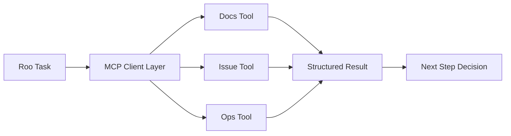
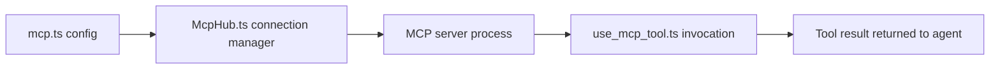

# Chapter 6: MCP and Tool Extensions

Welcome to **Chapter 6: MCP and Tool Extensions**. In this part of **Roo Code Tutorial: Run an AI Dev Team in Your Editor**, you will build an intuitive mental model first, then move into concrete implementation details and practical production tradeoffs.

Roo Code becomes a platform interface when connected to external tools. This chapter defines a safe rollout model for MCP and custom tool extensions.

## Typical Integration Domains

- issue and incident systems
- internal docs and knowledge APIs
- deployment and CI systems
- cloud and observability controls

## MCP Integration Model

```mermaid
flowchart LR
    A[Roo Task] --> B[MCP Client Layer]
    B --> C1[Docs Tool]
    B --> C2[Issue Tool]
    B --> C3[Ops Tool]
    C1 --> D[Structured Result]
    C2 --> D
    C3 --> D
    D --> E[Next Step Decision]
```

## Tool Contract Requirements

| Contract Area | Requirement |
|:--------------|:------------|
| inputs | strict schema and validation |
| outputs | deterministic structured response |
| side effects | explicit read-only vs mutating |
| errors | actionable machine-readable categories |
| runtime | timeout and retry bounds |

Loose tool contracts create unreliable agent behavior.

## Rollout Stages

1. start with read-only tools
2. verify output quality in real workflows
3. add mutating tools with explicit approvals
4. log all mutating calls
5. disable or remove noisy tools quickly

## Security Baseline

- least-privilege tokens per tool
- environment-separated credentials
- audit logs for mutating operations
- emergency disable switch for unstable tools

## Common Failure Patterns

- one tool doing too many unrelated actions
- vague or unstructured error responses
- implicit side effects not declared in contract
- retries with no maximum bound

## Readiness Checklist

- schema contracts are documented
- side effects are explicit
- auth scopes are minimal
- timeout/retry behavior is tested
- approval policy is aligned with risk level

## Chapter Summary

You now have a practical extension strategy for Roo Code:

- MCP-first integration model
- staged risk-based rollout
- secure credential and audit boundaries

Next: [Chapter 7: Profiles and Team Standards](07-profiles-and-team-standards.md)

## Source Code Walkthrough

Use the following upstream sources to verify MCP and tool extension implementation details while reading this chapter:

- [`src/shared/mcp.ts`](https://github.com/RooCodeInc/Roo-Code/blob/HEAD/src/shared/mcp.ts) — defines the MCP server configuration types and connection settings used to declare external tool servers in Roo Code's settings.
- [`src/services/mcp/McpHub.ts`](https://github.com/RooCodeInc/Roo-Code/blob/HEAD/src/services/mcp/McpHub.ts) — manages the lifecycle of MCP server connections, tool discovery, and tool invocation routing for all registered MCP servers.

Suggested trace strategy:
- review the `McpServerConfig` type in `src/shared/mcp.ts` to understand what connection parameters are configurable
- trace `McpHub.ts` for connection establishment, tool listing (`listTools`), and invocation flow
- check `src/core/tools/use_mcp_tool.ts` for how the agent constructs MCP tool calls during task execution

## How These Components Connect

```mermaid
flowchart LR
    A[mcp.ts config] --> B[McpHub.ts connection manager]
    B --> C[MCP server process]
    C --> D[use_mcp_tool.ts invocation]
    D --> E[Tool result returned to agent]
```
