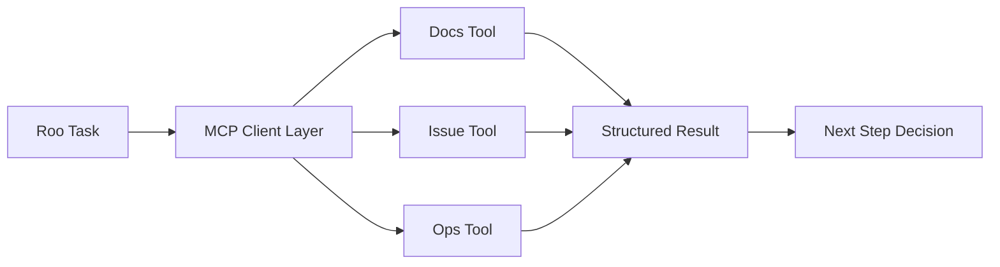
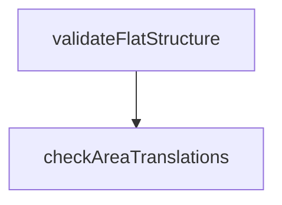

# Chapter 6: MCP and Tool Extensions

Welcome to **Chapter 6: MCP and Tool Extensions**. In this part of **Roo Code Tutorial: Run an AI Dev Team in Your Editor**, you will build an intuitive mental model first, then move into concrete implementation details and practical production tradeoffs.


Roo Code becomes a platform interface when connected to external tools. This chapter defines a safe rollout model for MCP and custom tool extensions.

## Typical Integration Domains

- issue and incident systems
- internal docs and knowledge APIs
- deployment and CI systems
- cloud and observability controls

## MCP Integration Model


```mermaid
flowchart LR
    A[Roo Task] --> B[MCP Client Layer]
    B --> C1[Docs Tool]
    B --> C2[Issue Tool]
    B --> C3[Ops Tool]
    C1 --> D[Structured Result]
    C2 --> D
    C3 --> D
    D --> E[Next Step Decision]
```

## Tool Contract Requirements

| Contract Area | Requirement |
|:--------------|:------------|
| inputs | strict schema and validation |
| outputs | deterministic structured response |
| side effects | explicit read-only vs mutating |
| errors | actionable machine-readable categories |
| runtime | timeout and retry bounds |

Loose tool contracts create unreliable agent behavior.

## Rollout Stages

1. start with read-only tools
2. verify output quality in real workflows
3. add mutating tools with explicit approvals
4. log all mutating calls
5. disable or remove noisy tools quickly

## Security Baseline

- least-privilege tokens per tool
- environment-separated credentials
- audit logs for mutating operations
- emergency disable switch for unstable tools

## Common Failure Patterns

- one tool doing too many unrelated actions
- vague or unstructured error responses
- implicit side effects not declared in contract
- retries with no maximum bound

## Readiness Checklist

- schema contracts are documented
- side effects are explicit
- auth scopes are minimal
- timeout/retry behavior is tested
- approval policy is aligned with risk level

## Chapter Summary

You now have a practical extension strategy for Roo Code:

- MCP-first integration model
- staged risk-based rollout
- secure credential and audit boundaries

Next: [Chapter 7: Profiles and Team Standards](07-profiles-and-team-standards.md)

## Depth Expansion Playbook

## Source Code Walkthrough

### `scripts/find-missing-translations.js`

The `validateFlatStructure` function in [`scripts/find-missing-translations.js`](https://github.com/RooCodeInc/Roo-Code/blob/HEAD/scripts/find-missing-translations.js) handles a key part of this chapter's functionality:

```js

// Validate that a JSON object has a flat structure (no nested objects)
function validateFlatStructure(obj, filePath) {
	for (const [key, value] of Object.entries(obj)) {
		if (typeof value === "object" && value !== null) {
			console.error(`Error: ${filePath} should be a flat JSON structure. Found nested object at key '${key}'`)
			process.exit(1)
		}
	}
}

// Function to check translations for a specific area
async function checkAreaTranslations(area) {
	const LOCALES_DIR = LOCALES_DIRS[area]

	// Get all locale directories (or filter to the specified locale)
	const dirContents = await readdir(LOCALES_DIR)
	const allLocales = await Promise.all(
		dirContents.map(async (item) => {
			const stats = await stat(path.join(LOCALES_DIR, item))
			return stats.isDirectory() && item !== "en" ? item : null
		}),
	)
	const filteredLocales = allLocales.filter(Boolean)

	// Filter to the specified locale if provided
	const locales = args.locale ? filteredLocales.filter((locale) => locale === args.locale) : filteredLocales

	if (args.locale && locales.length === 0) {
		console.error(`Error: Locale '${args.locale}' not found in ${LOCALES_DIR}`)
		process.exit(1)
	}
```

This function is important because it defines how Roo Code Tutorial: Run an AI Dev Team in Your Editor implements the patterns covered in this chapter.

### `scripts/find-missing-translations.js`

The `checkAreaTranslations` function in [`scripts/find-missing-translations.js`](https://github.com/RooCodeInc/Roo-Code/blob/HEAD/scripts/find-missing-translations.js) handles a key part of this chapter's functionality:

```js

// Function to check translations for a specific area
async function checkAreaTranslations(area) {
	const LOCALES_DIR = LOCALES_DIRS[area]

	// Get all locale directories (or filter to the specified locale)
	const dirContents = await readdir(LOCALES_DIR)
	const allLocales = await Promise.all(
		dirContents.map(async (item) => {
			const stats = await stat(path.join(LOCALES_DIR, item))
			return stats.isDirectory() && item !== "en" ? item : null
		}),
	)
	const filteredLocales = allLocales.filter(Boolean)

	// Filter to the specified locale if provided
	const locales = args.locale ? filteredLocales.filter((locale) => locale === args.locale) : filteredLocales

	if (args.locale && locales.length === 0) {
		console.error(`Error: Locale '${args.locale}' not found in ${LOCALES_DIR}`)
		process.exit(1)
	}

	console.log(
		`\n${area === "core" ? "BACKEND" : "FRONTEND"} - Checking ${locales.length} non-English locale(s): ${locales.join(", ")}`,
	)

	// Get all English JSON files
	const englishDir = path.join(LOCALES_DIR, "en")
	const englishDirContents = await readdir(englishDir)
	let englishFiles = englishDirContents.filter((file) => file.endsWith(".json") && !file.startsWith("."))

```

This function is important because it defines how Roo Code Tutorial: Run an AI Dev Team in Your Editor implements the patterns covered in this chapter.


## How These Components Connect


```mermaid
flowchart TD
    A[validateFlatStructure]
    B[checkAreaTranslations]
    A --> B
```
