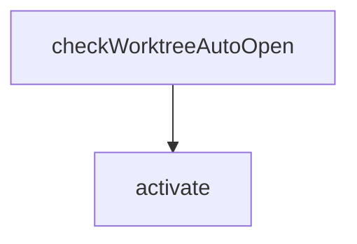

# Chapter 7: Profiles and Team Standards

Welcome to **Chapter 7: Profiles and Team Standards**. In this part of **Roo Code Tutorial: Run an AI Dev Team in Your Editor**, you will build an intuitive mental model first, then move into concrete implementation details and practical production tradeoffs.


Profiles are the mechanism for making Roo behavior consistent across individuals and repositories.

## Why Profiles Matter

Without shared profiles, teams get:

- inconsistent model/provider usage
- variable prompt quality
- unpredictable cost and latency
- uneven review and approval behavior

Profiles solve this by encoding defaults.

## Profile Baseline Components

| Component | Standardize |
|:----------|:------------|
| model strategy | default model tiers by task class |
| mode policy | which modes are preferred/forbidden per work type |
| tool policy | approved tools and approval thresholds |
| output format | required summary and evidence structure |
| budget controls | per-task and per-session limits |

## Example Team Profile Set

| Profile | Use Case |
|:--------|:---------|
| `dev-fast` | everyday implementation loops |
| `debug-deep` | incident and regression investigation |
| `release-safe` | high scrutiny before merge/release |
| `private-compliance` | sensitive code and restricted providers |

## Rollout Pattern

1. pilot profile in one repo
2. collect quality/cost/latency metrics
3. revise defaults and publish versioned profile
4. expand to more teams with opt-in gates

## Policy Drift Controls

- version profile definitions
- log profile changes with rationale
- run scheduled profile health checks
- review exceptions and temporary overrides

## Team Enablement Checklist

- profile docs are accessible
- onboarding includes profile selection guidance
- prompt templates are profile-aware
- incident runbooks reference profile behavior

## Anti-Patterns

- too many profiles with overlapping scope
- profiles that hide risky defaults
- no ownership for profile maintenance
- no metric feedback loop after rollout

## Chapter Summary

You now have a profile-driven scaling model for Roo Code:

- shared defaults for quality and safety
- staged rollout with measurable impact
- governance against policy drift

Next: [Chapter 8: Enterprise Operations](08-enterprise-operations.md)

## Source Code Walkthrough

### `src/extension.ts`

The `checkWorktreeAutoOpen` function in [`src/extension.ts`](https://github.com/RooCodeInc/Roo-Code/blob/HEAD/src/extension.ts) handles a key part of this chapter's functionality:

```ts
 * This is called during extension activation to handle the worktree auto-open flow.
 */
async function checkWorktreeAutoOpen(
	context: vscode.ExtensionContext,
	outputChannel: vscode.OutputChannel,
): Promise<void> {
	try {
		const worktreeAutoOpenPath = context.globalState.get<string>("worktreeAutoOpenPath")
		if (!worktreeAutoOpenPath) {
			return
		}

		const workspaceFolders = vscode.workspace.workspaceFolders
		if (!workspaceFolders || workspaceFolders.length === 0) {
			return
		}

		const currentPath = workspaceFolders[0].uri.fsPath

		// Normalize paths for comparison
		const normalizePath = (p: string) => p.replace(/\/+$/, "").replace(/\\+/g, "/").toLowerCase()

		// Check if current workspace matches the worktree path
		if (normalizePath(currentPath) === normalizePath(worktreeAutoOpenPath)) {
			// Clear the state first to prevent re-triggering
			await context.globalState.update("worktreeAutoOpenPath", undefined)

			outputChannel.appendLine(`[Worktree] Auto-opening Roo Code sidebar for worktree: ${worktreeAutoOpenPath}`)

			// Open the Roo Code sidebar with a slight delay to ensure UI is ready
			setTimeout(async () => {
				try {
```

This function is important because it defines how Roo Code Tutorial: Run an AI Dev Team in Your Editor implements the patterns covered in this chapter.

### `src/extension.ts`

The `activate` function in [`src/extension.ts`](https://github.com/RooCodeInc/Roo-Code/blob/HEAD/src/extension.ts) handles a key part of this chapter's functionality:

```ts
	registerTerminalActions,
	CodeActionProvider,
} from "./activate"
import { initializeI18n } from "./i18n"
import { flushModels, initializeModelCacheRefresh, refreshModels } from "./api/providers/fetchers/modelCache"

/**
 * Built using https://github.com/microsoft/vscode-webview-ui-toolkit
 *
 * Inspired by:
 *  - https://github.com/microsoft/vscode-webview-ui-toolkit-samples/tree/main/default/weather-webview
 *  - https://github.com/microsoft/vscode-webview-ui-toolkit-samples/tree/main/frameworks/hello-world-react-cra
 */

let outputChannel: vscode.OutputChannel
let extensionContext: vscode.ExtensionContext
let cloudService: CloudService | undefined

let authStateChangedHandler: ((data: { state: AuthState; previousState: AuthState }) => Promise<void>) | undefined
let settingsUpdatedHandler: (() => void) | undefined
let userInfoHandler: ((data: { userInfo: CloudUserInfo }) => Promise<void>) | undefined

/**
 * Check if we should auto-open the Roo Code sidebar after switching to a worktree.
 * This is called during extension activation to handle the worktree auto-open flow.
 */
async function checkWorktreeAutoOpen(
	context: vscode.ExtensionContext,
	outputChannel: vscode.OutputChannel,
): Promise<void> {
	try {
		const worktreeAutoOpenPath = context.globalState.get<string>("worktreeAutoOpenPath")
```

This function is important because it defines how Roo Code Tutorial: Run an AI Dev Team in Your Editor implements the patterns covered in this chapter.


## How These Components Connect


