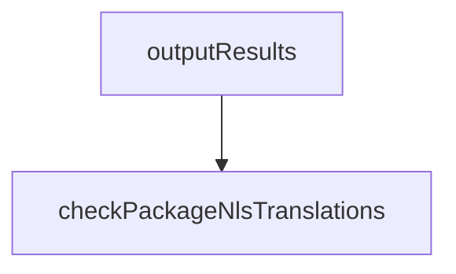

# Chapter 7: Profiles and Team Standards

Welcome to **Chapter 7: Profiles and Team Standards**. In this part of **Roo Code Tutorial: Run an AI Dev Team in Your Editor**, you will build an intuitive mental model first, then move into concrete implementation details and practical production tradeoffs.


Profiles are the mechanism for making Roo behavior consistent across individuals and repositories.

## Why Profiles Matter

Without shared profiles, teams get:

- inconsistent model/provider usage
- variable prompt quality
- unpredictable cost and latency
- uneven review and approval behavior

Profiles solve this by encoding defaults.

## Profile Baseline Components

| Component | Standardize |
|:----------|:------------|
| model strategy | default model tiers by task class |
| mode policy | which modes are preferred/forbidden per work type |
| tool policy | approved tools and approval thresholds |
| output format | required summary and evidence structure |
| budget controls | per-task and per-session limits |

## Example Team Profile Set

| Profile | Use Case |
|:--------|:---------|
| `dev-fast` | everyday implementation loops |
| `debug-deep` | incident and regression investigation |
| `release-safe` | high scrutiny before merge/release |
| `private-compliance` | sensitive code and restricted providers |

## Rollout Pattern

1. pilot profile in one repo
2. collect quality/cost/latency metrics
3. revise defaults and publish versioned profile
4. expand to more teams with opt-in gates

## Policy Drift Controls

- version profile definitions
- log profile changes with rationale
- run scheduled profile health checks
- review exceptions and temporary overrides

## Team Enablement Checklist

- profile docs are accessible
- onboarding includes profile selection guidance
- prompt templates are profile-aware
- incident runbooks reference profile behavior

## Anti-Patterns

- too many profiles with overlapping scope
- profiles that hide risky defaults
- no ownership for profile maintenance
- no metric feedback loop after rollout

## Chapter Summary

You now have a profile-driven scaling model for Roo Code:

- shared defaults for quality and safety
- staged rollout with measurable impact
- governance against policy drift

Next: [Chapter 8: Enterprise Operations](08-enterprise-operations.md)

## Depth Expansion Playbook

## Source Code Walkthrough

### `scripts/find-missing-translations.js`

The `outputResults` function in [`scripts/find-missing-translations.js`](https://github.com/RooCodeInc/Roo-Code/blob/HEAD/scripts/find-missing-translations.js) handles a key part of this chapter's functionality:

```js
	)

	return { missingTranslations, hasMissingTranslations: outputResults(missingTranslations, area) }
}

// Function to output results for an area
function outputResults(missingTranslations, area) {
	let hasMissingTranslations = false

	console.log(`\n${area === "core" ? "BACKEND" : "FRONTEND"} Missing Translations Report:\n`)

	for (const [locale, files] of Object.entries(missingTranslations)) {
		if (Object.keys(files).length === 0) {
			console.log(`✅ ${locale}: No missing translations`)
			continue
		}

		hasMissingTranslations = true
		console.log(`📝 ${locale}:`)

		for (const [fileName, missingItems] of Object.entries(files)) {
			if (missingItems.file) {
				console.log(`  - ${fileName}: ${missingItems.file}`)
				continue
			}

			console.log(`  - ${fileName}: ${missingItems.length} missing translations`)

			for (const { key, englishValue } of missingItems) {
				console.log(`      ${key}: "${englishValue}"`)
			}
		}
```

This function is important because it defines how Roo Code Tutorial: Run an AI Dev Team in Your Editor implements the patterns covered in this chapter.

### `scripts/find-missing-translations.js`

The `checkPackageNlsTranslations` function in [`scripts/find-missing-translations.js`](https://github.com/RooCodeInc/Roo-Code/blob/HEAD/scripts/find-missing-translations.js) handles a key part of this chapter's functionality:

```js

// Function to check package.nls.json translations
async function checkPackageNlsTranslations() {
	const SRC_DIR = path.join(__dirname, "../src")

	// Read the base package.nls.json file
	const baseFilePath = path.join(SRC_DIR, "package.nls.json")
	const baseContent = await parseJsonFile(baseFilePath)

	if (!baseContent) {
		console.warn(`Warning: Base package.nls.json not found at ${baseFilePath} - skipping package.nls checks`)
		return { missingTranslations: {}, hasMissingTranslations: false }
	}

	// Validate that the base file has a flat structure
	validateFlatStructure(baseContent, baseFilePath)

	// Get all package.nls.*.json files
	const srcDirContents = await readdir(SRC_DIR)
	const nlsFiles = srcDirContents
		.filter((file) => file.startsWith("package.nls.") && file.endsWith(".json"))
		.filter((file) => file !== "package.nls.json") // Exclude the base file

	// Filter to the specified locale if provided
	const filesToCheck = args.locale
		? nlsFiles.filter((file) => {
				const locale = file.replace("package.nls.", "").replace(".json", "")
				return locale === args.locale
			})
		: nlsFiles

	if (args.locale && filesToCheck.length === 0) {
```

This function is important because it defines how Roo Code Tutorial: Run an AI Dev Team in Your Editor implements the patterns covered in this chapter.


## How These Components Connect


