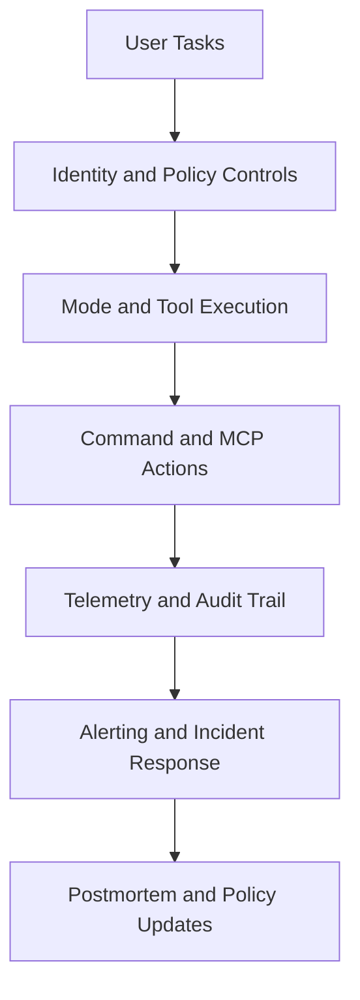

# Chapter 8: Enterprise Operations

This chapter defines a practical operations model for running Roo Code at organizational scale.

## Production Readiness Criteria

Roo usage is production-ready when:

- identity and access boundaries are enforced
- mode/tool/provider policies are centrally governed
- task actions are observable and auditable
- incidents have documented and tested runbooks

## Enterprise Control Plane

## High-Value Metrics

| Metric | Why It Matters |
|:-------|:---------------|
| task success rate | overall reliability signal |
| rollback frequency | output risk indicator |
| command/tool error rate | integration quality signal |
| median cycle time | productivity and latency impact |
| cost per completed task | budget governance |

## Alerting Priorities

Alert first on:

- provider outages or auth failure spikes
- abnormal command timeout rates
- mutating tool-call anomalies
- rapid spend acceleration

## Incident Runbooks

### Provider degradation

- switch to fallback provider profile
- reduce high-complexity workload
- communicate expected behavior changes

### Unsafe output pattern

- tighten approval gates
- require smaller-scoped tasks
- review recent prompt/profile changes

### Integration incident

- disable unstable tool or server
- route tasks to read-only alternatives
- restore after contract and reliability checks

## Governance and Compliance

Add these controls for regulated environments:

- retention and redaction policy for task logs
- periodic access review for privileged settings
- immutable audit records for mutating operations
- documented approval chain for policy changes

## Maturity Stages

| Stage | Characteristics |
|:------|:----------------|
| pilot | small team, manual controls |
| standardized | shared profiles and review policies |
| managed | central telemetry and budget controls |
| enterprise | identity integration, policy governance, audit readiness |

## Final Summary

You now have end-to-end Roo Code operating guidance:

- setup and mode-driven execution
- safe patch, command, and checkpoint patterns
- MCP and profile governance
- enterprise operations and incident readiness

Related:

- [Cline Tutorial](../cline-tutorial/)
- [Continue Tutorial](../continue-tutorial/)
- [OpenHands Tutorial](../openhands-tutorial/)
- [MCP Servers Tutorial](../mcp-servers-tutorial/)
