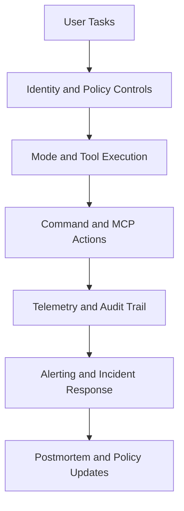
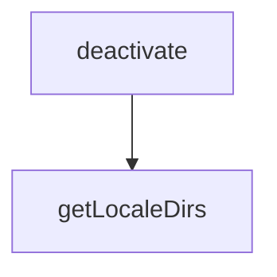

# Chapter 8: Enterprise Operations

Welcome to **Chapter 8: Enterprise Operations**. In this part of **Roo Code Tutorial: Run an AI Dev Team in Your Editor**, you will build an intuitive mental model first, then move into concrete implementation details and practical production tradeoffs.


This chapter defines a practical operations model for running Roo Code at organizational scale.

## Production Readiness Criteria

Roo usage is production-ready when:

- identity and access boundaries are enforced
- mode/tool/provider policies are centrally governed
- task actions are observable and auditable
- incidents have documented and tested runbooks

## Enterprise Control Plane


```mermaid
flowchart TD
    A[User Tasks] --> B[Identity and Policy Controls]
    B --> C[Mode and Tool Execution]
    C --> D[Command and MCP Actions]
    D --> E[Telemetry and Audit Trail]
    E --> F[Alerting and Incident Response]
    F --> G[Postmortem and Policy Updates]
```

## High-Value Metrics

| Metric | Why It Matters |
|:-------|:---------------|
| task success rate | overall reliability signal |
| rollback frequency | output risk indicator |
| command/tool error rate | integration quality signal |
| median cycle time | productivity and latency impact |
| cost per completed task | budget governance |

## Alerting Priorities

Alert first on:

- provider outages or auth failure spikes
- abnormal command timeout rates
- mutating tool-call anomalies
- rapid spend acceleration

## Incident Runbooks

### Provider degradation

- switch to fallback provider profile
- reduce high-complexity workload
- communicate expected behavior changes

### Unsafe output pattern

- tighten approval gates
- require smaller-scoped tasks
- review recent prompt/profile changes

### Integration incident

- disable unstable tool or server
- route tasks to read-only alternatives
- restore after contract and reliability checks

## Governance and Compliance

Add these controls for regulated environments:

- retention and redaction policy for task logs
- periodic access review for privileged settings
- immutable audit records for mutating operations
- documented approval chain for policy changes

## Maturity Stages

| Stage | Characteristics |
|:------|:----------------|
| pilot | small team, manual controls |
| standardized | shared profiles and review policies |
| managed | central telemetry and budget controls |
| enterprise | identity integration, policy governance, audit readiness |

## Final Summary

You now have end-to-end Roo Code operating guidance:

- setup and mode-driven execution
- safe patch, command, and checkpoint patterns
- MCP and profile governance
- enterprise operations and incident readiness

Related:

- [Cline Tutorial](../cline-tutorial/)
- [Continue Tutorial](../continue-tutorial/)
- [OpenHands Tutorial](../openhands-tutorial/)
- [MCP Servers Tutorial](../mcp-servers-tutorial/)

## Source Code Walkthrough

### `src/extension.ts`

The `deactivate` function in [`src/extension.ts`](https://github.com/RooCodeInc/Roo-Code/blob/HEAD/src/extension.ts) handles a key part of this chapter's functionality:

```ts
	}

	// Add to subscriptions for proper cleanup on deactivate.
	context.subscriptions.push(cloudService)

	// Trigger initial cloud profile sync now that CloudService is ready.
	try {
		await provider.initializeCloudProfileSyncWhenReady()
	} catch (error) {
		outputChannel.appendLine(
			`[CloudService] Failed to initialize cloud profile sync: ${error instanceof Error ? error.message : String(error)}`,
		)
	}

	// Finish initializing the provider.
	TelemetryService.instance.setProvider(provider)

	context.subscriptions.push(
		vscode.window.registerWebviewViewProvider(ClineProvider.sideBarId, provider, {
			webviewOptions: { retainContextWhenHidden: true },
		}),
	)

	// Check for worktree auto-open path (set when switching to a worktree)
	await checkWorktreeAutoOpen(context, outputChannel)

	// Auto-import configuration if specified in settings.
	try {
		await autoImportSettings(outputChannel, {
			providerSettingsManager: provider.providerSettingsManager,
			contextProxy: provider.contextProxy,
			customModesManager: provider.customModesManager,
```

This function is important because it defines how Roo Code Tutorial: Run an AI Dev Team in Your Editor implements the patterns covered in this chapter.

### `scripts/find-missing-i18n-key.js`

The `getLocaleDirs` function in [`scripts/find-missing-i18n-key.js`](https://github.com/RooCodeInc/Roo-Code/blob/HEAD/scripts/find-missing-i18n-key.js) handles a key part of this chapter's functionality:

```js

// Get all language directories for a specific locales directory
function getLocaleDirs(localesDir) {
	try {
		const allLocales = fs.readdirSync(localesDir).filter((file) => {
			const stats = fs.statSync(path.join(localesDir, file))
			return stats.isDirectory() // Do not exclude any language directories
		})

		// Filter to a specific language if specified
		return args.locale ? allLocales.filter((locale) => locale === args.locale) : allLocales
	} catch (error) {
		if (error.code === "ENOENT") {
			console.warn(`Warning: Locales directory not found: ${localesDir}`)
			return []
		}
		throw error
	}
}

// Get the value from JSON by path
function getValueByPath(obj, path) {
	const parts = path.split(".")
	let current = obj

	for (const part of parts) {
		if (current === undefined || current === null) {
			return undefined
		}
		current = current[part]
	}

```

This function is important because it defines how Roo Code Tutorial: Run an AI Dev Team in Your Editor implements the patterns covered in this chapter.


## How These Components Connect


```mermaid
flowchart TD
    A[deactivate]
    B[getLocaleDirs]
    A --> B
```
