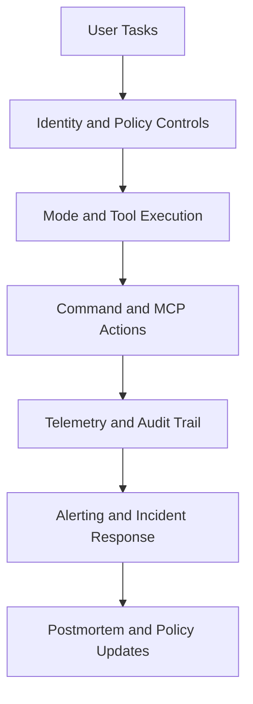
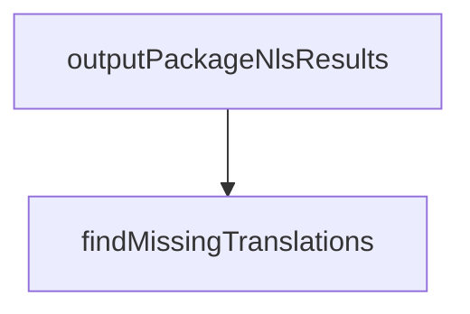

# Chapter 8: Enterprise Operations

Welcome to **Chapter 8: Enterprise Operations**. In this part of **Roo Code Tutorial: Run an AI Dev Team in Your Editor**, you will build an intuitive mental model first, then move into concrete implementation details and practical production tradeoffs.


This chapter defines a practical operations model for running Roo Code at organizational scale.

## Production Readiness Criteria

Roo usage is production-ready when:

- identity and access boundaries are enforced
- mode/tool/provider policies are centrally governed
- task actions are observable and auditable
- incidents have documented and tested runbooks

## Enterprise Control Plane


```mermaid
flowchart TD
    A[User Tasks] --> B[Identity and Policy Controls]
    B --> C[Mode and Tool Execution]
    C --> D[Command and MCP Actions]
    D --> E[Telemetry and Audit Trail]
    E --> F[Alerting and Incident Response]
    F --> G[Postmortem and Policy Updates]
```

## High-Value Metrics

| Metric | Why It Matters |
|:-------|:---------------|
| task success rate | overall reliability signal |
| rollback frequency | output risk indicator |
| command/tool error rate | integration quality signal |
| median cycle time | productivity and latency impact |
| cost per completed task | budget governance |

## Alerting Priorities

Alert first on:

- provider outages or auth failure spikes
- abnormal command timeout rates
- mutating tool-call anomalies
- rapid spend acceleration

## Incident Runbooks

### Provider degradation

- switch to fallback provider profile
- reduce high-complexity workload
- communicate expected behavior changes

### Unsafe output pattern

- tighten approval gates
- require smaller-scoped tasks
- review recent prompt/profile changes

### Integration incident

- disable unstable tool or server
- route tasks to read-only alternatives
- restore after contract and reliability checks

## Governance and Compliance

Add these controls for regulated environments:

- retention and redaction policy for task logs
- periodic access review for privileged settings
- immutable audit records for mutating operations
- documented approval chain for policy changes

## Maturity Stages

| Stage | Characteristics |
|:------|:----------------|
| pilot | small team, manual controls |
| standardized | shared profiles and review policies |
| managed | central telemetry and budget controls |
| enterprise | identity integration, policy governance, audit readiness |

## Final Summary

You now have end-to-end Roo Code operating guidance:

- setup and mode-driven execution
- safe patch, command, and checkpoint patterns
- MCP and profile governance
- enterprise operations and incident readiness

Related:

- [Cline Tutorial](../cline-tutorial/)
- [Continue Tutorial](../continue-tutorial/)
- [OpenHands Tutorial](../openhands-tutorial/)
- [MCP Servers Tutorial](../mcp-servers-tutorial/)

## Depth Expansion Playbook

## Source Code Walkthrough

### `scripts/find-missing-translations.js`

The `outputPackageNlsResults` function in [`scripts/find-missing-translations.js`](https://github.com/RooCodeInc/Roo-Code/blob/HEAD/scripts/find-missing-translations.js) handles a key part of this chapter's functionality:

```js
	)

	return { missingTranslations, hasMissingTranslations: outputPackageNlsResults(missingTranslations) }
}

// Function to output package.nls results
function outputPackageNlsResults(missingTranslations) {
	let hasMissingTranslations = false

	console.log(`\nPACKAGE.NLS Missing Translations Report:\n`)

	for (const [locale, files] of Object.entries(missingTranslations)) {
		if (Object.keys(files).length === 0) {
			console.log(`✅ ${locale}: No missing translations`)
			continue
		}

		hasMissingTranslations = true
		console.log(`📝 ${locale}:`)

		for (const [fileName, missingItems] of Object.entries(files)) {
			console.log(`  - ${fileName}: ${missingItems.length} missing translations`)

			for (const { key, englishValue } of missingItems) {
				console.log(`      ${key}: "${englishValue}"`)
			}
		}

		console.log("")
	}

	return hasMissingTranslations
```

This function is important because it defines how Roo Code Tutorial: Run an AI Dev Team in Your Editor implements the patterns covered in this chapter.

### `scripts/find-missing-translations.js`

The `findMissingTranslations` function in [`scripts/find-missing-translations.js`](https://github.com/RooCodeInc/Roo-Code/blob/HEAD/scripts/find-missing-translations.js) handles a key part of this chapter's functionality:

```js

// Main function to find missing translations
async function findMissingTranslations() {
	try {
		console.log("Starting translation check...")

		let anyAreaMissingTranslations = false

		// Check each requested area
		for (const area of areasToCheck) {
			if (area === "package-nls") {
				const { hasMissingTranslations } = await checkPackageNlsTranslations()
				anyAreaMissingTranslations = anyAreaMissingTranslations || hasMissingTranslations
			} else {
				const { hasMissingTranslations } = await checkAreaTranslations(area)
				anyAreaMissingTranslations = anyAreaMissingTranslations || hasMissingTranslations
			}
		}

		// Summary
		if (!anyAreaMissingTranslations) {
			console.log("\n✅ All translations are complete across all checked areas!")
		} else {
			console.log("\n✏️  To add missing translations:")
			console.log("1. Add the missing keys to the corresponding locale files")
			console.log("2. Translate the English values to the appropriate language")
			console.log("3. Run this script again to verify all translations are complete")
			// Exit with error code to fail CI checks
			process.exit(1)
		}
	} catch (error) {
		console.error("Error:", error.message)
```

This function is important because it defines how Roo Code Tutorial: Run an AI Dev Team in Your Editor implements the patterns covered in this chapter.


## How These Components Connect


```mermaid
flowchart TD
    A[outputPackageNlsResults]
    B[findMissingTranslations]
    A --> B
```
