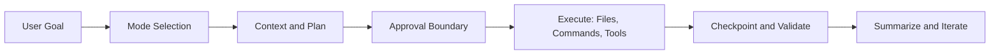

# Roo Code Tutorial: Run an AI Dev Team in Your Editor

> A production-focused guide to `RooCodeInc/Roo-Code`: mode design, task execution, checkpoints, MCP, team profiles, and enterprise operations.

## Why This Track Matters

Roo Code is powerful because it is multi-modal, tool-extensible, and workflow-oriented. That same power creates operational risk without clear standards.

This track teaches you how to:

- pick the right mode for each task class
- enforce bounded prompts and approval checkpoints
- use checkpoints and recovery intentionally
- scale Roo Code with profiles and policy consistency

## Current Snapshot (Verified February 11, 2026)

- repository: [`RooCodeInc/Roo-Code`](https://github.com/RooCodeInc/Roo-Code)
- stars: about **22.2k**
- extension package version in repo source: `3.47.3` (`src/package.json`)
- release streams include extension and CLI tags (latest published tag in GitHub releases includes `cli-v0.0.52`)
- docs cover getting started, modes, MCP, profiles, providers, cloud/router features, and release notes

## Roo Code Mental Model

## Chapter Map

| Chapter | Key Question | Outcome |
|:--------|:-------------|:--------|
| [01 - Getting Started](01-getting-started.md) | How do we set up Roo Code safely? | Clean setup + first deterministic task |
| [02 - Modes and Task Design](02-modes-and-task-design.md) | How do modes improve quality and control? | Mode-selection framework + task templates |
| [03 - File and Command Operations](03-file-and-command-operations.md) | How do we run edit/validate loops safely? | Diff and command governance model |
| [04 - Context and Indexing](04-context-and-indexing.md) | How do we stay accurate in large repos? | Context slicing and indexing strategy |
| [05 - Checkpoints and Recovery](05-checkpoints-and-recovery.md) | How do we experiment without losing control? | Snapshot, compare, restore playbook |
| [06 - MCP and Tool Extensions](06-mcp-and-tool-extensions.md) | How do we integrate external systems safely? | MCP rollout and tool contract standards |
| [07 - Profiles and Team Standards](07-profiles-and-team-standards.md) | How do teams standardize Roo behavior? | Shared profile baseline + rollout pattern |
| [08 - Enterprise Operations](08-enterprise-operations.md) | What makes Roo production-ready at org scale? | Security, observability, incident governance |

## What You Will Learn

- mode-driven task execution with explicit success criteria
- safe patch and terminal workflows with rollback readiness
- MCP-based integration design with low blast radius
- policy and profile standardization for multi-team usage

## Source References

- [Roo Code README](https://github.com/RooCodeInc/Roo-Code/blob/main/README.md)
- [Roo Code Docs](https://docs.roocode.com/)
- [Using Modes docs page](https://docs.roocode.com/basic-usage/using-modes)
- [Roo Code Releases](https://github.com/RooCodeInc/Roo-Code/releases)

## Related Tutorials

- [Cline Tutorial](../cline-tutorial/)
- [Continue Tutorial](../continue-tutorial/)
- [OpenHands Tutorial](../openhands-tutorial/)
- [MCP Servers Tutorial](../mcp-servers-tutorial/)
- [Dyad Tutorial](../dyad-tutorial/)

---

Start with [Chapter 1: Getting Started](01-getting-started.md).
