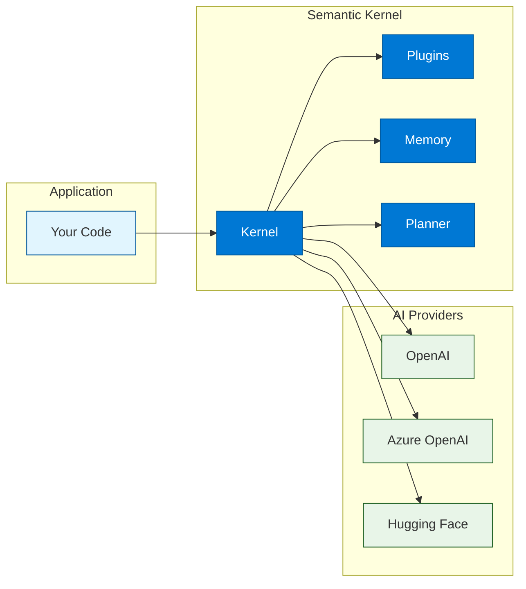
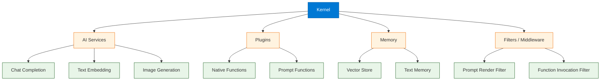

# Chapter 1: Getting Started with Semantic Kernel

> Install Semantic Kernel, wire up your first AI service, and run a simple plugin-powered prompt in minutes.

## What is Semantic Kernel?

Semantic Kernel (SK) is Microsoft's open-source SDK that lets developers integrate Large Language Models (LLMs) into their applications using a plugin-based architecture. Think of it as an **orchestration layer** that sits between your application code and AI services, providing a structured way to combine prompts, native code, memory, and planning into cohesive AI-powered workflows.



### Why Semantic Kernel?

| Benefit | Description |
|:--------|:------------|
| **Multi-language** | First-class SDKs for C#, Python, and Java |
| **Enterprise-ready** | Built by Microsoft for production workloads with Azure integration |
| **Plugin architecture** | Compose native functions and prompt templates into reusable plugins |
| **Model agnostic** | Swap between OpenAI, Azure OpenAI, Hugging Face, and local models |
| **Memory built-in** | Vector store integrations for semantic recall (Chroma, Qdrant, Pinecone) |
| **Planner** | LLM-powered automatic task decomposition and execution |
| **Open source** | MIT-licensed with active community and Microsoft backing |

### How Semantic Kernel Compares

| Feature | Semantic Kernel | LangChain | Haystack |
|:--------|:---------------|:----------|:---------|
| Primary language | C# / Python / Java | Python / JS | Python |
| Plugin system | First-class | Tools / Agents | Pipelines |
| Planning | Built-in planners | Agent chains | Pipeline DAGs |
| Azure integration | Native | Community | Community |
| Memory | Built-in vector stores | Retrievers | Document stores |
| Enterprise focus | Strong | Moderate | Moderate |

---

## Installation and Setup

### Python Installation

```bash
# Core SDK
pip install semantic-kernel

# OpenAI connector (includes both OpenAI and Azure OpenAI)
pip install semantic-kernel[openai]

# Azure-specific connector
pip install semantic-kernel[azure]

# Optional: vector store backends for memory
pip install semantic-kernel[chroma]
pip install semantic-kernel[qdrant]
pip install semantic-kernel[pinecone]

# Optional: Hugging Face connector
pip install semantic-kernel[hugging_face]

# Verify installation
python -c "import semantic_kernel; print(semantic_kernel.__version__)"
```

### .NET (C#) Installation

```bash
# Create a new console project
dotnet new console -n SKQuickstart
cd SKQuickstart

# Add core Semantic Kernel package
dotnet add package Microsoft.SemanticKernel

# Add OpenAI connector
dotnet add package Microsoft.SemanticKernel.Connectors.OpenAI

# Add Azure OpenAI connector
dotnet add package Microsoft.SemanticKernel.Connectors.AzureOpenAI

# Optional: memory stores
dotnet add package Microsoft.SemanticKernel.Connectors.Chroma
dotnet add package Microsoft.SemanticKernel.Connectors.Qdrant
```

### Environment Configuration

Create a `.env` file in your project root (and add `.env` to `.gitignore`):

```bash
# .env
OPENAI_API_KEY=sk-your-openai-key-here
AZURE_OPENAI_API_KEY=your-azure-key-here
AZURE_OPENAI_ENDPOINT=https://your-resource.openai.azure.com/
AZURE_OPENAI_DEPLOYMENT=gpt-4o
DEFAULT_MODEL=gpt-4o
```

For .NET projects, use `appsettings.json` or user secrets:

```json
{
  "OpenAI": {
    "ApiKey": "sk-your-openai-key-here",
    "ModelId": "gpt-4o"
  },
  "AzureOpenAI": {
    "ApiKey": "your-azure-key-here",
    "Endpoint": "https://your-resource.openai.azure.com/",
    "DeploymentName": "gpt-4o"
  }
}
```

---

## Understanding the Kernel

The **Kernel** is the central object in Semantic Kernel. It is the runtime container that holds references to AI services, plugins, memory, and configuration. Every interaction with SK starts by building a Kernel instance.



### Kernel Lifecycle

| Phase | What Happens |
|:------|:-------------|
| **Build** | Create kernel, register AI services, add plugins |
| **Configure** | Set default service, add filters, attach memory |
| **Invoke** | Call functions (prompt or native) through the kernel |
| **Observe** | Capture logs, metrics, and traces from invocations |

---

## Your First Kernel -- Python

Here is a complete, runnable Python example. It creates a kernel, registers an OpenAI chat service, defines a prompt-based function, and invokes it.

```python
import asyncio
import os
from dotenv import load_dotenv

import semantic_kernel as sk
from semantic_kernel.connectors.ai.open_ai import OpenAIChatCompletion

# Load environment variables from .env
load_dotenv()


async def main():
    # 1. Create the kernel
    kernel = sk.Kernel()

    # 2. Register an AI service
    kernel.add_service(
        OpenAIChatCompletion(
            service_id="chat",
            ai_model_id="gpt-4o",
            api_key=os.environ["OPENAI_API_KEY"],
        )
    )

    # 3. Create a semantic function (prompt template)
    summarize = kernel.create_function_from_prompt(
        function_name="summarize",
        plugin_name="Writer",
        prompt="""
        Summarize the following text in {{$style}} style.
        Keep the summary under 3 sentences.

        Text:
        {{$input}}
        """,
    )

    # 4. Invoke the function with variables
    result = await kernel.invoke(
        summarize,
        input="Semantic Kernel is an open-source SDK from Microsoft that lets "
              "developers integrate large language models into their applications. "
              "It supports plugins, planners, memory, and multiple AI providers.",
        style="executive",
    )

    print("Summary:", result)


# Run the async entry point
asyncio.run(main())
```

### Expected Output

```
Summary: Semantic Kernel is Microsoft's open-source SDK for embedding LLMs into
applications, offering plugins, planners, and memory. It supports multiple AI
providers and is designed for enterprise integration.
```

---

## Your First Kernel -- C# (.NET)

```csharp
using Microsoft.SemanticKernel;
using Microsoft.Extensions.Configuration;

// Load configuration
var config = new ConfigurationBuilder()
    .AddJsonFile("appsettings.json")
    .AddEnvironmentVariables()
    .Build();

// 1. Build the kernel
var builder = Kernel.CreateBuilder();

// 2. Add OpenAI chat completion
builder.AddOpenAIChatCompletion(
    modelId: config["OpenAI:ModelId"] ?? "gpt-4o",
    apiKey: config["OpenAI:ApiKey"]!
);

var kernel = builder.Build();

// 3. Invoke a prompt directly
var result = await kernel.InvokePromptAsync(
    "Summarize Semantic Kernel in two sentences for a software architect."
);

Console.WriteLine(result);

// 4. Invoke with template variables
var templateResult = await kernel.InvokePromptAsync(
    "Summarize the following in {{$style}} style:\n{{$input}}",
    new KernelArguments
    {
        ["style"] = "executive",
        ["input"] = "Semantic Kernel is Microsoft's SDK for AI orchestration."
    }
);

Console.WriteLine(templateResult);
```

### Using Azure OpenAI Instead

```csharp
// Swap to Azure OpenAI -- same kernel, different builder call
var builder = Kernel.CreateBuilder();

builder.AddAzureOpenAIChatCompletion(
    deploymentName: config["AzureOpenAI:DeploymentName"]!,
    endpoint: config["AzureOpenAI:Endpoint"]!,
    apiKey: config["AzureOpenAI:ApiKey"]!
);

var kernel = builder.Build();
// Everything else stays the same
```

---

## Project Structure Recommendations

A well-organized SK project helps teams scale and collaborate. Here is a recommended layout:

```
my-sk-app/
  .env                       # secrets (git-ignored)
  .env.example               # template for team (no real secrets)
  requirements.txt           # or pyproject.toml
  src/
    main.py                  # entry point
    kernel_factory.py        # kernel construction logic
    plugins/
      writer/
        __init__.py          # WriterPlugin class with @kernel_function
        prompts/
          summarize.yaml     # prompt template config
          rewrite.yaml
      math/
        __init__.py          # MathPlugin class
    memory/
      setup.py               # memory store configuration
    config/
      settings.py            # settings and env loader
  tests/
    test_plugins.py
    test_memory.py
  docker/
    Dockerfile
    docker-compose.yml
```

---

## Troubleshooting Common Issues

| Problem | Cause | Solution |
|:--------|:------|:---------|
| `401 Unauthorized` | Invalid or expired API key | Verify key in `.env`; check Azure deployment status |
| `404 Not Found` | Wrong model name or deployment | Confirm `ai_model_id` matches your provider (e.g., `gpt-4o` for OpenAI, deployment name for Azure) |
| `429 Too Many Requests` | Rate limit exceeded | Lower `max_tokens`, add retry with exponential backoff, cache results |
| `RuntimeWarning: coroutine was never awaited` | Missing `await` | Ensure every `kernel.invoke(...)` call is awaited |
| `ModuleNotFoundError` | Missing connector package | Install the right extra: `pip install semantic-kernel[openai]` |
| `Timeout` | Slow model response | Wrap calls in `asyncio.wait_for(...)` with a timeout; try a faster model |

### Debugging Tips

1. **Enable logging** to see rendered prompts and API calls:

```python
import logging
logging.basicConfig(level=logging.DEBUG)
```

2. **Print the function metadata** to verify registration:

```python
for plugin_name, plugin in kernel.plugins.items():
    for func_name, func in plugin.items():
        print(f"{plugin_name}.{func_name}: {func.description}")
```

3. **Use the .NET logging pipeline**:

```csharp
var builder = Kernel.CreateBuilder();
builder.Services.AddLogging(c => c.AddConsole().SetMinimumLevel(LogLevel.Debug));
```

---

## Quick Start Checklist

| Step | Python | .NET |
|:-----|:-------|:-----|
| Install SDK | `pip install semantic-kernel` | `dotnet add package Microsoft.SemanticKernel` |
| Install connector | `pip install semantic-kernel[openai]` | `dotnet add package Microsoft.SemanticKernel.Connectors.OpenAI` |
| Set API key | `.env` file with `OPENAI_API_KEY` | `appsettings.json` or user secrets |
| Create kernel | `sk.Kernel()` | `Kernel.CreateBuilder().Build()` |
| Add service | `kernel.add_service(...)` | `builder.AddOpenAIChatCompletion(...)` |
| Create function | `kernel.create_function_from_prompt(...)` | `kernel.InvokePromptAsync(...)` |
| Invoke | `await kernel.invoke(func, ...)` | `await kernel.InvokeAsync(func, ...)` |

---

## Summary

Semantic Kernel is Microsoft's orchestration SDK for integrating LLMs into applications. In this chapter you installed the SDK for Python or .NET, configured API keys, built your first Kernel instance, created a prompt-based function, and invoked it to get a result. The Kernel acts as the central hub connecting your code to AI services, plugins, and memory.

## Key Takeaways

- The **Kernel** is the central runtime object -- all services, plugins, and memory attach to it.
- Semantic Kernel supports **Python, C#, and Java** with nearly identical concepts across languages.
- **AI services** (OpenAI, Azure OpenAI, Hugging Face) are registered on the kernel and can be swapped without changing application logic.
- **Prompt functions** let you define templates with `{{$variable}}` syntax and invoke them with named arguments.
- Always store API keys in environment variables or secret managers -- never hard-code them.

## Next Steps

In **[Chapter 2: Plugins & Functions](02-plugins.md)**, you will learn how to build native functions with `@kernel_function`, combine them with prompt templates into reusable plugins, and organize your plugin library for team collaboration.

---

*Built with insights from the [Semantic Kernel](https://github.com/microsoft/semantic-kernel) project.*
