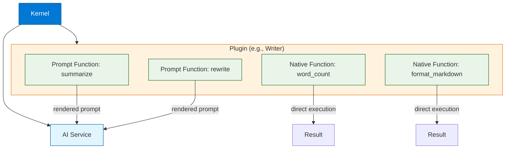
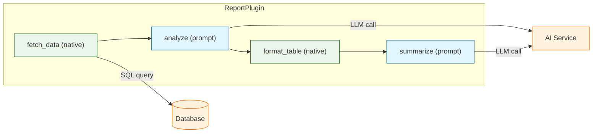
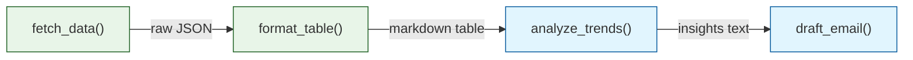

# Chapter 2: Plugins & Functions

Welcome to **Chapter 2: Plugins & Functions**. In this part of **Semantic Kernel Tutorial: Microsoft's AI Orchestration**, you will build an intuitive mental model first, then move into concrete implementation details and practical production tradeoffs.


> Build native and semantic functions, package them as plugins, and compose them for reusable AI capabilities.

## What Are Plugins?

Plugins are the fundamental building blocks of Semantic Kernel. A **plugin** is a named collection of **functions** that can be invoked by the kernel, by planners, or by other functions. Plugins give the LLM "skills" -- the ability to perform actions beyond text generation, such as calculations, API calls, file operations, and database queries.



### Function Types at a Glance

| Type | Description | Execution | Use Case |
|:-----|:------------|:----------|:---------|
| **Native function** | Python/C# method decorated with `@kernel_function` | Deterministic, runs locally | Calculations, validation, API calls, formatting |
| **Prompt function** | Prompt template with variables and execution settings | Sent to LLM via AI service | Summarization, translation, classification, generation |
| **Hybrid plugin** | Mix of native and prompt functions in one namespace | Both | End-to-end workflows (fetch data natively, process with LLM) |

---

## Creating Native Functions

Native functions are regular methods in your programming language. They execute deterministically on the host machine -- no LLM call is involved. Decorate them with `@kernel_function` (Python) or `[KernelFunction]` (C#) to register them with the kernel.

### Python Native Functions

```python
from semantic_kernel.functions import kernel_function


class MathPlugin:
    """Plugin for mathematical operations."""

    @kernel_function(name="add", description="Add two numbers together")
    def add(self, a: float, b: float) -> float:
        return a + b

    @kernel_function(name="subtract", description="Subtract b from a")
    def subtract(self, a: float, b: float) -> float:
        return a - b

    @kernel_function(name="multiply", description="Multiply two numbers")
    def multiply(self, a: float, b: float) -> float:
        return a * b

    @kernel_function(name="percent_change", description="Calculate percentage change from old to new value")
    def percent_change(self, old: float, new: float) -> float:
        if old == 0:
            raise ValueError("Old value cannot be zero")
        return round(((new - old) / old) * 100, 2)


# Register the plugin on the kernel
kernel.add_plugin(MathPlugin(), plugin_name="math")

# Invoke a specific function
result = await kernel.invoke(
    kernel.plugins["math"]["percent_change"],
    old=100,
    new=125,
)
print(result)  # 25.0
```

### C# Native Functions

```csharp
using Microsoft.SemanticKernel;
using System.ComponentModel;

public class MathPlugin
{
    [KernelFunction("add")]
    [Description("Add two numbers together")]
    public double Add(double a, double b) => a + b;

    [KernelFunction("subtract")]
    [Description("Subtract b from a")]
    public double Subtract(double a, double b) => a - b;

    [KernelFunction("multiply")]
    [Description("Multiply two numbers")]
    public double Multiply(double a, double b) => a * b;

    [KernelFunction("percent_change")]
    [Description("Calculate percentage change from old to new value")]
    public double PercentChange(double oldValue, double newValue)
    {
        if (oldValue == 0) throw new ArgumentException("Old value cannot be zero");
        return Math.Round(((newValue - oldValue) / oldValue) * 100, 2);
    }
}

// Register plugin
kernel.Plugins.AddFromObject(new MathPlugin(), "math");

// Invoke
var result = await kernel.InvokeAsync(
    kernel.Plugins["math"]["percent_change"],
    new KernelArguments { ["oldValue"] = 100.0, ["newValue"] = 125.0 }
);
Console.WriteLine(result); // 25
```

---

## Creating Prompt Functions

Prompt functions wrap a prompt template with variable placeholders, execution settings (temperature, max tokens), and metadata. When invoked, the kernel renders the template with the provided arguments and sends it to the configured AI service.

### Python Prompt Functions

```python
import semantic_kernel as sk

# Define the prompt template configuration
email_template = sk.PromptTemplateConfig(
    template="""
    You are a professional copywriter.
    Draft a {{$tone}} email about {{$topic}} to {{$audience}}.
    Keep it under {{$words}} words.
    End with a clear call-to-action.

    Format:
    Subject: ...
    Body: ...
    """,
    input_variables=[
        {"name": "tone", "description": "Tone of voice", "default": "concise"},
        {"name": "topic", "description": "Main subject of the email"},
        {"name": "audience", "description": "Target recipients"},
        {"name": "words", "description": "Maximum word count", "default": "120"},
    ],
    execution_settings=sk.PromptExecutionSettings(
        max_tokens=300,
        temperature=0.7,
        top_p=0.9,
    ),
)

# Create the function from the template
email_fn = kernel.create_function_from_prompt(
    function_name="draft_email",
    plugin_name="Writer",
    prompt_template_config=email_template,
)

# Invoke with arguments
draft = await kernel.invoke(
    email_fn,
    topic="launching our new API",
    audience="developer community",
    tone="friendly",
    words="100",
)
print(draft)
```

### C# Prompt Functions

```csharp
using Microsoft.SemanticKernel;

// Create a prompt function inline
var emailFunction = kernel.CreateFunctionFromPrompt(
    promptTemplate: @"You are a professional copywriter.
Draft a {{$tone}} email about {{$topic}} to {{$audience}}.
Keep it under {{$words}} words.
End with a clear call-to-action.

Format:
Subject: ...
Body: ...",
    functionName: "draft_email",
    description: "Draft a professional email"
);

// Invoke with arguments
var result = await kernel.InvokeAsync(
    emailFunction,
    new KernelArguments
    {
        ["tone"] = "friendly",
        ["topic"] = "launching our new API",
        ["audience"] = "developer community",
        ["words"] = "100"
    }
);

Console.WriteLine(result);
```

---

## Hybrid Plugins: Combining Native and Prompt Functions

The real power of the plugin system emerges when you combine deterministic native functions with LLM-powered prompt functions in a single plugin. This lets you build end-to-end workflows where data is fetched, processed, and transformed within one cohesive namespace.



### Python Hybrid Plugin

```python
import json
from semantic_kernel.functions import kernel_function


class ReportPlugin:
    """Plugin that combines data fetching with LLM analysis."""

    @kernel_function(name="fetch_sales", description="Fetch sales data for a given quarter")
    def fetch_sales(self, quarter: str) -> str:
        # In production, this would query a database or API
        data = {
            "Q1": {"revenue": 1200000, "deals": 45, "growth": 12.5},
            "Q2": {"revenue": 1450000, "deals": 52, "growth": 20.8},
            "Q3": {"revenue": 1380000, "deals": 48, "growth": -4.8},
            "Q4": {"revenue": 1620000, "deals": 61, "growth": 17.4},
        }
        return json.dumps(data.get(quarter, {}))

    @kernel_function(name="format_table", description="Format data as a markdown table")
    def format_table(self, data: str) -> str:
        parsed = json.loads(data)
        rows = ["| Metric | Value |", "|:-------|------:|"]
        for key, value in parsed.items():
            rows.append(f"| {key} | {value} |")
        return "\n".join(rows)

    @kernel_function(name="calculate_growth", description="Calculate compound growth rate")
    def calculate_growth(self, values: str) -> float:
        nums = json.loads(values)
        if len(nums) < 2:
            return 0.0
        return round(((nums[-1] / nums[0]) ** (1 / (len(nums) - 1)) - 1) * 100, 2)


# Register the hybrid plugin
kernel.add_plugin(ReportPlugin(), plugin_name="reports")

# Also add a prompt function to the same logical workflow
analyze_fn = kernel.create_function_from_prompt(
    function_name="analyze_trends",
    plugin_name="reports_ai",
    prompt="""
    Analyze the following sales data and provide 3 key insights:
    {{$data}}

    Format each insight as a bullet point.
    """,
)
```

---

## Organizing Plugins on Disk

For maintainable projects, organize plugins in a clear directory structure. Semantic Kernel supports loading prompt functions from YAML or JSON configuration files alongside your native code.

### Recommended Directory Layout

```
plugins/
  writer/
    __init__.py              # WriterPlugin class (native functions)
    prompts/
      summarize/
        config.json          # prompt config (template, settings)
        skprompt.txt         # prompt template text
      rewrite/
        config.json
        skprompt.txt
  math/
    __init__.py              # MathPlugin class (native functions)
  reports/
    __init__.py              # ReportPlugin class (hybrid)
    prompts/
      analyze/
        config.json
        skprompt.txt
```

### Prompt Configuration File (config.json)

```json
{
  "schema": 1,
  "description": "Summarize text in a given style",
  "execution_settings": {
    "default": {
      "max_tokens": 256,
      "temperature": 0.5,
      "top_p": 0.9
    }
  },
  "input_variables": [
    {
      "name": "input",
      "description": "Text to summarize",
      "is_required": true
    },
    {
      "name": "style",
      "description": "Summary style",
      "default": "concise"
    }
  ]
}
```

### Prompt Template File (skprompt.txt)

```
Summarize the following text in {{$style}} style.
Keep the summary under 3 sentences.

Text:
{{$input}}
```

### Loading Plugins from Disk

```python
# Load all prompt functions from a directory
kernel.add_plugin(
    parent_directory="./plugins",
    plugin_name="writer",
)

# Or load native + prompt functions together
from plugins.writer import WriterPlugin

kernel.add_plugin(WriterPlugin(), plugin_name="writer_native")
```

---

## Function Parameters and Return Types

Semantic Kernel uses type annotations to understand function signatures. Proper typing improves planner accuracy (planners read descriptions and types to decide which functions to call) and enables validation.

### Parameter Best Practices

| Practice | Why |
|:---------|:----|
| Use type hints (`str`, `float`, `int`, `bool`) | Planners and auto-invocation rely on type metadata |
| Write clear `description` strings | Planners select functions by matching descriptions to goals |
| Set `default` values where appropriate | Prevents errors when optional arguments are omitted |
| Return `str` for LLM-consumable output | Planners chain function outputs as text between steps |
| Use `json.dumps()` for complex return values | Structured data can be parsed by downstream functions |

### Python Example with Rich Typing

```python
from semantic_kernel.functions import kernel_function
from typing import Optional
import json


class TextPlugin:
    """Plugin for text analysis and transformation."""

    @kernel_function(
        name="word_count",
        description="Count the number of words in the given text"
    )
    def word_count(self, text: str) -> int:
        return len(text.split())

    @kernel_function(
        name="truncate",
        description="Truncate text to the specified maximum number of words"
    )
    def truncate(self, text: str, max_words: int = 50) -> str:
        words = text.split()
        if len(words) <= max_words:
            return text
        return " ".join(words[:max_words]) + "..."

    @kernel_function(
        name="extract_keywords",
        description="Extract keywords from text and return as JSON array"
    )
    def extract_keywords(self, text: str, top_n: int = 5) -> str:
        # Simplified keyword extraction (use NLP library in production)
        words = text.lower().split()
        freq = {}
        for w in words:
            w = w.strip(".,!?;:")
            if len(w) > 3:
                freq[w] = freq.get(w, 0) + 1
        sorted_words = sorted(freq, key=freq.get, reverse=True)[:top_n]
        return json.dumps(sorted_words)
```

### C# Example with Rich Typing

```csharp
using Microsoft.SemanticKernel;
using System.ComponentModel;
using System.Text.Json;

public class TextPlugin
{
    [KernelFunction("word_count")]
    [Description("Count the number of words in the given text")]
    public int WordCount(string text) => text.Split(' ').Length;

    [KernelFunction("truncate")]
    [Description("Truncate text to the specified maximum number of words")]
    public string Truncate(
        string text,
        [Description("Maximum number of words")] int maxWords = 50)
    {
        var words = text.Split(' ');
        if (words.Length <= maxWords) return text;
        return string.Join(' ', words.Take(maxWords)) + "...";
    }

    [KernelFunction("extract_keywords")]
    [Description("Extract keywords from text and return as JSON array")]
    public string ExtractKeywords(
        string text,
        [Description("Number of top keywords to extract")] int topN = 5)
    {
        var words = text.ToLower().Split(' ', StringSplitOptions.RemoveEmptyEntries);
        var freq = words
            .Where(w => w.Length > 3)
            .GroupBy(w => w.Trim('.', ',', '!', '?'))
            .OrderByDescending(g => g.Count())
            .Take(topN)
            .Select(g => g.Key);
        return JsonSerializer.Serialize(freq);
    }
}
```

---

## Composing Functions: Chaining and Pipelines

You can chain multiple functions together, passing the output of one as the input of the next. This is the foundation for building complex AI workflows.



### Python Function Chaining

```python
async def generate_report(kernel, quarter: str):
    """Chain multiple plugin functions to generate a report."""

    # Step 1: Fetch data (native function)
    raw_data = await kernel.invoke(
        kernel.plugins["reports"]["fetch_sales"],
        quarter=quarter,
    )

    # Step 2: Format as table (native function)
    table = await kernel.invoke(
        kernel.plugins["reports"]["format_table"],
        data=str(raw_data),
    )

    # Step 3: Analyze with LLM (prompt function)
    analysis = await kernel.invoke(
        kernel.plugins["reports_ai"]["analyze_trends"],
        data=str(table),
    )

    # Step 4: Draft email (prompt function)
    email = await kernel.invoke(
        kernel.plugins["Writer"]["draft_email"],
        topic=f"Q{quarter} Sales Report",
        audience="leadership team",
        tone="executive",
        words="200",
    )

    return {
        "table": str(table),
        "analysis": str(analysis),
        "email": str(email),
    }
```

### C# Function Chaining

```csharp
async Task<Dictionary<string, string>> GenerateReport(Kernel kernel, string quarter)
{
    // Step 1: Fetch data
    var rawData = await kernel.InvokeAsync(
        kernel.Plugins["reports"]["fetch_sales"],
        new KernelArguments { ["quarter"] = quarter }
    );

    // Step 2: Format as table
    var table = await kernel.InvokeAsync(
        kernel.Plugins["reports"]["format_table"],
        new KernelArguments { ["data"] = rawData.ToString() }
    );

    // Step 3: Analyze with LLM
    var analysis = await kernel.InvokeAsync(
        kernel.Plugins["reports_ai"]["analyze_trends"],
        new KernelArguments { ["data"] = table.ToString() }
    );

    return new Dictionary<string, string>
    {
        ["table"] = table.ToString(),
        ["analysis"] = analysis.ToString(),
    };
}
```

---

## Testing Plugins

Native functions are fully deterministic and should have comprehensive unit tests. Prompt functions can be tested with mocked AI services or integration tests with real providers.

### Python Unit Tests

```python
import pytest
import semantic_kernel as sk
from plugins.math import MathPlugin
from plugins.text import TextPlugin


class TestMathPlugin:
    """Unit tests for the MathPlugin."""

    @pytest.fixture
    def kernel(self):
        k = sk.Kernel()
        k.add_plugin(MathPlugin(), "math")
        return k

    @pytest.mark.asyncio
    async def test_add(self, kernel):
        result = await kernel.invoke(kernel.plugins["math"]["add"], a=2, b=3)
        assert float(str(result)) == 5.0

    @pytest.mark.asyncio
    async def test_percent_change(self, kernel):
        result = await kernel.invoke(
            kernel.plugins["math"]["percent_change"],
            old=100, new=125,
        )
        assert float(str(result)) == 25.0

    @pytest.mark.asyncio
    async def test_percent_change_zero_division(self, kernel):
        with pytest.raises(ValueError, match="cannot be zero"):
            await kernel.invoke(
                kernel.plugins["math"]["percent_change"],
                old=0, new=100,
            )


class TestTextPlugin:
    """Unit tests for the TextPlugin."""

    @pytest.fixture
    def kernel(self):
        k = sk.Kernel()
        k.add_plugin(TextPlugin(), "text")
        return k

    @pytest.mark.asyncio
    async def test_word_count(self, kernel):
        result = await kernel.invoke(
            kernel.plugins["text"]["word_count"],
            text="hello world foo bar",
        )
        assert int(str(result)) == 4

    @pytest.mark.asyncio
    async def test_truncate_short_text(self, kernel):
        result = await kernel.invoke(
            kernel.plugins["text"]["truncate"],
            text="short text",
            max_words=50,
        )
        assert str(result) == "short text"
```

### C# Unit Tests

```csharp
using Microsoft.SemanticKernel;
using Xunit;

public class MathPluginTests
{
    private readonly Kernel _kernel;

    public MathPluginTests()
    {
        var builder = Kernel.CreateBuilder();
        _kernel = builder.Build();
        _kernel.Plugins.AddFromObject(new MathPlugin(), "math");
    }

    [Fact]
    public async Task Add_ReturnsSum()
    {
        var result = await _kernel.InvokeAsync(
            _kernel.Plugins["math"]["add"],
            new KernelArguments { ["a"] = 2.0, ["b"] = 3.0 }
        );
        Assert.Equal(5.0, double.Parse(result.ToString()));
    }

    [Fact]
    public async Task PercentChange_CalculatesCorrectly()
    {
        var result = await _kernel.InvokeAsync(
            _kernel.Plugins["math"]["percent_change"],
            new KernelArguments { ["oldValue"] = 100.0, ["newValue"] = 125.0 }
        );
        Assert.Equal(25.0, double.Parse(result.ToString()));
    }
}
```

---

## Best Practices

| Category | Recommendation |
|:---------|:---------------|
| **Naming** | Use clear, verb-based function names (`add`, `fetch_data`, `summarize`) |
| **Descriptions** | Write descriptions as if explaining to a co-worker; planners rely on them |
| **Deterministic logic** | Use native functions for calculations, validation, and formatting |
| **LLM tasks** | Use prompt functions for creativity, summarization, and classification |
| **Type safety** | Add type annotations; consider Pydantic models for structured I/O |
| **Error handling** | Raise descriptive exceptions in native functions; add fallback prompts |
| **Guardrails** | Set `max_tokens` and `temperature` in prompt execution settings |
| **Testing** | Unit test every native function; integration test prompt functions |
| **Versioning** | Store prompt configs in version control; track prompt changes like code |
| **Streaming** | Use `kernel.invoke_stream()` for long prompt outputs |

---

## Summary

Plugins are the building blocks of Semantic Kernel. Native functions provide deterministic, testable logic using standard Python or C# methods. Prompt functions wrap LLM calls in reusable templates with variable substitution and execution settings. Hybrid plugins combine both types, enabling end-to-end workflows that fetch data, process it with AI, and return structured results. Organizing plugins into clear namespaces with proper descriptions makes them discoverable by planners and maintainable by teams.

## Key Takeaways

- **Native functions** use `@kernel_function` (Python) or `[KernelFunction]` (C#) to register methods with the kernel.
- **Prompt functions** are created from templates with `{{$variable}}` placeholders and execution settings.
- **Hybrid plugins** mix native and prompt functions in one namespace for complete workflows.
- Good **descriptions and type hints** are critical -- planners use them to select the right functions.
- **Test native functions** with standard unit tests; test prompt functions with integration tests.
- Organize plugins in **directories** with config files for team collaboration and version control.

## Next Steps

In **[Chapter 3: Prompt Engineering](03-prompts.md)**, you will learn how to design robust prompt templates with few-shot examples, safety guardrails, grounded generation patterns, and output format controls.

---

*Built with insights from the [Semantic Kernel](https://github.com/microsoft/semantic-kernel) project.*

## What Problem Does This Solve?

Most teams struggle here because the hard part is not writing more code, but deciding clear boundaries for `kernel`, `text`, `words` so behavior stays predictable as complexity grows.

In practical terms, this chapter helps you avoid three common failures:

- coupling core logic too tightly to one implementation path
- missing the handoff boundaries between setup, execution, and validation
- shipping changes without clear rollback or observability strategy

After working through this chapter, you should be able to reason about `Chapter 2: Plugins & Functions` as an operating subsystem inside **Semantic Kernel Tutorial: Microsoft's AI Orchestration**, with explicit contracts for inputs, state transitions, and outputs.

Use the implementation notes around `prompt`, `description`, `result` as your checklist when adapting these patterns to your own repository.

## How it Works Under the Hood

Under the hood, `Chapter 2: Plugins & Functions` usually follows a repeatable control path:

1. **Context bootstrap**: initialize runtime config and prerequisites for `kernel`.
2. **Input normalization**: shape incoming data so `text` receives stable contracts.
3. **Core execution**: run the main logic branch and propagate intermediate state through `words`.
4. **Policy and safety checks**: enforce limits, auth scopes, and failure boundaries.
5. **Output composition**: return canonical result payloads for downstream consumers.
6. **Operational telemetry**: emit logs/metrics needed for debugging and performance tuning.

When debugging, walk this sequence in order and confirm each stage has explicit success/failure conditions.

## Source Walkthrough

Use the following upstream sources to verify implementation details while reading this chapter:

- [View Repo](https://github.com/microsoft/semantic-kernel)
  Why it matters: authoritative reference on `View Repo` (github.com).
- [Awesome Code Docs](https://github.com/johnxie/awesome-code-docs)
  Why it matters: authoritative reference on `Awesome Code Docs` (github.com).

Suggested trace strategy:
- search upstream code for `kernel` and `text` to map concrete implementation paths
- compare docs claims against actual runtime/config code before reusing patterns in production

## Chapter Connections

- [Tutorial Index](index.md)
- [Previous Chapter: Chapter 1: Getting Started with Semantic Kernel](01-getting-started.md)
- [Next Chapter: Chapter 3: Prompt Engineering](03-prompts.md)
- [Main Catalog](../../README.md#-tutorial-catalog)
- [A-Z Tutorial Directory](../../discoverability/tutorial-directory.md)
