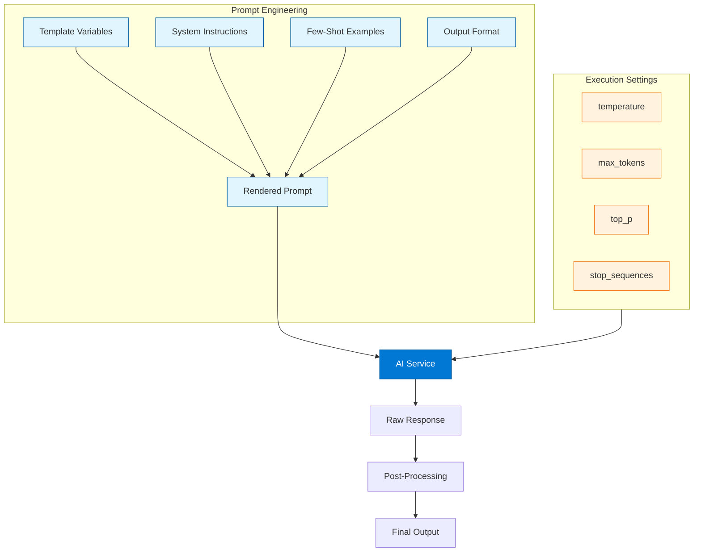
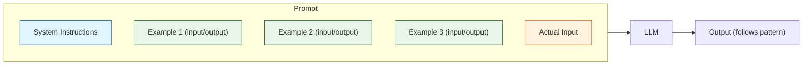
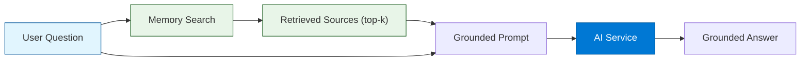
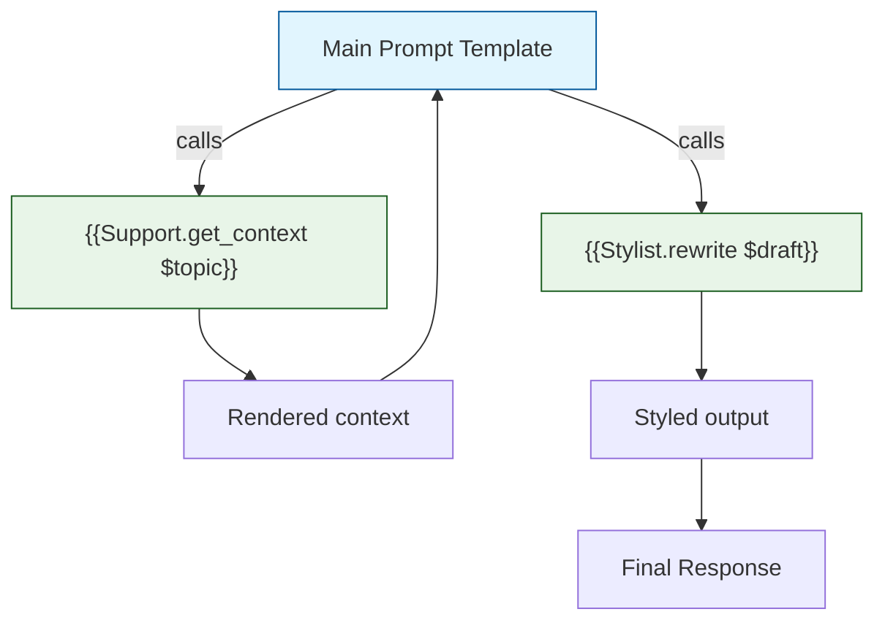

# Chapter 3: Prompt Engineering

Welcome to **Chapter 3: Prompt Engineering**. In this part of **Semantic Kernel Tutorial: Microsoft's AI Orchestration**, you will build an intuitive mental model first, then move into concrete implementation details and practical production tradeoffs.


> Design resilient prompt templates with variables, few-shot examples, safety rails, and output controls.

## Why Prompt Engineering Matters

In Semantic Kernel, prompt functions are the primary way your application communicates with LLMs. A well-engineered prompt is the difference between a prototype that works "sometimes" and a production system that delivers consistent, safe, and useful results. This chapter covers the patterns, techniques, and best practices for building robust prompt templates within the SK framework.



---

## Prompt Template Basics

Every prompt function in Semantic Kernel starts with a **template** -- a string that contains both static instructions and dynamic `{{$variable}}` placeholders. When the function is invoked, the kernel substitutes the variables with the provided arguments and sends the rendered prompt to the AI service.

### Template Variable Syntax

| Syntax | Meaning | Example |
|:-------|:--------|:--------|
| `{{$variableName}}` | Substitute a kernel argument | `{{$input}}` |
| `{{$var}}` with default | Use default if argument is missing | Defined in `input_variables` config |
| `{{plugin.function}}` | Call another function inline | `{{Writer.summarize $input}}` |

### Python -- Basic Template

```python
import semantic_kernel as sk

qa_template = sk.PromptTemplateConfig(
    template="""
    You are an expert support assistant for {{$product}}.
    Answer the user's question using the provided context.
    If the answer is not in the context, say "I don't have that information."

    Context:
    {{$context}}

    Question: {{$question}}

    Answer in a {{$tone}} tone and keep it under {{$max_words}} words.
    """,
    input_variables=[
        {"name": "product", "description": "Product name", "default": "our platform"},
        {"name": "context", "description": "Grounding context from docs or memory"},
        {"name": "question", "description": "The user's question"},
        {"name": "tone", "description": "Response tone", "default": "professional"},
        {"name": "max_words", "description": "Maximum word count", "default": "150"},
    ],
    execution_settings=sk.PromptExecutionSettings(
        max_tokens=300,
        temperature=0.3,
        top_p=0.9,
    ),
)

qa_function = kernel.create_function_from_prompt(
    function_name="answer_question",
    plugin_name="Support",
    prompt_template_config=qa_template,
)

# Invoke
result = await kernel.invoke(
    qa_function,
    product="Semantic Kernel",
    context="Semantic Kernel supports plugins, planners, and memory.",
    question="What features does Semantic Kernel offer?",
    tone="concise",
    max_words="100",
)
print(result)
```

### C# -- Basic Template

```csharp
using Microsoft.SemanticKernel;

var qaFunction = kernel.CreateFunctionFromPrompt(
    promptTemplate: @"You are an expert support assistant for {{$product}}.
Answer the user's question using the provided context.
If the answer is not in the context, say ""I don't have that information.""

Context:
{{$context}}

Question: {{$question}}

Answer in a {{$tone}} tone and keep it under {{$max_words}} words.",
    functionName: "answer_question",
    description: "Answer a support question using provided context"
);

var result = await kernel.InvokeAsync(
    qaFunction,
    new KernelArguments
    {
        ["product"] = "Semantic Kernel",
        ["context"] = "Semantic Kernel supports plugins, planners, and memory.",
        ["question"] = "What features does Semantic Kernel offer?",
        ["tone"] = "concise",
        ["max_words"] = "100"
    }
);

Console.WriteLine(result);
```

---

## Execution Settings

Execution settings control how the AI service processes your prompt. Choosing the right settings is critical for balancing quality, cost, and latency.

| Setting | Range | Purpose | Guidance |
|:--------|:------|:--------|:---------|
| `temperature` | 0.0 -- 2.0 | Controls randomness | 0.0--0.3 for factual tasks; 0.7--1.0 for creative tasks |
| `top_p` | 0.0 -- 1.0 | Nucleus sampling threshold | 0.9 is a good default; lower for more focused output |
| `max_tokens` | 1 -- model max | Maximum response length | Set tight limits to control cost; leave headroom for full answers |
| `frequency_penalty` | -2.0 -- 2.0 | Penalize repeated tokens | 0.0--0.5 to reduce repetition |
| `presence_penalty` | -2.0 -- 2.0 | Encourage topic diversity | 0.0--0.5 for broader coverage |
| `stop_sequences` | list of strings | Stop generation at these tokens | Useful for structured output (`\n\n`, `---`) |

### Setting Profiles by Task Type

```python
# Factual Q&A -- low temperature, tight token budget
factual_settings = sk.PromptExecutionSettings(
    temperature=0.1,
    max_tokens=200,
    top_p=0.9,
    frequency_penalty=0.0,
)

# Creative writing -- higher temperature, generous budget
creative_settings = sk.PromptExecutionSettings(
    temperature=0.8,
    max_tokens=800,
    top_p=0.95,
    frequency_penalty=0.3,
    presence_penalty=0.3,
)

# Classification -- very low temperature, minimal tokens
classification_settings = sk.PromptExecutionSettings(
    temperature=0.0,
    max_tokens=10,
    top_p=1.0,
)

# Structured output (JSON) -- low temperature, stop at closing brace
structured_settings = sk.PromptExecutionSettings(
    temperature=0.0,
    max_tokens=500,
    top_p=1.0,
    stop_sequences=["\n\n"],
)
```

---

## Few-Shot Prompting

Few-shot examples show the model the pattern you expect. They are one of the most effective ways to improve output quality and consistency without fine-tuning.



### Python -- Few-Shot Style Transfer

```python
style_template = sk.PromptTemplateConfig(
    template="""
    You rewrite text to match the requested style.
    Follow the pattern shown in the examples exactly.

    Examples:
    ---
    Style: formal
    Input: Thanks for the info!
    Output: Thank you for providing this information.
    ---
    Style: casual
    Input: Please provide the quarterly financial details.
    Output: Hey, can you share the quarterly numbers?
    ---
    Style: enthusiastic
    Input: The project is complete.
    Output: The project is done -- what an amazing milestone!
    ---

    Now rewrite the following:
    Style: {{$style}}
    Input: {{$text}}
    Output:
    """,
    input_variables=[
        {"name": "style", "description": "Target writing style"},
        {"name": "text", "description": "Text to rewrite"},
    ],
    execution_settings=sk.PromptExecutionSettings(
        temperature=0.5,
        max_tokens=200,
    ),
)

rewrite_fn = kernel.create_function_from_prompt(
    function_name="rewrite",
    plugin_name="Stylist",
    prompt_template_config=style_template,
)

result = await kernel.invoke(
    rewrite_fn,
    style="enthusiastic",
    text="Welcome to Semantic Kernel.",
)
print(result)
# Expected: Welcome to Semantic Kernel -- this is going to be incredible!
```

### Python -- Few-Shot Classification

```python
classifier_template = sk.PromptTemplateConfig(
    template="""
    Classify the support ticket into exactly one category.

    Categories: billing, technical, account, feature_request, other

    Examples:
    Ticket: "I was charged twice for my subscription"
    Category: billing

    Ticket: "The API returns a 500 error when I send POST requests"
    Category: technical

    Ticket: "Can I change the email on my account?"
    Category: account

    Ticket: "It would be great if you added dark mode"
    Category: feature_request

    Ticket: "{{$ticket}}"
    Category:
    """,
    input_variables=[
        {"name": "ticket", "description": "Support ticket text to classify"},
    ],
    execution_settings=sk.PromptExecutionSettings(
        temperature=0.0,
        max_tokens=10,
    ),
)

classify_fn = kernel.create_function_from_prompt(
    function_name="classify_ticket",
    plugin_name="Support",
    prompt_template_config=classifier_template,
)
```

### C# -- Few-Shot Classification

```csharp
var classifyFunction = kernel.CreateFunctionFromPrompt(
    promptTemplate: @"Classify the support ticket into exactly one category.

Categories: billing, technical, account, feature_request, other

Examples:
Ticket: ""I was charged twice for my subscription""
Category: billing

Ticket: ""The API returns a 500 error when I send POST requests""
Category: technical

Ticket: ""Can I change the email on my account?""
Category: account

Ticket: ""{{$ticket}}""
Category:",
    functionName: "classify_ticket",
    description: "Classify a support ticket into a category"
);

var result = await kernel.InvokeAsync(
    classifyFunction,
    new KernelArguments { ["ticket"] = "My dashboard won't load after the latest update" }
);
Console.WriteLine(result); // technical
```

---

## Grounded Generation (RAG Pattern)

Grounded generation forces the model to answer using only the provided sources, reducing hallucinations. This is the foundation of Retrieval-Augmented Generation (RAG) in Semantic Kernel.



### Python -- Grounded Prompt

```python
grounded_template = sk.PromptTemplateConfig(
    template="""
    You are a helpful assistant. Answer the question using ONLY the provided sources.
    If the answer is not contained in the sources, respond with:
    "I don't have enough information to answer that based on the available sources."

    Do NOT make up information. Do NOT use prior knowledge.
    Cite the source ID when possible (e.g., [Source 1]).

    Sources:
    {{$sources}}

    Question: {{$question}}

    Answer:
    """,
    input_variables=[
        {"name": "sources", "description": "Retrieved source documents"},
        {"name": "question", "description": "User question to answer"},
    ],
    execution_settings=sk.PromptExecutionSettings(
        temperature=0.1,
        max_tokens=300,
        frequency_penalty=0.0,
    ),
)

grounded_fn = kernel.create_function_from_prompt(
    function_name="grounded_answer",
    plugin_name="RAG",
    prompt_template_config=grounded_template,
)

# Usage with memory search results
sources = """
[Source 1] Semantic Kernel supports plugins for extending functionality.
[Source 2] Planners in SK can automatically decompose goals into steps.
[Source 3] Memory uses vector stores like Chroma and Qdrant for semantic search.
"""

result = await kernel.invoke(
    grounded_fn,
    sources=sources,
    question="How does Semantic Kernel handle task planning?",
)
print(result)
```

### C# -- Grounded Prompt

```csharp
var groundedFunction = kernel.CreateFunctionFromPrompt(
    promptTemplate: @"You are a helpful assistant. Answer the question using ONLY the provided sources.
If the answer is not contained in the sources, respond with:
""I don't have enough information to answer that based on the available sources.""

Do NOT make up information. Do NOT use prior knowledge.
Cite the source ID when possible (e.g., [Source 1]).

Sources:
{{$sources}}

Question: {{$question}}

Answer:",
    functionName: "grounded_answer",
    description: "Answer questions using only provided sources"
);

var sources = @"[Source 1] Semantic Kernel supports plugins for extending functionality.
[Source 2] Planners in SK can automatically decompose goals into steps.
[Source 3] Memory uses vector stores like Chroma and Qdrant for semantic search.";

var result = await kernel.InvokeAsync(
    groundedFunction,
    new KernelArguments
    {
        ["sources"] = sources,
        ["question"] = "How does Semantic Kernel handle task planning?"
    }
);

Console.WriteLine(result);
```

---

## Structured Output: JSON and Markdown

Requesting structured output formats gives you predictable, machine-parseable results.

### Python -- JSON Output

```python
json_template = sk.PromptTemplateConfig(
    template="""
    Extract structured information from the following text.
    Return ONLY a valid JSON object with no additional text.

    Schema:
    {
      "title": "string",
      "summary": "string (max 50 words)",
      "topics": ["string"],
      "sentiment": "positive | neutral | negative",
      "confidence": 0.0-1.0
    }

    Text:
    {{$text}}

    JSON:
    """,
    input_variables=[
        {"name": "text", "description": "Text to extract information from"},
    ],
    execution_settings=sk.PromptExecutionSettings(
        temperature=0.0,
        max_tokens=300,
    ),
)

extract_fn = kernel.create_function_from_prompt(
    function_name="extract_info",
    plugin_name="Extractor",
    prompt_template_config=json_template,
)

result = await kernel.invoke(
    extract_fn,
    text="Semantic Kernel 1.0 was released with great fanfare. "
         "The community loves the new plugin architecture and planner improvements.",
)

import json
parsed = json.loads(str(result))
print(parsed["sentiment"])  # positive
print(parsed["topics"])     # ["Semantic Kernel", "plugin architecture", "planner"]
```

### Python -- Markdown Table Output

```python
table_template = sk.PromptTemplateConfig(
    template="""
    Compare the following items and return a markdown table.

    Items to compare: {{$items}}
    Comparison criteria: {{$criteria}}

    Return ONLY the markdown table with headers. No additional text.
    """,
    input_variables=[
        {"name": "items", "description": "Comma-separated list of items to compare"},
        {"name": "criteria", "description": "Comma-separated comparison criteria"},
    ],
    execution_settings=sk.PromptExecutionSettings(
        temperature=0.2,
        max_tokens=500,
    ),
)
```

---

## Safety and Guardrails

Every production prompt should include safety instructions that prevent misuse, block harmful outputs, and handle edge cases gracefully.

### Safety Checklist for Prompts

| Guardrail | Implementation |
|:----------|:---------------|
| **Refusal policy** | "If asked to do something harmful, politely decline" |
| **PII handling** | "Do not include personal identifiable information in responses" |
| **Brand tone** | "Always respond as a professional assistant for [Company]" |
| **Scope limitation** | "Only answer questions about [topic]. For other topics, redirect" |
| **Hallucination prevention** | "If unsure, say you are unsure. Do not make up information" |
| **Output constraints** | Word limits, format requirements, allowed response categories |
| **Input validation** | Check input length and content before sending to the model |

### Python -- Safe Prompt Template

```python
safe_template = sk.PromptTemplateConfig(
    template="""
    You are a helpful assistant for Contoso Corp.

    RULES:
    1. Only answer questions about Contoso products and services.
    2. If asked about competitors, say "I can only help with Contoso topics."
    3. Never reveal internal pricing, roadmaps, or confidential information.
    4. Do not generate harmful, offensive, or misleading content.
    5. If you are unsure about an answer, say "I'm not sure about that.
       Let me connect you with a human agent."
    6. Keep responses under {{$max_words}} words.
    7. Do not include any personal information (names, emails, phone numbers)
       in your responses.

    Context:
    {{$context}}

    User: {{$question}}
    Assistant:
    """,
    input_variables=[
        {"name": "context", "description": "Relevant context from knowledge base"},
        {"name": "question", "description": "User question"},
        {"name": "max_words", "description": "Response word limit", "default": "150"},
    ],
    execution_settings=sk.PromptExecutionSettings(
        temperature=0.3,
        max_tokens=250,
    ),
)
```

### Input Validation Before Prompt Execution

```python
def validate_input(text: str, max_length: int = 2000) -> str:
    """Validate and sanitize user input before sending to the model."""
    if not text or not text.strip():
        raise ValueError("Input cannot be empty")

    if len(text) > max_length:
        raise ValueError(f"Input exceeds maximum length of {max_length} characters")

    # Strip potential prompt injection attempts
    dangerous_patterns = ["ignore previous instructions", "system:", "assistant:"]
    text_lower = text.lower()
    for pattern in dangerous_patterns:
        if pattern in text_lower:
            raise ValueError("Input contains disallowed content")

    return text.strip()


# Usage
try:
    clean_input = validate_input(user_message)
    result = await kernel.invoke(qa_function, question=clean_input, context=context)
except ValueError as e:
    result = f"Invalid input: {e}"
```

---

## Prompt Composition: Nested Function Calls

Semantic Kernel templates can call other registered functions inline using the `{{plugin.function}}` syntax. This lets you compose complex prompts from simpler building blocks.



### Python -- Nested Function Call in Template

```python
# Assume "Support.get_faq" is a registered native function
# that returns FAQ text for a given topic

composite_template = sk.PromptTemplateConfig(
    template="""
    Answer the user's question using the FAQ below.

    FAQ:
    {{Support.get_faq $topic}}

    Question: {{$question}}

    Provide a helpful, concise answer.
    """,
    input_variables=[
        {"name": "topic", "description": "FAQ topic category"},
        {"name": "question", "description": "User question"},
    ],
)
```

---

## Prompt Debugging and Iteration

### Logging Rendered Prompts

```python
import logging

# Enable debug logging to see rendered prompts
logging.basicConfig(level=logging.DEBUG)
logger = logging.getLogger("semantic_kernel")

# Or use filters to capture the rendered prompt programmatically
from semantic_kernel.filters import PromptRenderFilter


class PromptLogger(PromptRenderFilter):
    async def on_prompt_render(self, context, next):
        await next(context)
        # Log the rendered prompt (redact sensitive data in production)
        logger.info(f"Rendered prompt:\n{context.rendered_prompt}")


kernel.add_filter(PromptLogger())
```

### C# -- Prompt Render Filter

```csharp
using Microsoft.SemanticKernel;

// Add a filter to log rendered prompts
kernel.PromptRenderFilters.Add(new PromptLoggingFilter());

public class PromptLoggingFilter : IPromptRenderFilter
{
    public async Task OnPromptRenderAsync(
        PromptRenderContext context,
        Func<PromptRenderContext, Task> next)
    {
        await next(context);
        Console.WriteLine($"Rendered prompt:\n{context.RenderedPrompt}");
    }
}
```

### Prompt Iteration Workflow

| Step | Action | Tool |
|:-----|:-------|:-----|
| 1 | Write initial prompt template | IDE / text editor |
| 2 | Test with sample inputs | `kernel.invoke()` with debug logging |
| 3 | Review rendered prompt | Prompt render filter / logs |
| 4 | Evaluate output quality | Manual review or LLM-as-judge |
| 5 | Adjust settings (temperature, examples) | Modify `PromptExecutionSettings` |
| 6 | A/B test variants | Run both, compare metrics |
| 7 | Monitor in production | OpenTelemetry traces, token usage |

---

## Prompt Patterns Reference

| Pattern | When to Use | Key Technique |
|:--------|:-----------|:-------------|
| **Zero-shot** | Simple, well-defined tasks | Clear instructions, no examples |
| **Few-shot** | Pattern-following tasks | 2--5 input/output examples |
| **Chain-of-thought** | Reasoning tasks | "Think step by step" instruction |
| **Grounded/RAG** | Factual Q&A | Provide sources, cite them |
| **Classification** | Categorization | List categories, show examples, low temperature |
| **Extraction** | Structured data from text | Define JSON schema, request only JSON |
| **Rewriting** | Style transfer, editing | Show before/after examples |
| **Summarization** | Condensing text | Specify length, format, and audience |

---

## Summary

Prompt engineering in Semantic Kernel revolves around designing templates with `{{$variable}}` placeholders, configuring execution settings for different task types, and applying proven patterns like few-shot examples, grounded generation, and structured output formats. Safety guardrails, input validation, and prompt logging are essential for production deployments. The template system supports nested function calls, enabling composition of complex prompts from simpler building blocks.

## Key Takeaways

- **Template variables** (`{{$name}}`) with descriptions and defaults make prompts reusable and self-documenting.
- **Execution settings** (temperature, max_tokens, top_p) must be tuned for each task type -- factual vs. creative.
- **Few-shot examples** dramatically improve output quality and consistency for pattern-following tasks.
- **Grounded generation** (RAG) reduces hallucinations by constraining answers to provided sources.
- **Safety guardrails** (refusal policies, scope limits, PII handling) are non-negotiable for production.
- **Prompt render filters** let you log, audit, and transform prompts before they reach the AI service.
- **Structured output** (JSON, markdown) makes responses machine-parseable for downstream processing.

## Next Steps

In **[Chapter 4: AI Services & Connectors](04-services.md)**, you will learn how to register multiple AI providers, implement service routing and fallbacks, handle streaming responses, and add observability to your AI calls.

---

*Built with insights from the [Semantic Kernel](https://github.com/microsoft/semantic-kernel) project.*

## What Problem Does This Solve?

Most teams struggle here because the hard part is not writing more code, but deciding clear boundaries for `question`, `context`, `description` so behavior stays predictable as complexity grows.

In practical terms, this chapter helps you avoid three common failures:

- coupling core logic too tightly to one implementation path
- missing the handoff boundaries between setup, execution, and validation
- shipping changes without clear rollback or observability strategy

After working through this chapter, you should be able to reason about `Chapter 3: Prompt Engineering` as an operating subsystem inside **Semantic Kernel Tutorial: Microsoft's AI Orchestration**, with explicit contracts for inputs, state transitions, and outputs.

Use the implementation notes around `name`, `kernel`, `text` as your checklist when adapting these patterns to your own repository.

## How it Works Under the Hood

Under the hood, `Chapter 3: Prompt Engineering` usually follows a repeatable control path:

1. **Context bootstrap**: initialize runtime config and prerequisites for `question`.
2. **Input normalization**: shape incoming data so `context` receives stable contracts.
3. **Core execution**: run the main logic branch and propagate intermediate state through `description`.
4. **Policy and safety checks**: enforce limits, auth scopes, and failure boundaries.
5. **Output composition**: return canonical result payloads for downstream consumers.
6. **Operational telemetry**: emit logs/metrics needed for debugging and performance tuning.

When debugging, walk this sequence in order and confirm each stage has explicit success/failure conditions.

## Source Walkthrough

Use the following upstream sources to verify implementation details while reading this chapter:

- [View Repo](https://github.com/microsoft/semantic-kernel)
  Why it matters: authoritative reference on `View Repo` (github.com).
- [Awesome Code Docs](https://github.com/johnxie/awesome-code-docs)
  Why it matters: authoritative reference on `Awesome Code Docs` (github.com).

Suggested trace strategy:
- search upstream code for `question` and `context` to map concrete implementation paths
- compare docs claims against actual runtime/config code before reusing patterns in production

## Chapter Connections

- [Tutorial Index](index.md)
- [Previous Chapter: Chapter 2: Plugins & Functions](02-plugins.md)
- [Next Chapter: Chapter 4: AI Services & Connectors](04-services.md)
- [Main Catalog](../../README.md#-tutorial-catalog)
- [A-Z Tutorial Directory](../../discoverability/tutorial-directory.md)
