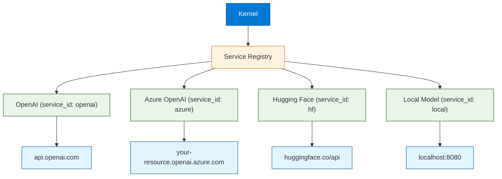
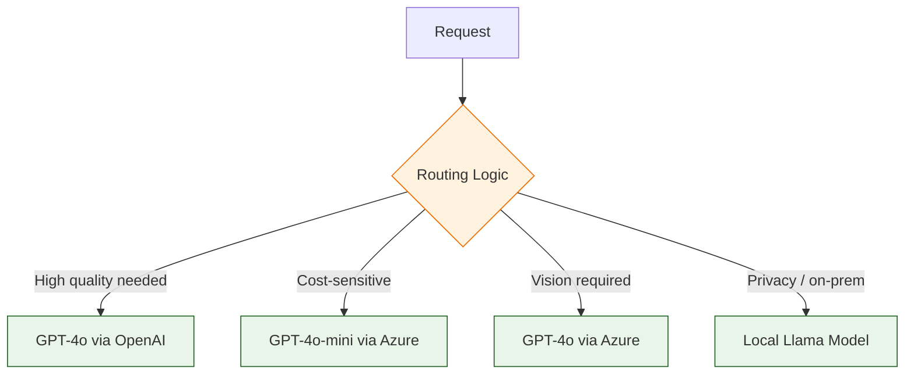
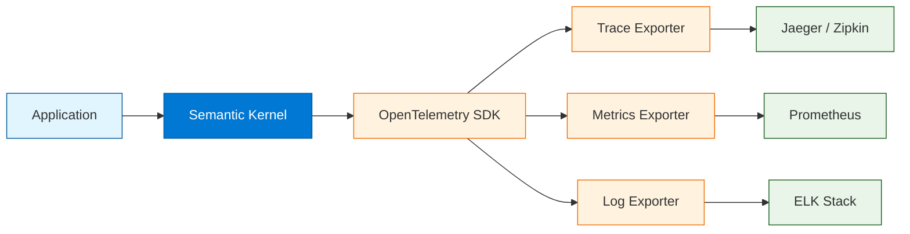

# Chapter 4: AI Services & Connectors

Welcome to **Chapter 4: AI Services & Connectors**. In this part of **Semantic Kernel Tutorial: Microsoft's AI Orchestration**, you will build an intuitive mental model first, then move into concrete implementation details and practical production tradeoffs.


> Connect OpenAI, Azure OpenAI, Hugging Face, and local models with retries, fallbacks, and routing.

## The Service Layer

AI services are the connectors that link Semantic Kernel to the actual language models. The kernel delegates all LLM calls to registered services, abstracting away provider-specific details. This means you can swap providers, add fallbacks, or route requests without changing your application logic.



### Supported Service Types

| Service Type | Purpose | Example Providers |
|:-------------|:--------|:-----------------|
| **Chat Completion** | Conversational text generation | OpenAI GPT-4o, Azure OpenAI, Anthropic |
| **Text Completion** | Single-turn text generation | OpenAI, Hugging Face |
| **Text Embedding** | Convert text to vector embeddings | OpenAI text-embedding-3-small, Azure |
| **Image Generation** | Generate images from text | DALL-E via OpenAI/Azure |
| **Audio** | Speech-to-text, text-to-speech | OpenAI Whisper, Azure Speech |

---

## Registering AI Services

### Python -- OpenAI

```python
import os
import semantic_kernel as sk
from semantic_kernel.connectors.ai.open_ai import (
    OpenAIChatCompletion,
    OpenAITextEmbedding,
)

kernel = sk.Kernel()

# Chat completion service
kernel.add_service(
    OpenAIChatCompletion(
        service_id="openai-chat",
        ai_model_id="gpt-4o",
        api_key=os.environ["OPENAI_API_KEY"],
    )
)

# Text embedding service (for memory/vector search)
kernel.add_service(
    OpenAITextEmbedding(
        service_id="openai-embedding",
        ai_model_id="text-embedding-3-small",
        api_key=os.environ["OPENAI_API_KEY"],
    )
)
```

### Python -- Azure OpenAI

```python
from semantic_kernel.connectors.ai.open_ai import (
    AzureChatCompletion,
    AzureTextEmbedding,
)

# Azure OpenAI chat completion
kernel.add_service(
    AzureChatCompletion(
        service_id="azure-chat",
        deployment_name="gpt-4o",
        endpoint=os.environ["AZURE_OPENAI_ENDPOINT"],
        api_key=os.environ["AZURE_OPENAI_API_KEY"],
    )
)

# Azure OpenAI embeddings
kernel.add_service(
    AzureTextEmbedding(
        service_id="azure-embedding",
        deployment_name="text-embedding-3-small",
        endpoint=os.environ["AZURE_OPENAI_ENDPOINT"],
        api_key=os.environ["AZURE_OPENAI_API_KEY"],
    )
)
```

### Python -- Hugging Face

```python
from semantic_kernel.connectors.ai.hugging_face import (
    HuggingFaceTextCompletion,
)

# Hugging Face Inference API
kernel.add_service(
    HuggingFaceTextCompletion(
        service_id="hf-text",
        ai_model_id="mistralai/Mistral-7B-Instruct-v0.2",
        api_key=os.environ.get("HF_API_KEY"),
    )
)
```

### C# -- Registering Multiple Services

```csharp
using Microsoft.SemanticKernel;
using Microsoft.Extensions.Configuration;

var config = new ConfigurationBuilder()
    .AddJsonFile("appsettings.json")
    .AddEnvironmentVariables()
    .Build();

var builder = Kernel.CreateBuilder();

// OpenAI chat completion
builder.AddOpenAIChatCompletion(
    modelId: "gpt-4o",
    apiKey: config["OpenAI:ApiKey"]!,
    serviceId: "openai-chat"
);

// Azure OpenAI chat completion
builder.AddAzureOpenAIChatCompletion(
    deploymentName: config["AzureOpenAI:DeploymentName"]!,
    endpoint: config["AzureOpenAI:Endpoint"]!,
    apiKey: config["AzureOpenAI:ApiKey"]!,
    serviceId: "azure-chat"
);

// OpenAI text embedding
builder.AddOpenAITextEmbeddingGeneration(
    modelId: "text-embedding-3-small",
    apiKey: config["OpenAI:ApiKey"]!,
    serviceId: "openai-embedding"
);

var kernel = builder.Build();
```

---

## Service Selection and Routing

When multiple services are registered, you need a strategy for selecting the right one. Semantic Kernel lets you specify a `service_id` at invocation time or build custom routing logic.



### Python -- Service Router

```python
from dataclasses import dataclass
from typing import Optional


@dataclass
class RequestRequirements:
    """Requirements that determine which AI service to use."""
    needs_vision: bool = False
    needs_high_quality: bool = False
    is_cost_sensitive: bool = False
    needs_privacy: bool = False
    max_latency_ms: Optional[int] = None


def select_service(requirements: RequestRequirements) -> str:
    """Select the best service based on request requirements."""
    if requirements.needs_privacy:
        return "local"
    if requirements.needs_vision:
        return "azure-chat"  # Azure supports vision models
    if requirements.is_cost_sensitive:
        return "hf-text"
    if requirements.needs_high_quality:
        return "openai-chat"
    return "openai-chat"  # default


async def routed_invoke(kernel, function, requirements: RequestRequirements, **kwargs):
    """Invoke a function with automatic service routing."""
    service_id = select_service(requirements)
    try:
        return await kernel.invoke(function, service_id=service_id, **kwargs)
    except Exception as e:
        # Fallback to a different service on failure
        fallback_id = "azure-chat" if service_id != "azure-chat" else "openai-chat"
        print(f"Service {service_id} failed ({e}), falling back to {fallback_id}")
        return await kernel.invoke(function, service_id=fallback_id, **kwargs)


# Usage
result = await routed_invoke(
    kernel,
    summarize_fn,
    RequestRequirements(is_cost_sensitive=True),
    input="Long text to summarize...",
    style="concise",
)
```

### C# -- Service Selector

```csharp
using Microsoft.SemanticKernel;

public class SmartServiceSelector
{
    public string SelectService(Dictionary<string, object> requirements)
    {
        if (requirements.ContainsKey("privacy") && (bool)requirements["privacy"])
            return "local";
        if (requirements.ContainsKey("vision") && (bool)requirements["vision"])
            return "azure-chat";
        if (requirements.ContainsKey("cost_sensitive") && (bool)requirements["cost_sensitive"])
            return "azure-mini";
        return "openai-chat";
    }
}

// Usage with execution settings that specify the service
var settings = new PromptExecutionSettings { ServiceId = "azure-chat" };
var result = await kernel.InvokePromptAsync(
    "Summarize: {{$input}}",
    new KernelArguments(settings) { ["input"] = "Text to summarize..." }
);
```

---

## Retries, Timeouts, and Circuit Breakers

Production AI applications must handle transient failures gracefully. Implement retry logic with exponential backoff, timeouts for slow responses, and circuit breakers to avoid hammering failing services.

### Python -- Retry with Tenacity

```python
import asyncio
from tenacity import (
    retry,
    stop_after_attempt,
    wait_exponential,
    retry_if_exception_type,
)


@retry(
    stop=stop_after_attempt(3),
    wait=wait_exponential(multiplier=1, min=1, max=10),
    retry=retry_if_exception_type((TimeoutError, ConnectionError)),
)
async def safe_invoke(kernel, function, timeout_seconds=30, **kwargs):
    """Invoke a kernel function with retry and timeout."""
    try:
        return await asyncio.wait_for(
            kernel.invoke(function, **kwargs),
            timeout=timeout_seconds,
        )
    except asyncio.TimeoutError:
        raise TimeoutError(f"Function timed out after {timeout_seconds}s")


# Usage
result = await safe_invoke(
    kernel,
    summarize_fn,
    timeout_seconds=20,
    input="Text to summarize...",
    style="concise",
)
```

### Python -- Circuit Breaker Pattern

```python
import time
from dataclasses import dataclass, field


@dataclass
class CircuitBreaker:
    """Simple circuit breaker for AI service calls."""
    failure_threshold: int = 5
    recovery_timeout: int = 60
    failures: int = field(default=0, init=False)
    last_failure_time: float = field(default=0, init=False)
    is_open: bool = field(default=False, init=False)

    def record_failure(self):
        self.failures += 1
        self.last_failure_time = time.time()
        if self.failures >= self.failure_threshold:
            self.is_open = True

    def record_success(self):
        self.failures = 0
        self.is_open = False

    def can_execute(self) -> bool:
        if not self.is_open:
            return True
        # Check if recovery timeout has elapsed
        if time.time() - self.last_failure_time > self.recovery_timeout:
            self.is_open = False  # Half-open: allow one attempt
            return True
        return False


# Per-service circuit breakers
breakers = {
    "openai-chat": CircuitBreaker(),
    "azure-chat": CircuitBreaker(),
}


async def resilient_invoke(kernel, function, service_id, **kwargs):
    """Invoke with circuit breaker protection."""
    breaker = breakers.get(service_id, CircuitBreaker())

    if not breaker.can_execute():
        raise RuntimeError(f"Circuit breaker open for {service_id}")

    try:
        result = await kernel.invoke(function, service_id=service_id, **kwargs)
        breaker.record_success()
        return result
    except Exception as e:
        breaker.record_failure()
        raise
```

### C# -- HttpClient Resilience with Polly

```csharp
using Microsoft.Extensions.DependencyInjection;
using Microsoft.Extensions.Http.Resilience;
using Microsoft.SemanticKernel;

var builder = Kernel.CreateBuilder();

// Add resilience to the HTTP client used by OpenAI
builder.Services.ConfigureHttpClientDefaults(clientBuilder =>
{
    clientBuilder.AddStandardResilienceHandler(options =>
    {
        options.Retry.MaxRetryAttempts = 3;
        options.Retry.BackoffType = DelayBackoffType.Exponential;
        options.Retry.UseJitter = true;
        options.AttemptTimeout.Timeout = TimeSpan.FromSeconds(30);
        options.CircuitBreaker.SamplingDuration = TimeSpan.FromSeconds(60);
        options.CircuitBreaker.FailureRatioThreshold = 0.5;
    });
});

builder.AddOpenAIChatCompletion("gpt-4o", apiKey, serviceId: "openai-chat");
var kernel = builder.Build();
```

---

## Streaming Responses

Streaming lets you display partial responses to users as they are generated, reducing perceived latency. This is especially important for long-form content generation and chat interfaces.

### Python -- Streaming

```python
# Stream a response token by token
async for chunk in kernel.invoke_stream(
    summarize_fn,
    input="A very long article about AI orchestration frameworks...",
    style="detailed",
    service_id="openai-chat",
):
    print(chunk, end="", flush=True)

print()  # newline after stream completes
```

### Python -- Streaming with Accumulation

```python
async def stream_with_callback(kernel, function, on_chunk, **kwargs):
    """Stream a response, calling on_chunk for each piece and returning the full text."""
    full_response = []
    async for chunk in kernel.invoke_stream(function, **kwargs):
        chunk_text = str(chunk)
        full_response.append(chunk_text)
        on_chunk(chunk_text)
    return "".join(full_response)


# Usage with a web socket or SSE callback
full_text = await stream_with_callback(
    kernel,
    summarize_fn,
    on_chunk=lambda c: send_to_websocket(c),
    input="Long text...",
    style="concise",
)
```

### C# -- Streaming

```csharp
using Microsoft.SemanticKernel;

// Stream a prompt response
await foreach (var chunk in kernel.InvokePromptStreamingAsync(
    "Write a detailed summary of {{$topic}}",
    new KernelArguments { ["topic"] = "AI orchestration frameworks" }))
{
    Console.Write(chunk);
}

Console.WriteLine();
```

### C# -- Streaming with Chat History

```csharp
using Microsoft.SemanticKernel.ChatCompletion;

var chatService = kernel.GetRequiredService<IChatCompletionService>();
var history = new ChatHistory("You are a helpful assistant.");
history.AddUserMessage("Explain Semantic Kernel plugins in detail.");

var fullResponse = new StringBuilder();
await foreach (var chunk in chatService.GetStreamingChatMessageContentsAsync(history))
{
    Console.Write(chunk.Content);
    fullResponse.Append(chunk.Content);
}

// Add the complete response to history
history.AddAssistantMessage(fullResponse.ToString());
```

---

## Observability and Monitoring

Production AI services need comprehensive observability. Semantic Kernel integrates with OpenTelemetry for distributed tracing and metrics.



### Python -- OpenTelemetry Setup

```python
from opentelemetry import trace
from opentelemetry.sdk.trace import TracerProvider
from opentelemetry.sdk.trace.export import ConsoleSpanExporter, BatchSpanProcessor

# Set up tracing
provider = TracerProvider()
provider.add_span_processor(BatchSpanProcessor(ConsoleSpanExporter()))
trace.set_tracer_provider(provider)

# Semantic Kernel will automatically emit traces when configured
# You can also add custom spans around your invocations
tracer = trace.get_tracer("sk-app")

async def traced_invoke(kernel, function, **kwargs):
    with tracer.start_as_current_span("sk.invoke") as span:
        span.set_attribute("sk.function_name", function.name)
        span.set_attribute("sk.plugin_name", function.plugin_name)
        try:
            result = await kernel.invoke(function, **kwargs)
            span.set_attribute("sk.success", True)
            span.set_attribute("sk.result_length", len(str(result)))
            return result
        except Exception as e:
            span.set_attribute("sk.success", False)
            span.set_attribute("sk.error", str(e))
            raise
```

### Key Metrics to Track

| Metric | Description | Alert Threshold |
|:-------|:-----------|:----------------|
| `sk.invoke.duration` | Latency per function call | p99 > 10s |
| `sk.invoke.tokens.input` | Input tokens per call | Unusually high (budget) |
| `sk.invoke.tokens.output` | Output tokens per call | Unusually high (budget) |
| `sk.invoke.errors` | Error count by service and type | > 5% error rate |
| `sk.service.availability` | Success rate per provider | < 99% |
| `sk.cost.per_request` | Estimated cost per invocation | > budget threshold |

### C# -- Logging and Telemetry

```csharp
using Microsoft.Extensions.DependencyInjection;
using Microsoft.Extensions.Logging;
using Microsoft.SemanticKernel;

var builder = Kernel.CreateBuilder();

// Add structured logging
builder.Services.AddLogging(logging =>
{
    logging.AddConsole();
    logging.SetMinimumLevel(LogLevel.Information);
    // Add OpenTelemetry logging
    // logging.AddOpenTelemetry(options => { ... });
});

// Add a function invocation filter for custom telemetry
builder.Services.AddSingleton<IFunctionInvocationFilter, TelemetryFilter>();

var kernel = builder.Build();

public class TelemetryFilter : IFunctionInvocationFilter
{
    private readonly ILogger<TelemetryFilter> _logger;

    public TelemetryFilter(ILogger<TelemetryFilter> logger) => _logger = logger;

    public async Task OnFunctionInvocationAsync(
        FunctionInvocationContext context,
        Func<FunctionInvocationContext, Task> next)
    {
        var sw = System.Diagnostics.Stopwatch.StartNew();
        _logger.LogInformation(
            "Invoking {Plugin}.{Function}",
            context.Function.PluginName,
            context.Function.Name);

        await next(context);

        sw.Stop();
        _logger.LogInformation(
            "Completed {Plugin}.{Function} in {ElapsedMs}ms",
            context.Function.PluginName,
            context.Function.Name,
            sw.ElapsedMilliseconds);
    }
}
```

---

## Cost Management

AI service costs can grow quickly. Implement controls to monitor and limit spending.

### Cost Control Strategies

| Strategy | Implementation |
|:---------|:---------------|
| **Model tiering** | Use GPT-4o-mini for drafts, GPT-4o for final output |
| **Token budgets** | Set `max_tokens` aggressively; track cumulative usage |
| **Caching** | Cache identical prompts; deduplicate embeddings by content hash |
| **Request batching** | Batch multiple small requests into one prompt |
| **Rate limiting** | Limit requests per user/session/minute |
| **Alerting** | Set budget alerts per provider; cut off when exceeded |

### Python -- Cost Tracker

```python
from dataclasses import dataclass, field


@dataclass
class CostTracker:
    """Track estimated costs across AI service invocations."""
    # Approximate costs per 1K tokens (USD)
    pricing = {
        "gpt-4o": {"input": 0.005, "output": 0.015},
        "gpt-4o-mini": {"input": 0.00015, "output": 0.0006},
        "text-embedding-3-small": {"input": 0.00002, "output": 0.0},
    }
    total_cost: float = field(default=0.0, init=False)
    calls: int = field(default=0, init=False)

    def record(self, model: str, input_tokens: int, output_tokens: int):
        prices = self.pricing.get(model, {"input": 0.01, "output": 0.03})
        cost = (input_tokens / 1000 * prices["input"] +
                output_tokens / 1000 * prices["output"])
        self.total_cost += cost
        self.calls += 1
        return cost

    def report(self) -> str:
        return f"Total cost: ${self.total_cost:.4f} across {self.calls} calls"


cost_tracker = CostTracker()

# After each invocation, record usage
# (extract token counts from the response metadata)
cost = cost_tracker.record("gpt-4o", input_tokens=150, output_tokens=200)
print(cost_tracker.report())
```

---

## Multi-Modal Services

Semantic Kernel supports multi-modal AI services for tasks beyond text generation.

### Python -- Image Generation

```python
from semantic_kernel.connectors.ai.open_ai import OpenAITextToImage

kernel.add_service(
    OpenAITextToImage(
        service_id="dalle",
        ai_model_id="dall-e-3",
        api_key=os.environ["OPENAI_API_KEY"],
    )
)

# Generate an image
image_service = kernel.get_service("dalle")
image_url = await image_service.generate_image(
    description="A futuristic city powered by AI, digital art style",
    width=1024,
    height=1024,
)
print(f"Generated image: {image_url}")
```

### Service Capabilities Matrix

| Service | Text Gen | Chat | Embeddings | Vision | Images | Audio |
|:--------|:--------:|:----:|:----------:|:------:|:------:|:-----:|
| OpenAI | Yes | Yes | Yes | Yes | Yes | Yes |
| Azure OpenAI | Yes | Yes | Yes | Yes | Yes | Yes |
| Hugging Face | Yes | Partial | Yes | No | No | No |
| Local (Ollama) | Yes | Yes | Yes | No | No | No |

---

## Summary

AI services in Semantic Kernel are modular connectors that link your application to language models. By registering multiple services with distinct `service_id` values, you can implement routing strategies based on cost, quality, privacy, and capability requirements. Production deployments require retry logic with exponential backoff, circuit breakers for fault tolerance, streaming for responsive UIs, and comprehensive observability through OpenTelemetry. Cost management through model tiering, token budgets, and caching keeps spending under control.

## Key Takeaways

- Register services with unique **`service_id`** values to enable routing and fallback.
- **OpenAI, Azure OpenAI, and Hugging Face** connectors are built-in; custom connectors can extend the framework.
- Implement **retries with exponential backoff** and **circuit breakers** for production resilience.
- Use **streaming** (`invoke_stream`) for long responses to reduce perceived latency.
- Export **traces and metrics** via OpenTelemetry for observability and debugging.
- Manage costs with **model tiering**, **token budgets**, **caching**, and **usage tracking**.
- The service layer is provider-agnostic -- swap models without changing application code.

## Next Steps

In **[Chapter 5: Memory & Embeddings](05-memory.md)**, you will learn how to add semantic memory to your application using vector stores, configure embedding models, implement RAG patterns, and manage document ingestion pipelines.

---

*Built with insights from the [Semantic Kernel](https://github.com/microsoft/semantic-kernel) project.*

## What Problem Does This Solve?

Most teams struggle here because the hard part is not writing more code, but deciding clear boundaries for `kernel`, `service_id`, `self` so behavior stays predictable as complexity grows.

In practical terms, this chapter helps you avoid three common failures:

- coupling core logic too tightly to one implementation path
- missing the handoff boundaries between setup, execution, and validation
- shipping changes without clear rollback or observability strategy

After working through this chapter, you should be able to reason about `Chapter 4: AI Services & Connectors` as an operating subsystem inside **Semantic Kernel Tutorial: Microsoft's AI Orchestration**, with explicit contracts for inputs, state transitions, and outputs.

Use the implementation notes around `chat`, `requirements`, `openai` as your checklist when adapting these patterns to your own repository.

## How it Works Under the Hood

Under the hood, `Chapter 4: AI Services & Connectors` usually follows a repeatable control path:

1. **Context bootstrap**: initialize runtime config and prerequisites for `kernel`.
2. **Input normalization**: shape incoming data so `service_id` receives stable contracts.
3. **Core execution**: run the main logic branch and propagate intermediate state through `self`.
4. **Policy and safety checks**: enforce limits, auth scopes, and failure boundaries.
5. **Output composition**: return canonical result payloads for downstream consumers.
6. **Operational telemetry**: emit logs/metrics needed for debugging and performance tuning.

When debugging, walk this sequence in order and confirm each stage has explicit success/failure conditions.

## Source Walkthrough

Use the following upstream sources to verify implementation details while reading this chapter:

- [View Repo](https://github.com/microsoft/semantic-kernel)
  Why it matters: authoritative reference on `View Repo` (github.com).
- [Awesome Code Docs](https://github.com/johnxie/awesome-code-docs)
  Why it matters: authoritative reference on `Awesome Code Docs` (github.com).

Suggested trace strategy:
- search upstream code for `kernel` and `service_id` to map concrete implementation paths
- compare docs claims against actual runtime/config code before reusing patterns in production

## Chapter Connections

- [Tutorial Index](index.md)
- [Previous Chapter: Chapter 3: Prompt Engineering](03-prompts.md)
- [Next Chapter: Chapter 5: Memory & Embeddings](05-memory.md)
- [Main Catalog](../../README.md#-tutorial-catalog)
- [A-Z Tutorial Directory](../../discoverability/tutorial-directory.md)
