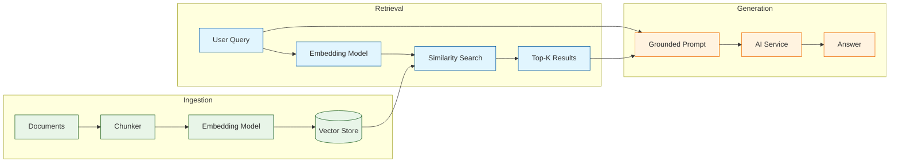
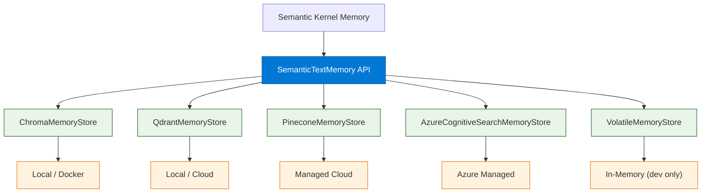
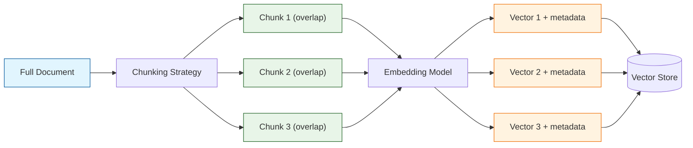

# Chapter 5: Memory & Embeddings

Welcome to **Chapter 5: Memory & Embeddings**. In this part of **Semantic Kernel Tutorial: Microsoft's AI Orchestration**, you will build an intuitive mental model first, then move into concrete implementation details and practical production tradeoffs.


> Add semantic memory with vector stores, embeddings, and grounded retrieval to build knowledge-aware applications.

## What is Semantic Memory?

Semantic memory gives your AI application the ability to store and retrieve information based on **meaning** rather than exact keyword matches. Instead of traditional database queries, semantic memory uses **vector embeddings** -- numerical representations of text -- to find contextually relevant information. This is the foundation of Retrieval-Augmented Generation (RAG).



### How Embeddings Work

| Concept | Description |
|:--------|:------------|
| **Embedding** | A fixed-length numeric vector (e.g., 1536 dimensions) representing the meaning of text |
| **Similarity** | Measured by cosine distance between vectors; closer vectors = more related text |
| **Vector store** | A database optimized for storing and searching embedding vectors |
| **Top-K search** | Return the K most similar vectors to a query vector |
| **Collection** | A named group of vectors within a store, like a database table |

---

## Setting Up Semantic Memory

### Python -- Basic Memory Setup

```python
import os
import semantic_kernel as sk
from semantic_kernel.connectors.ai.open_ai import OpenAITextEmbedding
from semantic_kernel.connectors.memory.chroma import ChromaMemoryStore
from semantic_kernel.memory import SemanticTextMemory

# 1. Create an embedding generator
embeddings = OpenAITextEmbedding(
    ai_model_id="text-embedding-3-small",
    api_key=os.environ["OPENAI_API_KEY"],
)

# 2. Create a vector store (Chroma with local persistence)
store = ChromaMemoryStore(persist_directory="./memory_data")

# 3. Combine into SemanticTextMemory
memory = SemanticTextMemory(
    storage=store,
    embeddings_generator=embeddings,
)

# 4. Optionally attach to the kernel
kernel = sk.Kernel()
kernel.add_service(
    OpenAITextEmbedding(
        service_id="embedding",
        ai_model_id="text-embedding-3-small",
        api_key=os.environ["OPENAI_API_KEY"],
    )
)
```

### C# -- Basic Memory Setup

```csharp
using Microsoft.SemanticKernel;
using Microsoft.SemanticKernel.Memory;
using Microsoft.SemanticKernel.Connectors.Chroma;
using Microsoft.SemanticKernel.Connectors.OpenAI;

var builder = Kernel.CreateBuilder();
builder.AddOpenAIChatCompletion("gpt-4o", apiKey);
var kernel = builder.Build();

// Create memory with Chroma store
var memoryBuilder = new MemoryBuilder()
    .WithOpenAITextEmbeddingGeneration("text-embedding-3-small", apiKey)
    .WithChromaMemoryStore("http://localhost:8000");

var memory = memoryBuilder.Build();
```

---

## Saving Information to Memory

### Python -- Saving Documents

```python
# Save individual facts or document chunks
await memory.save_information(
    collection="company_docs",
    id="doc-001",
    text="Semantic Kernel is Microsoft's open-source SDK for AI orchestration. "
         "It supports plugins, planners, and memory for building enterprise AI apps.",
    description="SK overview",
    additional_metadata="source=docs, version=1.0",
)

await memory.save_information(
    collection="company_docs",
    id="doc-002",
    text="Plugins in Semantic Kernel consist of native functions (Python/C# code) "
         "and prompt functions (LLM prompt templates). They are the building blocks "
         "of SK applications.",
    description="Plugin architecture",
    additional_metadata="source=docs, version=1.0",
)

await memory.save_information(
    collection="company_docs",
    id="doc-003",
    text="Planners use the LLM to automatically decompose a user goal into a "
         "sequence of plugin function calls. The Sequential Planner creates a "
         "linear chain of steps.",
    description="Planners overview",
    additional_metadata="source=docs, version=1.0",
)

# Save a batch of documents
documents = [
    {"id": f"faq-{i}", "text": text, "description": f"FAQ item {i}"}
    for i, text in enumerate(faq_items)
]

for doc in documents:
    await memory.save_information(
        collection="faq",
        id=doc["id"],
        text=doc["text"],
        description=doc["description"],
    )
```

### C# -- Saving Documents

```csharp
// Save individual documents
await memory.SaveInformationAsync(
    collection: "company_docs",
    id: "doc-001",
    text: "Semantic Kernel is Microsoft's open-source SDK for AI orchestration.",
    description: "SK overview",
    additionalMetadata: "source=docs"
);

await memory.SaveInformationAsync(
    collection: "company_docs",
    id: "doc-002",
    text: "Plugins consist of native functions and prompt functions.",
    description: "Plugin architecture",
    additionalMetadata: "source=docs"
);

// Save multiple documents in a loop
foreach (var (text, index) in faqItems.Select((t, i) => (t, i)))
{
    await memory.SaveInformationAsync(
        collection: "faq",
        id: $"faq-{index}",
        text: text,
        description: $"FAQ item {index}"
    );
}
```

---

## Searching Memory

### Python -- Semantic Search

```python
# Search for relevant documents
results = await memory.search(
    collection="company_docs",
    query="How do I create plugins in Semantic Kernel?",
    limit=3,
    min_relevance_score=0.7,
)

for result in results:
    print(f"Score: {result.relevance:.4f}")
    print(f"Text:  {result.text}")
    print(f"ID:    {result.id}")
    print("---")
```

### Python -- Using Search Results in Prompts (RAG)

```python
async def answer_with_memory(kernel, memory, question: str) -> str:
    """Answer a question using semantic memory for grounding."""

    # Step 1: Search memory for relevant context
    results = await memory.search(
        collection="company_docs",
        query=question,
        limit=5,
        min_relevance_score=0.6,
    )

    # Step 2: Build context from search results
    if not results:
        return "I don't have any relevant information to answer that question."

    sources = []
    for i, r in enumerate(results):
        sources.append(f"[Source {i+1}] (relevance: {r.relevance:.2f}) {r.text}")
    context = "\n\n".join(sources)

    # Step 3: Create and invoke a grounded prompt
    grounded_fn = kernel.create_function_from_prompt(
        function_name="rag_answer",
        plugin_name="RAG",
        prompt="""
        Answer the question using ONLY the provided sources.
        If the answer is not in the sources, say "I don't have that information."
        Cite sources by number (e.g., [Source 1]).

        Sources:
        {{$context}}

        Question: {{$question}}

        Answer:
        """,
    )

    result = await kernel.invoke(
        grounded_fn,
        context=context,
        question=question,
    )

    return str(result)


# Usage
answer = await answer_with_memory(
    kernel, memory,
    "How do planners work in Semantic Kernel?"
)
print(answer)
```

### C# -- RAG Pattern

```csharp
async Task<string> AnswerWithMemory(
    Kernel kernel, ISemanticTextMemory memory, string question)
{
    // Search memory
    var results = await memory.SearchAsync(
        collection: "company_docs",
        query: question,
        limit: 5,
        minRelevanceScore: 0.6
    ).ToListAsync();

    if (!results.Any())
        return "I don't have relevant information for that question.";

    // Build context
    var sources = results.Select((r, i) =>
        $"[Source {i + 1}] (relevance: {r.Relevance:F2}) {r.Metadata.Text}");
    var context = string.Join("\n\n", sources);

    // Grounded prompt
    var result = await kernel.InvokePromptAsync(
        @"Answer the question using ONLY the provided sources.
Cite sources by number (e.g., [Source 1]).

Sources:
{{$context}}

Question: {{$question}}

Answer:",
        new KernelArguments
        {
            ["context"] = context,
            ["question"] = question
        }
    );

    return result.ToString();
}
```

---

## Vector Store Backends

Semantic Kernel supports multiple vector store backends. Choose based on your deployment requirements.



### Store Comparison

| Store | Persistence | Scalability | Managed | Filtering | Best For |
|:------|:-----------|:-----------|:--------|:----------|:---------|
| **Volatile** | In-memory only | Single process | No | Basic | Development, testing |
| **Chroma** | Local disk | Single node | No | Metadata | Prototypes, small apps |
| **Qdrant** | Disk / Cloud | Horizontal | Optional | Advanced | Production, on-prem |
| **Pinecone** | Cloud | Serverless | Yes | Metadata | Serverless production |
| **Azure Cognitive Search** | Cloud | Enterprise | Yes | Full-text + vector | Enterprise Azure apps |

### Python -- Alternative Store Configurations

```python
# Qdrant (local)
from semantic_kernel.connectors.memory.qdrant import QdrantMemoryStore

qdrant_store = QdrantMemoryStore(
    url="http://localhost:6333",
    vector_size=1536,  # must match your embedding model dimension
)

memory = SemanticTextMemory(
    storage=qdrant_store,
    embeddings_generator=embeddings,
)

# Pinecone (cloud)
from semantic_kernel.connectors.memory.pinecone import PineconeMemoryStore

pinecone_store = PineconeMemoryStore(
    api_key=os.environ["PINECONE_API_KEY"],
    environment="us-west1-gcp",
)

memory = SemanticTextMemory(
    storage=pinecone_store,
    embeddings_generator=embeddings,
)

# Azure Cognitive Search
from semantic_kernel.connectors.memory.azure_cognitive_search import (
    AzureCognitiveSearchMemoryStore,
)

acs_store = AzureCognitiveSearchMemoryStore(
    endpoint=os.environ["ACS_ENDPOINT"],
    admin_key=os.environ["ACS_ADMIN_KEY"],
    vector_size=1536,
)

memory = SemanticTextMemory(
    storage=acs_store,
    embeddings_generator=embeddings,
)

# Volatile (in-memory, for testing only)
from semantic_kernel.memory import VolatileMemoryStore

volatile_store = VolatileMemoryStore()

memory = SemanticTextMemory(
    storage=volatile_store,
    embeddings_generator=embeddings,
)
```

---

## Document Chunking and Ingestion

Real-world documents are too long to embed as a single vector. You need to **chunk** them into smaller pieces that fit within the embedding model's context window while preserving semantic coherence.



### Chunking Strategies

| Strategy | Description | Best For |
|:---------|:-----------|:---------|
| **Fixed-size** | Split every N characters/tokens | Simple, predictable |
| **Sentence-based** | Split on sentence boundaries | Prose, articles |
| **Paragraph-based** | Split on paragraph breaks | Structured docs |
| **Heading-based** | Split on markdown/HTML headings | Technical docs |
| **Recursive** | Try paragraph, then sentence, then fixed | Mixed content |
| **Sliding window** | Fixed size with overlap | Preserves context at boundaries |

### Python -- Document Ingestion Pipeline

```python
import hashlib
from dataclasses import dataclass


@dataclass
class DocumentChunk:
    id: str
    text: str
    source: str
    chunk_index: int
    metadata: dict


def chunk_text(
    text: str,
    chunk_size: int = 500,
    overlap: int = 50,
) -> list[str]:
    """Split text into overlapping chunks by character count."""
    chunks = []
    start = 0
    while start < len(text):
        end = start + chunk_size
        chunk = text[start:end]
        chunks.append(chunk.strip())
        start = end - overlap
    return [c for c in chunks if c]


def chunk_by_paragraphs(
    text: str,
    max_chunk_size: int = 1000,
) -> list[str]:
    """Split text by paragraphs, merging small ones."""
    paragraphs = text.split("\n\n")
    chunks = []
    current_chunk = ""

    for para in paragraphs:
        if len(current_chunk) + len(para) > max_chunk_size and current_chunk:
            chunks.append(current_chunk.strip())
            current_chunk = para
        else:
            current_chunk += "\n\n" + para if current_chunk else para

    if current_chunk.strip():
        chunks.append(current_chunk.strip())

    return chunks


async def ingest_document(
    memory,
    text: str,
    source: str,
    collection: str = "documents",
    chunk_size: int = 500,
    overlap: int = 50,
):
    """Ingest a document into memory by chunking and embedding."""
    chunks = chunk_text(text, chunk_size=chunk_size, overlap=overlap)

    for i, chunk in enumerate(chunks):
        # Generate a stable ID from content hash
        content_hash = hashlib.md5(chunk.encode()).hexdigest()[:12]
        doc_id = f"{source}_{i}_{content_hash}"

        await memory.save_information(
            collection=collection,
            id=doc_id,
            text=chunk,
            description=f"Chunk {i} from {source}",
            additional_metadata=f"source={source},chunk={i},total={len(chunks)}",
        )

    print(f"Ingested {len(chunks)} chunks from {source}")
    return len(chunks)


# Usage
with open("docs/architecture.md") as f:
    doc_text = f.read()

count = await ingest_document(
    memory,
    text=doc_text,
    source="architecture.md",
    collection="company_docs",
    chunk_size=600,
    overlap=100,
)
```

### Python -- Batch Ingestion

```python
import glob


async def ingest_directory(
    memory,
    directory: str,
    collection: str,
    pattern: str = "**/*.md",
):
    """Ingest all matching files from a directory."""
    files = glob.glob(f"{directory}/{pattern}", recursive=True)
    total_chunks = 0

    for filepath in files:
        with open(filepath) as f:
            text = f.read()
        chunks = await ingest_document(
            memory,
            text=text,
            source=filepath,
            collection=collection,
        )
        total_chunks += chunks

    print(f"Ingested {total_chunks} total chunks from {len(files)} files")
    return total_chunks


# Ingest an entire documentation directory
await ingest_directory(
    memory,
    directory="./docs",
    collection="company_docs",
    pattern="**/*.md",
)
```

---

## Embedding Model Selection

The embedding model determines the quality of your similarity search. Choose based on your requirements.

| Model | Dimensions | Max Tokens | Quality | Cost | Provider |
|:------|:----------|:----------|:--------|:-----|:---------|
| `text-embedding-3-small` | 1536 | 8191 | Good | Low | OpenAI |
| `text-embedding-3-large` | 3072 | 8191 | Best | Medium | OpenAI |
| `text-embedding-ada-002` | 1536 | 8191 | Good | Low | OpenAI |
| Azure `text-embedding-3-small` | 1536 | 8191 | Good | Low | Azure |
| `all-MiniLM-L6-v2` | 384 | 256 | Fair | Free | HF/local |
| `bge-large-en-v1.5` | 1024 | 512 | Good | Free | HF/local |

### Key Considerations

- **Dimension count** affects storage and search speed. Higher dimensions = better quality but more storage.
- **Max tokens** limits chunk size. Stay well under the limit for best results.
- **Never mix embedding models** in the same collection. Re-embed everything if you switch models.
- **Normalize text** before embedding: lowercase, strip boilerplate, remove excessive whitespace.

---

## Memory Management

### Collection Operations

```python
# List all collections
collections = await store.get_collections()
print(f"Collections: {collections}")

# Delete a specific memory by ID
await memory.remove(collection="company_docs", key="doc-001")

# Clear an entire collection
await store.delete_collection("old_docs")

# Check if a memory exists
result = await memory.get(collection="company_docs", key="doc-001")
if result:
    print(f"Found: {result.text}")
else:
    print("Not found")
```

### Caching Embeddings

```python
import hashlib
import json


class EmbeddingCache:
    """Cache embeddings to avoid re-computing for identical content."""

    def __init__(self, cache_file: str = "./embedding_cache.json"):
        self.cache_file = cache_file
        try:
            with open(cache_file) as f:
                self.cache = json.load(f)
        except FileNotFoundError:
            self.cache = {}

    def _hash(self, text: str) -> str:
        return hashlib.sha256(text.encode()).hexdigest()

    def get(self, text: str):
        return self.cache.get(self._hash(text))

    def set(self, text: str, embedding: list[float]):
        self.cache[self._hash(text)] = embedding

    def save(self):
        with open(self.cache_file, "w") as f:
            json.dump(self.cache, f)


# Usage with memory save
cache = EmbeddingCache()

async def save_with_cache(memory, collection, doc_id, text, **kwargs):
    cached = cache.get(text)
    if cached:
        # Use cached embedding directly if store supports it
        pass
    await memory.save_information(
        collection=collection, id=doc_id, text=text, **kwargs
    )
    cache.save()
```

---

## Advanced Patterns

### Metadata Filtering

```python
# Some vector stores support metadata filtering during search
# This narrows the search space before similarity matching

results = await memory.search(
    collection="company_docs",
    query="How do plugins work?",
    limit=5,
    min_relevance_score=0.6,
    # Metadata filtering varies by store backend
)

# Post-filter by metadata when store doesn't support it natively
filtered = [
    r for r in results
    if "source=docs" in (r.additional_metadata or "")
]
```

### Conversation Memory

```python
class ConversationMemory:
    """Maintain short-term and long-term conversation memory."""

    def __init__(self, memory: SemanticTextMemory, max_short_term: int = 10):
        self.memory = memory
        self.short_term: list[dict] = []
        self.max_short_term = max_short_term

    def add_turn(self, role: str, content: str):
        """Add a conversation turn to short-term memory."""
        self.short_term.append({"role": role, "content": content})
        if len(self.short_term) > self.max_short_term:
            self.short_term.pop(0)

    async def save_to_long_term(self, session_id: str, summary: str):
        """Save a conversation summary to long-term memory."""
        await self.memory.save_information(
            collection="conversations",
            id=f"conv-{session_id}",
            text=summary,
            description=f"Conversation summary for session {session_id}",
        )

    def get_recent_context(self) -> str:
        """Get recent conversation history as a string."""
        return "\n".join(
            f"{turn['role']}: {turn['content']}"
            for turn in self.short_term
        )

    async def search_past_conversations(self, query: str, limit: int = 3):
        """Search past conversations for relevant context."""
        return await self.memory.search(
            collection="conversations",
            query=query,
            limit=limit,
        )
```

---

## Summary

Semantic memory in Semantic Kernel transforms your application from a stateless prompt executor into a knowledge-aware system. By embedding documents into vector stores and retrieving relevant context at query time, you implement the RAG pattern that grounds LLM responses in your actual data. The `SemanticTextMemory` API provides a consistent interface across multiple vector store backends (Chroma, Qdrant, Pinecone, Azure Cognitive Search), letting you start with a local store and scale to managed cloud services without changing application code. Proper chunking, embedding model selection, and caching are critical for production quality and cost management.

## Key Takeaways

- **Semantic memory** stores and retrieves information by meaning using vector embeddings.
- The **SemanticTextMemory** API abstracts vector store backends behind a consistent interface.
- **RAG (Retrieval-Augmented Generation)** grounds LLM responses in your actual data, reducing hallucinations.
- **Document chunking** is essential -- choose a strategy (paragraph, heading, sliding window) that preserves context.
- **Embedding models** should not be mixed within a collection; re-embed if you change models.
- **Multiple vector store backends** are supported: Chroma for development, Qdrant/Pinecone/Azure for production.
- **Cache embeddings** by content hash to avoid redundant API calls and reduce costs.

## Next Steps

In **[Chapter 6: Planners](06-planners.md)**, you will learn how to use AI-powered planners to automatically decompose complex goals into executable sequences of plugin function calls, with step validation and human-in-the-loop approval.

---

*Built with insights from the [Semantic Kernel](https://github.com/microsoft/semantic-kernel) project.*

## What Problem Does This Solve?

Most teams struggle here because the hard part is not writing more code, but deciding clear boundaries for `memory`, `text`, `self` so behavior stays predictable as complexity grows.

In practical terms, this chapter helps you avoid three common failures:

- coupling core logic too tightly to one implementation path
- missing the handoff boundaries between setup, execution, and validation
- shipping changes without clear rollback or observability strategy

After working through this chapter, you should be able to reason about `Chapter 5: Memory & Embeddings` as an operating subsystem inside **Semantic Kernel Tutorial: Microsoft's AI Orchestration**, with explicit contracts for inputs, state transitions, and outputs.

Use the implementation notes around `collection`, `chunks`, `source` as your checklist when adapting these patterns to your own repository.

## How it Works Under the Hood

Under the hood, `Chapter 5: Memory & Embeddings` usually follows a repeatable control path:

1. **Context bootstrap**: initialize runtime config and prerequisites for `memory`.
2. **Input normalization**: shape incoming data so `text` receives stable contracts.
3. **Core execution**: run the main logic branch and propagate intermediate state through `self`.
4. **Policy and safety checks**: enforce limits, auth scopes, and failure boundaries.
5. **Output composition**: return canonical result payloads for downstream consumers.
6. **Operational telemetry**: emit logs/metrics needed for debugging and performance tuning.

When debugging, walk this sequence in order and confirm each stage has explicit success/failure conditions.

## Source Walkthrough

Use the following upstream sources to verify implementation details while reading this chapter:

- [View Repo](https://github.com/microsoft/semantic-kernel)
  Why it matters: authoritative reference on `View Repo` (github.com).
- [Awesome Code Docs](https://github.com/johnxie/awesome-code-docs)
  Why it matters: authoritative reference on `Awesome Code Docs` (github.com).

Suggested trace strategy:
- search upstream code for `memory` and `text` to map concrete implementation paths
- compare docs claims against actual runtime/config code before reusing patterns in production

## Chapter Connections

- [Tutorial Index](index.md)
- [Previous Chapter: Chapter 4: AI Services & Connectors](04-services.md)
- [Next Chapter: Chapter 6: Planners](06-planners.md)
- [Main Catalog](../../README.md#-tutorial-catalog)
- [A-Z Tutorial Directory](../../discoverability/tutorial-directory.md)
