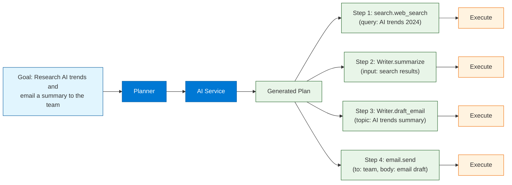
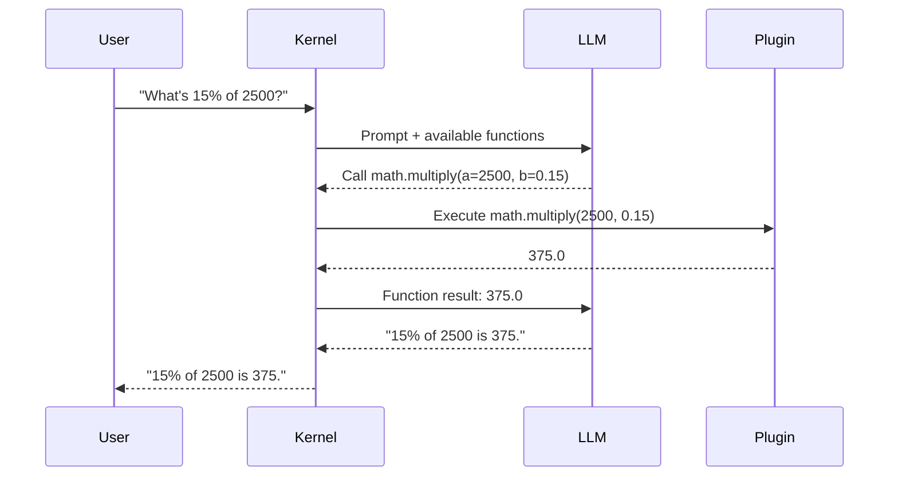
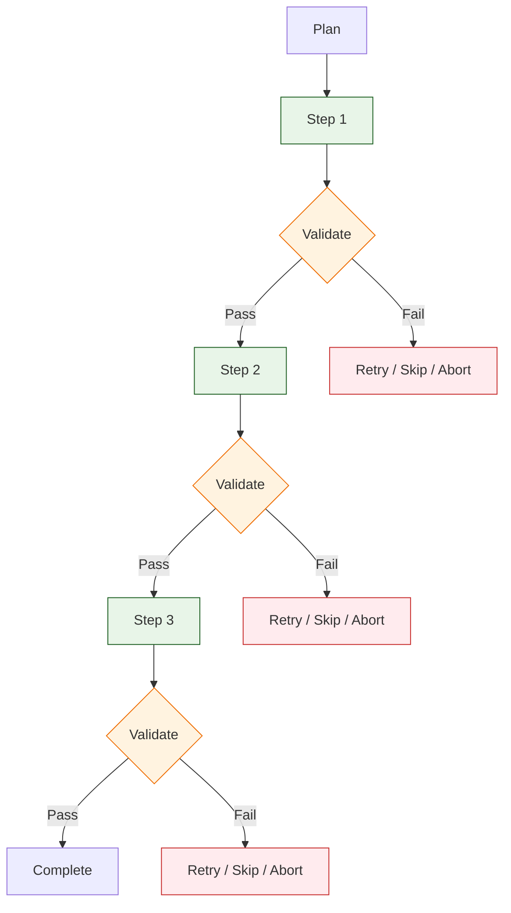

# Chapter 6: Planners

> Use planners to break down goals into executable steps using your plugins and AI services.

## What Are Planners?

Planners are one of Semantic Kernel's most powerful features. A planner takes a **natural language goal** and uses the LLM to automatically decompose it into a **sequence of plugin function calls** that achieve that goal. Instead of manually coding every workflow, you describe what you want and let the planner figure out how to accomplish it using the tools (plugins) available.



### Planner Types

| Planner | Description | Use Case |
|:--------|:------------|:---------|
| **Sequential Planner** | Generates a linear chain of steps | Simple, ordered workflows |
| **Stepwise Planner** | Iterates step-by-step, re-evaluating after each | Complex, adaptive tasks |
| **Handlebars Planner** | Uses Handlebars template syntax for plans | Template-based workflows |
| **Function Calling** | Leverages native LLM function calling | OpenAI/Azure function calling models |
| **Custom Planner** | Build your own planning logic | Domain-specific requirements |

---

## Sequential Planner

The Sequential Planner generates a complete plan upfront -- a linear sequence of steps that are executed in order. It examines all registered plugins and their function descriptions to decide which functions to call and in what order.

### Python -- Sequential Planner

```python
import asyncio
import semantic_kernel as sk
from semantic_kernel.connectors.ai.open_ai import OpenAIChatCompletion
from semantic_kernel.planners import SequentialPlanner
from semantic_kernel.functions import kernel_function


# Define some plugins for the planner to use
class SearchPlugin:
    @kernel_function(
        name="web_search",
        description="Search the web for information about a topic"
    )
    def web_search(self, query: str) -> str:
        # In production, call a real search API
        return f"Search results for '{query}': AI orchestration frameworks include "
               f"Semantic Kernel, LangChain, and Haystack..."

    @kernel_function(
        name="news_search",
        description="Search recent news articles about a topic"
    )
    def news_search(self, query: str) -> str:
        return f"Recent news about '{query}': Microsoft released SK 1.0..."


class WriterPlugin:
    @kernel_function(
        name="summarize",
        description="Summarize text into concise bullet points"
    )
    def summarize(self, text: str) -> str:
        # In practice, this would be a prompt function calling the LLM
        return f"Summary of: {text[:100]}..."

    @kernel_function(
        name="draft_email",
        description="Draft a professional email about a topic"
    )
    def draft_email(self, topic: str, audience: str = "team") -> str:
        return f"Subject: {topic}\n\nDear {audience},\n\n..."


async def main():
    kernel = sk.Kernel()
    kernel.add_service(
        OpenAIChatCompletion(
            service_id="chat",
            ai_model_id="gpt-4o",
        )
    )

    # Register plugins
    kernel.add_plugin(SearchPlugin(), "search")
    kernel.add_plugin(WriterPlugin(), "writer")

    # Create the planner
    planner = SequentialPlanner(kernel)

    # Generate a plan from a goal
    plan = await planner.create_plan(
        goal="Research the latest AI orchestration trends and email a "
             "3-bullet summary to the engineering team."
    )

    # Inspect the plan before executing
    print("Generated Plan:")
    print(f"  Steps: {len(plan.steps)}")
    for i, step in enumerate(plan.steps):
        print(f"  {i+1}. {step.plugin_name}.{step.name}")
        print(f"     Description: {step.description}")

    # Execute the plan
    result = await plan.invoke(kernel)
    print(f"\nResult: {result}")


asyncio.run(main())
```

### C# -- Sequential Planner

```csharp
using Microsoft.SemanticKernel;
using Microsoft.SemanticKernel.Planning;

var builder = Kernel.CreateBuilder();
builder.AddOpenAIChatCompletion("gpt-4o", apiKey);
var kernel = builder.Build();

// Register plugins
kernel.Plugins.AddFromObject(new SearchPlugin(), "search");
kernel.Plugins.AddFromObject(new WriterPlugin(), "writer");

// Create the planner
var planner = new SequentialPlanner(kernel);

// Generate a plan
var plan = await planner.CreatePlanAsync(
    "Research AI orchestration trends and email a summary to the team."
);

// Inspect the plan
Console.WriteLine($"Plan has {plan.Steps.Count} steps:");
foreach (var (step, index) in plan.Steps.Select((s, i) => (s, i)))
{
    Console.WriteLine($"  {index + 1}. {step.PluginName}.{step.Name}");
}

// Execute the plan
var result = await plan.InvokeAsync(kernel);
Console.WriteLine($"Result: {result}");
```

---

## Function Calling (Auto-Invocation)

Modern LLMs (GPT-4o, Claude) support native function calling, where the model itself decides which functions to call. Semantic Kernel supports this through automatic function invocation, which is often more reliable than the Sequential Planner for well-defined tool use.



### Python -- Auto Function Calling

```python
from semantic_kernel.connectors.ai.open_ai import OpenAIChatCompletion
from semantic_kernel.contents.chat_history import ChatHistory

kernel = sk.Kernel()
kernel.add_service(
    OpenAIChatCompletion(service_id="chat", ai_model_id="gpt-4o")
)
kernel.add_plugin(MathPlugin(), "math")
kernel.add_plugin(SearchPlugin(), "search")

# Configure execution settings to enable auto function calling
from semantic_kernel.connectors.ai.open_ai import OpenAIChatPromptExecutionSettings

execution_settings = OpenAIChatPromptExecutionSettings(
    service_id="chat",
    max_tokens=1000,
    temperature=0.0,
    function_choice_behavior="auto",  # Let the LLM choose which functions to call
)

# Create a chat with auto function calling
chat_history = ChatHistory()
chat_history.add_user_message(
    "Search for the latest AI trends, then calculate what percentage "
    "growth the AI market had if it grew from $150B to $210B."
)

result = await kernel.invoke_prompt(
    prompt="{{$chat_history}}",
    chat_history=chat_history,
    settings=execution_settings,
)

print(result)
```

### C# -- Auto Function Calling

```csharp
using Microsoft.SemanticKernel;
using Microsoft.SemanticKernel.ChatCompletion;
using Microsoft.SemanticKernel.Connectors.OpenAI;

var kernel = builder.Build();
kernel.Plugins.AddFromObject(new MathPlugin(), "math");
kernel.Plugins.AddFromObject(new SearchPlugin(), "search");

// Enable auto function calling
var settings = new OpenAIPromptExecutionSettings
{
    FunctionChoiceBehavior = FunctionChoiceBehavior.Auto()
};

var chatService = kernel.GetRequiredService<IChatCompletionService>();
var history = new ChatHistory("You are a helpful assistant with access to tools.");
history.AddUserMessage(
    "Calculate 15% of 2500 and tell me the result."
);

var result = await chatService.GetChatMessageContentAsync(
    history,
    settings,
    kernel
);

Console.WriteLine(result.Content);
```

---

## Adding Constraints to Plans

Unconstrained planners can produce unexpected results. Add constraints to guide plan generation.

### Restricting Available Plugins

```python
# Only allow specific plugins in the plan
planner = SequentialPlanner(
    kernel,
    config=SequentialPlannerConfig(
        included_plugins=["search", "writer"],
        # Or exclude specific plugins:
        # excluded_plugins=["email", "filesystem"],
        max_tokens=1024,
    ),
)

plan = await planner.create_plan(
    goal="Research AI trends and write a summary"
)
```

### Adding Context to Goals

```python
# Provide additional context to guide the planner
plan = await planner.create_plan(
    goal="""
    Research the latest AI orchestration trends.

    CONSTRAINTS:
    - Use only the search plugin for data gathering
    - Keep the summary under 200 words
    - Format output as bullet points
    - Do not send any emails
    - Focus on enterprise use cases

    AVAILABLE DATA SOURCES:
    - Web search (search.web_search)
    - News search (search.news_search)

    OUTPUT FORMAT:
    A concise bulleted summary suitable for a Slack message.
    """
)
```

### Python -- Custom Constraints

```python
from dataclasses import dataclass


@dataclass
class PlanConstraints:
    """Constraints for plan generation and execution."""
    max_steps: int = 10
    max_llm_calls: int = 5
    allowed_plugins: list[str] = None
    blocked_functions: list[str] = None
    require_approval: bool = False
    timeout_seconds: int = 120
    budget_limit_usd: float = 1.0


def validate_plan(plan, constraints: PlanConstraints) -> list[str]:
    """Validate a generated plan against constraints."""
    issues = []

    if len(plan.steps) > constraints.max_steps:
        issues.append(
            f"Plan has {len(plan.steps)} steps, max is {constraints.max_steps}"
        )

    if constraints.allowed_plugins:
        for step in plan.steps:
            if step.plugin_name not in constraints.allowed_plugins:
                issues.append(
                    f"Step uses unauthorized plugin: {step.plugin_name}"
                )

    if constraints.blocked_functions:
        for step in plan.steps:
            fn_name = f"{step.plugin_name}.{step.name}"
            if fn_name in constraints.blocked_functions:
                issues.append(f"Step uses blocked function: {fn_name}")

    return issues


# Usage
constraints = PlanConstraints(
    max_steps=5,
    allowed_plugins=["search", "writer"],
    blocked_functions=["email.send"],
    require_approval=True,
)

plan = await planner.create_plan(goal="Research AI trends and summarize")

issues = validate_plan(plan, constraints)
if issues:
    print("Plan validation failed:")
    for issue in issues:
        print(f"  - {issue}")
else:
    if constraints.require_approval:
        print("Plan requires approval. Steps:")
        for step in plan.steps:
            print(f"  - {step.plugin_name}.{step.name}")
        # approval = input("Approve? (y/n): ")
        # if approval == "y":
        #     result = await plan.invoke(kernel)
    else:
        result = await plan.invoke(kernel)
```

---

## Step-by-Step Execution with Validation

Instead of running the entire plan at once, you can execute each step individually and validate results between steps.



### Python -- Step-by-Step Execution

```python
import time
from dataclasses import dataclass, field


@dataclass
class StepResult:
    step_name: str
    plugin_name: str
    output: str
    latency_ms: float
    success: bool
    error: str = ""


async def execute_plan_with_validation(
    kernel, plan, max_retries: int = 2
) -> list[StepResult]:
    """Execute a plan step by step with validation and retry logic."""
    results = []

    for step in plan.steps:
        retries = 0
        step_result = None

        while retries <= max_retries:
            start_time = time.time()
            try:
                # Safety check: block dangerous operations
                if "delete" in step.name.lower() or "drop" in step.name.lower():
                    step_result = StepResult(
                        step_name=step.name,
                        plugin_name=step.plugin_name,
                        output="",
                        latency_ms=0,
                        success=False,
                        error="Blocked: destructive operation detected",
                    )
                    break

                # Execute the step
                output = await kernel.invoke(step)
                latency = (time.time() - start_time) * 1000

                # Validate output
                output_str = str(output)
                if not output_str or output_str.strip() == "":
                    raise ValueError("Empty output from step")

                step_result = StepResult(
                    step_name=step.name,
                    plugin_name=step.plugin_name,
                    output=output_str,
                    latency_ms=latency,
                    success=True,
                )
                break  # Success, exit retry loop

            except Exception as e:
                retries += 1
                latency = (time.time() - start_time) * 1000
                if retries > max_retries:
                    step_result = StepResult(
                        step_name=step.name,
                        plugin_name=step.plugin_name,
                        output="",
                        latency_ms=latency,
                        success=False,
                        error=str(e),
                    )

        results.append(step_result)
        print(
            f"{'OK' if step_result.success else 'FAIL'} "
            f"{step_result.plugin_name}.{step_result.step_name} "
            f"({step_result.latency_ms:.0f}ms)"
        )

        # Stop on failure if desired
        if not step_result.success:
            print(f"  Error: {step_result.error}")
            break  # Or continue to skip the step

    return results
```

### C# -- Step-by-Step Execution

```csharp
using Microsoft.SemanticKernel;

public record StepResult(
    string StepName, string PluginName, string Output,
    double LatencyMs, bool Success, string Error = "");

async Task<List<StepResult>> ExecutePlanWithValidation(
    Kernel kernel, Plan plan, int maxRetries = 2)
{
    var results = new List<StepResult>();

    foreach (var step in plan.Steps)
    {
        var retries = 0;
        StepResult stepResult = null;

        while (retries <= maxRetries)
        {
            var sw = System.Diagnostics.Stopwatch.StartNew();
            try
            {
                var output = await kernel.InvokeAsync(step);
                sw.Stop();

                stepResult = new StepResult(
                    step.Name, step.PluginName, output.ToString(),
                    sw.ElapsedMilliseconds, true);
                break;
            }
            catch (Exception ex)
            {
                retries++;
                sw.Stop();
                if (retries > maxRetries)
                {
                    stepResult = new StepResult(
                        step.Name, step.PluginName, "",
                        sw.ElapsedMilliseconds, false, ex.Message);
                }
            }
        }

        results.Add(stepResult!);
        Console.WriteLine(
            $"{(stepResult.Success ? "OK" : "FAIL")} " +
            $"{stepResult.PluginName}.{stepResult.StepName} " +
            $"({stepResult.LatencyMs}ms)");

        if (!stepResult.Success) break;
    }

    return results;
}
```

---

## Human-in-the-Loop Approval

For high-stakes operations, add human approval before executing certain steps.

### Python -- Approval Gate

```python
async def execute_with_approval(kernel, plan, auto_approve_plugins=None):
    """Execute a plan with human approval for sensitive steps."""
    auto_approve = set(auto_approve_plugins or [])

    for i, step in enumerate(plan.steps):
        print(f"\nStep {i+1}/{len(plan.steps)}: {step.plugin_name}.{step.name}")
        print(f"  Description: {step.description}")

        if step.plugin_name in auto_approve:
            print("  Auto-approved.")
        else:
            approval = input("  Approve this step? (y/n/skip): ").strip().lower()
            if approval == "n":
                print("  Plan execution aborted by user.")
                return None
            elif approval == "skip":
                print("  Step skipped.")
                continue

        result = await kernel.invoke(step)
        print(f"  Result: {str(result)[:200]}")

    return "Plan completed successfully."


# Usage: auto-approve search, but require approval for writer and email
result = await execute_with_approval(
    kernel, plan,
    auto_approve_plugins=["search"],
)
```

---

## Monitoring Plan Execution

### Plan Metrics

| Metric | Description | Use |
|:-------|:-----------|:----|
| **Total steps** | Number of steps in generated plan | Complexity indicator |
| **Steps executed** | How many steps completed before end | Success tracking |
| **Success rate** | Percentage of successful step executions | Reliability |
| **Total latency** | End-to-end time for plan execution | Performance |
| **LLM calls** | Number of LLM API calls during planning and execution | Cost tracking |
| **Token usage** | Total input + output tokens | Cost tracking |
| **Retry count** | How many steps required retries | Stability indicator |

### Python -- Plan Execution Logger

```python
import json
from datetime import datetime


class PlanLogger:
    """Log plan generation and execution for audit and analysis."""

    def __init__(self, log_file: str = "plan_logs.jsonl"):
        self.log_file = log_file

    def log_plan(self, goal: str, plan, results: list[StepResult]):
        entry = {
            "timestamp": datetime.utcnow().isoformat(),
            "goal": goal,
            "steps_planned": len(plan.steps),
            "steps_executed": len(results),
            "steps_succeeded": sum(1 for r in results if r.success),
            "total_latency_ms": sum(r.latency_ms for r in results),
            "steps": [
                {
                    "name": r.step_name,
                    "plugin": r.plugin_name,
                    "success": r.success,
                    "latency_ms": r.latency_ms,
                    "error": r.error,
                }
                for r in results
            ],
        }

        with open(self.log_file, "a") as f:
            f.write(json.dumps(entry) + "\n")

        return entry


# Usage
logger = PlanLogger()
plan = await planner.create_plan(goal="Research AI trends")
results = await execute_plan_with_validation(kernel, plan)
log_entry = logger.log_plan("Research AI trends", plan, results)
print(f"Plan logged: {log_entry['steps_succeeded']}/{log_entry['steps_planned']} succeeded")
```

---

## Planner Best Practices

| Practice | Why |
|:---------|:----|
| **Write detailed function descriptions** | Planners select functions by matching descriptions to goals |
| **Keep goals specific** | Vague goals produce vague plans; add constraints and format requirements |
| **Limit available plugins** | Fewer options = more focused plans; exclude irrelevant plugins |
| **Validate before executing** | Check step count, plugin usage, and blocked operations |
| **Add human approval for side effects** | Email, file writes, API calls need human oversight |
| **Log everything** | Audit plans, steps, results, and errors for debugging and compliance |
| **Set budgets** | Limit max steps, LLM calls, and token usage per plan |
| **Test with real goals** | Evaluate plans with representative tasks; track success rates |
| **Prefer function calling over planners** | Auto function calling is more reliable for well-defined tool use |
| **Handle failures gracefully** | Retry, skip, or abort on step failure; never leave operations half-done |

---

## Summary

Planners in Semantic Kernel automate the decomposition of natural language goals into executable sequences of plugin function calls. The Sequential Planner generates a complete plan upfront, while auto function calling leverages the LLM's native tool-use capabilities for more dynamic execution. Adding constraints, step validation, human-in-the-loop approval, and comprehensive logging ensures plans execute safely and reliably. Planners work best when plugins have clear descriptions, goals are specific, and the available toolset is scoped appropriately.

## Key Takeaways

- **Planners** automatically decompose goals into sequences of plugin function calls using the LLM.
- The **Sequential Planner** creates a linear plan; **auto function calling** lets the LLM decide tools dynamically.
- **Constraints** (allowed plugins, max steps, blocked functions) keep plans focused and safe.
- **Step-by-step execution** with validation and retry logic makes plans production-ready.
- **Human-in-the-loop approval** is essential for side-effectful operations (email, file writes, API calls).
- **Detailed function descriptions** are critical -- planners select functions by matching descriptions to goals.
- **Log all plan executions** for auditing, debugging, and measuring success rates.

## Next Steps

In **[Chapter 7: Agents](07-agents.md)**, you will learn how to combine plugins, memory, and planners into autonomous AI agents that can hold conversations, use tools, and execute multi-step tasks with governance and safety controls.

---

*Built with insights from the [Semantic Kernel](https://github.com/microsoft/semantic-kernel) project.*
