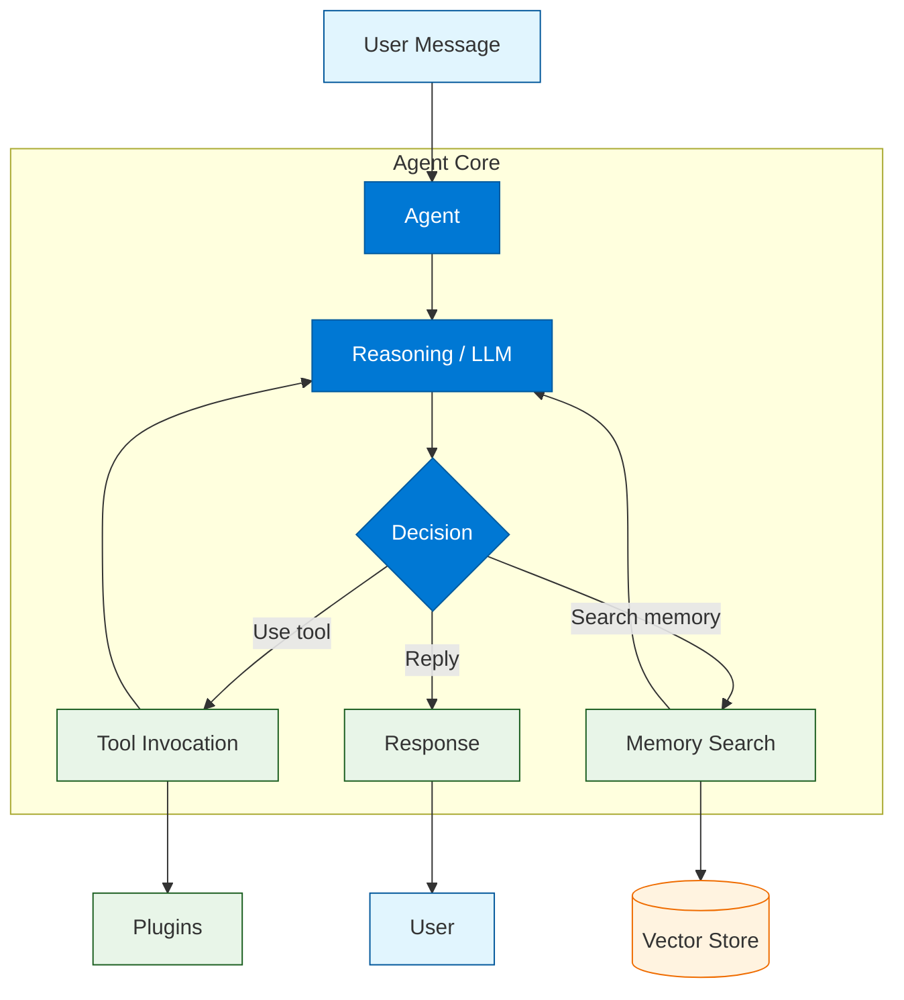
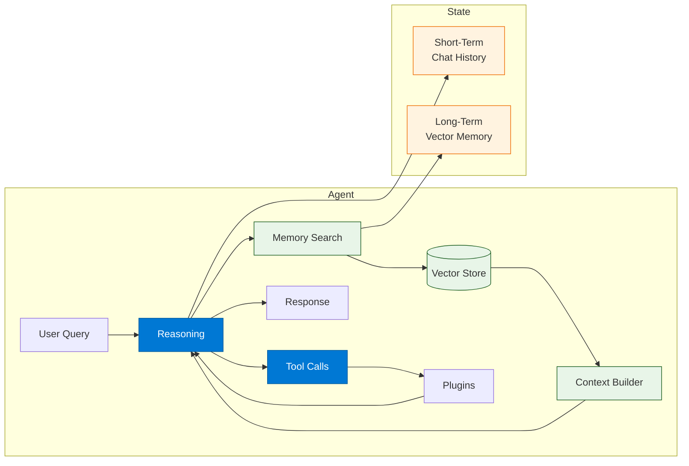
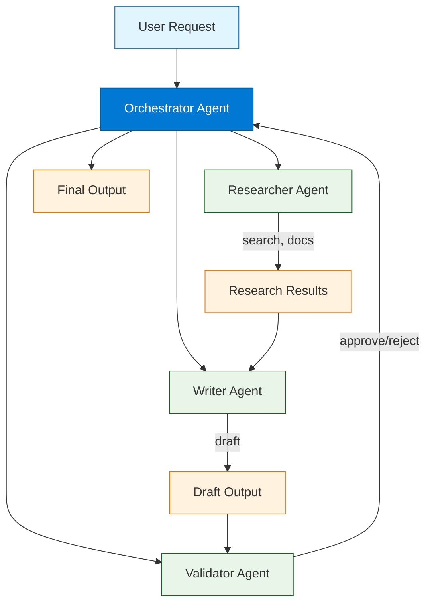

# Chapter 7: Agents & Tool Use

> Combine plugins, memory, and planners to build autonomous, tool-using agents with governance and safety controls.

## What Are Agents?

An **agent** is an AI system that can reason about goals, select and invoke tools, maintain context across turns, and take actions autonomously. In Semantic Kernel, agents are built by combining the components you have learned in previous chapters -- plugins (tools), memory (knowledge), planners (orchestration), and AI services (reasoning) -- into a cohesive loop that processes user requests.



### Agent vs. Planner vs. Function Calling

| Concept | Description | Autonomy |
|:--------|:-----------|:---------|
| **Function calling** | LLM selects one or more tools in a single turn | Low -- single turn |
| **Planner** | LLM generates a multi-step plan from a goal | Medium -- plan + execute |
| **Agent** | LLM reasons across multiple turns, maintains state, uses tools and memory | High -- multi-turn loop |

---

## Building a Basic Agent

### Python -- ReAct-Style Agent Loop

The ReAct (Reason + Act) pattern is the most common agent architecture. The agent thinks about what to do, takes an action (calls a tool), observes the result, and repeats until it can answer.

```python
import asyncio
import semantic_kernel as sk
from semantic_kernel.connectors.ai.open_ai import OpenAIChatCompletion
from semantic_kernel.contents.chat_history import ChatHistory
from semantic_kernel.functions import kernel_function


class SearchPlugin:
    @kernel_function(name="web_search", description="Search the web for a topic")
    def web_search(self, query: str) -> str:
        # Replace with a real search API (Bing, Google, etc.)
        return f"Results for '{query}': AI orchestration is growing rapidly..."

    @kernel_function(name="lookup_docs", description="Search internal documentation")
    def lookup_docs(self, query: str) -> str:
        return f"Internal docs about '{query}': See architecture guide section 3..."


class CalculatorPlugin:
    @kernel_function(name="calculate", description="Evaluate a math expression")
    def calculate(self, expression: str) -> str:
        try:
            # WARNING: eval is used for demo only. Use a safe math parser in production.
            result = eval(expression, {"__builtins__": {}})
            return str(result)
        except Exception as e:
            return f"Error: {e}"


class FilePlugin:
    @kernel_function(name="read_file", description="Read the contents of a file")
    def read_file(self, path: str) -> str:
        try:
            with open(path) as f:
                return f.read()[:2000]
        except Exception as e:
            return f"Error reading file: {e}"


async def run_agent():
    # Set up the kernel with tools
    kernel = sk.Kernel()
    kernel.add_service(
        OpenAIChatCompletion(service_id="chat", ai_model_id="gpt-4o")
    )
    kernel.add_plugin(SearchPlugin(), "search")
    kernel.add_plugin(CalculatorPlugin(), "calculator")
    kernel.add_plugin(FilePlugin(), "files")

    # Configure auto function calling
    from semantic_kernel.connectors.ai.open_ai import OpenAIChatPromptExecutionSettings

    settings = OpenAIChatPromptExecutionSettings(
        service_id="chat",
        max_tokens=2000,
        temperature=0.0,
        function_choice_behavior="auto",
    )

    # Agent conversation loop
    chat_service = kernel.get_service("chat")
    history = ChatHistory(
        system_message="""You are a helpful research assistant.
You have access to web search, internal docs, a calculator, and file reading.
Always cite your sources. If you cannot find an answer, say so clearly.
Think step by step before answering complex questions."""
    )

    print("Agent ready. Type 'quit' to exit.\n")

    while True:
        user_input = input("You: ").strip()
        if user_input.lower() in ("quit", "exit"):
            break

        history.add_user_message(user_input)

        # Let the LLM reason and call tools automatically
        result = await chat_service.get_chat_message_content(
            chat_history=history,
            settings=settings,
            kernel=kernel,
        )

        history.add_assistant_message(str(result))
        print(f"Agent: {result}\n")


asyncio.run(run_agent())
```

### C# -- Agent with Auto Function Calling

```csharp
using Microsoft.SemanticKernel;
using Microsoft.SemanticKernel.ChatCompletion;
using Microsoft.SemanticKernel.Connectors.OpenAI;

var builder = Kernel.CreateBuilder();
builder.AddOpenAIChatCompletion("gpt-4o", apiKey);
var kernel = builder.Build();

// Register tool plugins
kernel.Plugins.AddFromObject(new SearchPlugin(), "search");
kernel.Plugins.AddFromObject(new CalculatorPlugin(), "calculator");
kernel.Plugins.AddFromObject(new FilePlugin(), "files");

// Configure auto function calling
var settings = new OpenAIPromptExecutionSettings
{
    FunctionChoiceBehavior = FunctionChoiceBehavior.Auto(),
    MaxTokens = 2000,
    Temperature = 0
};

var chatService = kernel.GetRequiredService<IChatCompletionService>();
var history = new ChatHistory(@"You are a helpful research assistant.
You have access to web search, internal docs, a calculator, and file reading.
Always cite your sources.");

Console.WriteLine("Agent ready. Type 'quit' to exit.\n");

while (true)
{
    Console.Write("You: ");
    var input = Console.ReadLine()?.Trim();
    if (string.IsNullOrEmpty(input) || input.Equals("quit", StringComparison.OrdinalIgnoreCase))
        break;

    history.AddUserMessage(input);

    var result = await chatService.GetChatMessageContentAsync(
        history, settings, kernel);

    history.AddAssistantMessage(result.Content ?? "");
    Console.WriteLine($"Agent: {result.Content}\n");
}
```

---

## Agent with Memory

Adding memory gives your agent the ability to recall facts from past conversations and from ingested documents. This creates a much more capable and contextually aware agent.



### Python -- Memory-Augmented Agent

```python
from semantic_kernel.memory import SemanticTextMemory
from semantic_kernel.connectors.memory.chroma import ChromaMemoryStore
from semantic_kernel.connectors.ai.open_ai import OpenAITextEmbedding


class MemoryAgent:
    """An agent with both short-term chat history and long-term vector memory."""

    def __init__(self, kernel, memory: SemanticTextMemory):
        self.kernel = kernel
        self.memory = memory
        self.history = ChatHistory(
            system_message="""You are a knowledgeable assistant with access to tools
and a long-term memory of past conversations and documents.
When answering, check your memory for relevant context.
Always cite sources when using retrieved information."""
        )
        self.max_history_turns = 20

    async def search_memory(self, query: str, collection: str = "knowledge") -> str:
        """Search long-term memory for relevant context."""
        results = await self.memory.search(
            collection=collection,
            query=query,
            limit=5,
            min_relevance_score=0.6,
        )

        if not results:
            return "No relevant information found in memory."

        context_parts = []
        for i, r in enumerate(results):
            context_parts.append(
                f"[Memory {i+1}] (relevance: {r.relevance:.2f}) {r.text}"
            )
        return "\n".join(context_parts)

    async def save_to_memory(self, text: str, doc_id: str, collection: str = "knowledge"):
        """Save important information to long-term memory."""
        await self.memory.save_information(
            collection=collection,
            id=doc_id,
            text=text,
        )

    async def chat(self, user_message: str) -> str:
        """Process a user message and return the agent's response."""

        # Search memory for relevant context
        memory_context = await self.search_memory(user_message)

        # Add memory context to the user message
        augmented_message = f"""User question: {user_message}

Relevant context from memory:
{memory_context}

Please answer the user's question using the context above and your tools."""

        self.history.add_user_message(augmented_message)

        # Get response with auto function calling
        from semantic_kernel.connectors.ai.open_ai import OpenAIChatPromptExecutionSettings

        settings = OpenAIChatPromptExecutionSettings(
            service_id="chat",
            max_tokens=2000,
            temperature=0.0,
            function_choice_behavior="auto",
        )

        chat_service = self.kernel.get_service("chat")
        result = await chat_service.get_chat_message_content(
            chat_history=self.history,
            settings=settings,
            kernel=self.kernel,
        )

        response = str(result)
        self.history.add_assistant_message(response)

        # Trim history if it gets too long
        while len(self.history.messages) > self.max_history_turns * 2:
            # Remove oldest user/assistant pair (keep system message)
            self.history.messages.pop(1)
            self.history.messages.pop(1)

        return response


# Setup and run
kernel = sk.Kernel()
kernel.add_service(
    OpenAIChatCompletion(service_id="chat", ai_model_id="gpt-4o")
)
kernel.add_plugin(SearchPlugin(), "search")

memory = SemanticTextMemory(
    storage=ChromaMemoryStore(persist_directory="./agent_memory"),
    embeddings_generator=OpenAITextEmbedding(
        ai_model_id="text-embedding-3-small"
    ),
)

agent = MemoryAgent(kernel, memory)

# Ingest some knowledge
await agent.save_to_memory(
    "Our Q3 revenue was $1.38M with 48 deals closed.",
    doc_id="q3-revenue",
)

# Chat with the agent
response = await agent.chat("What was our Q3 revenue?")
print(response)
```

---

## Multi-Agent Patterns

Complex tasks benefit from multiple specialized agents collaborating. Each agent has its own persona, tools, and responsibilities.



### Python -- Multi-Agent System

```python
class ResearcherAgent:
    """Agent specialized in gathering information."""

    def __init__(self, kernel):
        self.kernel = kernel
        self.history = ChatHistory(
            system_message="You are a research specialist. Your job is to "
            "gather comprehensive information using available search tools. "
            "Always provide sources and be thorough."
        )

    async def research(self, topic: str) -> str:
        self.history.add_user_message(
            f"Research the following topic thoroughly: {topic}"
        )
        settings = OpenAIChatPromptExecutionSettings(
            service_id="chat", function_choice_behavior="auto"
        )
        result = await self.kernel.get_service("chat").get_chat_message_content(
            self.history, settings, self.kernel
        )
        return str(result)


class WriterAgent:
    """Agent specialized in writing and formatting."""

    def __init__(self, kernel):
        self.kernel = kernel
        self.history = ChatHistory(
            system_message="You are a professional writer. Your job is to "
            "take research materials and produce polished, well-structured "
            "content. Follow any formatting instructions precisely."
        )

    async def write(self, research: str, instructions: str) -> str:
        self.history.add_user_message(
            f"Write content based on this research:\n{research}\n\n"
            f"Instructions: {instructions}"
        )
        result = await self.kernel.get_service("chat").get_chat_message_content(
            self.history, OpenAIChatPromptExecutionSettings(service_id="chat"),
            self.kernel
        )
        return str(result)


class ValidatorAgent:
    """Agent specialized in quality review."""

    def __init__(self, kernel):
        self.kernel = kernel

    async def validate(self, content: str, criteria: str) -> dict:
        prompt = f"""Review the following content against the criteria.

Content:
{content}

Criteria:
{criteria}

Respond with a JSON object:
{{"approved": true/false, "issues": ["list of issues"], "score": 0-10}}
"""
        result = await self.kernel.invoke_prompt(prompt)
        import json
        try:
            return json.loads(str(result))
        except json.JSONDecodeError:
            return {"approved": False, "issues": ["Could not parse validation"], "score": 0}


class OrchestratorAgent:
    """Coordinates multiple agents to complete complex tasks."""

    def __init__(self, kernel):
        self.researcher = ResearcherAgent(kernel)
        self.writer = WriterAgent(kernel)
        self.validator = ValidatorAgent(kernel)

    async def execute(self, task: str, max_iterations: int = 3) -> str:
        # Step 1: Research
        print("Step 1: Researching...")
        research = await self.researcher.research(task)
        print(f"  Research complete ({len(research)} chars)")

        for iteration in range(max_iterations):
            # Step 2: Write
            print(f"Step 2: Writing (iteration {iteration + 1})...")
            draft = await self.writer.write(
                research,
                f"Task: {task}\nCreate a comprehensive, well-structured response."
            )
            print(f"  Draft complete ({len(draft)} chars)")

            # Step 3: Validate
            print("Step 3: Validating...")
            validation = await self.validator.validate(
                draft,
                "Accuracy, completeness, clarity, proper formatting"
            )
            print(f"  Score: {validation.get('score', 'N/A')}/10")

            if validation.get("approved", False):
                print("  Approved!")
                return draft

            issues = validation.get("issues", [])
            print(f"  Issues: {issues}")

            # Feed issues back to the writer for revision
            research += f"\n\nRevision feedback: {', '.join(issues)}"

        return draft  # Return best effort after max iterations


# Usage
orchestrator = OrchestratorAgent(kernel)
result = await orchestrator.execute(
    "Write a comparison of AI orchestration frameworks for enterprise architects"
)
print(result)
```

---

## Agent Governance and Safety

### Tool Governance

| Control | Implementation |
|:--------|:---------------|
| **Plugin allowlist** | Only register approved plugins per environment |
| **Function-level permissions** | Block specific functions (e.g., file write, email send) |
| **Argument validation** | Validate function arguments before execution |
| **Rate limiting** | Limit tool calls per conversation/session |
| **Budget caps** | Track token usage and cost; stop when budget is exceeded |
| **Audit logging** | Log every tool call with arguments and results |

### Python -- Governed Agent with Filters

```python
from semantic_kernel.filters import FunctionInvocationFilter
import logging

logger = logging.getLogger("agent.governance")


class GovernanceFilter(FunctionInvocationFilter):
    """Filter that enforces governance rules on function invocations."""

    def __init__(self):
        self.call_count = 0
        self.max_calls_per_session = 50
        self.blocked_functions = {"files.delete_file", "email.send_bulk"}
        self.requires_approval = {"email.send", "files.write_file"}

    async def on_function_invocation(self, context, next):
        func_id = f"{context.function.plugin_name}.{context.function.name}"

        # Check if function is blocked
        if func_id in self.blocked_functions:
            raise PermissionError(f"Function '{func_id}' is blocked by policy")

        # Check rate limit
        self.call_count += 1
        if self.call_count > self.max_calls_per_session:
            raise RuntimeError("Session tool call limit exceeded")

        # Check if approval is needed
        if func_id in self.requires_approval:
            logger.warning(f"Function '{func_id}' requires approval")
            # In production, integrate with an approval workflow
            # For now, auto-approve with logging
            logger.info(f"Auto-approving '{func_id}' (dev mode)")

        # Log the invocation
        logger.info(
            f"Tool call #{self.call_count}: {func_id} "
            f"args={context.arguments}"
        )

        # Execute the function
        await next(context)

        # Log the result
        logger.info(f"Tool result: {str(context.result)[:200]}")


# Register the governance filter
kernel.add_filter(GovernanceFilter())
```

### C# -- Governance Filter

```csharp
using Microsoft.SemanticKernel;
using Microsoft.Extensions.Logging;

public class GovernanceFilter : IFunctionInvocationFilter
{
    private readonly ILogger _logger;
    private int _callCount = 0;
    private const int MaxCallsPerSession = 50;
    private readonly HashSet<string> _blockedFunctions = new()
    {
        "files.delete_file", "email.send_bulk"
    };

    public GovernanceFilter(ILogger<GovernanceFilter> logger) => _logger = logger;

    public async Task OnFunctionInvocationAsync(
        FunctionInvocationContext context,
        Func<FunctionInvocationContext, Task> next)
    {
        var funcId = $"{context.Function.PluginName}.{context.Function.Name}";

        if (_blockedFunctions.Contains(funcId))
            throw new UnauthorizedAccessException($"'{funcId}' is blocked");

        _callCount++;
        if (_callCount > MaxCallsPerSession)
            throw new InvalidOperationException("Tool call limit exceeded");

        _logger.LogInformation("Tool call #{Count}: {FuncId}", _callCount, funcId);

        await next(context);

        _logger.LogInformation("Result: {Result}",
            context.Result?.ToString()?[..Math.Min(200, context.Result.ToString().Length)]);
    }
}

// Register
builder.Services.AddSingleton<IFunctionInvocationFilter, GovernanceFilter>();
```

---

## Conversation Patterns

### Turn-Based Chat Agent

```python
class ChatAgent:
    """A turn-based conversational agent with persona and memory."""

    def __init__(self, kernel, persona: str, memory=None):
        self.kernel = kernel
        self.memory = memory
        self.history = ChatHistory(system_message=persona)
        self.session_metadata = {
            "turns": 0,
            "tool_calls": 0,
            "tokens_used": 0,
        }

    async def process_message(self, message: str) -> str:
        self.session_metadata["turns"] += 1

        # Enrich with memory context if available
        context = ""
        if self.memory:
            results = await self.memory.search(
                collection="knowledge", query=message, limit=3
            )
            if results:
                context = "\n\nRelevant context:\n" + "\n".join(
                    f"- {r.text}" for r in results
                )

        enriched = message + context if context else message
        self.history.add_user_message(enriched)

        settings = OpenAIChatPromptExecutionSettings(
            service_id="chat",
            function_choice_behavior="auto",
            max_tokens=1500,
        )

        result = await self.kernel.get_service("chat").get_chat_message_content(
            self.history, settings, self.kernel
        )

        response = str(result)
        self.history.add_assistant_message(response)

        return response

    def get_session_summary(self) -> dict:
        return self.session_metadata
```

### Personas and System Prompts

| Persona | System Prompt Snippet |
|:--------|:---------------------|
| **Support Agent** | "You are a customer support agent for Contoso. Be empathetic, concise, and solution-oriented. Escalate to a human if you cannot resolve the issue." |
| **Research Assistant** | "You are a research assistant. Gather information from multiple sources, synthesize findings, and always cite sources." |
| **Code Reviewer** | "You are a senior software engineer. Review code for bugs, security issues, and best practices. Be constructive and specific." |
| **Data Analyst** | "You are a data analyst. When given data, provide statistical insights, identify trends, and create visualizations." |

---

## Testing Agents

### Python -- Agent Test Framework

```python
import pytest


class TestChatAgent:
    """Integration tests for the ChatAgent."""

    @pytest.fixture
    def agent(self):
        kernel = sk.Kernel()
        kernel.add_service(
            OpenAIChatCompletion(service_id="chat", ai_model_id="gpt-4o")
        )
        kernel.add_plugin(CalculatorPlugin(), "calculator")
        return ChatAgent(
            kernel,
            persona="You are a helpful math tutor.",
        )

    @pytest.mark.asyncio
    async def test_basic_conversation(self, agent):
        response = await agent.process_message("What is 2 + 2?")
        assert "4" in response

    @pytest.mark.asyncio
    async def test_tool_use(self, agent):
        response = await agent.process_message(
            "Calculate 15% of 2500 using the calculator"
        )
        assert "375" in response

    @pytest.mark.asyncio
    async def test_session_tracking(self, agent):
        await agent.process_message("Hello")
        await agent.process_message("How are you?")
        summary = agent.get_session_summary()
        assert summary["turns"] == 2

    @pytest.mark.asyncio
    async def test_refusal_for_off_topic(self, agent):
        response = await agent.process_message(
            "Write me a poem about the ocean"
        )
        # Math tutor should redirect to math topics
        # This is a behavioral test -- assertion depends on prompt engineering
        assert len(response) > 0
```

---

## Summary

Agents in Semantic Kernel combine plugins, memory, and LLM reasoning into autonomous systems that can hold conversations, use tools, search knowledge bases, and execute multi-step tasks. The ReAct pattern (Reason + Act) drives the core agent loop, where the LLM decides which tools to call based on the user's request and available functions. Multi-agent patterns enable specialization (researcher, writer, validator) for complex workflows. Governance filters enforce safety policies -- blocking dangerous functions, rate limiting tool calls, and logging all actions for audit compliance.

## Key Takeaways

- **Agents** combine plugins, memory, and LLM reasoning into autonomous, multi-turn systems.
- The **ReAct pattern** (Reason + Act) is the foundation -- the LLM reasons, calls tools, observes results, and repeats.
- **Auto function calling** is the preferred mechanism for tool use with modern LLMs (GPT-4o, Claude).
- **Memory-augmented agents** combine short-term chat history with long-term vector memory for context.
- **Multi-agent patterns** (researcher/writer/validator) enable specialization for complex workflows.
- **Governance filters** enforce safety policies: blocked functions, rate limits, approval workflows, audit logging.
- **Personas** (system prompts) define agent behavior, tone, and boundaries.
- **Test agents** with both unit tests (tool invocation) and integration tests (conversation flows).

## Next Steps

In **[Chapter 8: Production Deployment](08-production.md)**, you will learn how to deploy Semantic Kernel applications at scale with containerization, Kubernetes, security hardening, observability, and operational best practices.

---

*Built with insights from the [Semantic Kernel](https://github.com/microsoft/semantic-kernel) project.*
