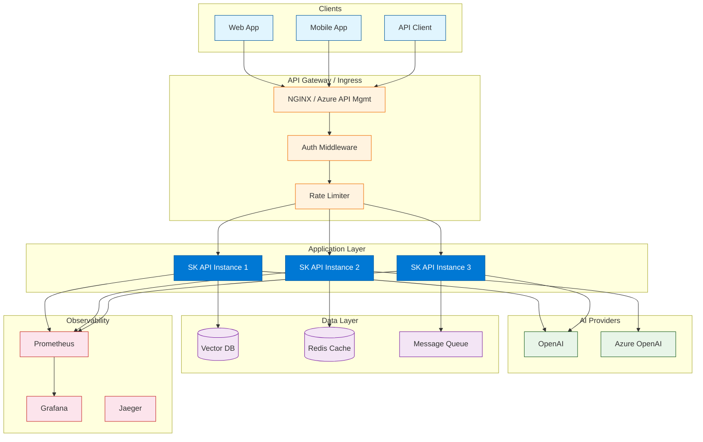

# Chapter 8: Production Deployment & Operations

> Deploy Semantic Kernel-based apps with scalable architecture, Kubernetes manifests, security hardening, and observability.

## Production Architecture

A production Semantic Kernel deployment involves multiple layers -- API ingress, application services, AI providers, vector databases, caching, and observability infrastructure. This chapter covers the patterns and configurations needed to run SK applications reliably at scale.



### Component Responsibilities

| Component | Role | Technologies |
|:----------|:-----|:-------------|
| **API Gateway** | Auth, rate limiting, TLS termination, routing | NGINX, Azure API Management, Kong |
| **Application** | SK kernel, plugins, request handling | FastAPI, ASP.NET, Spring Boot |
| **AI Providers** | LLM inference, embeddings | OpenAI, Azure OpenAI, local models |
| **Vector DB** | Semantic memory storage and search | Qdrant, Pinecone, Azure Cognitive Search |
| **Cache** | Session state, embedding cache, response cache | Redis, Memcached |
| **Queue** | Async job processing, event streaming | RabbitMQ, Azure Service Bus, Kafka |
| **Observability** | Metrics, traces, logs, alerting | Prometheus, Grafana, Jaeger, ELK |

---

## Application Integration

### Python -- FastAPI with Semantic Kernel

```python
import os
from contextlib import asynccontextmanager

from fastapi import FastAPI, HTTPException, Depends
from fastapi.middleware.cors import CORSMiddleware
from pydantic import BaseModel

import semantic_kernel as sk
from semantic_kernel.connectors.ai.open_ai import OpenAIChatCompletion


# Kernel factory -- creates a shared kernel instance
def build_kernel() -> sk.Kernel:
    kernel = sk.Kernel()

    kernel.add_service(
        OpenAIChatCompletion(
            service_id="chat",
            ai_model_id=os.environ.get("OPENAI_MODEL", "gpt-4o"),
            api_key=os.environ["OPENAI_API_KEY"],
        )
    )

    # Register plugins
    from plugins.writer import WriterPlugin
    from plugins.math import MathPlugin

    kernel.add_plugin(WriterPlugin(), "writer")
    kernel.add_plugin(MathPlugin(), "math")

    return kernel


# Application lifecycle
@asynccontextmanager
async def lifespan(app: FastAPI):
    # Startup: build kernel
    app.state.kernel = build_kernel()
    yield
    # Shutdown: cleanup


app = FastAPI(
    title="SK API",
    version="1.0.0",
    lifespan=lifespan,
)

app.add_middleware(
    CORSMiddleware,
    allow_origins=["*"],
    allow_methods=["POST"],
    allow_headers=["*"],
)


# Request/response models
class SummarizeRequest(BaseModel):
    text: str
    style: str = "concise"
    max_words: int = 150


class SummarizeResponse(BaseModel):
    result: str
    model: str
    tokens_used: int = 0


# Dependency to get the kernel
def get_kernel() -> sk.Kernel:
    from fastapi import Request
    # In production, use request.app.state.kernel
    return build_kernel()


# Endpoints
@app.post("/api/v1/summarize", response_model=SummarizeResponse)
async def summarize(body: SummarizeRequest):
    kernel = app.state.kernel

    summarize_fn = kernel.create_function_from_prompt(
        function_name="summarize",
        plugin_name="api",
        prompt="""Summarize the following text in {{$style}} style.
Keep it under {{$max_words}} words.

Text:
{{$input}}""",
    )

    try:
        result = await kernel.invoke(
            summarize_fn,
            input=body.text,
            style=body.style,
            max_words=str(body.max_words),
        )
        return SummarizeResponse(
            result=str(result),
            model=os.environ.get("OPENAI_MODEL", "gpt-4o"),
        )
    except Exception as e:
        raise HTTPException(status_code=500, detail=str(e))


@app.get("/health")
async def health():
    return {"status": "healthy"}


@app.get("/ready")
async def ready():
    # Check AI service connectivity
    try:
        kernel = app.state.kernel
        result = await kernel.invoke_prompt("Say 'OK'")
        return {"status": "ready", "ai_service": "connected"}
    except Exception as e:
        raise HTTPException(status_code=503, detail=f"Not ready: {e}")
```

### C# -- ASP.NET Minimal API with Semantic Kernel

```csharp
using Microsoft.SemanticKernel;
using Microsoft.AspNetCore.Builder;
using Microsoft.Extensions.DependencyInjection;

var builder = WebApplication.CreateBuilder(args);

// Register Semantic Kernel as a service
builder.Services.AddKernel()
    .AddOpenAIChatCompletion(
        modelId: builder.Configuration["OpenAI:ModelId"] ?? "gpt-4o",
        apiKey: builder.Configuration["OpenAI:ApiKey"]!
    );

// Register plugins
builder.Services.AddSingleton<WriterPlugin>();
builder.Services.AddSingleton<MathPlugin>();

// Add health checks
builder.Services.AddHealthChecks();

var app = builder.Build();

// Configure plugins on the kernel
app.Use(async (context, next) =>
{
    var kernel = context.RequestServices.GetRequiredService<Kernel>();
    kernel.Plugins.AddFromObject(
        context.RequestServices.GetRequiredService<WriterPlugin>(), "writer");
    await next();
});

// API endpoints
app.MapPost("/api/v1/summarize", async (SummarizeRequest request, Kernel kernel) =>
{
    var result = await kernel.InvokePromptAsync(
        $"Summarize in {request.Style} style under {request.MaxWords} words:\n{request.Text}"
    );
    return Results.Ok(new { result = result.ToString() });
});

app.MapGet("/health", () => Results.Ok(new { status = "healthy" }));
app.MapHealthChecks("/ready");

app.Run();

record SummarizeRequest(string Text, string Style = "concise", int MaxWords = 150);
```

---

## Containerization

### Dockerfile (Python / FastAPI)

```dockerfile
# Build stage
FROM python:3.11-slim AS builder

WORKDIR /app

# Install dependencies
COPY requirements.txt .
RUN pip install --no-cache-dir --prefix=/install -r requirements.txt

# Runtime stage
FROM python:3.11-slim

WORKDIR /app

# Copy installed packages
COPY --from=builder /install /usr/local

# Copy application code
COPY src/ ./src/
COPY plugins/ ./plugins/

# Non-root user for security
RUN adduser --disabled-password --gecos '' appuser
USER appuser

# Expose port
EXPOSE 8000

# Health check
HEALTHCHECK --interval=30s --timeout=5s --retries=3 \
    CMD python -c "import urllib.request; urllib.request.urlopen('http://localhost:8000/health')"

# Run the application
CMD ["uvicorn", "src.main:app", "--host", "0.0.0.0", "--port", "8000", "--workers", "4"]
```

### Dockerfile (C# / ASP.NET)

```dockerfile
# Build stage
FROM mcr.microsoft.com/dotnet/sdk:8.0 AS build
WORKDIR /src

COPY *.csproj .
RUN dotnet restore

COPY . .
RUN dotnet publish -c Release -o /app

# Runtime stage
FROM mcr.microsoft.com/dotnet/aspnet:8.0
WORKDIR /app

COPY --from=build /app .

# Non-root user
RUN adduser --disabled-password --gecos '' appuser
USER appuser

EXPOSE 8080

HEALTHCHECK --interval=30s --timeout=5s --retries=3 \
    CMD curl -f http://localhost:8080/health || exit 1

ENTRYPOINT ["dotnet", "SKApi.dll"]
```

### Docker Compose (Development)

```yaml
version: '3.8'

services:
  sk-api:
    build: .
    ports:
      - "8000:8000"
    environment:
      - OPENAI_API_KEY=${OPENAI_API_KEY}
      - OPENAI_MODEL=gpt-4o
    env_file:
      - .env
    depends_on:
      - chroma
      - redis
    healthcheck:
      test: ["CMD", "curl", "-f", "http://localhost:8000/health"]
      interval: 30s
      timeout: 5s
      retries: 3

  chroma:
    image: chromadb/chroma:latest
    ports:
      - "8001:8000"
    volumes:
      - chroma_data:/chroma/chroma

  redis:
    image: redis:7-alpine
    ports:
      - "6379:6379"
    volumes:
      - redis_data:/data

volumes:
  chroma_data:
  redis_data:
```

---

## Kubernetes Deployment

### Deployment Manifest

```yaml
apiVersion: apps/v1
kind: Deployment
metadata:
  name: sk-api
  namespace: semantic-kernel
  labels:
    app: sk-api
    version: v1
spec:
  replicas: 3
  strategy:
    type: RollingUpdate
    rollingUpdate:
      maxSurge: 1
      maxUnavailable: 0
  selector:
    matchLabels:
      app: sk-api
  template:
    metadata:
      labels:
        app: sk-api
        version: v1
      annotations:
        prometheus.io/scrape: "true"
        prometheus.io/port: "8000"
        prometheus.io/path: "/metrics"
    spec:
      serviceAccountName: sk-api
      securityContext:
        runAsNonRoot: true
        runAsUser: 1000
      containers:
      - name: api
        image: your-registry.azurecr.io/sk-api:1.0.0
        ports:
        - containerPort: 8000
          name: http
        envFrom:
        - secretRef:
            name: sk-secrets
        - configMapRef:
            name: sk-config
        resources:
          requests:
            cpu: "500m"
            memory: "512Mi"
          limits:
            cpu: "1000m"
            memory: "1Gi"
        livenessProbe:
          httpGet:
            path: /health
            port: 8000
          initialDelaySeconds: 15
          periodSeconds: 30
          failureThreshold: 3
        readinessProbe:
          httpGet:
            path: /ready
            port: 8000
          initialDelaySeconds: 10
          periodSeconds: 10
          failureThreshold: 3
        startupProbe:
          httpGet:
            path: /health
            port: 8000
          initialDelaySeconds: 5
          periodSeconds: 5
          failureThreshold: 12
      topologySpreadConstraints:
      - maxSkew: 1
        topologyKey: kubernetes.io/hostname
        whenUnsatisfiable: DoNotSchedule
        labelSelector:
          matchLabels:
            app: sk-api
```

### Service and Ingress

```yaml
apiVersion: v1
kind: Service
metadata:
  name: sk-api
  namespace: semantic-kernel
spec:
  selector:
    app: sk-api
  ports:
  - port: 80
    targetPort: 8000
    protocol: TCP
  type: ClusterIP
---
apiVersion: networking.k8s.io/v1
kind: Ingress
metadata:
  name: sk-api
  namespace: semantic-kernel
  annotations:
    nginx.ingress.kubernetes.io/rate-limit: "100"
    nginx.ingress.kubernetes.io/rate-limit-window: "1m"
    cert-manager.io/cluster-issuer: letsencrypt-prod
spec:
  tls:
  - hosts:
    - api.example.com
    secretName: sk-api-tls
  rules:
  - host: api.example.com
    http:
      paths:
      - path: /api
        pathType: Prefix
        backend:
          service:
            name: sk-api
            port:
              number: 80
```

### Horizontal Pod Autoscaler

```yaml
apiVersion: autoscaling/v2
kind: HorizontalPodAutoscaler
metadata:
  name: sk-api
  namespace: semantic-kernel
spec:
  scaleTargetRef:
    apiVersion: apps/v1
    kind: Deployment
    name: sk-api
  minReplicas: 2
  maxReplicas: 10
  metrics:
  - type: Resource
    resource:
      name: cpu
      target:
        type: Utilization
        averageUtilization: 70
  - type: Resource
    resource:
      name: memory
      target:
        type: Utilization
        averageUtilization: 80
  behavior:
    scaleUp:
      stabilizationWindowSeconds: 60
    scaleDown:
      stabilizationWindowSeconds: 300
```

### Secrets and ConfigMaps

```yaml
apiVersion: v1
kind: Secret
metadata:
  name: sk-secrets
  namespace: semantic-kernel
type: Opaque
stringData:
  OPENAI_API_KEY: "sk-your-key-here"
  AZURE_OPENAI_API_KEY: "your-azure-key-here"
---
apiVersion: v1
kind: ConfigMap
metadata:
  name: sk-config
  namespace: semantic-kernel
data:
  OPENAI_MODEL: "gpt-4o"
  AZURE_OPENAI_ENDPOINT: "https://your-resource.openai.azure.com/"
  VECTOR_DB_URL: "http://qdrant:6333"
  REDIS_URL: "redis://redis:6379"
  LOG_LEVEL: "INFO"
```

---

## Security

### Security Checklist

| Category | Control | Implementation |
|:---------|:--------|:---------------|
| **Secrets** | Never bake into images or source | K8s Secrets, Azure Key Vault, HashiCorp Vault |
| **Authentication** | Require valid credentials on every request | JWT, API keys, OAuth2, Azure AD |
| **Authorization** | Role-based access to endpoints and plugins | RBAC middleware, policy engine |
| **Rate limiting** | Protect models from abuse | NGINX rate limits, API gateway quotas |
| **Input validation** | Prevent prompt injection and oversized inputs | Max length, content filtering, blocklists |
| **Output filtering** | Block PII, harmful content in responses | Post-processing filters, content moderation |
| **Network** | Restrict egress to allowed AI providers | Network policies, firewall rules |
| **TLS** | Encrypt all traffic in transit | TLS 1.3 via cert-manager / Ingress |
| **Data at rest** | Encrypt vector stores and caches | Encryption at rest on storage volumes |
| **Audit** | Log all API calls, tool invocations, model calls | Structured logging, SIEM integration |

### Python -- Security Middleware

```python
from fastapi import Request, HTTPException
from fastapi.middleware.base import BaseHTTPMiddleware
import time
import hashlib


class SecurityMiddleware(BaseHTTPMiddleware):
    """Security middleware for the SK API."""

    def __init__(self, app, api_keys: set[str], rate_limit: int = 100):
        super().__init__(app)
        self.api_keys = api_keys
        self.rate_limit = rate_limit
        self.request_counts: dict[str, list[float]] = {}

    async def dispatch(self, request: Request, call_next):
        # Skip health checks
        if request.url.path in ("/health", "/ready"):
            return await call_next(request)

        # API key authentication
        api_key = request.headers.get("X-API-Key")
        if not api_key or api_key not in self.api_keys:
            raise HTTPException(status_code=401, detail="Invalid API key")

        # Rate limiting (per API key)
        key_hash = hashlib.sha256(api_key.encode()).hexdigest()[:16]
        now = time.time()
        window = 60  # 1 minute

        if key_hash not in self.request_counts:
            self.request_counts[key_hash] = []

        # Clean old entries
        self.request_counts[key_hash] = [
            t for t in self.request_counts[key_hash] if now - t < window
        ]

        if len(self.request_counts[key_hash]) >= self.rate_limit:
            raise HTTPException(status_code=429, detail="Rate limit exceeded")

        self.request_counts[key_hash].append(now)

        # Request size limit (prevent oversized prompts)
        content_length = request.headers.get("content-length", "0")
        if int(content_length) > 100_000:  # 100KB
            raise HTTPException(status_code=413, detail="Request too large")

        return await call_next(request)


# Register middleware
app.add_middleware(
    SecurityMiddleware,
    api_keys=set(os.environ.get("API_KEYS", "").split(",")),
    rate_limit=100,
)
```

---

## Observability

### Metrics Architecture

```mermaid
flowchart LR
    subgraph App["SK API Instances"]
        A1[Instance 1] --> M1[/metrics]
        A2[Instance 2] --> M2[/metrics]
        A3[Instance 3] --> M3[/metrics]
    end

    M1 --> P[Prometheus]
    M2 --> P
    M3 --> P

    P --> G[Grafana Dashboards]
    P --> AM[Alertmanager]
    AM --> S[Slack / PagerDuty]

    A1 --> J[Jaeger]
    A2 --> J
    A3 --> J

    classDef app fill:#0078d4,stroke:#005a9e,color:#fff
    classDef obs fill:#e8f5e8,stroke:#1b5e20
    classDef alert fill:#ffebee,stroke:#c62828

    class A1,A2,A3 app
    class P,G,J obs
    class AM,S alert
```

### Python -- Prometheus Metrics

```python
from prometheus_client import Counter, Histogram, Gauge, generate_latest
from fastapi import Response

# Define metrics
REQUEST_COUNT = Counter(
    "sk_request_total",
    "Total SK API requests",
    ["endpoint", "status"],
)

REQUEST_LATENCY = Histogram(
    "sk_request_duration_seconds",
    "Request latency",
    ["endpoint"],
    buckets=[0.1, 0.5, 1, 2, 5, 10, 30],
)

TOKEN_USAGE = Counter(
    "sk_tokens_total",
    "Total tokens used",
    ["model", "direction"],  # direction: input/output
)

ACTIVE_REQUESTS = Gauge(
    "sk_active_requests",
    "Currently active requests",
)

AI_SERVICE_ERRORS = Counter(
    "sk_ai_service_errors_total",
    "AI service errors",
    ["service_id", "error_type"],
)


# Metrics endpoint
@app.get("/metrics")
async def metrics():
    return Response(
        content=generate_latest(),
        media_type="text/plain",
    )


# Instrument API calls
import time
from functools import wraps


def instrument_endpoint(endpoint_name: str):
    def decorator(func):
        @wraps(func)
        async def wrapper(*args, **kwargs):
            ACTIVE_REQUESTS.inc()
            start = time.time()
            try:
                result = await func(*args, **kwargs)
                REQUEST_COUNT.labels(endpoint=endpoint_name, status="success").inc()
                return result
            except Exception as e:
                REQUEST_COUNT.labels(endpoint=endpoint_name, status="error").inc()
                raise
            finally:
                duration = time.time() - start
                REQUEST_LATENCY.labels(endpoint=endpoint_name).observe(duration)
                ACTIVE_REQUESTS.dec()
        return wrapper
    return decorator


# Usage
@app.post("/api/v1/summarize")
@instrument_endpoint("summarize")
async def summarize(body: SummarizeRequest):
    # ... handler code
    pass
```

### Key Dashboard Panels

| Panel | Metric | Alert Condition |
|:------|:-------|:----------------|
| **Request rate** | `rate(sk_request_total[5m])` | Sudden spike or drop |
| **Error rate** | `rate(sk_request_total{status="error"}[5m])` | > 5% of total |
| **P99 latency** | `histogram_quantile(0.99, sk_request_duration_seconds)` | > 10s |
| **Token usage** | `rate(sk_tokens_total[1h])` | Exceeds hourly budget |
| **Active requests** | `sk_active_requests` | Sustained above capacity |
| **AI service errors** | `rate(sk_ai_service_errors_total[5m])` | Any non-zero rate |

---

## Performance Optimization

### Optimization Strategies

| Strategy | Impact | Implementation |
|:---------|:-------|:---------------|
| **Response caching** | High | Cache identical prompts with TTL; key by hash of (prompt + settings) |
| **Embedding cache** | High | Deduplicate embeddings by content hash; reduces embedding API calls |
| **Connection pooling** | Medium | Reuse HTTP connections to AI providers; use `httpx` or `aiohttp` pools |
| **Async everywhere** | Medium | Use `async/await` for all I/O; avoid blocking the event loop |
| **Model tiering** | High | Use GPT-4o-mini for drafts/classification; GPT-4o for final output |
| **Batch requests** | Medium | Combine multiple small prompts into one when possible |
| **Warm-up on deploy** | Low | Pre-load plugins and make a dummy call during startup |
| **Streaming** | Medium | Stream long responses to reduce time-to-first-token |

### Python -- Response Cache

```python
import hashlib
import json
from typing import Optional


class ResponseCache:
    """Cache AI responses to avoid redundant API calls."""

    def __init__(self, redis_client, default_ttl: int = 3600):
        self.redis = redis_client
        self.default_ttl = default_ttl

    def _cache_key(self, prompt: str, settings: dict) -> str:
        content = json.dumps({"prompt": prompt, "settings": settings}, sort_keys=True)
        return f"sk:cache:{hashlib.sha256(content.encode()).hexdigest()}"

    async def get(self, prompt: str, settings: dict) -> Optional[str]:
        key = self._cache_key(prompt, settings)
        cached = await self.redis.get(key)
        return cached.decode() if cached else None

    async def set(self, prompt: str, settings: dict, response: str, ttl: int = None):
        key = self._cache_key(prompt, settings)
        await self.redis.setex(key, ttl or self.default_ttl, response)

    async def invalidate(self, prompt: str, settings: dict):
        key = self._cache_key(prompt, settings)
        await self.redis.delete(key)


# Usage in endpoint
cache = ResponseCache(redis_client)

async def cached_invoke(kernel, function, cache, **kwargs):
    prompt_key = str(kwargs)
    settings_key = {"model": "gpt-4o"}

    cached = await cache.get(prompt_key, settings_key)
    if cached:
        return cached

    result = await kernel.invoke(function, **kwargs)
    result_str = str(result)
    await cache.set(prompt_key, settings_key, result_str)
    return result_str
```

---

## Cost Management in Production

### Budget Controls

```python
from dataclasses import dataclass, field
from datetime import datetime, timedelta


@dataclass
class BudgetManager:
    """Manage AI spending budgets per tenant/project."""

    daily_limit_usd: float = 100.0
    monthly_limit_usd: float = 2000.0
    _daily_spend: float = field(default=0.0, init=False)
    _monthly_spend: float = field(default=0.0, init=False)
    _last_daily_reset: datetime = field(default_factory=datetime.utcnow, init=False)
    _last_monthly_reset: datetime = field(default_factory=datetime.utcnow, init=False)

    def _check_resets(self):
        now = datetime.utcnow()
        if now - self._last_daily_reset > timedelta(days=1):
            self._daily_spend = 0.0
            self._last_daily_reset = now
        if now - self._last_monthly_reset > timedelta(days=30):
            self._monthly_spend = 0.0
            self._last_monthly_reset = now

    def can_spend(self, estimated_cost: float) -> bool:
        self._check_resets()
        return (
            self._daily_spend + estimated_cost <= self.daily_limit_usd
            and self._monthly_spend + estimated_cost <= self.monthly_limit_usd
        )

    def record_spend(self, cost: float):
        self._check_resets()
        self._daily_spend += cost
        self._monthly_spend += cost

    def get_usage(self) -> dict:
        self._check_resets()
        return {
            "daily_spend": round(self._daily_spend, 4),
            "daily_limit": self.daily_limit_usd,
            "daily_remaining": round(self.daily_limit_usd - self._daily_spend, 4),
            "monthly_spend": round(self._monthly_spend, 4),
            "monthly_limit": self.monthly_limit_usd,
            "monthly_remaining": round(self.monthly_limit_usd - self._monthly_spend, 4),
        }


budget = BudgetManager(daily_limit_usd=50.0, monthly_limit_usd=1000.0)

# Check before making AI calls
estimated_cost = 0.05  # estimate based on prompt size and model
if not budget.can_spend(estimated_cost):
    raise HTTPException(status_code=429, detail="Budget limit exceeded")

# After call, record actual cost
budget.record_spend(actual_cost)
```

---

## CI/CD Pipeline


### GitHub Actions Example

```yaml
name: SK API CI/CD

on:
  push:
    branches: [main]
  pull_request:
    branches: [main]

jobs:
  test:
    runs-on: ubuntu-latest
    steps:
    - uses: actions/checkout@v4
    - uses: actions/setup-python@v5
      with:
        python-version: '3.11'
    - run: pip install -r requirements.txt -r requirements-dev.txt
    - run: ruff check src/ plugins/ tests/
    - run: mypy src/ plugins/
    - run: pytest tests/ -v --cov=src --cov-report=xml

  build-and-deploy:
    needs: test
    if: github.ref == 'refs/heads/main'
    runs-on: ubuntu-latest
    steps:
    - uses: actions/checkout@v4
    - name: Build Docker image
      run: docker build -t sk-api:${{ github.sha }} .
    - name: Push to registry
      run: |
        docker tag sk-api:${{ github.sha }} your-registry.azurecr.io/sk-api:${{ github.sha }}
        docker push your-registry.azurecr.io/sk-api:${{ github.sha }}
    - name: Deploy to Kubernetes
      run: |
        kubectl set image deployment/sk-api \
          api=your-registry.azurecr.io/sk-api:${{ github.sha }} \
          -n semantic-kernel
```

---

## Operational Runbook

### Common Issues and Resolutions

| Issue | Symptoms | Resolution |
|:------|:---------|:-----------|
| **API key expired** | 401 errors, all requests failing | Rotate key in Vault/Secrets, restart pods |
| **Rate limited by provider** | 429 errors, sporadic failures | Scale back, add retry backoff, contact provider for higher limits |
| **High latency** | P99 > 10s, timeout errors | Check model load, reduce `max_tokens`, switch to faster model |
| **Memory OOM** | Pod restarts, OOMKilled events | Increase memory limits, reduce batch sizes, add pagination |
| **Vector DB unavailable** | Memory search failures | Check Qdrant/Chroma health, failover to backup, degrade gracefully |
| **Cost spike** | Budget alerts firing | Audit usage, check for runaway agents, tighten `max_tokens` |

---

## Summary

Deploying Semantic Kernel applications to production requires attention to every layer of the stack -- from containerization and Kubernetes orchestration to security hardening, observability, cost management, and operational procedures. FastAPI (Python) and ASP.NET (C#) provide solid foundations for hosting SK kernels as APIs. Kubernetes manifests with proper health probes, resource limits, and autoscaling ensure reliability at scale. Security controls (authentication, rate limiting, input validation) protect your AI endpoints. Prometheus metrics, Jaeger traces, and structured logging provide the visibility needed to operate confidently. Budget management and response caching keep costs predictable.

## Key Takeaways

- **Containerize** your SK application with multi-stage Docker builds and non-root users.
- **Kubernetes** provides scaling, health checks, rolling updates, and secret management.
- **Security** is multi-layered: authentication, rate limiting, input validation, output filtering, TLS.
- **Observability** with Prometheus metrics, Jaeger traces, and structured logging is essential for production.
- **Cost management** requires budget controls, model tiering, response caching, and usage monitoring.
- **CI/CD pipelines** ensure code quality with linting, testing, security scanning, and staged deployments.
- **Health probes** (liveness, readiness, startup) let Kubernetes manage pod lifecycle correctly.
- Always have an **operational runbook** for common failure scenarios.

---

*Built with insights from the [Semantic Kernel](https://github.com/microsoft/semantic-kernel) project.*
