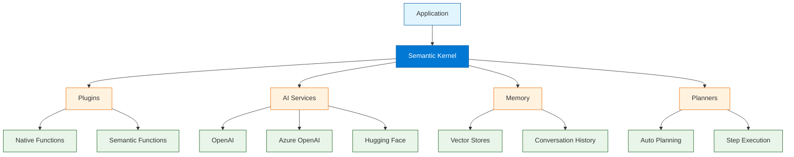

# Semantic Kernel Tutorial: Microsoft's AI Orchestration

> Build enterprise AI applications with Microsoft's SDK for integrating LLMs.

<div align="center">

**🔷 Enterprise-Grade AI Orchestration**

[](https://github.com/microsoft/semantic-kernel)

</div>

---

## 🎯 What is Semantic Kernel?

**Semantic Kernel**<sup>[View Repo](https://github.com/microsoft/semantic-kernel)</sup> is Microsoft's open-source SDK for integrating LLMs into applications. It provides a unified way to orchestrate AI services, plugins, and memory, making it easy to build sophisticated AI applications.

### Key Features

| Feature | Description |
|:--------|:------------|
| **Multi-Language** | C#, Python, and Java SDKs |
| **Plugin System** | Extensible function architecture |
| **Planners** | AI-powered task planning |
| **Memory** | Vector store integrations |
| **Connectors** | OpenAI, Azure, Hugging Face |
| **Enterprise Ready** | Built for production at scale |



## Tutorial Chapters

1. **[Chapter 1: Getting Started](01-getting-started.md)** - Installation, setup, and first kernel
2. **[Chapter 2: Plugins & Functions](02-plugins.md)** - Native and semantic functions
3. **[Chapter 3: Prompt Engineering](03-prompts.md)** - Prompt templates and configuration
4. **[Chapter 4: AI Services](04-services.md)** - OpenAI, Azure, and other connectors
5. **[Chapter 5: Memory & Embeddings](05-memory.md)** - Vector stores and semantic memory
6. **[Chapter 6: Planners](06-planners.md)** - Automatic task planning and execution
7. **[Chapter 7: Agents](07-agents.md)** - Building autonomous AI agents
8. **[Chapter 8: Production Deployment](08-production.md)** - Enterprise patterns and scaling

## What You'll Learn

- **Build AI Applications** with Microsoft's enterprise SDK
- **Create Plugins** with native and semantic functions
- **Engineer Prompts** with templates and variables
- **Connect AI Services** from multiple providers
- **Implement Memory** with vector stores
- **Use Planners** for complex task automation
- **Deploy at Scale** with enterprise patterns

## Prerequisites

- Python 3.8+ or .NET 6+
- API key for OpenAI or Azure OpenAI
- Understanding of async programming
- (Optional) Azure subscription

## Quick Start (Python)

```bash
# Install Semantic Kernel
pip install semantic-kernel

# Install connectors
pip install semantic-kernel[openai]
pip install semantic-kernel[azure]
```

## Your First Kernel

```python
import semantic_kernel as sk
from semantic_kernel.connectors.ai.open_ai import OpenAIChatCompletion

# Create kernel
kernel = sk.Kernel()

# Add AI service
kernel.add_service(
    OpenAIChatCompletion(
        service_id="chat",
        ai_model_id="gpt-4o"
    )
)

# Create a semantic function
prompt = """
Summarize the following text in {{$style}} style:
{{$input}}
"""

summarize = kernel.create_function_from_prompt(
    function_name="summarize",
    plugin_name="TextPlugin",
    prompt=prompt
)

# Invoke the function
result = await kernel.invoke(
    summarize,
    input="Long text here...",
    style="professional"
)

print(result)
```

## Native Functions (Plugins)

```python
from semantic_kernel.functions import kernel_function

class MathPlugin:
    @kernel_function(
        name="add",
        description="Adds two numbers together"
    )
    def add(self, a: float, b: float) -> float:
        return a + b
    
    @kernel_function(
        name="multiply", 
        description="Multiplies two numbers"
    )
    def multiply(self, a: float, b: float) -> float:
        return a * b

# Add plugin to kernel
kernel.add_plugin(MathPlugin(), plugin_name="math")

# Use in prompts or planners
result = await kernel.invoke(
    kernel.plugins["math"]["add"],
    a=5, b=3
)
```

## Semantic Functions

```python
# Create prompt template
prompt_config = sk.PromptTemplateConfig(
    template="""
    You are a helpful assistant.
    
    User: {{$user_input}}
    
    Respond in a {{$tone}} tone.
    """,
    input_variables=[
        {"name": "user_input", "description": "User's message"},
        {"name": "tone", "description": "Response tone", "default": "friendly"}
    ]
)

# Register function
chat = kernel.create_function_from_prompt(
    function_name="chat",
    plugin_name="Assistant",
    prompt_template_config=prompt_config
)
```

## Memory (Vector Store)

```python
from semantic_kernel.memory import SemanticTextMemory
from semantic_kernel.connectors.memory.chroma import ChromaMemoryStore

# Create memory with vector store
memory = SemanticTextMemory(
    storage=ChromaMemoryStore(persist_directory="./memory"),
    embeddings_generator=OpenAITextEmbedding(model_id="text-embedding-3-small")
)

# Save information
await memory.save_information(
    collection="docs",
    id="doc1",
    text="Semantic Kernel is Microsoft's AI SDK."
)

# Search memory
results = await memory.search(
    collection="docs",
    query="What is Semantic Kernel?",
    limit=5
)
```

## Planners

```python
from semantic_kernel.planners import SequentialPlanner

# Create planner
planner = SequentialPlanner(kernel)

# Generate plan from goal
plan = await planner.create_plan(
    goal="Research AI trends and write a summary email"
)

# Execute the plan
result = await plan.invoke(kernel)
```

## .NET Example

```csharp
using Microsoft.SemanticKernel;

// Create kernel
var builder = Kernel.CreateBuilder();
builder.AddOpenAIChatCompletion("gpt-4o", apiKey);
var kernel = builder.Build();

// Invoke prompt
var result = await kernel.InvokePromptAsync(
    "What is {{$topic}}?",
    new() { ["topic"] = "Semantic Kernel" }
);

Console.WriteLine(result);
```

## Learning Path

### 🟢 Beginner Track
1. Chapters 1-3: Setup, plugins, and prompts
2. Build simple AI-powered applications

### 🟡 Intermediate Track
1. Chapters 4-6: Services, memory, and planners
2. Create sophisticated AI workflows

### 🔴 Advanced Track
1. Chapters 7-8: Agents and production deployment
2. Build enterprise-grade AI systems

---

**Ready to build with Semantic Kernel? Let's begin with [Chapter 1: Getting Started](01-getting-started.md)!**

*Generated for [Awesome Code Docs](https://github.com/johnxie/awesome-code-docs)*
