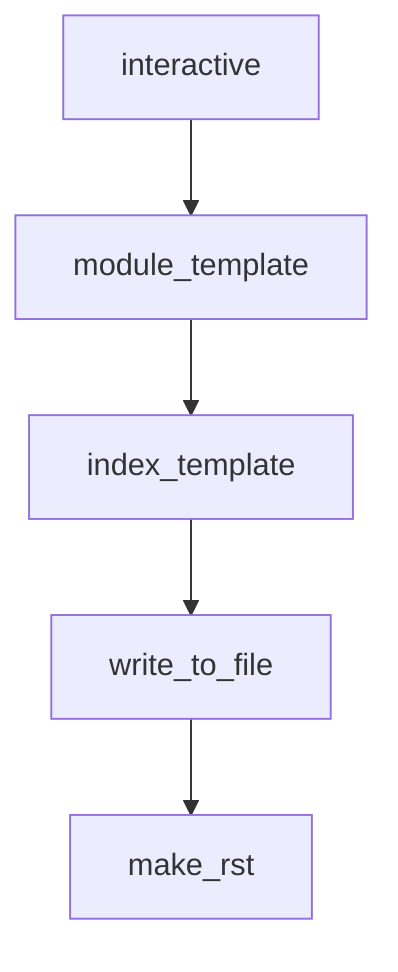

# Chapter 1: Getting Started

Welcome to **Chapter 1: Getting Started**. In this part of **Serena Tutorial: Semantic Code Retrieval Toolkit for Coding Agents**, you will build an intuitive mental model first, then move into concrete implementation details and practical production tradeoffs.


This chapter gets Serena running as an MCP server so your agent can use semantic code tools immediately.

## Learning Goals

- install required tooling (`uv`)
- launch Serena MCP server from the latest GitHub source
- connect a first MCP client
- validate basic semantic tool availability

## Fast Start Path

```bash
uvx --from git+https://github.com/oraios/serena serena start-mcp-server --help
```

## First Client Setup Pattern

1. choose MCP-capable client (Claude Code, Codex, Cursor, etc.)
2. configure Serena launch command in client MCP settings
3. restart client and verify Serena tools are listed
4. run a small retrieval task in a known repository

## Early Failure Triage

| Symptom | Likely Cause | First Fix |
|:--------|:-------------|:----------|
| server fails to start | missing `uv` dependency | install/update `uv` and retry |
| tools not visible in client | MCP launch command not wired correctly | recheck client config path and restart client |
| weak retrieval results | repo context or backend not configured | verify project setup and backend prerequisites |

## Source References

- [Serena Quick Start](https://github.com/oraios/serena/blob/main/README.md#quick-start)
- [MCP Client Setup Guide](https://oraios.github.io/serena/02-usage/030_clients.html)

## Summary

You now have Serena launched and connected as an MCP server.

Next: [Chapter 2: Semantic Toolkit and Agent Loop](02-semantic-toolkit-and-agent-loop.md)

## Source Code Walkthrough

### `docs/_config.yml`

The `interactive` interface in [`docs/_config.yml`](https://github.com/oraios/serena/blob/HEAD/docs/_config.yml) handles a key part of this chapter's functionality:

```yml
# Launch button settings
launch_buttons:
  notebook_interface        : classic  # The interface interactive links will activate ["classic", "jupyterlab"]
  binderhub_url             : ""  # The URL of the BinderHub (e.g., https://mybinder.org)
  jupyterhub_url            : ""  # The URL of the JupyterHub (e.g., https://datahub.berkeley.edu)
  thebe                     : false  # Add a thebe button to pages (requires the repository to run on Binder)
  colab_url                 : "https://colab.research.google.com"

repository:
  url                       : https://github.com/oraios/serena  # The URL to your book's repository
  path_to_book              : docs  # A path to your book's folder, relative to the repository root.
  branch                    : main  # Which branch of the repository should be used when creating links

#######################################################################################
# Advanced and power-user settings
sphinx:
  extra_extensions          :
    - sphinx.ext.autodoc
    - sphinx.ext.viewcode
    - sphinx_toolbox.more_autodoc.sourcelink
    #- sphinxcontrib.spelling
  local_extensions          :   # A list of local extensions to load by sphinx specified by "name: path" items
  recursive_update          : false # A boolean indicating whether to overwrite the Sphinx config (true) or recursively update (false)
  config                    :   # key-value pairs to directly over-ride the Sphinx configuration
    master_doc: "01-about/000_intro.md"
    html_theme_options:
      logo:
        image_light: ../resources/serena-logo.svg
        image_dark: ../resources/serena-logo-dark-mode.svg
    autodoc_typehints_format: "short"
    autodoc_member_order: "bysource"
    autoclass_content: "both"
```

This interface is important because it defines how Serena Tutorial: Semantic Code Retrieval Toolkit for Coding Agents implements the patterns covered in this chapter.

### `docs/autogen_docs.py`

The `module_template` function in [`docs/autogen_docs.py`](https://github.com/oraios/serena/blob/HEAD/docs/autogen_docs.py) handles a key part of this chapter's functionality:

```py
PROJECT_NAME = "Serena"

def module_template(module_qualname: str):
    module_name = module_qualname.split(".")[-1]
    title = module_name.replace("_", r"\_")
    return f"""{title}
{"=" * len(title)}

.. automodule:: {module_qualname}
   :members:
   :undoc-members:
"""


def index_template(package_name: str, doc_references: Optional[List[str]] = None, text_prefix=""):
    doc_references = doc_references or ""
    if doc_references:
        doc_references = "\n" + "\n".join(f"* :doc:`{ref}`" for ref in doc_references) + "\n"

    dirname = package_name.split(".")[-1]
    title = dirname.replace("_", r"\_")
    if title == TOP_LEVEL_PACKAGE:
        title = "API Reference"
    return f"{title}\n{'=' * len(title)}" + text_prefix + doc_references


def write_to_file(content: str, path: str):
    os.makedirs(os.path.dirname(path), exist_ok=True)
    with open(path, "w") as f:
        f.write(content)
    os.chmod(path, 0o666)

```

This function is important because it defines how Serena Tutorial: Semantic Code Retrieval Toolkit for Coding Agents implements the patterns covered in this chapter.

### `docs/autogen_docs.py`

The `index_template` function in [`docs/autogen_docs.py`](https://github.com/oraios/serena/blob/HEAD/docs/autogen_docs.py) handles a key part of this chapter's functionality:

```py


def index_template(package_name: str, doc_references: Optional[List[str]] = None, text_prefix=""):
    doc_references = doc_references or ""
    if doc_references:
        doc_references = "\n" + "\n".join(f"* :doc:`{ref}`" for ref in doc_references) + "\n"

    dirname = package_name.split(".")[-1]
    title = dirname.replace("_", r"\_")
    if title == TOP_LEVEL_PACKAGE:
        title = "API Reference"
    return f"{title}\n{'=' * len(title)}" + text_prefix + doc_references


def write_to_file(content: str, path: str):
    os.makedirs(os.path.dirname(path), exist_ok=True)
    with open(path, "w") as f:
        f.write(content)
    os.chmod(path, 0o666)


_SUBTITLE = (
    f"\n Here is the autogenerated documentation of the {PROJECT_NAME} API. \n \n "
    "The Table of Contents to the left has the same structure as the "
    "repository's package code. The links at each page point to the submodules and subpackages. \n"
)


def make_rst(src_root, rst_root, clean=False, overwrite=False, package_prefix=""):
    """Creates/updates documentation in form of rst files for modules and packages.

    Does not delete any existing rst files. Thus, rst files for packages or modules that have been removed or renamed
```

This function is important because it defines how Serena Tutorial: Semantic Code Retrieval Toolkit for Coding Agents implements the patterns covered in this chapter.

### `docs/autogen_docs.py`

The `write_to_file` function in [`docs/autogen_docs.py`](https://github.com/oraios/serena/blob/HEAD/docs/autogen_docs.py) handles a key part of this chapter's functionality:

```py


def write_to_file(content: str, path: str):
    os.makedirs(os.path.dirname(path), exist_ok=True)
    with open(path, "w") as f:
        f.write(content)
    os.chmod(path, 0o666)


_SUBTITLE = (
    f"\n Here is the autogenerated documentation of the {PROJECT_NAME} API. \n \n "
    "The Table of Contents to the left has the same structure as the "
    "repository's package code. The links at each page point to the submodules and subpackages. \n"
)


def make_rst(src_root, rst_root, clean=False, overwrite=False, package_prefix=""):
    """Creates/updates documentation in form of rst files for modules and packages.

    Does not delete any existing rst files. Thus, rst files for packages or modules that have been removed or renamed
    should be deleted by hand.

    This method should be executed from the project's top-level directory

    :param src_root: path to library base directory, typically "src/<library_name>"
    :param rst_root: path to the root directory to which .rst files will be written
    :param clean: whether to completely clean the target directory beforehand, removing any existing .rst files
    :param overwrite: whether to overwrite existing rst files. This should be used with caution as it will delete
        all manual changes to documentation files
    :package_prefix: a prefix to prepend to each module (for the case where the src_root is not the base package),
        which, if not empty, should end with a "."
    :return:
```

This function is important because it defines how Serena Tutorial: Semantic Code Retrieval Toolkit for Coding Agents implements the patterns covered in this chapter.


## How These Components Connect


