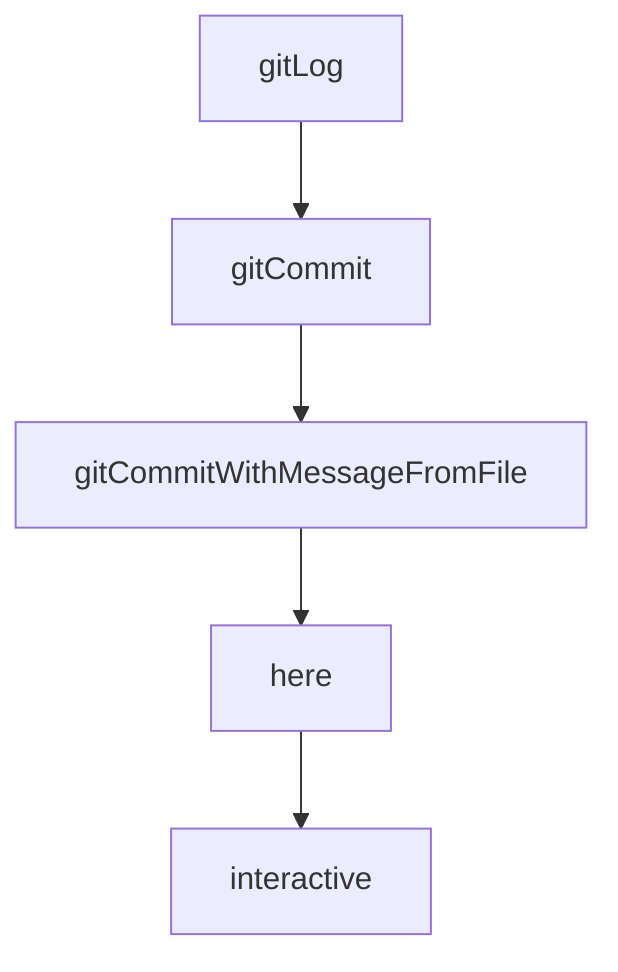

# Chapter 2: Semantic Toolkit and Agent Loop

Welcome to **Chapter 2: Semantic Toolkit and Agent Loop**. In this part of **Serena Tutorial: Semantic Code Retrieval Toolkit for Coding Agents**, you will build an intuitive mental model first, then move into concrete implementation details and practical production tradeoffs.


This chapter explains why Serena materially changes coding-agent behavior in large repositories.

## Learning Goals

- understand Serena's symbol-level tool philosophy
- compare semantic retrieval vs file-based approaches
- identify where token savings and quality gains come from
- map Serena into existing agent loops

## Semantic Tool Pattern

Serena exposes IDE-style operations such as:

- symbol lookup (`find_symbol`)
- reference discovery (`find_referencing_symbols`)
- targeted insertion/editing (`insert_after_symbol`)

These tools reduce brute-force full-file scanning and improve edit precision.

## Agent Loop Benefits

| Problem | File-Based Approach | Serena Approach |
|:--------|:--------------------|:----------------|
| finding exact edit location | repeated grep + large file reads | direct symbol resolution |
| changing related call sites | manual heuristic scans | explicit reference discovery |
| token overhead | high in large repos | reduced by targeted retrieval |

## Source References

- [Serena README Overview](https://github.com/oraios/serena/blob/main/README.md)
- [Serena Tools Docs](https://oraios.github.io/serena/01-about/035_tools.html)

## Summary

You now understand Serena's core leverage: semantic precision instead of file-wide approximation.

Next: [Chapter 3: MCP Client Integrations](03-mcp-client-integrations.md)

## Depth Expansion Playbook

## Source Code Walkthrough

### `repo_dir_sync.py`

The `gitLog` function in [`repo_dir_sync.py`](https://github.com/oraios/serena/blob/HEAD/repo_dir_sync.py) handles a key part of this chapter's functionality:

```py


def gitLog(path, arg):
    oldPath = os.getcwd()
    os.chdir(path)
    lg = call("git log --no-merges " + arg)
    os.chdir(oldPath)
    return lg


def gitCommit(msg):
    with open(COMMIT_MSG_FILENAME, "wb") as f:
        f.write(msg.encode("utf-8"))
    gitCommitWithMessageFromFile(COMMIT_MSG_FILENAME)


def gitCommitWithMessageFromFile(commitMsgFilename):
    if not os.path.exists(commitMsgFilename):
        raise FileNotFoundError(f"{commitMsgFilename} not found in {os.path.abspath(os.getcwd())}")
    os.system(f"git commit --file={commitMsgFilename}")
    os.unlink(commitMsgFilename)


COMMIT_MSG_FILENAME = "commitmsg.txt"


class OtherRepo:
    SYNC_COMMIT_ID_FILE_LIB_REPO = ".syncCommitId.remote"
    SYNC_COMMIT_ID_FILE_THIS_REPO = ".syncCommitId.this"
    SYNC_COMMIT_MESSAGE = f"Updated %s sync commit identifiers"
    SYNC_BACKUP_DIR = ".syncBackup"
    
```

This function is important because it defines how Serena Tutorial: Semantic Code Retrieval Toolkit for Coding Agents implements the patterns covered in this chapter.

### `repo_dir_sync.py`

The `gitCommit` function in [`repo_dir_sync.py`](https://github.com/oraios/serena/blob/HEAD/repo_dir_sync.py) handles a key part of this chapter's functionality:

```py


def gitCommit(msg):
    with open(COMMIT_MSG_FILENAME, "wb") as f:
        f.write(msg.encode("utf-8"))
    gitCommitWithMessageFromFile(COMMIT_MSG_FILENAME)


def gitCommitWithMessageFromFile(commitMsgFilename):
    if not os.path.exists(commitMsgFilename):
        raise FileNotFoundError(f"{commitMsgFilename} not found in {os.path.abspath(os.getcwd())}")
    os.system(f"git commit --file={commitMsgFilename}")
    os.unlink(commitMsgFilename)


COMMIT_MSG_FILENAME = "commitmsg.txt"


class OtherRepo:
    SYNC_COMMIT_ID_FILE_LIB_REPO = ".syncCommitId.remote"
    SYNC_COMMIT_ID_FILE_THIS_REPO = ".syncCommitId.this"
    SYNC_COMMIT_MESSAGE = f"Updated %s sync commit identifiers"
    SYNC_BACKUP_DIR = ".syncBackup"
    
    def __init__(self, name, branch, pathToLib):
        self.pathToLibInThisRepo = os.path.abspath(pathToLib)
        if not os.path.exists(self.pathToLibInThisRepo):
            raise ValueError(f"Repository directory '{self.pathToLibInThisRepo}' does not exist")
        self.name = name
        self.branch = branch
        self.libRepo: Optional[LibRepo] = None

```

This function is important because it defines how Serena Tutorial: Semantic Code Retrieval Toolkit for Coding Agents implements the patterns covered in this chapter.

### `repo_dir_sync.py`

The `gitCommitWithMessageFromFile` function in [`repo_dir_sync.py`](https://github.com/oraios/serena/blob/HEAD/repo_dir_sync.py) handles a key part of this chapter's functionality:

```py
    with open(COMMIT_MSG_FILENAME, "wb") as f:
        f.write(msg.encode("utf-8"))
    gitCommitWithMessageFromFile(COMMIT_MSG_FILENAME)


def gitCommitWithMessageFromFile(commitMsgFilename):
    if not os.path.exists(commitMsgFilename):
        raise FileNotFoundError(f"{commitMsgFilename} not found in {os.path.abspath(os.getcwd())}")
    os.system(f"git commit --file={commitMsgFilename}")
    os.unlink(commitMsgFilename)


COMMIT_MSG_FILENAME = "commitmsg.txt"


class OtherRepo:
    SYNC_COMMIT_ID_FILE_LIB_REPO = ".syncCommitId.remote"
    SYNC_COMMIT_ID_FILE_THIS_REPO = ".syncCommitId.this"
    SYNC_COMMIT_MESSAGE = f"Updated %s sync commit identifiers"
    SYNC_BACKUP_DIR = ".syncBackup"
    
    def __init__(self, name, branch, pathToLib):
        self.pathToLibInThisRepo = os.path.abspath(pathToLib)
        if not os.path.exists(self.pathToLibInThisRepo):
            raise ValueError(f"Repository directory '{self.pathToLibInThisRepo}' does not exist")
        self.name = name
        self.branch = branch
        self.libRepo: Optional[LibRepo] = None

    def isSyncEstablished(self):
        return os.path.exists(os.path.join(self.pathToLibInThisRepo, self.SYNC_COMMIT_ID_FILE_LIB_REPO))
    
```

This function is important because it defines how Serena Tutorial: Semantic Code Retrieval Toolkit for Coding Agents implements the patterns covered in this chapter.

### `.serena/project.yml`

The `here` interface in [`.serena/project.yml`](https://github.com/oraios/serena/blob/HEAD/.serena/project.yml) handles a key part of this chapter's functionality:

```yml
#   terraform           toml                typescript          typescript_vts      vue
#   yaml                zig
#   (This list may be outdated. For the current list, see values of Language enum here:
#   https://github.com/oraios/serena/blob/main/src/solidlsp/ls_config.py
#   For some languages, there are alternative language servers, e.g. csharp_omnisharp, ruby_solargraph.)
# Note:
#   - For C, use cpp
#   - For JavaScript, use typescript
#   - For Free Pascal/Lazarus, use pascal
# Special requirements:
#   - csharp: Requires the presence of a .sln file in the project folder.
#   - pascal: Requires Free Pascal Compiler (fpc) and optionally Lazarus.
# When using multiple languages, the first language server that supports a given file will be used for that file.
# The first language is the default language and the respective language server will be used as a fallback.
# Note that when using the JetBrains backend, language servers are not used and this list is correspondingly ignored.
languages:
- python
- typescript

# whether to use project's .gitignore files to ignore files
ignore_all_files_in_gitignore: true


# list of additional paths to ignore in all projects
# same syntax as gitignore, so you can use * and **
ignored_paths: []

# whether the project is in read-only mode
# If set to true, all editing tools will be disabled and attempts to use them will result in an error
read_only: false


```

This interface is important because it defines how Serena Tutorial: Semantic Code Retrieval Toolkit for Coding Agents implements the patterns covered in this chapter.


## How These Components Connect


