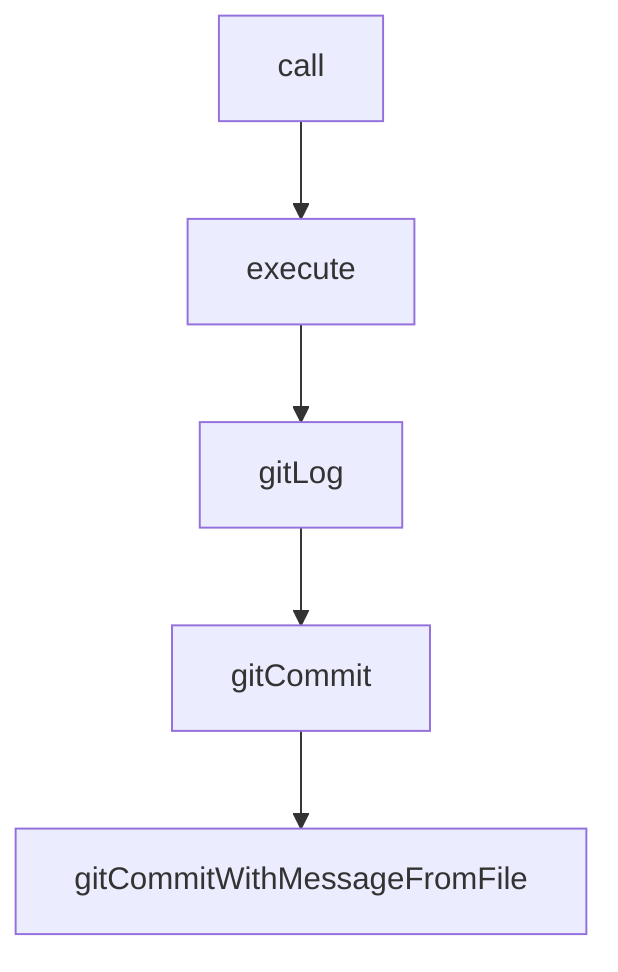

# Chapter 2: Semantic Toolkit and Agent Loop

Welcome to **Chapter 2: Semantic Toolkit and Agent Loop**. In this part of **Serena Tutorial: Semantic Code Retrieval Toolkit for Coding Agents**, you will build an intuitive mental model first, then move into concrete implementation details and practical production tradeoffs.


This chapter explains why Serena materially changes coding-agent behavior in large repositories.

## Learning Goals

- understand Serena's symbol-level tool philosophy
- compare semantic retrieval vs file-based approaches
- identify where token savings and quality gains come from
- map Serena into existing agent loops

## Semantic Tool Pattern

Serena exposes IDE-style operations such as:

- symbol lookup (`find_symbol`)
- reference discovery (`find_referencing_symbols`)
- targeted insertion/editing (`insert_after_symbol`)

These tools reduce brute-force full-file scanning and improve edit precision.

## Agent Loop Benefits

| Problem | File-Based Approach | Serena Approach |
|:--------|:--------------------|:----------------|
| finding exact edit location | repeated grep + large file reads | direct symbol resolution |
| changing related call sites | manual heuristic scans | explicit reference discovery |
| token overhead | high in large repos | reduced by targeted retrieval |

## Source References

- [Serena README Overview](https://github.com/oraios/serena/blob/main/README.md)
- [Serena Tools Docs](https://oraios.github.io/serena/01-about/035_tools.html)

## Summary

You now understand Serena's core leverage: semantic precision instead of file-wide approximation.

Next: [Chapter 3: MCP Client Integrations](03-mcp-client-integrations.md)

## Source Code Walkthrough

### `repo_dir_sync.py`

The `call` function in [`repo_dir_sync.py`](https://github.com/oraios/serena/blob/HEAD/repo_dir_sync.py) handles a key part of this chapter's functionality:

```py


def call(cmd):
    p = popen(cmd)
    return p.stdout.read().decode("utf-8")


def execute(cmd, exceptionOnError=True):
    """
    :param cmd: the command to execute
    :param exceptionOnError: if True, raise on exception on error (return code not 0); if False return
        whether the call was successful
    :return: True if the call was successful, False otherwise (if exceptionOnError==False)
    """
    p = popen(cmd)
    p.wait()
    success = p.returncode == 0
    if exceptionOnError:
        if not success:
            raise Exception("Command failed: %s" % cmd)
    else:
        return success


def gitLog(path, arg):
    oldPath = os.getcwd()
    os.chdir(path)
    lg = call("git log --no-merges " + arg)
    os.chdir(oldPath)
    return lg


```

This function is important because it defines how Serena Tutorial: Semantic Code Retrieval Toolkit for Coding Agents implements the patterns covered in this chapter.

### `repo_dir_sync.py`

The `execute` function in [`repo_dir_sync.py`](https://github.com/oraios/serena/blob/HEAD/repo_dir_sync.py) handles a key part of this chapter's functionality:

```py


def execute(cmd, exceptionOnError=True):
    """
    :param cmd: the command to execute
    :param exceptionOnError: if True, raise on exception on error (return code not 0); if False return
        whether the call was successful
    :return: True if the call was successful, False otherwise (if exceptionOnError==False)
    """
    p = popen(cmd)
    p.wait()
    success = p.returncode == 0
    if exceptionOnError:
        if not success:
            raise Exception("Command failed: %s" % cmd)
    else:
        return success


def gitLog(path, arg):
    oldPath = os.getcwd()
    os.chdir(path)
    lg = call("git log --no-merges " + arg)
    os.chdir(oldPath)
    return lg


def gitCommit(msg):
    with open(COMMIT_MSG_FILENAME, "wb") as f:
        f.write(msg.encode("utf-8"))
    gitCommitWithMessageFromFile(COMMIT_MSG_FILENAME)

```

This function is important because it defines how Serena Tutorial: Semantic Code Retrieval Toolkit for Coding Agents implements the patterns covered in this chapter.

### `repo_dir_sync.py`

The `gitLog` function in [`repo_dir_sync.py`](https://github.com/oraios/serena/blob/HEAD/repo_dir_sync.py) handles a key part of this chapter's functionality:

```py


def gitLog(path, arg):
    oldPath = os.getcwd()
    os.chdir(path)
    lg = call("git log --no-merges " + arg)
    os.chdir(oldPath)
    return lg


def gitCommit(msg):
    with open(COMMIT_MSG_FILENAME, "wb") as f:
        f.write(msg.encode("utf-8"))
    gitCommitWithMessageFromFile(COMMIT_MSG_FILENAME)


def gitCommitWithMessageFromFile(commitMsgFilename):
    if not os.path.exists(commitMsgFilename):
        raise FileNotFoundError(f"{commitMsgFilename} not found in {os.path.abspath(os.getcwd())}")
    os.system(f"git commit --file={commitMsgFilename}")
    os.unlink(commitMsgFilename)


COMMIT_MSG_FILENAME = "commitmsg.txt"


class OtherRepo:
    SYNC_COMMIT_ID_FILE_LIB_REPO = ".syncCommitId.remote"
    SYNC_COMMIT_ID_FILE_THIS_REPO = ".syncCommitId.this"
    SYNC_COMMIT_MESSAGE = f"Updated %s sync commit identifiers"
    SYNC_BACKUP_DIR = ".syncBackup"
    
```

This function is important because it defines how Serena Tutorial: Semantic Code Retrieval Toolkit for Coding Agents implements the patterns covered in this chapter.

### `repo_dir_sync.py`

The `gitCommit` function in [`repo_dir_sync.py`](https://github.com/oraios/serena/blob/HEAD/repo_dir_sync.py) handles a key part of this chapter's functionality:

```py


def gitCommit(msg):
    with open(COMMIT_MSG_FILENAME, "wb") as f:
        f.write(msg.encode("utf-8"))
    gitCommitWithMessageFromFile(COMMIT_MSG_FILENAME)


def gitCommitWithMessageFromFile(commitMsgFilename):
    if not os.path.exists(commitMsgFilename):
        raise FileNotFoundError(f"{commitMsgFilename} not found in {os.path.abspath(os.getcwd())}")
    os.system(f"git commit --file={commitMsgFilename}")
    os.unlink(commitMsgFilename)


COMMIT_MSG_FILENAME = "commitmsg.txt"


class OtherRepo:
    SYNC_COMMIT_ID_FILE_LIB_REPO = ".syncCommitId.remote"
    SYNC_COMMIT_ID_FILE_THIS_REPO = ".syncCommitId.this"
    SYNC_COMMIT_MESSAGE = f"Updated %s sync commit identifiers"
    SYNC_BACKUP_DIR = ".syncBackup"
    
    def __init__(self, name, branch, pathToLib):
        self.pathToLibInThisRepo = os.path.abspath(pathToLib)
        if not os.path.exists(self.pathToLibInThisRepo):
            raise ValueError(f"Repository directory '{self.pathToLibInThisRepo}' does not exist")
        self.name = name
        self.branch = branch
        self.libRepo: Optional[LibRepo] = None

```

This function is important because it defines how Serena Tutorial: Semantic Code Retrieval Toolkit for Coding Agents implements the patterns covered in this chapter.


## How These Components Connect


