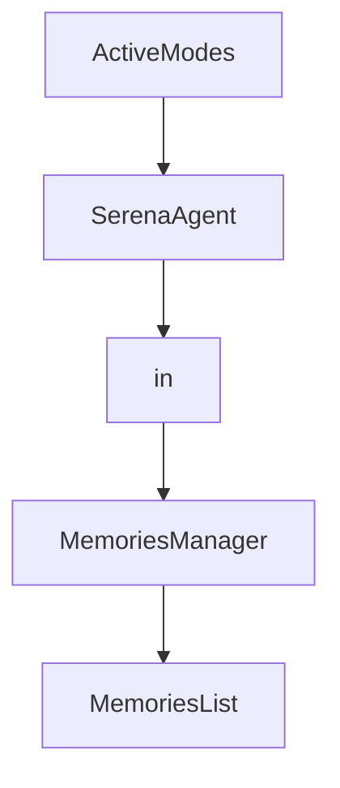

# Chapter 3: MCP Client Integrations

Welcome to **Chapter 3: MCP Client Integrations**. In this part of **Serena Tutorial: Semantic Code Retrieval Toolkit for Coding Agents**, you will build an intuitive mental model first, then move into concrete implementation details and practical production tradeoffs.


This chapter shows how Serena is deployed as a shared capability layer across different agent surfaces.

## Learning Goals

- connect Serena with terminal, desktop, and IDE clients
- choose integration style for your workflow constraints
- use MCP transport assumptions safely
- standardize client setup for team onboarding

## Supported Integration Surfaces

Serena documentation and README list integrations with:

- Claude Code / Claude Desktop
- Codex and other terminal MCP clients
- VS Code / Cursor / IntelliJ class IDEs
- Cline / Roo Code extensions
- local GUI clients and framework integrations

## Integration Decision Matrix

| Environment | Preferred Integration |
|:------------|:----------------------|
| terminal-heavy developer flow | CLI MCP client + Serena |
| IDE-centric flow | MCP-enabled IDE + Serena |
| mixed team tooling | standard Serena launch profile shared across clients |

## Source References

- [Connecting Your MCP Client](https://oraios.github.io/serena/02-usage/030_clients.html)
- [Serena README: LLM Integration](https://github.com/oraios/serena/blob/main/README.md#llm-integration)

## Summary

You now know how Serena fits across multiple agent clients without locking into a single UI.

Next: [Chapter 4: Language Backends and Analysis Strategy](04-language-backends-and-analysis-strategy.md)

## Depth Expansion Playbook

## Source Code Walkthrough

### `src/serena/agent.py`

The `ActiveModes` class in [`src/serena/agent.py`](https://github.com/oraios/serena/blob/HEAD/src/serena/agent.py) handles a key part of this chapter's functionality:

```py


class ActiveModes:
    def __init__(self) -> None:
        self._base_modes: Sequence[str] | None = None
        self._default_modes: Sequence[str] | None = None
        self._active_mode_names: Sequence[str] | None = []
        self._active_modes: Sequence[SerenaAgentMode] | None = []

    def apply(self, mode_selection: ModeSelectionDefinition) -> None:
        # invalidate active modes
        self._active_mode_names = None
        self._active_modes = None

        # apply overrides
        log.debug("Applying mode selection: default_modes=%s, base_modes=%s", mode_selection.default_modes, mode_selection.base_modes)
        if mode_selection.base_modes is not None:
            self._base_modes = mode_selection.base_modes
        if mode_selection.default_modes is not None:
            self._default_modes = mode_selection.default_modes
        log.debug("Current mode selection: base_modes=%s, default_modes=%s", self._base_modes, self._default_modes)

    def get_mode_names(self) -> Sequence[str]:
        if self._active_mode_names is not None:
            return self._active_mode_names
        active_mode_names: set[str] = set()
        if self._base_modes is not None:
            active_mode_names.update(self._base_modes)
        if self._default_modes is not None:
            active_mode_names.update(self._default_modes)
        self._active_mode_names = sorted(active_mode_names)
        log.info("Active modes: %s", self._active_mode_names)
```

This class is important because it defines how Serena Tutorial: Semantic Code Retrieval Toolkit for Coding Agents implements the patterns covered in this chapter.

### `src/serena/agent.py`

The `SerenaAgent` class in [`src/serena/agent.py`](https://github.com/oraios/serena/blob/HEAD/src/serena/agent.py) handles a key part of this chapter's functionality:

```py
from serena import serena_version
from serena.analytics import RegisteredTokenCountEstimator, ToolUsageStats
from serena.config.context_mode import SerenaAgentContext, SerenaAgentMode
from serena.config.serena_config import (
    LanguageBackend,
    ModeSelectionDefinition,
    NamedToolInclusionDefinition,
    RegisteredProject,
    SerenaConfig,
    SerenaPaths,
    ToolInclusionDefinition,
)
from serena.dashboard import SerenaDashboardAPI
from serena.ls_manager import LanguageServerManager
from serena.project import MemoriesManager, Project
from serena.prompt_factory import SerenaPromptFactory
from serena.task_executor import TaskExecutor
from serena.tools import ActivateProjectTool, GetCurrentConfigTool, OpenDashboardTool, ReplaceContentTool, Tool, ToolMarker, ToolRegistry
from serena.util.gui import system_has_usable_display
from serena.util.inspection import iter_subclasses
from serena.util.logging import MemoryLogHandler
from solidlsp.ls_config import Language

if TYPE_CHECKING:
    from serena.gui_log_viewer import GuiLogViewer

log = logging.getLogger(__name__)
TTool = TypeVar("TTool", bound="Tool")
T = TypeVar("T")
SUCCESS_RESULT = "OK"


```

This class is important because it defines how Serena Tutorial: Semantic Code Retrieval Toolkit for Coding Agents implements the patterns covered in this chapter.

### `src/serena/agent.py`

The `in` class in [`src/serena/agent.py`](https://github.com/oraios/serena/blob/HEAD/src/serena/agent.py) handles a key part of this chapter's functionality:

```py
from collections.abc import Callable, Iterator, Sequence
from contextlib import contextmanager
from logging import Logger
from typing import TYPE_CHECKING, Optional, TypeVar

from sensai.util import logging
from sensai.util.logging import LogTime
from sensai.util.string import dict_string

from interprompt.jinja_template import JinjaTemplate
from serena import serena_version
from serena.analytics import RegisteredTokenCountEstimator, ToolUsageStats
from serena.config.context_mode import SerenaAgentContext, SerenaAgentMode
from serena.config.serena_config import (
    LanguageBackend,
    ModeSelectionDefinition,
    NamedToolInclusionDefinition,
    RegisteredProject,
    SerenaConfig,
    SerenaPaths,
    ToolInclusionDefinition,
)
from serena.dashboard import SerenaDashboardAPI
from serena.ls_manager import LanguageServerManager
from serena.project import MemoriesManager, Project
from serena.prompt_factory import SerenaPromptFactory
from serena.task_executor import TaskExecutor
from serena.tools import ActivateProjectTool, GetCurrentConfigTool, OpenDashboardTool, ReplaceContentTool, Tool, ToolMarker, ToolRegistry
from serena.util.gui import system_has_usable_display
from serena.util.inspection import iter_subclasses
from serena.util.logging import MemoryLogHandler
from solidlsp.ls_config import Language
```

This class is important because it defines how Serena Tutorial: Semantic Code Retrieval Toolkit for Coding Agents implements the patterns covered in this chapter.

### `src/serena/project.py`

The `MemoriesManager` class in [`src/serena/project.py`](https://github.com/oraios/serena/blob/HEAD/src/serena/project.py) handles a key part of this chapter's functionality:

```py


class MemoriesManager:
    GLOBAL_TOPIC = "global"
    _global_memory_dir = SerenaPaths().global_memories_path

    def __init__(self, serena_data_folder: str | Path | None, read_only_memory_patterns: Sequence[str] = ()):
        """
        :param serena_data_folder: the absolute path to the project's .serena data folder
        :param read_only_memory_patterns: whether to allow writing global memories in tool execution contexts
        """
        self._project_memory_dir: Path | None = None
        if serena_data_folder is not None:
            self._project_memory_dir = Path(serena_data_folder) / "memories"
            self._project_memory_dir.mkdir(parents=True, exist_ok=True)
        self._encoding = SERENA_FILE_ENCODING
        self._read_only_memory_patterns = [re.compile(pattern) for pattern in set(read_only_memory_patterns)]

    def _is_read_only_memory(self, name: str) -> bool:
        for pattern in self._read_only_memory_patterns:
            if pattern.fullmatch(name):
                return True
        return False

    def _is_global(self, name: str) -> bool:
        return name == self.GLOBAL_TOPIC or name.startswith(self.GLOBAL_TOPIC + "/")

    def get_memory_file_path(self, name: str) -> Path:
        # Strip .md extension if present
        name = name.replace(".md", "")

        if self._is_global(name):
```

This class is important because it defines how Serena Tutorial: Semantic Code Retrieval Toolkit for Coding Agents implements the patterns covered in this chapter.


## How These Components Connect


