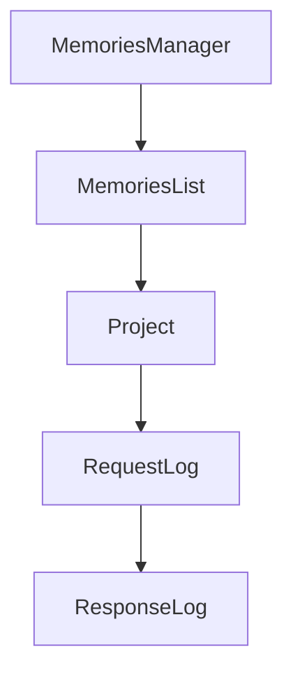

# Chapter 3: MCP Client Integrations

Welcome to **Chapter 3: MCP Client Integrations**. In this part of **Serena Tutorial: Semantic Code Retrieval Toolkit for Coding Agents**, you will build an intuitive mental model first, then move into concrete implementation details and practical production tradeoffs.


This chapter shows how Serena is deployed as a shared capability layer across different agent surfaces.

## Learning Goals

- connect Serena with terminal, desktop, and IDE clients
- choose integration style for your workflow constraints
- use MCP transport assumptions safely
- standardize client setup for team onboarding

## Supported Integration Surfaces

Serena documentation and README list integrations with:

- Claude Code / Claude Desktop
- Codex and other terminal MCP clients
- VS Code / Cursor / IntelliJ class IDEs
- Cline / Roo Code extensions
- local GUI clients and framework integrations

## Integration Decision Matrix

| Environment | Preferred Integration |
|:------------|:----------------------|
| terminal-heavy developer flow | CLI MCP client + Serena |
| IDE-centric flow | MCP-enabled IDE + Serena |
| mixed team tooling | standard Serena launch profile shared across clients |

## Source References

- [Connecting Your MCP Client](https://oraios.github.io/serena/02-usage/030_clients.html)
- [Serena README: LLM Integration](https://github.com/oraios/serena/blob/main/README.md#llm-integration)

## Summary

You now know how Serena fits across multiple agent clients without locking into a single UI.

Next: [Chapter 4: Language Backends and Analysis Strategy](04-language-backends-and-analysis-strategy.md)

## Source Code Walkthrough

### `src/serena/project.py`

The `MemoriesManager` class in [`src/serena/project.py`](https://github.com/oraios/serena/blob/HEAD/src/serena/project.py) handles a key part of this chapter's functionality:

```py


class MemoriesManager:
    GLOBAL_TOPIC = "global"
    _global_memory_dir = SerenaPaths().global_memories_path

    def __init__(
        self,
        serena_data_folder: str | Path | None,
        read_only_memory_patterns: Sequence[str] = (),
        ignored_memory_patterns: Sequence[str] = (),
    ):
        """
        :param serena_data_folder: the absolute path to the project's .serena data folder
        :param read_only_memory_patterns: whether to allow writing global memories in tool execution contexts
        :param ignored_memory_patterns: regex patterns for memories to completely exclude from listing, reading, and writing.
            Matching memories will not appear in list_memories or activate_project output and cannot be accessed
            via read_memory or write_memory. Use read_file on the raw path to access ignored memory files.
        """
        self._project_memory_dir: Path | None = None
        if serena_data_folder is not None:
            self._project_memory_dir = Path(serena_data_folder) / "memories"
            self._project_memory_dir.mkdir(parents=True, exist_ok=True)
        self._encoding = SERENA_FILE_ENCODING
        self._read_only_memory_patterns = [re.compile(pattern) for pattern in set(read_only_memory_patterns)]
        self._ignored_memory_patterns = [re.compile(pattern) for pattern in set(ignored_memory_patterns)]

    def _is_read_only_memory(self, name: str) -> bool:
        for pattern in self._read_only_memory_patterns:
            if pattern.fullmatch(name):
                return True
        return False
```

This class is important because it defines how Serena Tutorial: Semantic Code Retrieval Toolkit for Coding Agents implements the patterns covered in this chapter.

### `src/serena/project.py`

The `MemoriesList` class in [`src/serena/project.py`](https://github.com/oraios/serena/blob/HEAD/src/serena/project.py) handles a key part of this chapter's functionality:

```py
        return f"Memory {name} written."

    class MemoriesList:
        def __init__(self) -> None:
            self.memories: list[str] = []
            self.read_only_memories: list[str] = []

        def __len__(self) -> int:
            return len(self.memories) + len(self.read_only_memories)

        def add(self, memory_name: str, is_read_only: bool) -> None:
            if is_read_only:
                self.read_only_memories.append(memory_name)
            else:
                self.memories.append(memory_name)

        def extend(self, other: "MemoriesManager.MemoriesList") -> None:
            self.memories.extend(other.memories)
            self.read_only_memories.extend(other.read_only_memories)

        def to_dict(self) -> dict[str, list[str]]:
            result = {}
            if self.memories:
                result["memories"] = sorted(self.memories)
            if self.read_only_memories:
                result["read_only_memories"] = sorted(self.read_only_memories)
            return result

        def get_full_list(self) -> list[str]:
            return sorted(self.memories + self.read_only_memories)

    def _list_memories(self, search_dir: Path, base_dir: Path, prefix: str = "") -> MemoriesList:
```

This class is important because it defines how Serena Tutorial: Semantic Code Retrieval Toolkit for Coding Agents implements the patterns covered in this chapter.

### `src/serena/project.py`

The `Project` class in [`src/serena/project.py`](https://github.com/oraios/serena/blob/HEAD/src/serena/project.py) handles a key part of this chapter's functionality:

```py

from serena.config.serena_config import (
    ProjectConfig,
    SerenaConfig,
    SerenaPaths,
)
from serena.constants import SERENA_FILE_ENCODING
from serena.ls_manager import LanguageServerFactory, LanguageServerManager
from serena.util.file_system import GitignoreParser, match_path
from serena.util.text_utils import ContentReplacer, MatchedConsecutiveLines, search_files
from solidlsp import SolidLanguageServer
from solidlsp.ls_config import Language
from solidlsp.ls_utils import FileUtils

if TYPE_CHECKING:
    from serena.agent import SerenaAgent

log = logging.getLogger(__name__)


class MemoriesManager:
    GLOBAL_TOPIC = "global"
    _global_memory_dir = SerenaPaths().global_memories_path

    def __init__(
        self,
        serena_data_folder: str | Path | None,
        read_only_memory_patterns: Sequence[str] = (),
        ignored_memory_patterns: Sequence[str] = (),
    ):
        """
        :param serena_data_folder: the absolute path to the project's .serena data folder
```

This class is important because it defines how Serena Tutorial: Semantic Code Retrieval Toolkit for Coding Agents implements the patterns covered in this chapter.

### `src/serena/dashboard.py`

The `RequestLog` class in [`src/serena/dashboard.py`](https://github.com/oraios/serena/blob/HEAD/src/serena/dashboard.py) handles a key part of this chapter's functionality:

```py


class RequestLog(BaseModel):
    start_idx: int = 0


class ResponseLog(BaseModel):
    messages: list[str]
    max_idx: int
    active_project: str | None = None


class ResponseToolNames(BaseModel):
    tool_names: list[str]


class ResponseToolStats(BaseModel):
    stats: dict[str, dict[str, int]]


class ResponseConfigOverview(BaseModel):
    active_project: dict[str, str | None]
    context: dict[str, str]
    modes: list[dict[str, str]]
    active_tools: list[str]
    tool_stats_summary: dict[str, dict[str, int]]
    registered_projects: list[dict[str, str | bool]]
    available_tools: list[dict[str, str | bool]]
    available_modes: list[dict[str, str | bool]]
    available_contexts: list[dict[str, str | bool]]
    available_memories: list[str] | None
    jetbrains_mode: bool
```

This class is important because it defines how Serena Tutorial: Semantic Code Retrieval Toolkit for Coding Agents implements the patterns covered in this chapter.


## How These Components Connect


