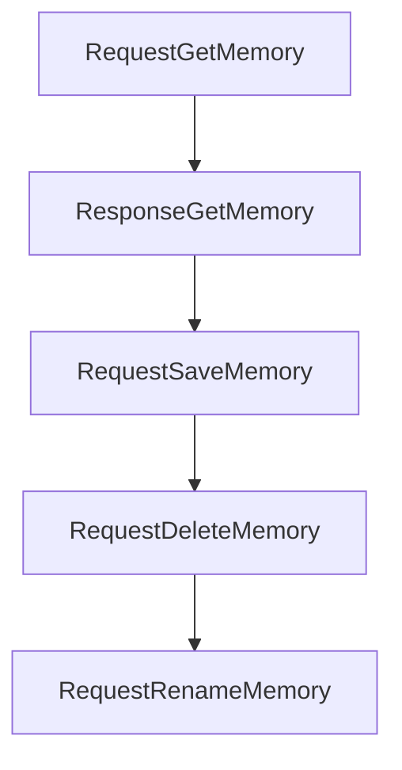

# Chapter 4: Language Backends and Analysis Strategy

Welcome to **Chapter 4: Language Backends and Analysis Strategy**. In this part of **Serena Tutorial: Semantic Code Retrieval Toolkit for Coding Agents**, you will build an intuitive mental model first, then move into concrete implementation details and practical production tradeoffs.


This chapter covers the backend choices that determine semantic quality and operational complexity.

## Learning Goals

- understand Serena's backend options
- choose between LSP and JetBrains-plugin pathways
- align backend choice with project language coverage
- avoid backend-related reliability pitfalls

## Backend Options

| Backend | Strengths | Tradeoffs |
|:--------|:----------|:----------|
| LSP-based analysis | open, broad language support | depends on per-language server setup |
| Serena JetBrains plugin | deep IDE-native analysis | requires JetBrains IDE environment |

Serena reports support for 30+ languages through its LSP abstraction.

## Selection Guidance

- choose LSP for cross-editor, infrastructure-friendly setups
- choose JetBrains plugin for strongest IDE-assisted semantics
- document required backend dependencies per language stack

## Source References

- [Language Support](https://oraios.github.io/serena/01-about/020_programming-languages.html)
- [Serena JetBrains Plugin](https://oraios.github.io/serena/02-usage/025_jetbrains_plugin.html)

## Summary

You now can select analysis backend strategy based on workflow, language set, and team environment.

Next: [Chapter 5: Project Workflow and Context Practices](05-project-workflow-and-context-practices.md)

## Source Code Walkthrough

### `src/serena/dashboard.py`

The `RequestGetMemory` class in [`src/serena/dashboard.py`](https://github.com/oraios/serena/blob/HEAD/src/serena/dashboard.py) handles a key part of this chapter's functionality:

```py


class RequestGetMemory(BaseModel):
    memory_name: str


class ResponseGetMemory(BaseModel):
    content: str
    memory_name: str


class RequestSaveMemory(BaseModel):
    memory_name: str
    content: str


class RequestDeleteMemory(BaseModel):
    memory_name: str


class RequestRenameMemory(BaseModel):
    old_name: str
    new_name: str


class ResponseGetSerenaConfig(BaseModel):
    content: str


class RequestSaveSerenaConfig(BaseModel):
    content: str

```

This class is important because it defines how Serena Tutorial: Semantic Code Retrieval Toolkit for Coding Agents implements the patterns covered in this chapter.

### `src/serena/dashboard.py`

The `ResponseGetMemory` class in [`src/serena/dashboard.py`](https://github.com/oraios/serena/blob/HEAD/src/serena/dashboard.py) handles a key part of this chapter's functionality:

```py


class ResponseGetMemory(BaseModel):
    content: str
    memory_name: str


class RequestSaveMemory(BaseModel):
    memory_name: str
    content: str


class RequestDeleteMemory(BaseModel):
    memory_name: str


class RequestRenameMemory(BaseModel):
    old_name: str
    new_name: str


class ResponseGetSerenaConfig(BaseModel):
    content: str


class RequestSaveSerenaConfig(BaseModel):
    content: str


class RequestCancelTaskExecution(BaseModel):
    task_id: int

```

This class is important because it defines how Serena Tutorial: Semantic Code Retrieval Toolkit for Coding Agents implements the patterns covered in this chapter.

### `src/serena/dashboard.py`

The `RequestSaveMemory` class in [`src/serena/dashboard.py`](https://github.com/oraios/serena/blob/HEAD/src/serena/dashboard.py) handles a key part of this chapter's functionality:

```py


class RequestSaveMemory(BaseModel):
    memory_name: str
    content: str


class RequestDeleteMemory(BaseModel):
    memory_name: str


class RequestRenameMemory(BaseModel):
    old_name: str
    new_name: str


class ResponseGetSerenaConfig(BaseModel):
    content: str


class RequestSaveSerenaConfig(BaseModel):
    content: str


class RequestCancelTaskExecution(BaseModel):
    task_id: int


class QueuedExecution(BaseModel):
    task_id: int
    is_running: bool
    name: str
```

This class is important because it defines how Serena Tutorial: Semantic Code Retrieval Toolkit for Coding Agents implements the patterns covered in this chapter.

### `src/serena/dashboard.py`

The `RequestDeleteMemory` class in [`src/serena/dashboard.py`](https://github.com/oraios/serena/blob/HEAD/src/serena/dashboard.py) handles a key part of this chapter's functionality:

```py


class RequestDeleteMemory(BaseModel):
    memory_name: str


class RequestRenameMemory(BaseModel):
    old_name: str
    new_name: str


class ResponseGetSerenaConfig(BaseModel):
    content: str


class RequestSaveSerenaConfig(BaseModel):
    content: str


class RequestCancelTaskExecution(BaseModel):
    task_id: int


class QueuedExecution(BaseModel):
    task_id: int
    is_running: bool
    name: str
    finished_successfully: bool
    logged: bool

    @classmethod
    def from_task_info(cls, task_info: TaskExecutor.TaskInfo) -> Self:
```

This class is important because it defines how Serena Tutorial: Semantic Code Retrieval Toolkit for Coding Agents implements the patterns covered in this chapter.


## How These Components Connect


