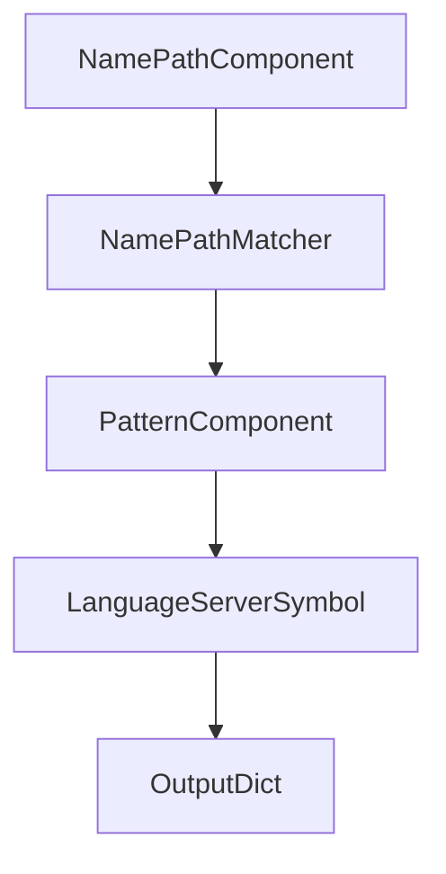

# Chapter 4: Language Backends and Analysis Strategy

Welcome to **Chapter 4: Language Backends and Analysis Strategy**. In this part of **Serena Tutorial: Semantic Code Retrieval Toolkit for Coding Agents**, you will build an intuitive mental model first, then move into concrete implementation details and practical production tradeoffs.


This chapter covers the backend choices that determine semantic quality and operational complexity.

## Learning Goals

- understand Serena's backend options
- choose between LSP and JetBrains-plugin pathways
- align backend choice with project language coverage
- avoid backend-related reliability pitfalls

## Backend Options

| Backend | Strengths | Tradeoffs |
|:--------|:----------|:----------|
| LSP-based analysis | open, broad language support | depends on per-language server setup |
| Serena JetBrains plugin | deep IDE-native analysis | requires JetBrains IDE environment |

Serena reports support for 30+ languages through its LSP abstraction.

## Selection Guidance

- choose LSP for cross-editor, infrastructure-friendly setups
- choose JetBrains plugin for strongest IDE-assisted semantics
- document required backend dependencies per language stack

## Source References

- [Language Support](https://oraios.github.io/serena/01-about/020_programming-languages.html)
- [Serena JetBrains Plugin](https://oraios.github.io/serena/02-usage/025_jetbrains_plugin.html)

## Summary

You now can select analysis backend strategy based on workflow, language set, and team environment.

Next: [Chapter 5: Project Workflow and Context Practices](05-project-workflow-and-context-practices.md)

## Depth Expansion Playbook

## Source Code Walkthrough

### `src/serena/symbol.py`

The `NamePathComponent` class in [`src/serena/symbol.py`](https://github.com/oraios/serena/blob/HEAD/src/serena/symbol.py) handles a key part of this chapter's functionality:

```py


class NamePathComponent:
    def __init__(self, name: str, overload_idx: int | None = None) -> None:
        self.name = name
        self.overload_idx = overload_idx

    def __repr__(self) -> str:
        if self.overload_idx is not None:
            return f"{self.name}[{self.overload_idx}]"
        else:
            return self.name


class NamePathMatcher(ToStringMixin):
    """
    Matches name paths of symbols against search patterns.

    A name path is a path in the symbol tree *within a source file*.
    For example, the method `my_method` defined in class `MyClass` would have the name path `MyClass/my_method`.
    If a symbol is overloaded (e.g., in Java), a 0-based index is appended (e.g. "MyClass/my_method[0]") to
    uniquely identify it.

    A matching pattern can be:
     * a simple name (e.g. "method"), which will match any symbol with that name
     * a relative path like "class/method", which will match any symbol with that name path suffix
     * an absolute name path "/class/method" (absolute name path), which requires an exact match of the full name path within the source file.
    Append an index `[i]` to match a specific overload only, e.g. "MyClass/my_method[1]".
    """

    class PatternComponent(NamePathComponent):
        @classmethod
```

This class is important because it defines how Serena Tutorial: Semantic Code Retrieval Toolkit for Coding Agents implements the patterns covered in this chapter.

### `src/serena/symbol.py`

The `NamePathMatcher` class in [`src/serena/symbol.py`](https://github.com/oraios/serena/blob/HEAD/src/serena/symbol.py) handles a key part of this chapter's functionality:

```py


class NamePathMatcher(ToStringMixin):
    """
    Matches name paths of symbols against search patterns.

    A name path is a path in the symbol tree *within a source file*.
    For example, the method `my_method` defined in class `MyClass` would have the name path `MyClass/my_method`.
    If a symbol is overloaded (e.g., in Java), a 0-based index is appended (e.g. "MyClass/my_method[0]") to
    uniquely identify it.

    A matching pattern can be:
     * a simple name (e.g. "method"), which will match any symbol with that name
     * a relative path like "class/method", which will match any symbol with that name path suffix
     * an absolute name path "/class/method" (absolute name path), which requires an exact match of the full name path within the source file.
    Append an index `[i]` to match a specific overload only, e.g. "MyClass/my_method[1]".
    """

    class PatternComponent(NamePathComponent):
        @classmethod
        def from_string(cls, component_str: str) -> Self:
            overload_idx = None
            if component_str.endswith("]") and "[" in component_str:
                bracket_idx = component_str.rfind("[")
                index_part = component_str[bracket_idx + 1 : -1]
                if index_part.isdigit():
                    component_str = component_str[:bracket_idx]
                    overload_idx = int(index_part)
            return cls(name=component_str, overload_idx=overload_idx)

        def matches(self, name_path_component: NamePathComponent, substring_matching: bool) -> bool:
            if substring_matching:
```

This class is important because it defines how Serena Tutorial: Semantic Code Retrieval Toolkit for Coding Agents implements the patterns covered in this chapter.

### `src/serena/symbol.py`

The `PatternComponent` class in [`src/serena/symbol.py`](https://github.com/oraios/serena/blob/HEAD/src/serena/symbol.py) handles a key part of this chapter's functionality:

```py
    """

    class PatternComponent(NamePathComponent):
        @classmethod
        def from_string(cls, component_str: str) -> Self:
            overload_idx = None
            if component_str.endswith("]") and "[" in component_str:
                bracket_idx = component_str.rfind("[")
                index_part = component_str[bracket_idx + 1 : -1]
                if index_part.isdigit():
                    component_str = component_str[:bracket_idx]
                    overload_idx = int(index_part)
            return cls(name=component_str, overload_idx=overload_idx)

        def matches(self, name_path_component: NamePathComponent, substring_matching: bool) -> bool:
            if substring_matching:
                if self.name not in name_path_component.name:
                    return False
            else:
                if self.name != name_path_component.name:
                    return False
            if self.overload_idx is not None and self.overload_idx != name_path_component.overload_idx:
                return False
            return True

    def __init__(self, name_path_pattern: str, substring_matching: bool) -> None:
        """
        :param name_path_pattern: the name path expression to match against
        :param substring_matching: whether to use substring matching for the last segment
        """
        assert name_path_pattern, "name_path must not be empty"
        self._expr = name_path_pattern
```

This class is important because it defines how Serena Tutorial: Semantic Code Retrieval Toolkit for Coding Agents implements the patterns covered in this chapter.

### `src/serena/symbol.py`

The `LanguageServerSymbol` class in [`src/serena/symbol.py`](https://github.com/oraios/serena/blob/HEAD/src/serena/symbol.py) handles a key part of this chapter's functionality:

```py

@dataclass
class LanguageServerSymbolLocation:
    """
    Represents the (start) location of a symbol identifier, which, within Serena, uniquely identifies the symbol.
    """

    relative_path: str | None
    """
    the relative path of the file containing the symbol; if None, the symbol is defined outside of the project's scope
    """
    line: int | None
    """
    the line number in which the symbol identifier is defined (if the symbol is a function, class, etc.);
    may be None for some types of symbols (e.g. SymbolKind.File)
    """
    column: int | None
    """
    the column number in which the symbol identifier is defined (if the symbol is a function, class, etc.);
    may be None for some types of symbols (e.g. SymbolKind.File)
    """

    def __post_init__(self) -> None:
        if self.relative_path is not None:
            self.relative_path = self.relative_path.replace("/", os.path.sep)

    def to_dict(self, include_relative_path: bool = True) -> dict[str, Any]:
        result = asdict(self)
        if not include_relative_path:
            result.pop("relative_path", None)
        return result

```

This class is important because it defines how Serena Tutorial: Semantic Code Retrieval Toolkit for Coding Agents implements the patterns covered in this chapter.


## How These Components Connect


