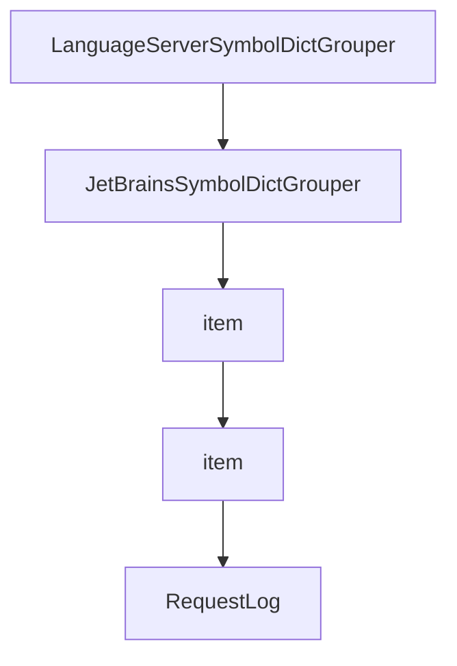

# Chapter 5: Project Workflow and Context Practices

Welcome to **Chapter 5: Project Workflow and Context Practices**. In this part of **Serena Tutorial: Semantic Code Retrieval Toolkit for Coding Agents**, you will build an intuitive mental model first, then move into concrete implementation details and practical production tradeoffs.


This chapter focuses on day-to-day operating habits that maximize Serena's value.

## Learning Goals

- apply Serena's project-based workflow model
- structure tasks to exploit semantic retrieval efficiently
- reduce unnecessary context churn in long sessions
- improve quality on large and strongly structured repos

## Workflow Practices

1. start each task with explicit objective + target module scope
2. retrieve symbols before editing full files
3. follow references before bulk refactors
4. validate changed symbols with focused tests

## Where Serena Helps Most

Serena is especially effective when:

- repositories are large and modular
- relationship tracking between symbols matters
- token budgets are constrained in long sessions

## Source References

- [Project Workflow](https://oraios.github.io/serena/02-usage/040_workflow.html)
- [Serena README: Community Feedback](https://github.com/oraios/serena/blob/main/README.md#community-feedback)

## Summary

You now have practical workflow patterns for getting consistent value from Serena.

Next: [Chapter 6: Configuration and Operational Controls](06-configuration-and-operational-controls.md)

## Depth Expansion Playbook

## Source Code Walkthrough

### `src/serena/symbol.py`

The `LanguageServerSymbolDictGrouper` class in [`src/serena/symbol.py`](https://github.com/oraios/serena/blob/HEAD/src/serena/symbol.py) handles a key part of this chapter's functionality:

```py


class LanguageServerSymbolDictGrouper(SymbolDictGrouper[LanguageServerSymbol.OutputDict]):
    def __init__(
        self,
        group_keys: list[LanguageServerSymbol.OutputDictKey],
        group_children_keys: list[LanguageServerSymbol.OutputDictKey],
        collapse_singleton: bool = False,
    ) -> None:
        super().__init__(LanguageServerSymbol.OutputDict, "children", group_keys, group_children_keys, collapse_singleton)


class JetBrainsSymbolDictGrouper(SymbolDictGrouper[jb.SymbolDTO]):
    def __init__(
        self,
        group_keys: list[jb.SymbolDTOKey],
        group_children_keys: list[jb.SymbolDTOKey],
        collapse_singleton: bool = False,
        map_name_path_to_name: bool = False,
    ) -> None:
        super().__init__(jb.SymbolDTO, "children", group_keys, group_children_keys, collapse_singleton)
        self._map_name_path_to_name = map_name_path_to_name

    def _transform_item(self, item: dict) -> dict:
        if self._map_name_path_to_name:
            # {"name_path: "Class/myMethod"} -> {"name: "myMethod"}
            new_item = dict(item)
            if "name_path" in item:
                name_path = new_item.pop("name_path")
                new_item["name"] = name_path.split("/")[-1]
            return super()._transform_item(new_item)
        else:
```

This class is important because it defines how Serena Tutorial: Semantic Code Retrieval Toolkit for Coding Agents implements the patterns covered in this chapter.

### `src/serena/symbol.py`

The `JetBrainsSymbolDictGrouper` class in [`src/serena/symbol.py`](https://github.com/oraios/serena/blob/HEAD/src/serena/symbol.py) handles a key part of this chapter's functionality:

```py


class JetBrainsSymbolDictGrouper(SymbolDictGrouper[jb.SymbolDTO]):
    def __init__(
        self,
        group_keys: list[jb.SymbolDTOKey],
        group_children_keys: list[jb.SymbolDTOKey],
        collapse_singleton: bool = False,
        map_name_path_to_name: bool = False,
    ) -> None:
        super().__init__(jb.SymbolDTO, "children", group_keys, group_children_keys, collapse_singleton)
        self._map_name_path_to_name = map_name_path_to_name

    def _transform_item(self, item: dict) -> dict:
        if self._map_name_path_to_name:
            # {"name_path: "Class/myMethod"} -> {"name: "myMethod"}
            new_item = dict(item)
            if "name_path" in item:
                name_path = new_item.pop("name_path")
                new_item["name"] = name_path.split("/")[-1]
            return super()._transform_item(new_item)
        else:
            return super()._transform_item(item)

```

This class is important because it defines how Serena Tutorial: Semantic Code Retrieval Toolkit for Coding Agents implements the patterns covered in this chapter.

### `src/serena/symbol.py`

The `item` interface in [`src/serena/symbol.py`](https://github.com/oraios/serena/blob/HEAD/src/serena/symbol.py) handles a key part of this chapter's functionality:

```py
    def symbol_kind_name(self) -> str:
        """
        :return: string representation of the symbol kind (name attribute of the `SymbolKind` enum item)
        """
        return SymbolKind(self.symbol_kind).name

    @property
    def symbol_kind(self) -> SymbolKind:
        return self.symbol_root["kind"]

    def is_low_level(self) -> bool:
        """
        :return: whether the symbol is a low-level symbol (variable, constant, etc.), which typically represents data
            rather than structure and therefore is not relevant in a high-level overview of the code.
        """
        return self.symbol_kind >= SymbolKind.Variable.value

    @property
    def overload_idx(self) -> int | None:
        return self.symbol_root.get("overload_idx")

    def is_neighbouring_definition_separated_by_empty_line(self) -> bool:
        return self.symbol_kind in (SymbolKind.Function, SymbolKind.Method, SymbolKind.Class, SymbolKind.Interface, SymbolKind.Struct)

    @property
    def relative_path(self) -> str | None:
        location = self.symbol_root.get("location")
        if location:
            return location.get("relativePath")
        return None

    @property
```

This interface is important because it defines how Serena Tutorial: Semantic Code Retrieval Toolkit for Coding Agents implements the patterns covered in this chapter.

### `src/serena/symbol.py`

The `item` interface in [`src/serena/symbol.py`](https://github.com/oraios/serena/blob/HEAD/src/serena/symbol.py) handles a key part of this chapter's functionality:

```py
    def symbol_kind_name(self) -> str:
        """
        :return: string representation of the symbol kind (name attribute of the `SymbolKind` enum item)
        """
        return SymbolKind(self.symbol_kind).name

    @property
    def symbol_kind(self) -> SymbolKind:
        return self.symbol_root["kind"]

    def is_low_level(self) -> bool:
        """
        :return: whether the symbol is a low-level symbol (variable, constant, etc.), which typically represents data
            rather than structure and therefore is not relevant in a high-level overview of the code.
        """
        return self.symbol_kind >= SymbolKind.Variable.value

    @property
    def overload_idx(self) -> int | None:
        return self.symbol_root.get("overload_idx")

    def is_neighbouring_definition_separated_by_empty_line(self) -> bool:
        return self.symbol_kind in (SymbolKind.Function, SymbolKind.Method, SymbolKind.Class, SymbolKind.Interface, SymbolKind.Struct)

    @property
    def relative_path(self) -> str | None:
        location = self.symbol_root.get("location")
        if location:
            return location.get("relativePath")
        return None

    @property
```

This interface is important because it defines how Serena Tutorial: Semantic Code Retrieval Toolkit for Coding Agents implements the patterns covered in this chapter.


## How These Components Connect


