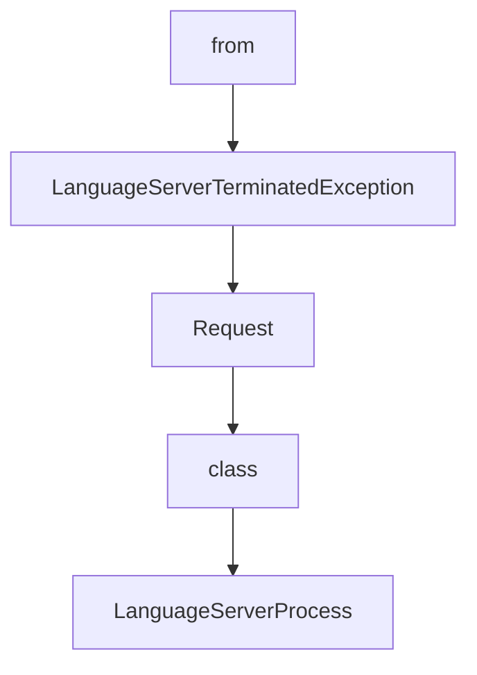

# Chapter 5: Project Workflow and Context Practices

Welcome to **Chapter 5: Project Workflow and Context Practices**. In this part of **Serena Tutorial: Semantic Code Retrieval Toolkit for Coding Agents**, you will build an intuitive mental model first, then move into concrete implementation details and practical production tradeoffs.


This chapter focuses on day-to-day operating habits that maximize Serena's value.

## Learning Goals

- apply Serena's project-based workflow model
- structure tasks to exploit semantic retrieval efficiently
- reduce unnecessary context churn in long sessions
- improve quality on large and strongly structured repos

## Workflow Practices

1. start each task with explicit objective + target module scope
2. retrieve symbols before editing full files
3. follow references before bulk refactors
4. validate changed symbols with focused tests

## Where Serena Helps Most

Serena is especially effective when:

- repositories are large and modular
- relationship tracking between symbols matters
- token budgets are constrained in long sessions

## Source References

- [Project Workflow](https://oraios.github.io/serena/02-usage/040_workflow.html)
- [Serena README: Community Feedback](https://github.com/oraios/serena/blob/main/README.md#community-feedback)

## Summary

You now have practical workflow patterns for getting consistent value from Serena.

Next: [Chapter 6: Configuration and Operational Controls](06-configuration-and-operational-controls.md)

## Source Code Walkthrough

### `src/solidlsp/ls_process.py`

The `from` class in [`src/solidlsp/ls_process.py`](https://github.com/oraios/serena/blob/HEAD/src/solidlsp/ls_process.py) handles a key part of this chapter's functionality:

```py
import threading
import time
from collections.abc import Callable
from dataclasses import dataclass
from queue import Empty, Queue
from typing import Any

import psutil
from sensai.util.string import ToStringMixin

from solidlsp.ls_config import Language
from solidlsp.ls_exceptions import SolidLSPException
from solidlsp.ls_request import LanguageServerRequest
from solidlsp.lsp_protocol_handler.lsp_requests import LspNotification
from solidlsp.lsp_protocol_handler.lsp_types import ErrorCodes
from solidlsp.lsp_protocol_handler.server import (
    ENCODING,
    LSPError,
    PayloadLike,
    ProcessLaunchInfo,
    StringDict,
    content_length,
    create_message,
    make_error_response,
    make_notification,
    make_request,
    make_response,
)
from solidlsp.util.subprocess_util import quote_arg, subprocess_kwargs

log = logging.getLogger(__name__)

```

This class is important because it defines how Serena Tutorial: Semantic Code Retrieval Toolkit for Coding Agents implements the patterns covered in this chapter.

### `src/solidlsp/ls_process.py`

The `LanguageServerTerminatedException` class in [`src/solidlsp/ls_process.py`](https://github.com/oraios/serena/blob/HEAD/src/solidlsp/ls_process.py) handles a key part of this chapter's functionality:

```py


class LanguageServerTerminatedException(Exception):
    """
    Exception raised when the language server process has terminated unexpectedly.
    """

    def __init__(self, message: str, language: Language, cause: Exception | None = None) -> None:
        super().__init__(message)
        self.message = message
        self.language = language
        self.cause = cause

    def __str__(self) -> str:
        return f"LanguageServerTerminatedException: {self.message}" + (f"; Cause: {self.cause}" if self.cause else "")


class Request(ToStringMixin):
    @dataclass
    class Result:
        payload: PayloadLike | None = None
        error: Exception | None = None

        def is_error(self) -> bool:
            return self.error is not None

    def __init__(self, request_id: int, method: str) -> None:
        self._request_id = request_id
        self._method = method
        self._status = "pending"
        self._result_queue: Queue[Request.Result] = Queue()

```

This class is important because it defines how Serena Tutorial: Semantic Code Retrieval Toolkit for Coding Agents implements the patterns covered in this chapter.

### `src/solidlsp/ls_process.py`

The `Request` class in [`src/solidlsp/ls_process.py`](https://github.com/oraios/serena/blob/HEAD/src/solidlsp/ls_process.py) handles a key part of this chapter's functionality:

```py
from solidlsp.ls_config import Language
from solidlsp.ls_exceptions import SolidLSPException
from solidlsp.ls_request import LanguageServerRequest
from solidlsp.lsp_protocol_handler.lsp_requests import LspNotification
from solidlsp.lsp_protocol_handler.lsp_types import ErrorCodes
from solidlsp.lsp_protocol_handler.server import (
    ENCODING,
    LSPError,
    PayloadLike,
    ProcessLaunchInfo,
    StringDict,
    content_length,
    create_message,
    make_error_response,
    make_notification,
    make_request,
    make_response,
)
from solidlsp.util.subprocess_util import quote_arg, subprocess_kwargs

log = logging.getLogger(__name__)


class LanguageServerTerminatedException(Exception):
    """
    Exception raised when the language server process has terminated unexpectedly.
    """

    def __init__(self, message: str, language: Language, cause: Exception | None = None) -> None:
        super().__init__(message)
        self.message = message
        self.language = language
```

This class is important because it defines how Serena Tutorial: Semantic Code Retrieval Toolkit for Coding Agents implements the patterns covered in this chapter.

### `src/solidlsp/ls_process.py`

The `class` class in [`src/solidlsp/ls_process.py`](https://github.com/oraios/serena/blob/HEAD/src/solidlsp/ls_process.py) handles a key part of this chapter's functionality:

```py
import time
from collections.abc import Callable
from dataclasses import dataclass
from queue import Empty, Queue
from typing import Any

import psutil
from sensai.util.string import ToStringMixin

from solidlsp.ls_config import Language
from solidlsp.ls_exceptions import SolidLSPException
from solidlsp.ls_request import LanguageServerRequest
from solidlsp.lsp_protocol_handler.lsp_requests import LspNotification
from solidlsp.lsp_protocol_handler.lsp_types import ErrorCodes
from solidlsp.lsp_protocol_handler.server import (
    ENCODING,
    LSPError,
    PayloadLike,
    ProcessLaunchInfo,
    StringDict,
    content_length,
    create_message,
    make_error_response,
    make_notification,
    make_request,
    make_response,
)
from solidlsp.util.subprocess_util import quote_arg, subprocess_kwargs

log = logging.getLogger(__name__)


```

This class is important because it defines how Serena Tutorial: Semantic Code Retrieval Toolkit for Coding Agents implements the patterns covered in this chapter.


## How These Components Connect


