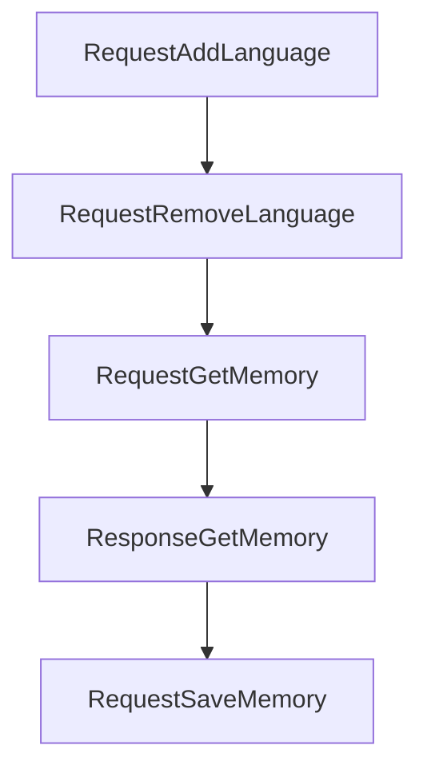

# Chapter 6: Configuration and Operational Controls

Welcome to **Chapter 6: Configuration and Operational Controls**. In this part of **Serena Tutorial: Semantic Code Retrieval Toolkit for Coding Agents**, you will build an intuitive mental model first, then move into concrete implementation details and practical production tradeoffs.


This chapter covers configuration strategy for reliability, reproducibility, and team-scale use.

## Learning Goals

- identify key Serena configuration surfaces
- separate local experimentation from team defaults
- standardize launch settings across clients
- reduce configuration drift across projects

## Configuration Model

| Concern | Recommendation |
|:--------|:---------------|
| client launch command | version-pin and template in team docs |
| backend dependencies | declare per-language prerequisites |
| project settings | keep project-local settings close to repo conventions |
| upgrades | review changelog before broad rollout |

## Operational Safeguards

- validate new Serena versions in pilot repositories first
- keep client integration instructions versioned
- maintain a known-good setup profile for onboarding

## Source References

- [Serena Configuration Docs](https://oraios.github.io/serena/02-usage/050_configuration.html)
- [Serena Changelog](https://github.com/oraios/serena/blob/main/CHANGELOG.md)

## Summary

You now have a configuration governance baseline for Serena deployments.

Next: [Chapter 7: Extending Serena and Custom Agent Integration](07-extending-serena-and-custom-agent-integration.md)

## Depth Expansion Playbook

## Source Code Walkthrough

### `src/serena/dashboard.py`

The `RequestAddLanguage` class in [`src/serena/dashboard.py`](https://github.com/oraios/serena/blob/HEAD/src/serena/dashboard.py) handles a key part of this chapter's functionality:

```py


class RequestAddLanguage(BaseModel):
    language: str


class RequestRemoveLanguage(BaseModel):
    language: str


class RequestGetMemory(BaseModel):
    memory_name: str


class ResponseGetMemory(BaseModel):
    content: str
    memory_name: str


class RequestSaveMemory(BaseModel):
    memory_name: str
    content: str


class RequestDeleteMemory(BaseModel):
    memory_name: str


class RequestRenameMemory(BaseModel):
    old_name: str
    new_name: str

```

This class is important because it defines how Serena Tutorial: Semantic Code Retrieval Toolkit for Coding Agents implements the patterns covered in this chapter.

### `src/serena/dashboard.py`

The `RequestRemoveLanguage` class in [`src/serena/dashboard.py`](https://github.com/oraios/serena/blob/HEAD/src/serena/dashboard.py) handles a key part of this chapter's functionality:

```py


class RequestRemoveLanguage(BaseModel):
    language: str


class RequestGetMemory(BaseModel):
    memory_name: str


class ResponseGetMemory(BaseModel):
    content: str
    memory_name: str


class RequestSaveMemory(BaseModel):
    memory_name: str
    content: str


class RequestDeleteMemory(BaseModel):
    memory_name: str


class RequestRenameMemory(BaseModel):
    old_name: str
    new_name: str


class ResponseGetSerenaConfig(BaseModel):
    content: str

```

This class is important because it defines how Serena Tutorial: Semantic Code Retrieval Toolkit for Coding Agents implements the patterns covered in this chapter.

### `src/serena/dashboard.py`

The `RequestGetMemory` class in [`src/serena/dashboard.py`](https://github.com/oraios/serena/blob/HEAD/src/serena/dashboard.py) handles a key part of this chapter's functionality:

```py


class RequestGetMemory(BaseModel):
    memory_name: str


class ResponseGetMemory(BaseModel):
    content: str
    memory_name: str


class RequestSaveMemory(BaseModel):
    memory_name: str
    content: str


class RequestDeleteMemory(BaseModel):
    memory_name: str


class RequestRenameMemory(BaseModel):
    old_name: str
    new_name: str


class ResponseGetSerenaConfig(BaseModel):
    content: str


class RequestSaveSerenaConfig(BaseModel):
    content: str

```

This class is important because it defines how Serena Tutorial: Semantic Code Retrieval Toolkit for Coding Agents implements the patterns covered in this chapter.

### `src/serena/dashboard.py`

The `ResponseGetMemory` class in [`src/serena/dashboard.py`](https://github.com/oraios/serena/blob/HEAD/src/serena/dashboard.py) handles a key part of this chapter's functionality:

```py


class ResponseGetMemory(BaseModel):
    content: str
    memory_name: str


class RequestSaveMemory(BaseModel):
    memory_name: str
    content: str


class RequestDeleteMemory(BaseModel):
    memory_name: str


class RequestRenameMemory(BaseModel):
    old_name: str
    new_name: str


class ResponseGetSerenaConfig(BaseModel):
    content: str


class RequestSaveSerenaConfig(BaseModel):
    content: str


class RequestCancelTaskExecution(BaseModel):
    task_id: int

```

This class is important because it defines how Serena Tutorial: Semantic Code Retrieval Toolkit for Coding Agents implements the patterns covered in this chapter.


## How These Components Connect


