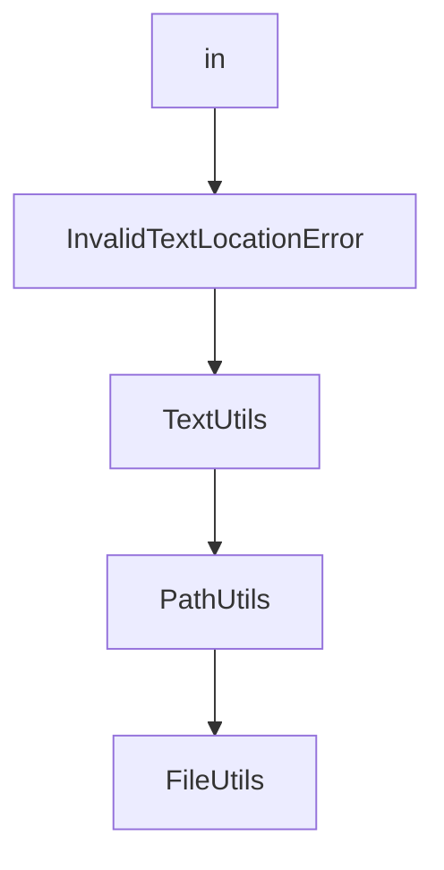

# Chapter 6: Configuration and Operational Controls

Welcome to **Chapter 6: Configuration and Operational Controls**. In this part of **Serena Tutorial: Semantic Code Retrieval Toolkit for Coding Agents**, you will build an intuitive mental model first, then move into concrete implementation details and practical production tradeoffs.


This chapter covers configuration strategy for reliability, reproducibility, and team-scale use.

## Learning Goals

- identify key Serena configuration surfaces
- separate local experimentation from team defaults
- standardize launch settings across clients
- reduce configuration drift across projects

## Configuration Model

| Concern | Recommendation |
|:--------|:---------------|
| client launch command | version-pin and template in team docs |
| backend dependencies | declare per-language prerequisites |
| project settings | keep project-local settings close to repo conventions |
| upgrades | review changelog before broad rollout |

## Operational Safeguards

- validate new Serena versions in pilot repositories first
- keep client integration instructions versioned
- maintain a known-good setup profile for onboarding

## Source References

- [Serena Configuration Docs](https://oraios.github.io/serena/02-usage/050_configuration.html)
- [Serena Changelog](https://github.com/oraios/serena/blob/main/CHANGELOG.md)

## Summary

You now have a configuration governance baseline for Serena deployments.

Next: [Chapter 7: Extending Serena and Custom Agent Integration](07-extending-serena-and-custom-agent-integration.md)

## Source Code Walkthrough

### `src/serena/agent.py`

The `in` class in [`src/serena/agent.py`](https://github.com/oraios/serena/blob/HEAD/src/serena/agent.py) handles a key part of this chapter's functionality:

```py

import json
import multiprocessing
import os
import platform
import subprocess
import sys
from collections.abc import Callable, Iterator, Sequence
from contextlib import contextmanager
from logging import Logger
from typing import TYPE_CHECKING, Optional, TypeVar

import webview
from sensai.util import logging
from sensai.util.logging import LogTime
from sensai.util.string import dict_string

from interprompt.jinja_template import JinjaTemplate
from serena import serena_version
from serena.analytics import RegisteredTokenCountEstimator, ToolUsageStats
from serena.config.context_mode import SerenaAgentContext, SerenaAgentMode
from serena.config.serena_config import (
    LanguageBackend,
    ModeSelectionDefinition,
    NamedToolInclusionDefinition,
    RegisteredProject,
    SerenaConfig,
    SerenaPaths,
    ToolInclusionDefinition,
)
from serena.dashboard import SerenaDashboardAPI, SerenaDashboardViewer
from serena.ls_manager import LanguageServerManager
```

This class is important because it defines how Serena Tutorial: Semantic Code Retrieval Toolkit for Coding Agents implements the patterns covered in this chapter.

### `src/solidlsp/ls_utils.py`

The `InvalidTextLocationError` class in [`src/solidlsp/ls_utils.py`](https://github.com/oraios/serena/blob/HEAD/src/solidlsp/ls_utils.py) handles a key part of this chapter's functionality:

```py


class InvalidTextLocationError(Exception):
    pass


class TextUtils:
    """
    Utilities for text operations.
    """

    @staticmethod
    def get_line_col_from_index(text: str, index: int) -> tuple[int, int]:
        """
        Returns the zero-indexed line and column number of the given index in the given text
        """
        l = 0
        c = 0
        idx = 0
        while idx < index:
            if text[idx] == "\n":
                l += 1
                c = 0
            else:
                c += 1
            idx += 1

        return l, c

    @staticmethod
    def get_index_from_line_col(text: str, line: int, col: int) -> int:
        """
```

This class is important because it defines how Serena Tutorial: Semantic Code Retrieval Toolkit for Coding Agents implements the patterns covered in this chapter.

### `src/solidlsp/ls_utils.py`

The `TextUtils` class in [`src/solidlsp/ls_utils.py`](https://github.com/oraios/serena/blob/HEAD/src/solidlsp/ls_utils.py) handles a key part of this chapter's functionality:

```py


class TextUtils:
    """
    Utilities for text operations.
    """

    @staticmethod
    def get_line_col_from_index(text: str, index: int) -> tuple[int, int]:
        """
        Returns the zero-indexed line and column number of the given index in the given text
        """
        l = 0
        c = 0
        idx = 0
        while idx < index:
            if text[idx] == "\n":
                l += 1
                c = 0
            else:
                c += 1
            idx += 1

        return l, c

    @staticmethod
    def get_index_from_line_col(text: str, line: int, col: int) -> int:
        """
        Returns the index of the given zero-indexed line and column number in the given text
        """
        idx = 0
        while line > 0:
```

This class is important because it defines how Serena Tutorial: Semantic Code Retrieval Toolkit for Coding Agents implements the patterns covered in this chapter.

### `src/solidlsp/ls_utils.py`

The `PathUtils` class in [`src/solidlsp/ls_utils.py`](https://github.com/oraios/serena/blob/HEAD/src/solidlsp/ls_utils.py) handles a key part of this chapter's functionality:

```py


class PathUtils:
    """
    Utilities for platform-agnostic path operations.
    """

    @staticmethod
    def uri_to_path(uri: str) -> str:
        """
        Converts a URI to a file path. Works on both Linux and Windows.

        This method was obtained from https://stackoverflow.com/a/61922504
        """
        try:
            from urllib.parse import unquote, urlparse
            from urllib.request import url2pathname
        except ImportError:
            # backwards compatibility (Python 2)
            from urllib.parse import unquote as unquote_py2
            from urllib.request import url2pathname as url2pathname_py2

            from urlparse import urlparse as urlparse_py2

            unquote = unquote_py2
            url2pathname = url2pathname_py2
            urlparse = urlparse_py2
        parsed = urlparse(uri)
        host = f"{os.path.sep}{os.path.sep}{parsed.netloc}{os.path.sep}"
        path = os.path.normpath(os.path.join(host, url2pathname(unquote(parsed.path))))
        return path

```

This class is important because it defines how Serena Tutorial: Semantic Code Retrieval Toolkit for Coding Agents implements the patterns covered in this chapter.


## How These Components Connect


