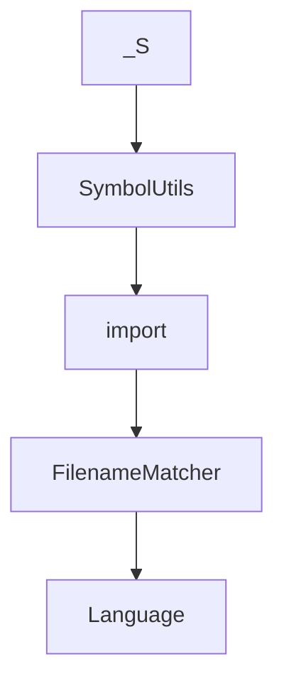

# Chapter 7: Extending Serena and Custom Agent Integration

Welcome to **Chapter 7: Extending Serena and Custom Agent Integration**. In this part of **Serena Tutorial: Semantic Code Retrieval Toolkit for Coding Agents**, you will build an intuitive mental model first, then move into concrete implementation details and practical production tradeoffs.


This chapter targets advanced users integrating Serena into custom frameworks or extending tool capabilities.

## Learning Goals

- integrate Serena tools into custom agent frameworks
- understand extension points for adding new tools
- map custom additions to existing workflow patterns
- preserve stability while extending functionality

## Integration Paths

| Path | Best For |
|:-----|:---------|
| MCP server mode | rapid use with existing clients |
| OpenAPI bridge via mcpo | clients without MCP support |
| direct framework integration | custom agent stacks requiring deeper control |

## Extension Pattern

Serena documents tool extension via subclassing and implementing tool behavior methods, enabling custom AI capabilities tied to your code domain.

## Source References

- [Custom Agent Guide](https://github.com/oraios/serena/blob/main/docs/03-special-guides/custom_agent.md)
- [Serena on ChatGPT via mcpo](https://github.com/oraios/serena/blob/main/docs/03-special-guides/serena_on_chatgpt.md)
- [Extending Serena](https://github.com/oraios/serena/blob/main/README.md#customizing-and-extending-serena)

## Summary

You now know how to plug Serena into bespoke agent systems and extend it safely.

Next: [Chapter 8: Production Operations and Governance](08-production-operations-and-governance.md)

## Source Code Walkthrough

### `src/solidlsp/ls_utils.py`

The `_S` class in [`src/solidlsp/ls_utils.py`](https://github.com/oraios/serena/blob/HEAD/src/solidlsp/ls_utils.py) handles a key part of this chapter's functionality:

```py
                    shutil.copyfileobj(source_file, output_file)

                ZIP_SYSTEM_UNIX = 3
                if zip_info.create_system == ZIP_SYSTEM_UNIX:
                    attrs = (zip_info.external_attr >> 16) & 0o777
                    if attrs:
                        os.chmod(extracted_path, attrs)

    @staticmethod
    def _extract_tar_archive(archive_path: str, target_path: str, archive_type: str) -> None:
        """
        Extracts a tar archive safely into the target directory.
        """
        archive_mode_by_type = {
            "tar": "r:",
            "gztar": "r:gz",
            "bztar": "r:bz2",
            "xztar": "r:xz",
        }
        tar_mode = cast(Literal["r:", "r:gz", "r:bz2", "r:xz"], archive_mode_by_type[archive_type])

        with tarfile.open(archive_path, tar_mode) as tar_ref:
            for tar_member in tar_ref.getmembers():
                FileUtils._validate_extraction_path(tar_member.name, target_path)

            tar_ref.extractall(target_path)


class PlatformId(str, Enum):
    WIN_x86 = "win-x86"
    WIN_x64 = "win-x64"
    WIN_arm64 = "win-arm64"
```

This class is important because it defines how Serena Tutorial: Semantic Code Retrieval Toolkit for Coding Agents implements the patterns covered in this chapter.

### `src/solidlsp/ls_utils.py`

The `SymbolUtils` class in [`src/solidlsp/ls_utils.py`](https://github.com/oraios/serena/blob/HEAD/src/solidlsp/ls_utils.py) handles a key part of this chapter's functionality:

```py


class SymbolUtils:
    @staticmethod
    def symbol_tree_contains_name(roots: list[UnifiedSymbolInformation], name: str) -> bool:
        """
        Check if any symbol in the tree has a name matching the given name.
        """
        for symbol in roots:
            if symbol["name"] == name:
                return True
            if SymbolUtils.symbol_tree_contains_name(symbol["children"], name):
                return True
        return False

```

This class is important because it defines how Serena Tutorial: Semantic Code Retrieval Toolkit for Coding Agents implements the patterns covered in this chapter.

### `src/solidlsp/ls_utils.py`

The `import` interface in [`src/solidlsp/ls_utils.py`](https://github.com/oraios/serena/blob/HEAD/src/solidlsp/ls_utils.py) handles a key part of this chapter's functionality:

```py
"""

import gzip
import hashlib
import logging
import os
import platform
import shutil
import subprocess
import tarfile
import uuid
import zipfile
from enum import Enum
from pathlib import Path, PurePath
from typing import Literal, cast
from urllib.parse import urlparse

import charset_normalizer
import requests

from solidlsp.ls_exceptions import SolidLSPException
from solidlsp.ls_types import UnifiedSymbolInformation

log = logging.getLogger(__name__)


class InvalidTextLocationError(Exception):
    pass


class TextUtils:
    """
```

This interface is important because it defines how Serena Tutorial: Semantic Code Retrieval Toolkit for Coding Agents implements the patterns covered in this chapter.

### `src/solidlsp/ls_config.py`

The `FilenameMatcher` class in [`src/solidlsp/ls_config.py`](https://github.com/oraios/serena/blob/HEAD/src/solidlsp/ls_config.py) handles a key part of this chapter's functionality:

```py


class FilenameMatcher:
    def __init__(self, *patterns: str) -> None:
        """
        :param patterns: fnmatch-compatible patterns
        """
        self.patterns = patterns

    def is_relevant_filename(self, fn: str) -> bool:
        for pattern in self.patterns:
            if fnmatch.fnmatch(fn, pattern):
                return True
        return False


class Language(str, Enum):
    """
    Enumeration of language servers supported by SolidLSP.
    """

    CSHARP = "csharp"
    PYTHON = "python"
    RUST = "rust"
    JAVA = "java"
    KOTLIN = "kotlin"
    TYPESCRIPT = "typescript"
    GO = "go"
    RUBY = "ruby"
    DART = "dart"
    CPP = "cpp"
    CPP_CCLS = "cpp_ccls"
```

This class is important because it defines how Serena Tutorial: Semantic Code Retrieval Toolkit for Coding Agents implements the patterns covered in this chapter.


## How These Components Connect


