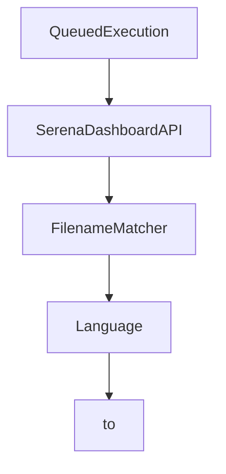

# Chapter 7: Extending Serena and Custom Agent Integration

Welcome to **Chapter 7: Extending Serena and Custom Agent Integration**. In this part of **Serena Tutorial: Semantic Code Retrieval Toolkit for Coding Agents**, you will build an intuitive mental model first, then move into concrete implementation details and practical production tradeoffs.


This chapter targets advanced users integrating Serena into custom frameworks or extending tool capabilities.

## Learning Goals

- integrate Serena tools into custom agent frameworks
- understand extension points for adding new tools
- map custom additions to existing workflow patterns
- preserve stability while extending functionality

## Integration Paths

| Path | Best For |
|:-----|:---------|
| MCP server mode | rapid use with existing clients |
| OpenAPI bridge via mcpo | clients without MCP support |
| direct framework integration | custom agent stacks requiring deeper control |

## Extension Pattern

Serena documents tool extension via subclassing and implementing tool behavior methods, enabling custom AI capabilities tied to your code domain.

## Source References

- [Custom Agent Guide](https://github.com/oraios/serena/blob/main/docs/03-special-guides/custom_agent.md)
- [Serena on ChatGPT via mcpo](https://github.com/oraios/serena/blob/main/docs/03-special-guides/serena_on_chatgpt.md)
- [Extending Serena](https://github.com/oraios/serena/blob/main/README.md#customizing-and-extending-serena)

## Summary

You now know how to plug Serena into bespoke agent systems and extend it safely.

Next: [Chapter 8: Production Operations and Governance](08-production-operations-and-governance.md)

## Depth Expansion Playbook

## Source Code Walkthrough

### `src/serena/dashboard.py`

The `QueuedExecution` class in [`src/serena/dashboard.py`](https://github.com/oraios/serena/blob/HEAD/src/serena/dashboard.py) handles a key part of this chapter's functionality:

```py


class QueuedExecution(BaseModel):
    task_id: int
    is_running: bool
    name: str
    finished_successfully: bool
    logged: bool

    @classmethod
    def from_task_info(cls, task_info: TaskExecutor.TaskInfo) -> Self:
        return cls(
            task_id=task_info.task_id,
            is_running=task_info.is_running,
            name=task_info.name,
            finished_successfully=task_info.finished_successfully(),
            logged=task_info.logged,
        )


class SerenaDashboardAPI:
    log = logging.getLogger(__qualname__)

    def __init__(
        self,
        memory_log_handler: MemoryLogHandler,
        tool_names: list[str],
        agent: "SerenaAgent",
        shutdown_callback: Callable[[], None] | None = None,
        tool_usage_stats: ToolUsageStats | None = None,
    ) -> None:
        self._memory_log_handler = memory_log_handler
```

This class is important because it defines how Serena Tutorial: Semantic Code Retrieval Toolkit for Coding Agents implements the patterns covered in this chapter.

### `src/serena/dashboard.py`

The `SerenaDashboardAPI` class in [`src/serena/dashboard.py`](https://github.com/oraios/serena/blob/HEAD/src/serena/dashboard.py) handles a key part of this chapter's functionality:

```py


class SerenaDashboardAPI:
    log = logging.getLogger(__qualname__)

    def __init__(
        self,
        memory_log_handler: MemoryLogHandler,
        tool_names: list[str],
        agent: "SerenaAgent",
        shutdown_callback: Callable[[], None] | None = None,
        tool_usage_stats: ToolUsageStats | None = None,
    ) -> None:
        self._memory_log_handler = memory_log_handler
        self._tool_names = tool_names
        self._agent = agent
        self._shutdown_callback = shutdown_callback
        self._app = Flask(__name__)
        self._tool_usage_stats = tool_usage_stats
        self._setup_routes()

    @property
    def memory_log_handler(self) -> MemoryLogHandler:
        return self._memory_log_handler

    def _setup_routes(self) -> None:
        # Static files
        @self._app.route("/dashboard/<path:filename>")
        def serve_dashboard(filename: str) -> Response:
            return send_from_directory(SERENA_DASHBOARD_DIR, filename)

        @self._app.route("/dashboard/")
```

This class is important because it defines how Serena Tutorial: Semantic Code Retrieval Toolkit for Coding Agents implements the patterns covered in this chapter.

### `src/solidlsp/ls_config.py`

The `FilenameMatcher` class in [`src/solidlsp/ls_config.py`](https://github.com/oraios/serena/blob/HEAD/src/solidlsp/ls_config.py) handles a key part of this chapter's functionality:

```py


class FilenameMatcher:
    def __init__(self, *patterns: str) -> None:
        """
        :param patterns: fnmatch-compatible patterns
        """
        self.patterns = patterns

    def is_relevant_filename(self, fn: str) -> bool:
        for pattern in self.patterns:
            if fnmatch.fnmatch(fn, pattern):
                return True
        return False


class Language(str, Enum):
    """
    Enumeration of language servers supported by SolidLSP.
    """

    CSHARP = "csharp"
    PYTHON = "python"
    RUST = "rust"
    JAVA = "java"
    KOTLIN = "kotlin"
    TYPESCRIPT = "typescript"
    GO = "go"
    RUBY = "ruby"
    DART = "dart"
    CPP = "cpp"
    CPP_CCLS = "cpp_ccls"
```

This class is important because it defines how Serena Tutorial: Semantic Code Retrieval Toolkit for Coding Agents implements the patterns covered in this chapter.

### `src/solidlsp/ls_config.py`

The `Language` class in [`src/solidlsp/ls_config.py`](https://github.com/oraios/serena/blob/HEAD/src/solidlsp/ls_config.py) handles a key part of this chapter's functionality:

```py

if TYPE_CHECKING:
    from solidlsp import SolidLanguageServer


class FilenameMatcher:
    def __init__(self, *patterns: str) -> None:
        """
        :param patterns: fnmatch-compatible patterns
        """
        self.patterns = patterns

    def is_relevant_filename(self, fn: str) -> bool:
        for pattern in self.patterns:
            if fnmatch.fnmatch(fn, pattern):
                return True
        return False


class Language(str, Enum):
    """
    Enumeration of language servers supported by SolidLSP.
    """

    CSHARP = "csharp"
    PYTHON = "python"
    RUST = "rust"
    JAVA = "java"
    KOTLIN = "kotlin"
    TYPESCRIPT = "typescript"
    GO = "go"
    RUBY = "ruby"
```

This class is important because it defines how Serena Tutorial: Semantic Code Retrieval Toolkit for Coding Agents implements the patterns covered in this chapter.


## How These Components Connect


