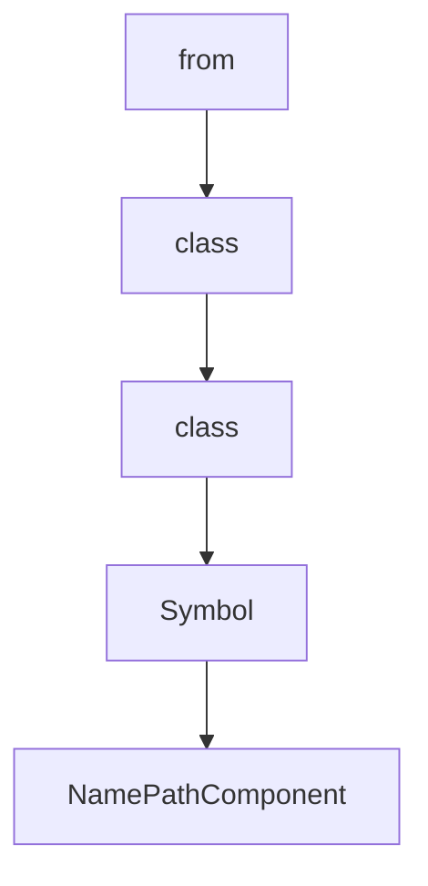

# Chapter 8: Production Operations and Governance

Welcome to **Chapter 8: Production Operations and Governance**. In this part of **Serena Tutorial: Semantic Code Retrieval Toolkit for Coding Agents**, you will build an intuitive mental model first, then move into concrete implementation details and practical production tradeoffs.


This chapter provides a practical rollout model for Serena in high-stakes engineering environments.

## Learning Goals

- define phased adoption for Serena across teams
- align Serena with internal coding-agent safety policies
- establish cadence for upgrades and regression checks
- maintain high quality in large codebase operations

## Rollout Plan

1. pilot on medium-size repository with clear regression suite
2. validate semantic workflow improvements against baseline tooling
3. publish standard client integration + config templates
4. roll out to additional repos with periodic review checkpoints

## Governance Checklist

| Area | Baseline |
|:-----|:---------|
| versioning | pin and review before upgrades |
| integrations | maintain approved client setup matrix |
| backend deps | verify language-server/IDE prerequisites |
| quality | monitor token use, edit precision, and test pass rate |

## Source References

- [Serena Roadmap](https://github.com/oraios/serena/blob/main/roadmap.md)
- [Serena Lessons Learned](https://github.com/oraios/serena/blob/main/lessons_learned.md)
- [Serena Governance Signals via Changelog](https://github.com/oraios/serena/blob/main/CHANGELOG.md)

## Summary

You now have a complete operational model for deploying Serena as a production-grade capability layer.

Continue with the [Onlook Tutorial](../onlook-tutorial/) for visual-first coding workflows.

## Source Code Walkthrough

### `src/serena/symbol.py`

The `from` class in [`src/serena/symbol.py`](https://github.com/oraios/serena/blob/HEAD/src/serena/symbol.py) handles a key part of this chapter's functionality:

```py
import logging
import os
from abc import ABC, abstractmethod
from collections.abc import Callable, Iterable, Iterator, Sequence
from dataclasses import asdict, dataclass
from time import perf_counter
from typing import Any, Generic, Literal, NotRequired, Self, TypedDict, TypeVar

from sensai.util.string import ToStringMixin

import serena.jetbrains.jetbrains_types as jb
from solidlsp import SolidLanguageServer
from solidlsp.ls import LSPFileBuffer
from solidlsp.ls import ReferenceInSymbol as LSPReferenceInSymbol
from solidlsp.ls_types import Position, SymbolKind, UnifiedSymbolInformation

from .ls_manager import LanguageServerManager
from .project import Project

log = logging.getLogger(__name__)
NAME_PATH_SEP = "/"


@dataclass
class LanguageServerSymbolLocation:
    """
    Represents the (start) location of a symbol identifier, which, within Serena, uniquely identifies the symbol.
    """

    relative_path: str | None
    """
    the relative path of the file containing the symbol; if None, the symbol is defined outside of the project's scope
```

This class is important because it defines how Serena Tutorial: Semantic Code Retrieval Toolkit for Coding Agents implements the patterns covered in this chapter.

### `src/serena/symbol.py`

The `class` class in [`src/serena/symbol.py`](https://github.com/oraios/serena/blob/HEAD/src/serena/symbol.py) handles a key part of this chapter's functionality:

```py
from abc import ABC, abstractmethod
from collections.abc import Callable, Iterable, Iterator, Sequence
from dataclasses import asdict, dataclass
from time import perf_counter
from typing import Any, Generic, Literal, NotRequired, Self, TypedDict, TypeVar

from sensai.util.string import ToStringMixin

import serena.jetbrains.jetbrains_types as jb
from solidlsp import SolidLanguageServer
from solidlsp.ls import LSPFileBuffer
from solidlsp.ls import ReferenceInSymbol as LSPReferenceInSymbol
from solidlsp.ls_types import Position, SymbolKind, UnifiedSymbolInformation

from .ls_manager import LanguageServerManager
from .project import Project

log = logging.getLogger(__name__)
NAME_PATH_SEP = "/"


@dataclass
class LanguageServerSymbolLocation:
    """
    Represents the (start) location of a symbol identifier, which, within Serena, uniquely identifies the symbol.
    """

    relative_path: str | None
    """
    the relative path of the file containing the symbol; if None, the symbol is defined outside of the project's scope
    """
    line: int | None
```

This class is important because it defines how Serena Tutorial: Semantic Code Retrieval Toolkit for Coding Agents implements the patterns covered in this chapter.

### `src/serena/symbol.py`

The `class` class in [`src/serena/symbol.py`](https://github.com/oraios/serena/blob/HEAD/src/serena/symbol.py) handles a key part of this chapter's functionality:

```py
from abc import ABC, abstractmethod
from collections.abc import Callable, Iterable, Iterator, Sequence
from dataclasses import asdict, dataclass
from time import perf_counter
from typing import Any, Generic, Literal, NotRequired, Self, TypedDict, TypeVar

from sensai.util.string import ToStringMixin

import serena.jetbrains.jetbrains_types as jb
from solidlsp import SolidLanguageServer
from solidlsp.ls import LSPFileBuffer
from solidlsp.ls import ReferenceInSymbol as LSPReferenceInSymbol
from solidlsp.ls_types import Position, SymbolKind, UnifiedSymbolInformation

from .ls_manager import LanguageServerManager
from .project import Project

log = logging.getLogger(__name__)
NAME_PATH_SEP = "/"


@dataclass
class LanguageServerSymbolLocation:
    """
    Represents the (start) location of a symbol identifier, which, within Serena, uniquely identifies the symbol.
    """

    relative_path: str | None
    """
    the relative path of the file containing the symbol; if None, the symbol is defined outside of the project's scope
    """
    line: int | None
```

This class is important because it defines how Serena Tutorial: Semantic Code Retrieval Toolkit for Coding Agents implements the patterns covered in this chapter.

### `src/serena/symbol.py`

The `Symbol` class in [`src/serena/symbol.py`](https://github.com/oraios/serena/blob/HEAD/src/serena/symbol.py) handles a key part of this chapter's functionality:

```py
from solidlsp import SolidLanguageServer
from solidlsp.ls import LSPFileBuffer
from solidlsp.ls import ReferenceInSymbol as LSPReferenceInSymbol
from solidlsp.ls_types import Position, SymbolKind, UnifiedSymbolInformation

from .ls_manager import LanguageServerManager
from .project import Project

log = logging.getLogger(__name__)
NAME_PATH_SEP = "/"


@dataclass
class LanguageServerSymbolLocation:
    """
    Represents the (start) location of a symbol identifier, which, within Serena, uniquely identifies the symbol.
    """

    relative_path: str | None
    """
    the relative path of the file containing the symbol; if None, the symbol is defined outside of the project's scope
    """
    line: int | None
    """
    the line number in which the symbol identifier is defined (if the symbol is a function, class, etc.);
    may be None for some types of symbols (e.g. SymbolKind.File)
    """
    column: int | None
    """
    the column number in which the symbol identifier is defined (if the symbol is a function, class, etc.);
    may be None for some types of symbols (e.g. SymbolKind.File)
    """
```

This class is important because it defines how Serena Tutorial: Semantic Code Retrieval Toolkit for Coding Agents implements the patterns covered in this chapter.


## How These Components Connect


