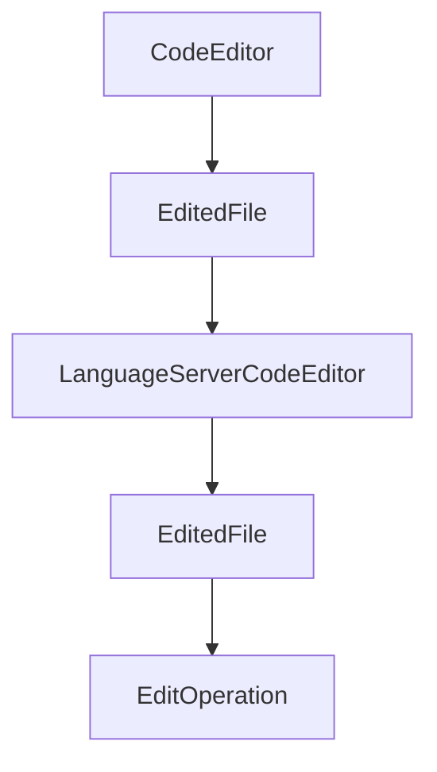

# Chapter 8: Production Operations and Governance

Welcome to **Chapter 8: Production Operations and Governance**. In this part of **Serena Tutorial: Semantic Code Retrieval Toolkit for Coding Agents**, you will build an intuitive mental model first, then move into concrete implementation details and practical production tradeoffs.


This chapter provides a practical rollout model for Serena in high-stakes engineering environments.

## Learning Goals

- define phased adoption for Serena across teams
- align Serena with internal coding-agent safety policies
- establish cadence for upgrades and regression checks
- maintain high quality in large codebase operations

## Rollout Plan

1. pilot on medium-size repository with clear regression suite
2. validate semantic workflow improvements against baseline tooling
3. publish standard client integration + config templates
4. roll out to additional repos with periodic review checkpoints

## Governance Checklist

| Area | Baseline |
|:-----|:---------|
| versioning | pin and review before upgrades |
| integrations | maintain approved client setup matrix |
| backend deps | verify language-server/IDE prerequisites |
| quality | monitor token use, edit precision, and test pass rate |

## Source References

- [Serena Roadmap](https://github.com/oraios/serena/blob/main/roadmap.md)
- [Serena Lessons Learned](https://github.com/oraios/serena/blob/main/lessons_learned.md)
- [Serena Governance Signals via Changelog](https://github.com/oraios/serena/blob/main/CHANGELOG.md)

## Summary

You now have a complete operational model for deploying Serena as a production-grade capability layer.

Continue with the [Onlook Tutorial](../onlook-tutorial/) for visual-first coding workflows.

## Depth Expansion Playbook

## Source Code Walkthrough

### `src/serena/code_editor.py`

The `CodeEditor` class in [`src/serena/code_editor.py`](https://github.com/oraios/serena/blob/HEAD/src/serena/code_editor.py) handles a key part of this chapter's functionality:

```py


class CodeEditor(Generic[TSymbol], ABC):
    def __init__(self, project: Project) -> None:
        self.project_root = project.project_root
        self.encoding = project.project_config.encoding
        self.newline = project.line_ending.newline_str

    class EditedFile(ABC):
        def __init__(self, relative_path: str) -> None:
            self.relative_path = relative_path

        @abstractmethod
        def get_contents(self) -> str:
            """
            :return: the contents of the file.
            """

        @abstractmethod
        def set_contents(self, contents: str) -> None:
            """
            Fully resets the contents of the file.

            :param contents: the new contents
            """

        @abstractmethod
        def delete_text_between_positions(self, start_pos: PositionInFile, end_pos: PositionInFile) -> None:
            pass

        @abstractmethod
        def insert_text_at_position(self, pos: PositionInFile, text: str) -> None:
```

This class is important because it defines how Serena Tutorial: Semantic Code Retrieval Toolkit for Coding Agents implements the patterns covered in this chapter.

### `src/serena/code_editor.py`

The `EditedFile` class in [`src/serena/code_editor.py`](https://github.com/oraios/serena/blob/HEAD/src/serena/code_editor.py) handles a key part of this chapter's functionality:

```py
        self.newline = project.line_ending.newline_str

    class EditedFile(ABC):
        def __init__(self, relative_path: str) -> None:
            self.relative_path = relative_path

        @abstractmethod
        def get_contents(self) -> str:
            """
            :return: the contents of the file.
            """

        @abstractmethod
        def set_contents(self, contents: str) -> None:
            """
            Fully resets the contents of the file.

            :param contents: the new contents
            """

        @abstractmethod
        def delete_text_between_positions(self, start_pos: PositionInFile, end_pos: PositionInFile) -> None:
            pass

        @abstractmethod
        def insert_text_at_position(self, pos: PositionInFile, text: str) -> None:
            pass

    @contextmanager
    def _open_file_context(self, relative_path: str) -> Iterator["CodeEditor.EditedFile"]:
        """
        Context manager for opening a file
```

This class is important because it defines how Serena Tutorial: Semantic Code Retrieval Toolkit for Coding Agents implements the patterns covered in this chapter.

### `src/serena/code_editor.py`

The `LanguageServerCodeEditor` class in [`src/serena/code_editor.py`](https://github.com/oraios/serena/blob/HEAD/src/serena/code_editor.py) handles a key part of this chapter's functionality:

```py


class LanguageServerCodeEditor(CodeEditor[LanguageServerSymbol]):
    def __init__(self, symbol_retriever: LanguageServerSymbolRetriever):
        super().__init__(project=symbol_retriever.project)
        self._symbol_retriever = symbol_retriever

    def _get_language_server(self, relative_path: str) -> SolidLanguageServer:
        return self._symbol_retriever.get_language_server(relative_path)

    class EditedFile(CodeEditor.EditedFile):
        def __init__(self, lang_server: SolidLanguageServer, relative_path: str, file_buffer: LSPFileBuffer):
            super().__init__(relative_path)
            self._lang_server = lang_server
            self._file_buffer = file_buffer

        def get_contents(self) -> str:
            return self._file_buffer.contents

        def set_contents(self, contents: str) -> None:
            self._file_buffer.contents = contents

        def delete_text_between_positions(self, start_pos: PositionInFile, end_pos: PositionInFile) -> None:
            self._lang_server.delete_text_between_positions(self.relative_path, start_pos.to_lsp_position(), end_pos.to_lsp_position())

        def insert_text_at_position(self, pos: PositionInFile, text: str) -> None:
            self._lang_server.insert_text_at_position(self.relative_path, pos.line, pos.col, text)

        def apply_text_edits(self, text_edits: list[ls_types.TextEdit]) -> None:
            return self._lang_server.apply_text_edits_to_file(self.relative_path, text_edits)

    @contextmanager
```

This class is important because it defines how Serena Tutorial: Semantic Code Retrieval Toolkit for Coding Agents implements the patterns covered in this chapter.

### `src/serena/code_editor.py`

The `EditedFile` class in [`src/serena/code_editor.py`](https://github.com/oraios/serena/blob/HEAD/src/serena/code_editor.py) handles a key part of this chapter's functionality:

```py
        self.newline = project.line_ending.newline_str

    class EditedFile(ABC):
        def __init__(self, relative_path: str) -> None:
            self.relative_path = relative_path

        @abstractmethod
        def get_contents(self) -> str:
            """
            :return: the contents of the file.
            """

        @abstractmethod
        def set_contents(self, contents: str) -> None:
            """
            Fully resets the contents of the file.

            :param contents: the new contents
            """

        @abstractmethod
        def delete_text_between_positions(self, start_pos: PositionInFile, end_pos: PositionInFile) -> None:
            pass

        @abstractmethod
        def insert_text_at_position(self, pos: PositionInFile, text: str) -> None:
            pass

    @contextmanager
    def _open_file_context(self, relative_path: str) -> Iterator["CodeEditor.EditedFile"]:
        """
        Context manager for opening a file
```

This class is important because it defines how Serena Tutorial: Semantic Code Retrieval Toolkit for Coding Agents implements the patterns covered in this chapter.


## How These Components Connect


