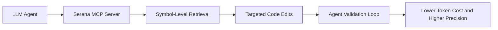

# Serena Tutorial: Semantic Code Retrieval Toolkit for Coding Agents

> Learn how to use `oraios/serena` to give coding agents IDE-grade semantic retrieval and editing tools across large codebases.

## Why This Track Matters

Serena is one of the highest-impact add-ons for modern coding agents because it replaces file-wide brute-force search/edit loops with symbol-level code intelligence.

This track focuses on:

- running Serena as an MCP server for existing coding agents
- using semantic symbol tools for faster and safer edits
- selecting language-analysis backends (LSP vs JetBrains plugin)
- operating Serena in team and production-like development workflows

## Current Snapshot (Verified February 12, 2026)

- repository: [`oraios/serena`](https://github.com/oraios/serena)
- stars: about **20.1k**
- latest release: [`v0.1.4`](https://github.com/oraios/serena/releases/tag/v0.1.4)
- recent activity: updates on **February 11, 2026**
- project positioning: coding-agent toolkit with semantic retrieval/editing capabilities

## Mental Model

## Chapter Guide

| Chapter | Key Question | Outcome |
|:--------|:-------------|:--------|
| [01 - Getting Started](01-getting-started.md) | How do I run Serena quickly with an MCP client? | Working baseline |
| [02 - Semantic Toolkit and Agent Loop](02-semantic-toolkit-and-agent-loop.md) | What makes Serena different from file-based tooling? | Strong mental model |
| [03 - MCP Client Integrations](03-mcp-client-integrations.md) | How do I connect Serena to Claude Code, Codex, and IDE clients? | Reliable client setup strategy |
| [04 - Language Backends and Analysis Strategy](04-language-backends-and-analysis-strategy.md) | How do LSP and JetBrains-based backends differ? | Better backend decisions |
| [05 - Project Workflow and Context Practices](05-project-workflow-and-context-practices.md) | How should Serena be used on real projects? | Durable workflow patterns |
| [06 - Configuration and Operational Controls](06-configuration-and-operational-controls.md) | How do I configure Serena for stability and scale? | Config governance baseline |
| [07 - Extending Serena and Custom Agent Integration](07-extending-serena-and-custom-agent-integration.md) | How do I add Serena to custom agent stacks or extend tools? | Advanced integration path |
| [08 - Production Operations and Governance](08-production-operations-and-governance.md) | How do teams roll out Serena safely in production repos? | Team-level runbook |

## What You Will Learn

- how to run Serena as a high-leverage MCP capability layer
- how semantic tools improve retrieval precision and editing efficiency
- how to tune analysis backend, configuration, and workflow practices
- how to standardize Serena usage across teams and codebases

## Source References

- [Serena Repository](https://github.com/oraios/serena)
- [Serena Documentation](https://oraios.github.io/serena/)
- [Quick Start and MCP startup](https://github.com/oraios/serena/blob/main/README.md#quick-start)
- [Connecting clients](https://oraios.github.io/serena/02-usage/030_clients.html)
- [Project workflow](https://oraios.github.io/serena/02-usage/040_workflow.html)
- [Configuration](https://oraios.github.io/serena/02-usage/050_configuration.html)

## Related Tutorials

- [MCP Servers Tutorial](../mcp-servers-tutorial/)
- [OpenCode Tutorial](../opencode-tutorial/)
- [Goose Tutorial](../goose-tutorial/)
- [Crush Tutorial](../crush-tutorial/)

---

Start with [Chapter 1: Getting Started](01-getting-started.md).
