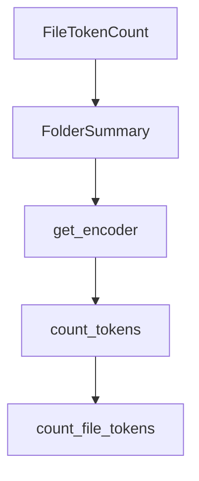

# Chapter 1: Getting Started

Welcome to **Chapter 1: Getting Started**. In this part of **Shotgun Tutorial: Spec-Driven Development for Coding Agents**, you will build an intuitive mental model first, then move into concrete implementation details and practical production tradeoffs.


This chapter gets Shotgun running in a repository so you can generate your first spec-driven workflow.

## Quick Start

```bash
uvx shotgun-sh@latest
```

## Recommended First Session

1. Launch Shotgun in your project directory.
2. Let it index the repository when prompted.
3. Start with a research-oriented request before asking for implementation.

Example prompt:

```text
Research how authentication currently works and propose a staged implementation plan for password reset.
```

## Core Setup Notes

- Python: 3.11+
- install method: `uvx shotgun-sh@latest`
- default interaction: TUI-first workflow
- default execution mode: Planning

## Source References

- [Shotgun README](https://github.com/shotgun-sh/shotgun)
- [Installation section](https://github.com/shotgun-sh/shotgun#-installation)

## Summary

You now have Shotgun running with a first research and planning loop.

Next: [Chapter 2: Router Architecture and Agent Lifecycle](02-router-architecture-and-agent-lifecycle.md)

## Depth Expansion Playbook

## Source Code Walkthrough

### `scripts/count_tokens.py`

The `FileTokenCount` class in [`scripts/count_tokens.py`](https://github.com/shotgun-sh/shotgun/blob/HEAD/scripts/count_tokens.py) handles a key part of this chapter's functionality:

```py


class FileTokenCount(NamedTuple):
    """Token count for a single file."""

    path: Path
    tokens: int
    chars: int


class FolderSummary(NamedTuple):
    """Token count summary for a folder."""

    path: Path
    files: list[FileTokenCount]
    total_tokens: int
    total_chars: int


def get_encoder(model: str = "cl100k_base") -> tiktoken.Encoding:
    """Get tiktoken encoder. cl100k_base is used by Claude/GPT-4."""
    return tiktoken.get_encoding(model)


def count_tokens(text: str, encoder: tiktoken.Encoding | None = None) -> int:
    """Count tokens in a string."""
    if encoder is None:
        encoder = get_encoder()
    return len(encoder.encode(text))


def count_file_tokens(
```

This class is important because it defines how Shotgun Tutorial: Spec-Driven Development for Coding Agents implements the patterns covered in this chapter.

### `scripts/count_tokens.py`

The `FolderSummary` class in [`scripts/count_tokens.py`](https://github.com/shotgun-sh/shotgun/blob/HEAD/scripts/count_tokens.py) handles a key part of this chapter's functionality:

```py


class FolderSummary(NamedTuple):
    """Token count summary for a folder."""

    path: Path
    files: list[FileTokenCount]
    total_tokens: int
    total_chars: int


def get_encoder(model: str = "cl100k_base") -> tiktoken.Encoding:
    """Get tiktoken encoder. cl100k_base is used by Claude/GPT-4."""
    return tiktoken.get_encoding(model)


def count_tokens(text: str, encoder: tiktoken.Encoding | None = None) -> int:
    """Count tokens in a string."""
    if encoder is None:
        encoder = get_encoder()
    return len(encoder.encode(text))


def count_file_tokens(
    file_path: Path, encoder: tiktoken.Encoding
) -> FileTokenCount | None:
    """Count tokens in a single file. Returns None for binary/unreadable files."""
    try:
        content = file_path.read_text(encoding="utf-8")
        tokens = count_tokens(content, encoder)
        return FileTokenCount(path=file_path, tokens=tokens, chars=len(content))
    except (UnicodeDecodeError, PermissionError):
```

This class is important because it defines how Shotgun Tutorial: Spec-Driven Development for Coding Agents implements the patterns covered in this chapter.

### `scripts/count_tokens.py`

The `get_encoder` function in [`scripts/count_tokens.py`](https://github.com/shotgun-sh/shotgun/blob/HEAD/scripts/count_tokens.py) handles a key part of this chapter's functionality:

```py


def get_encoder(model: str = "cl100k_base") -> tiktoken.Encoding:
    """Get tiktoken encoder. cl100k_base is used by Claude/GPT-4."""
    return tiktoken.get_encoding(model)


def count_tokens(text: str, encoder: tiktoken.Encoding | None = None) -> int:
    """Count tokens in a string."""
    if encoder is None:
        encoder = get_encoder()
    return len(encoder.encode(text))


def count_file_tokens(
    file_path: Path, encoder: tiktoken.Encoding
) -> FileTokenCount | None:
    """Count tokens in a single file. Returns None for binary/unreadable files."""
    try:
        content = file_path.read_text(encoding="utf-8")
        tokens = count_tokens(content, encoder)
        return FileTokenCount(path=file_path, tokens=tokens, chars=len(content))
    except (UnicodeDecodeError, PermissionError):
        return None


def count_tokens_in_directory(
    directory: Path,
    extensions: set[str] | None = None,
) -> tuple[list[FolderSummary], int]:
    """
    Count tokens for all files in a directory tree.
```

This function is important because it defines how Shotgun Tutorial: Spec-Driven Development for Coding Agents implements the patterns covered in this chapter.

### `scripts/count_tokens.py`

The `count_tokens` function in [`scripts/count_tokens.py`](https://github.com/shotgun-sh/shotgun/blob/HEAD/scripts/count_tokens.py) handles a key part of this chapter's functionality:

```py

Usage:
    python scripts/count_tokens.py [path]

    If no path is provided, defaults to .shotgun/ in current directory.

Can also be imported:
    from scripts.count_tokens import count_tokens_in_directory, count_tokens
"""

import sys
from pathlib import Path
from typing import NamedTuple

import tiktoken


class FileTokenCount(NamedTuple):
    """Token count for a single file."""

    path: Path
    tokens: int
    chars: int


class FolderSummary(NamedTuple):
    """Token count summary for a folder."""

    path: Path
    files: list[FileTokenCount]
    total_tokens: int
    total_chars: int
```

This function is important because it defines how Shotgun Tutorial: Spec-Driven Development for Coding Agents implements the patterns covered in this chapter.


## How These Components Connect


