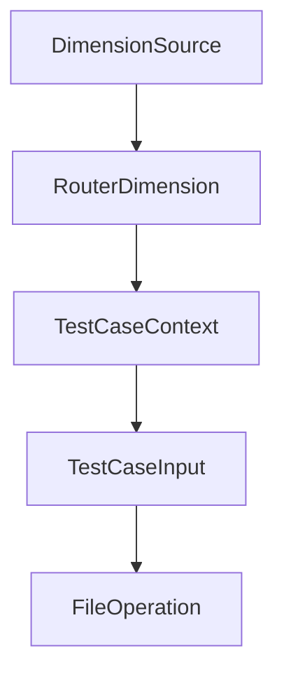

# Chapter 2: Router Architecture and Agent Lifecycle

Welcome to **Chapter 2: Router Architecture and Agent Lifecycle**. In this part of **Shotgun Tutorial: Spec-Driven Development for Coding Agents**, you will build an intuitive mental model first, then move into concrete implementation details and practical production tradeoffs.


Shotgun routes requests through specialized agents instead of using one generic prompt loop.

## Lifecycle Model

| Stage | Purpose |
|:------|:--------|
| Research | understand codebase and external context |
| Specify | define requirements and boundaries |
| Plan | propose staged implementation roadmap |
| Tasks | decompose into execution-ready units |
| Export | emit agent-ready deliverables |

## Why This Matters

- each stage can use more focused prompts
- outputs stay structured and easier to review
- task handoff quality improves across long features

## Implementation Signals

Shotgun documentation describes a router that orchestrates these phases internally while exposing user-facing mode controls.

## Source References

- [Shotgun README: router flow](https://github.com/shotgun-sh/shotgun#-features)
- [CLI docs](https://github.com/shotgun-sh/shotgun/blob/main/docs/CLI.md)

## Summary

You now understand how Shotgun sequences specialized agents across the delivery lifecycle.

Next: [Chapter 3: Planning vs Drafting Execution Modes](03-planning-vs-drafting-execution-modes.md)

## Source Code Walkthrough

### `evals/models.py`

The `DimensionSource` class in [`evals/models.py`](https://github.com/shotgun-sh/shotgun/blob/HEAD/evals/models.py) handles a key part of this chapter's functionality:

```py


class DimensionSource(str, Enum):
    """Source of an evaluation dimension score."""

    DETERMINISTIC = "deterministic"
    JUDGE = "judge"


# ============================================================================
# Router Evaluation Dimensions
# ============================================================================


class RouterDimension(str, Enum):
    """Evaluation dimensions for Router agent."""

    # Router-specific dimensions
    DELEGATION_RATIONALE = "delegation_rationale"
    CONTEXT_HANDLING = "context_handling"
    # Core writing quality dimensions
    CLARITY = "clarity"
    RELEVANCE = "relevance"


# ============================================================================
# Test Case Context
# ============================================================================


class TestCaseContext(BaseModel):
    """Typed context for test cases - what state exists before the test runs."""
```

This class is important because it defines how Shotgun Tutorial: Spec-Driven Development for Coding Agents implements the patterns covered in this chapter.

### `evals/models.py`

The `RouterDimension` class in [`evals/models.py`](https://github.com/shotgun-sh/shotgun/blob/HEAD/evals/models.py) handles a key part of this chapter's functionality:

```py


class RouterDimension(str, Enum):
    """Evaluation dimensions for Router agent."""

    # Router-specific dimensions
    DELEGATION_RATIONALE = "delegation_rationale"
    CONTEXT_HANDLING = "context_handling"
    # Core writing quality dimensions
    CLARITY = "clarity"
    RELEVANCE = "relevance"


# ============================================================================
# Test Case Context
# ============================================================================


class TestCaseContext(BaseModel):
    """Typed context for test cases - what state exists before the test runs."""

    has_codebase_indexed: bool = Field(
        default=False, description="Whether a codebase graph is available"
    )
    codebase_name: str | None = Field(
        default=None, description="Name of the indexed codebase"
    )
    router_mode: RouterMode = Field(
        default=RouterMode.PLANNING,
        description="Router mode: PLANNING (no delegation) or DRAFTING (delegation enabled)",
    )
    use_isolated_directory: bool = Field(
```

This class is important because it defines how Shotgun Tutorial: Spec-Driven Development for Coding Agents implements the patterns covered in this chapter.

### `evals/models.py`

The `TestCaseContext` class in [`evals/models.py`](https://github.com/shotgun-sh/shotgun/blob/HEAD/evals/models.py) handles a key part of this chapter's functionality:

```py


class TestCaseContext(BaseModel):
    """Typed context for test cases - what state exists before the test runs."""

    has_codebase_indexed: bool = Field(
        default=False, description="Whether a codebase graph is available"
    )
    codebase_name: str | None = Field(
        default=None, description="Name of the indexed codebase"
    )
    router_mode: RouterMode = Field(
        default=RouterMode.PLANNING,
        description="Router mode: PLANNING (no delegation) or DRAFTING (delegation enabled)",
    )
    use_isolated_directory: bool = Field(
        default=False,
        description="If True, run eval in an isolated temp directory to avoid existing files",
    )


# ============================================================================
# Test Case Input/Output Models
# ============================================================================


class TestCaseInput(BaseModel):
    """Input structure for agent test cases."""

    prompt: str = Field(..., description="The user prompt/request to the agent")
    agent_type: AgentType = Field(..., description="Which agent to invoke")
    context: TestCaseContext = Field(
```

This class is important because it defines how Shotgun Tutorial: Spec-Driven Development for Coding Agents implements the patterns covered in this chapter.

### `evals/models.py`

The `TestCaseInput` class in [`evals/models.py`](https://github.com/shotgun-sh/shotgun/blob/HEAD/evals/models.py) handles a key part of this chapter's functionality:

```py


class TestCaseInput(BaseModel):
    """Input structure for agent test cases."""

    prompt: str = Field(..., description="The user prompt/request to the agent")
    agent_type: AgentType = Field(..., description="Which agent to invoke")
    context: TestCaseContext = Field(
        default_factory=TestCaseContext,
        description="Test context (codebase state, etc.)",
    )
    message_history: list[ModelMessage] | None = Field(
        default=None,
        description="Optional message history for multi-turn conversations",
    )
    request_limit: int = Field(
        default=10,
        description="Max API requests for this test (overrides default 10)",
    )
    tool_calls_limit: int = Field(
        default=10,
        description="Max tool calls for this test (overrides default 10)",
    )


class FileOperation(BaseModel):
    """Represents a file operation performed by an agent."""

    file_path: str = Field(..., description="Path to the file")
    operation: FileOperationType = Field(..., description="Type of file operation")
    content_snippet: str | None = Field(
        default=None, description="Optional snippet of file content for validation"
```

This class is important because it defines how Shotgun Tutorial: Spec-Driven Development for Coding Agents implements the patterns covered in this chapter.


## How These Components Connect


