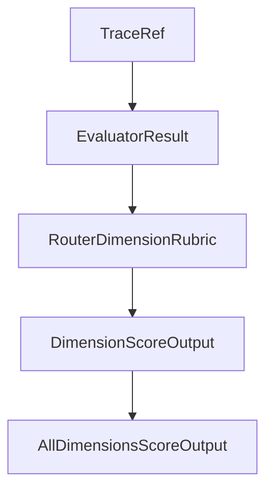

# Chapter 3: Planning vs Drafting Execution Modes

Welcome to **Chapter 3: Planning vs Drafting Execution Modes**. In this part of **Shotgun Tutorial: Spec-Driven Development for Coding Agents**, you will build an intuitive mental model first, then move into concrete implementation details and practical production tradeoffs.


Shotgun exposes two user-facing execution modes with different tradeoffs.

## Mode Comparison

| Mode | Behavior | Best For |
|:-----|:---------|:---------|
| Planning | step-by-step confirmations and checkpoints | high-risk or high-complexity work |
| Drafting | continuous execution with fewer interruptions | well-scoped work where speed matters |

## Practical Guidance

Use Planning when:

- requirements are still evolving
- cross-cutting changes affect many files
- you need signoff checkpoints for team review

Use Drafting when:

- plan is already validated
- workflow is repetitive
- you are optimizing for cycle time

## Operator Controls

- mode switching is available in TUI
- planner checkpoints help catch drift early
- drafting reduces manual overhead for mature flows

## Source References

- [Shotgun README: Planning vs Drafting](https://github.com/shotgun-sh/shotgun#planning-vs-drafting)

## Summary

You can now choose execution mode based on risk, ambiguity, and throughput needs.

Next: [Chapter 4: Codebase Indexing and Context Retrieval](04-codebase-indexing-and-context-retrieval.md)

## Depth Expansion Playbook

## Source Code Walkthrough

### `evals/models.py`

The `TraceRef` class in [`evals/models.py`](https://github.com/shotgun-sh/shotgun/blob/HEAD/evals/models.py) handles a key part of this chapter's functionality:

```py


class TraceRef(BaseModel):
    """Reference to a Logfire trace for debugging."""

    trace_id: str = Field(..., description="OpenTelemetry trace ID (32 hex chars)")
    span_id: str = Field(..., description="OpenTelemetry span ID (16 hex chars)")
    url: str | None = Field(default=None, description="Logfire UI URL for this trace")


# ============================================================================
# Deterministic Evaluator Models
# ============================================================================


class EvaluatorResult(BaseModel):
    """Result from a deterministic evaluator."""

    evaluator_name: str = Field(..., description="Name of the evaluator")
    passed: bool = Field(..., description="Whether the check passed")
    severity: EvaluatorSeverity = Field(
        ..., description="Severity of failure if failed"
    )
    reasoning: str = Field(..., description="Explanation of the result")
    details: dict[str, list[str]] = Field(
        default_factory=dict,
        description="Additional details (e.g., lists of violations)",
    )


# ============================================================================
# LLM Judge Models
```

This class is important because it defines how Shotgun Tutorial: Spec-Driven Development for Coding Agents implements the patterns covered in this chapter.

### `evals/models.py`

The `EvaluatorResult` class in [`evals/models.py`](https://github.com/shotgun-sh/shotgun/blob/HEAD/evals/models.py) handles a key part of this chapter's functionality:

```py


class EvaluatorResult(BaseModel):
    """Result from a deterministic evaluator."""

    evaluator_name: str = Field(..., description="Name of the evaluator")
    passed: bool = Field(..., description="Whether the check passed")
    severity: EvaluatorSeverity = Field(
        ..., description="Severity of failure if failed"
    )
    reasoning: str = Field(..., description="Explanation of the result")
    details: dict[str, list[str]] = Field(
        default_factory=dict,
        description="Additional details (e.g., lists of violations)",
    )


# ============================================================================
# LLM Judge Models
# ============================================================================


class RouterDimensionRubric(BaseModel):
    """Rubric definition for a single Router evaluation dimension."""

    dimension: RouterDimension = Field(..., description="The dimension being evaluated")
    description: str = Field(..., description="What this dimension measures")
    rubric_text: str = Field(..., description="Full rubric text for the LLM judge")
    weight: float = Field(default=1.0, ge=0.0, le=2.0, description="Weight for scoring")


class DimensionScoreOutput(BaseModel):
```

This class is important because it defines how Shotgun Tutorial: Spec-Driven Development for Coding Agents implements the patterns covered in this chapter.

### `evals/models.py`

The `RouterDimensionRubric` class in [`evals/models.py`](https://github.com/shotgun-sh/shotgun/blob/HEAD/evals/models.py) handles a key part of this chapter's functionality:

```py


class RouterDimensionRubric(BaseModel):
    """Rubric definition for a single Router evaluation dimension."""

    dimension: RouterDimension = Field(..., description="The dimension being evaluated")
    description: str = Field(..., description="What this dimension measures")
    rubric_text: str = Field(..., description="Full rubric text for the LLM judge")
    weight: float = Field(default=1.0, ge=0.0, le=2.0, description="Weight for scoring")


class DimensionScoreOutput(BaseModel):
    """Structured output from LLM judge for a single dimension."""

    score: int = Field(..., ge=1, le=5, description="Score on 1-5 Likert scale")
    reasoning: str = Field(..., description="Explanation for the score")
    passed: bool = Field(
        ..., description="Whether the minimum threshold was met (score >= 3)"
    )


class AllDimensionsScoreOutput(BaseModel):
    """Structured output from LLM judge for all dimensions in one call."""

    delegation_rationale: DimensionScoreOutput = Field(
        ..., description="Score for delegation rationale quality"
    )
    context_handling: DimensionScoreOutput = Field(
        ..., description="Score for context handling"
    )
    clarity: DimensionScoreOutput = Field(..., description="Score for clarity")
    relevance: DimensionScoreOutput = Field(..., description="Score for relevance")
```

This class is important because it defines how Shotgun Tutorial: Spec-Driven Development for Coding Agents implements the patterns covered in this chapter.

### `evals/models.py`

The `DimensionScoreOutput` class in [`evals/models.py`](https://github.com/shotgun-sh/shotgun/blob/HEAD/evals/models.py) handles a key part of this chapter's functionality:

```py


class DimensionScoreOutput(BaseModel):
    """Structured output from LLM judge for a single dimension."""

    score: int = Field(..., ge=1, le=5, description="Score on 1-5 Likert scale")
    reasoning: str = Field(..., description="Explanation for the score")
    passed: bool = Field(
        ..., description="Whether the minimum threshold was met (score >= 3)"
    )


class AllDimensionsScoreOutput(BaseModel):
    """Structured output from LLM judge for all dimensions in one call."""

    delegation_rationale: DimensionScoreOutput = Field(
        ..., description="Score for delegation rationale quality"
    )
    context_handling: DimensionScoreOutput = Field(
        ..., description="Score for context handling"
    )
    clarity: DimensionScoreOutput = Field(..., description="Score for clarity")
    relevance: DimensionScoreOutput = Field(..., description="Score for relevance")


class RouterJudgeResult(BaseModel):
    """Complete result from Router quality judge evaluation."""

    dimension_scores: dict[str, DimensionScoreOutput] = Field(
        ..., description="Scores for each evaluated dimension"
    )
    overall_score: float = Field(
```

This class is important because it defines how Shotgun Tutorial: Spec-Driven Development for Coding Agents implements the patterns covered in this chapter.


## How These Components Connect


