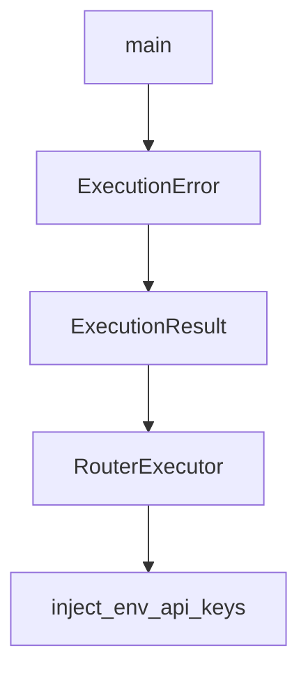

# Chapter 4: Codebase Indexing and Context Retrieval

Welcome to **Chapter 4: Codebase Indexing and Context Retrieval**. In this part of **Shotgun Tutorial: Spec-Driven Development for Coding Agents**, you will build an intuitive mental model first, then move into concrete implementation details and practical production tradeoffs.


Shotgun builds a local code graph so agent outputs are grounded in actual repository structure.

## Indexing Workflow

1. ingest repository files
2. build searchable code relationships
3. use the graph during research/spec/planning phases

## Why It Improves Output

- reduces hallucinated project structure
- improves dependency awareness before edits
- helps break large work into staged PRs

## Privacy Posture

Shotgun docs emphasize local indexing storage and no code upload during indexing itself.

## Source References

- [Shotgun README: code graph behavior](https://github.com/shotgun-sh/shotgun#faq)
- [CLI codebase commands](https://github.com/shotgun-sh/shotgun/blob/main/docs/CLI.md)

## Summary

You now understand how codebase indexing improves planning and reduces execution drift.

Next: [Chapter 5: CLI Automation and Scripting](05-cli-automation-and-scripting.md)

## Source Code Walkthrough

### `evals/runner.py`

The `main` function in [`evals/runner.py`](https://github.com/shotgun-sh/shotgun/blob/HEAD/evals/runner.py) handles a key part of this chapter's functionality:

```py


async def main() -> int:
    """Main entry point for the evaluation runner."""
    args = parse_args()

    # Configure logging
    logging.basicConfig(
        level=logging.INFO,
        format="%(asctime)s - %(name)s - %(levelname)s - %(message)s",
    )

    # Create runner config
    config = RunnerConfig(
        max_concurrency=args.concurrency,
        enable_judge=not args.no_judge,
        judge_concurrency=args.judge_concurrency,
    )

    # Create runner
    runner = EvaluationRunner(config=config)

    # Determine which models to run
    models_to_run = get_models_to_run(args)

    try:
        reports: list[EvaluationReport] = []

        # If no models specified, run with default
        if not models_to_run:
            models_to_run_iter: list[ModelName | None] = [None]
        else:
```

This function is important because it defines how Shotgun Tutorial: Spec-Driven Development for Coding Agents implements the patterns covered in this chapter.

### `evals/executor.py`

The `ExecutionError` class in [`evals/executor.py`](https://github.com/shotgun-sh/shotgun/blob/HEAD/evals/executor.py) handles a key part of this chapter's functionality:

```py


class ExecutionError(Exception):
    """Raised when test case execution fails."""


class ExecutionResult(BaseModel):
    """Result from executing a single test case."""

    test_case_name: str = Field(..., description="Name of the executed test case")
    output: AgentExecutionOutput = Field(
        ..., description="Captured execution output from the agent"
    )
    trace_ref: TraceRef = Field(
        ..., description="Logfire trace reference for debugging"
    )
    error: str | None = Field(
        default=None, description="Error message if execution failed"
    )


class RouterExecutor:
    """
    Executes Router agent test cases with Logfire instrumentation.

    This executor wraps the AgentManager to run test cases and capture
    evaluable outputs with trace references for debugging.
    """

    def __init__(self, working_directory: Path | None = None) -> None:
        """Initialize the RouterExecutor.

```

This class is important because it defines how Shotgun Tutorial: Spec-Driven Development for Coding Agents implements the patterns covered in this chapter.

### `evals/executor.py`

The `ExecutionResult` class in [`evals/executor.py`](https://github.com/shotgun-sh/shotgun/blob/HEAD/evals/executor.py) handles a key part of this chapter's functionality:

```py


class ExecutionResult(BaseModel):
    """Result from executing a single test case."""

    test_case_name: str = Field(..., description="Name of the executed test case")
    output: AgentExecutionOutput = Field(
        ..., description="Captured execution output from the agent"
    )
    trace_ref: TraceRef = Field(
        ..., description="Logfire trace reference for debugging"
    )
    error: str | None = Field(
        default=None, description="Error message if execution failed"
    )


class RouterExecutor:
    """
    Executes Router agent test cases with Logfire instrumentation.

    This executor wraps the AgentManager to run test cases and capture
    evaluable outputs with trace references for debugging.
    """

    def __init__(self, working_directory: Path | None = None) -> None:
        """Initialize the RouterExecutor.

        Args:
            working_directory: Working directory for agent execution.
                Defaults to current working directory.
        """
```

This class is important because it defines how Shotgun Tutorial: Spec-Driven Development for Coding Agents implements the patterns covered in this chapter.

### `evals/executor.py`

The `RouterExecutor` class in [`evals/executor.py`](https://github.com/shotgun-sh/shotgun/blob/HEAD/evals/executor.py) handles a key part of this chapter's functionality:

```py


class RouterExecutor:
    """
    Executes Router agent test cases with Logfire instrumentation.

    This executor wraps the AgentManager to run test cases and capture
    evaluable outputs with trace references for debugging.
    """

    def __init__(self, working_directory: Path | None = None) -> None:
        """Initialize the RouterExecutor.

        Args:
            working_directory: Working directory for agent execution.
                Defaults to current working directory.
        """
        self._configured = False
        self._working_directory = working_directory or Path.cwd()

    async def _ensure_configured(self) -> None:
        """Ensure Logfire and API keys are configured. Raises if misconfigured."""
        if not self._configured:
            configure_logfire_or_fail()
            await inject_env_api_keys()
            self._configured = True

    async def execute_case(
        self,
        test_case: ShotgunTestCase,
        suite_name: str = "default",
        model_override: ModelName | None = None,
```

This class is important because it defines how Shotgun Tutorial: Spec-Driven Development for Coding Agents implements the patterns covered in this chapter.


## How These Components Connect


