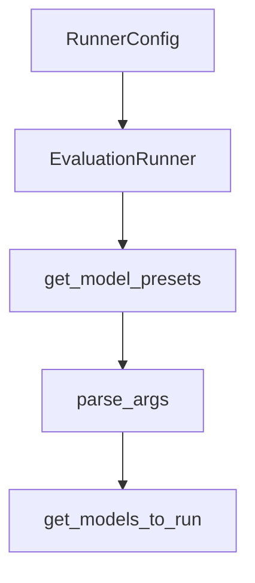

# Chapter 4: Codebase Indexing and Context Retrieval

Welcome to **Chapter 4: Codebase Indexing and Context Retrieval**. In this part of **Shotgun Tutorial: Spec-Driven Development for Coding Agents**, you will build an intuitive mental model first, then move into concrete implementation details and practical production tradeoffs.


Shotgun builds a local code graph so agent outputs are grounded in actual repository structure.

## Indexing Workflow

1. ingest repository files
2. build searchable code relationships
3. use the graph during research/spec/planning phases

## Why It Improves Output

- reduces hallucinated project structure
- improves dependency awareness before edits
- helps break large work into staged PRs

## Privacy Posture

Shotgun docs emphasize local indexing storage and no code upload during indexing itself.

## Source References

- [Shotgun README: code graph behavior](https://github.com/shotgun-sh/shotgun#faq)
- [CLI codebase commands](https://github.com/shotgun-sh/shotgun/blob/main/docs/CLI.md)

## Summary

You now understand how codebase indexing improves planning and reduces execution drift.

Next: [Chapter 5: CLI Automation and Scripting](05-cli-automation-and-scripting.md)

## Depth Expansion Playbook

## Source Code Walkthrough

### `evals/runner.py`

The `RunnerConfig` class in [`evals/runner.py`](https://github.com/shotgun-sh/shotgun/blob/HEAD/evals/runner.py) handles a key part of this chapter's functionality:

```py


class RunnerConfig:
    """Configuration for the evaluation runner."""

    def __init__(
        self,
        max_concurrency: int = 2,
        enable_judge: bool = True,
        judge_concurrency: int = 1,
        timeout_seconds: float = 300.0,
    ) -> None:
        """Initialize runner configuration.

        Args:
            max_concurrency: Maximum concurrent test case executions
            enable_judge: Whether to run LLM judge evaluation
            judge_concurrency: Concurrency for judge calls (conservative default)
            timeout_seconds: Timeout per test case
        """
        self.max_concurrency = max_concurrency
        self.enable_judge = enable_judge
        self.judge_concurrency = judge_concurrency
        self.timeout_seconds = timeout_seconds


class EvaluationRunner:
    """
    Runs evaluation suites and produces reports.

    Orchestrates:
    1. Test case execution via RouterExecutor
```

This class is important because it defines how Shotgun Tutorial: Spec-Driven Development for Coding Agents implements the patterns covered in this chapter.

### `evals/runner.py`

The `EvaluationRunner` class in [`evals/runner.py`](https://github.com/shotgun-sh/shotgun/blob/HEAD/evals/runner.py) handles a key part of this chapter's functionality:

```py


class EvaluationRunner:
    """
    Runs evaluation suites and produces reports.

    Orchestrates:
    1. Test case execution via RouterExecutor
    2. Deterministic evaluation
    3. LLM judge evaluation (optional, with conservative concurrency)
    4. Result aggregation
    5. Report generation
    """

    def __init__(
        self,
        config: RunnerConfig | None = None,
        working_directory: Path | None = None,
    ) -> None:
        """Initialize the evaluation runner.

        Args:
            config: Runner configuration
            working_directory: Working directory for agent execution
        """
        self.config = config or RunnerConfig()
        self.executor = RouterExecutor(working_directory=working_directory)
        # Initialize judges lazily based on evaluator_names
        self._router_judge: RouterQualityJudge | None = None
        self._file_requests_judge: FileRequestsJudge | None = None
        self._web_search_efficiency_judge: WebSearchEfficiencyJudge | None = None
        self.aggregator = RouterAggregator()
```

This class is important because it defines how Shotgun Tutorial: Spec-Driven Development for Coding Agents implements the patterns covered in this chapter.

### `evals/runner.py`

The `get_model_presets` function in [`evals/runner.py`](https://github.com/shotgun-sh/shotgun/blob/HEAD/evals/runner.py) handles a key part of this chapter's functionality:

```py


def get_model_presets() -> dict[str, list[ModelName]]:
    """Build model presets from MODEL_SPECS registry.

    Returns:
        Dictionary mapping preset names to lists of ModelName enums.
        Presets include 'all', 'anthropic', 'openai', 'google', and 'fast'.
    """
    all_models = list(MODEL_SPECS.keys())

    # Group by provider
    by_provider: dict[ProviderType, list[ModelName]] = {}
    for model_name, spec in MODEL_SPECS.items():
        by_provider.setdefault(spec.provider, []).append(model_name)

    return {
        "all": all_models,
        "anthropic": by_provider.get(ProviderType.ANTHROPIC, []),
        "openai": by_provider.get(ProviderType.OPENAI, []),
        "google": by_provider.get(ProviderType.GOOGLE, []),
        # Fast models - one per provider (cheapest/fastest)
        "fast": [
            ModelName.CLAUDE_HAIKU_4_5,
            ModelName.GPT_5_1,
            ModelName.GEMINI_2_5_FLASH_LITE,
        ],
    }


# Available model presets for CLI
MODEL_PRESETS = get_model_presets()
```

This function is important because it defines how Shotgun Tutorial: Spec-Driven Development for Coding Agents implements the patterns covered in this chapter.

### `evals/runner.py`

The `parse_args` function in [`evals/runner.py`](https://github.com/shotgun-sh/shotgun/blob/HEAD/evals/runner.py) handles a key part of this chapter's functionality:

```py


def parse_args() -> argparse.Namespace:
    """Parse command line arguments."""
    # Build available model choices from MODEL_SPECS
    available_models = [m.value for m in ModelName]

    parser = argparse.ArgumentParser(
        description="Run Router agent evaluation suites",
        formatter_class=argparse.RawDescriptionHelpFormatter,
        epilog=f"""
Examples:
    python -m evals.runner --suite router_smoke --report json --out evals/reports/router_smoke.json
    python -m evals.runner --suite router_core --report console
    python -m evals.runner --case local_models_clarifying_questions
    python -m evals.runner --tag smoke

Model comparison examples:
    python -m evals.runner --suite router_smoke --model claude-sonnet-4-6
    python -m evals.runner --suite router_smoke --model claude-sonnet-4-6 --model gpt-5.1
    python -m evals.runner --suite router_smoke --models anthropic
    python -m evals.runner --suite router_smoke --models fast

Available models: {", ".join(available_models)}
Available presets: {", ".join(MODEL_PRESETS.keys())}
        """,
    )

    # Selection options (mutually exclusive)
    selection = parser.add_mutually_exclusive_group(required=True)
    selection.add_argument("--suite", help="Run a named suite")
    selection.add_argument("--tag", help="Run all suites matching a tag")
```

This function is important because it defines how Shotgun Tutorial: Spec-Driven Development for Coding Agents implements the patterns covered in this chapter.


## How These Components Connect


