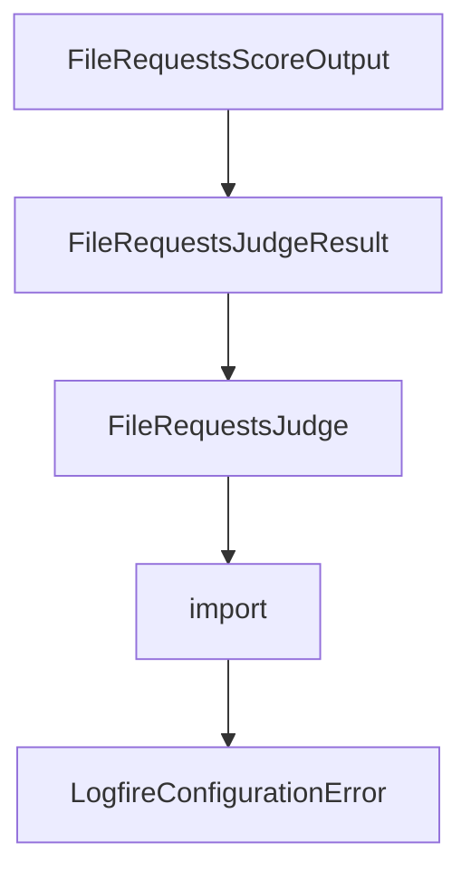

# Chapter 5: CLI Automation and Scripting

Welcome to **Chapter 5: CLI Automation and Scripting**. In this part of **Shotgun Tutorial: Spec-Driven Development for Coding Agents**, you will build an intuitive mental model first, then move into concrete implementation details and practical production tradeoffs.


Shotgun includes CLI commands for non-interactive and automation-friendly usage.

## Key Commands

```bash
shotgun run "Research auth architecture and produce implementation plan"
shotgun run -n "Analyze current retry strategy"
shotgun run -p anthropic "Generate staged refactor plan"
```

## Utility Commands

- `shotgun context` for token usage visibility
- `shotgun compact` for conversation compaction
- `shotgun codebase index` and `shotgun codebase info` for graph lifecycle

## CI Pattern

Use `shotgun run -n` in controlled environments where deterministic prompt templates and post-run validation steps are in place.

## Source References

- [Shotgun CLI Docs](https://github.com/shotgun-sh/shotgun/blob/main/docs/CLI.md)

## Summary

You can now run Shotgun workflows both interactively and in scripted pipelines.

Next: [Chapter 6: Context7 MCP and Local Models](06-context7-mcp-and-local-models.md)

## Source Code Walkthrough

### `evals/judges/file_requests_judge.py`

The `FileRequestsScoreOutput` class in [`evals/judges/file_requests_judge.py`](https://github.com/shotgun-sh/shotgun/blob/HEAD/evals/judges/file_requests_judge.py) handles a key part of this chapter's functionality:

```py


class FileRequestsScoreOutput(BaseModel):
    """Output structure for all file_requests dimension scores."""

    file_request_usage: DimensionScoreOutput = Field(
        description="Score for correct file_requests usage"
    )
    no_unnecessary_questions: DimensionScoreOutput = Field(
        description="Score for not asking unnecessary clarifying questions"
    )
    appropriate_response: DimensionScoreOutput = Field(
        description="Score for appropriate response text"
    )
    no_wrong_delegation: DimensionScoreOutput = Field(
        description="Score for not delegating to wrong agents"
    )


class FileRequestsJudgeResult(BaseModel):
    """Result from file_requests judge evaluation."""

    dimension_scores: dict[str, DimensionScoreOutput]
    overall_score: float
    overall_passed: bool
    summary: str


# Default rubrics for file_requests evaluation dimensions
DEFAULT_FILE_REQUESTS_RUBRICS: dict[
    FileRequestsDimension, FileRequestsDimensionRubric
] = {
```

This class is important because it defines how Shotgun Tutorial: Spec-Driven Development for Coding Agents implements the patterns covered in this chapter.

### `evals/judges/file_requests_judge.py`

The `FileRequestsJudgeResult` class in [`evals/judges/file_requests_judge.py`](https://github.com/shotgun-sh/shotgun/blob/HEAD/evals/judges/file_requests_judge.py) handles a key part of this chapter's functionality:

```py


class FileRequestsJudgeResult(BaseModel):
    """Result from file_requests judge evaluation."""

    dimension_scores: dict[str, DimensionScoreOutput]
    overall_score: float
    overall_passed: bool
    summary: str


# Default rubrics for file_requests evaluation dimensions
DEFAULT_FILE_REQUESTS_RUBRICS: dict[
    FileRequestsDimension, FileRequestsDimensionRubric
] = {
    FileRequestsDimension.FILE_REQUEST_USAGE: FileRequestsDimensionRubric(
        dimension=FileRequestsDimension.FILE_REQUEST_USAGE,
        description="Did the Router correctly use file_requests to load the binary file?",
        weight=2.0,  # Highest weight - this is the core behavior being tested
        rubric_text="""
Evaluate if the Router correctly used file_requests to load the binary file on a 1-5 scale:

**File Request Usage:**
5 (Excellent): Router immediately used file_requests with the correct file path. No hesitation or unnecessary steps.
4 (Good): Router used file_requests correctly but with minor issues (slight delay or extra explanation).
3 (Average): Router eventually used file_requests but took unnecessary steps first.
2 (Fair): Router attempted to use file_requests but with incorrect path or format.
1 (Poor): Router did not use file_requests at all, or claimed inability to access the file.

Consider:
- Did the Router include the file path in file_requests?
- Was the response immediate rather than asking for more information first?
```

This class is important because it defines how Shotgun Tutorial: Spec-Driven Development for Coding Agents implements the patterns covered in this chapter.

### `evals/judges/file_requests_judge.py`

The `FileRequestsJudge` class in [`evals/judges/file_requests_judge.py`](https://github.com/shotgun-sh/shotgun/blob/HEAD/evals/judges/file_requests_judge.py) handles a key part of this chapter's functionality:

```py


class FileRequestsJudgeResult(BaseModel):
    """Result from file_requests judge evaluation."""

    dimension_scores: dict[str, DimensionScoreOutput]
    overall_score: float
    overall_passed: bool
    summary: str


# Default rubrics for file_requests evaluation dimensions
DEFAULT_FILE_REQUESTS_RUBRICS: dict[
    FileRequestsDimension, FileRequestsDimensionRubric
] = {
    FileRequestsDimension.FILE_REQUEST_USAGE: FileRequestsDimensionRubric(
        dimension=FileRequestsDimension.FILE_REQUEST_USAGE,
        description="Did the Router correctly use file_requests to load the binary file?",
        weight=2.0,  # Highest weight - this is the core behavior being tested
        rubric_text="""
Evaluate if the Router correctly used file_requests to load the binary file on a 1-5 scale:

**File Request Usage:**
5 (Excellent): Router immediately used file_requests with the correct file path. No hesitation or unnecessary steps.
4 (Good): Router used file_requests correctly but with minor issues (slight delay or extra explanation).
3 (Average): Router eventually used file_requests but took unnecessary steps first.
2 (Fair): Router attempted to use file_requests but with incorrect path or format.
1 (Poor): Router did not use file_requests at all, or claimed inability to access the file.

Consider:
- Did the Router include the file path in file_requests?
- Was the response immediate rather than asking for more information first?
```

This class is important because it defines how Shotgun Tutorial: Spec-Driven Development for Coding Agents implements the patterns covered in this chapter.

### `evals/judges/file_requests_judge.py`

The `import` interface in [`evals/judges/file_requests_judge.py`](https://github.com/shotgun-sh/shotgun/blob/HEAD/evals/judges/file_requests_judge.py) handles a key part of this chapter's functionality:

```py
"""

import logging
from enum import StrEnum

import logfire
from pydantic import BaseModel, Field
from pydantic_ai import Agent

from evals.models import (
    AgentExecutionOutput,
    DimensionScoreOutput,
    EvaluationResult,
    JudgeModelConfig,
    JudgeProviderType,
    ShotgunTestCase,
)

logger = logging.getLogger(__name__)


class FileRequestsDimension(StrEnum):
    """Dimensions for evaluating file_requests behavior."""

    FILE_REQUEST_USAGE = "file_request_usage"
    NO_UNNECESSARY_QUESTIONS = "no_unnecessary_questions"
    APPROPRIATE_RESPONSE = "appropriate_response"
    NO_WRONG_DELEGATION = "no_wrong_delegation"


class FileRequestsDimensionRubric(BaseModel):
    """Rubric definition for a file_requests evaluation dimension."""
```

This interface is important because it defines how Shotgun Tutorial: Spec-Driven Development for Coding Agents implements the patterns covered in this chapter.


## How These Components Connect


