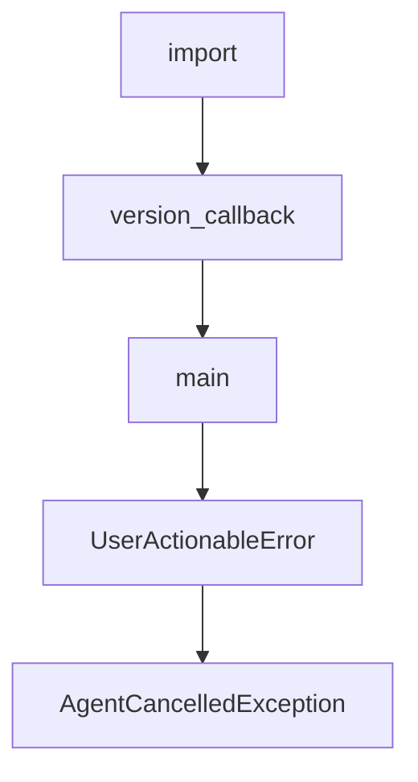

# Chapter 5: CLI Automation and Scripting

Welcome to **Chapter 5: CLI Automation and Scripting**. In this part of **Shotgun Tutorial: Spec-Driven Development for Coding Agents**, you will build an intuitive mental model first, then move into concrete implementation details and practical production tradeoffs.


Shotgun includes CLI commands for non-interactive and automation-friendly usage.

## Key Commands

```bash
shotgun run "Research auth architecture and produce implementation plan"
shotgun run -n "Analyze current retry strategy"
shotgun run -p anthropic "Generate staged refactor plan"
```

## Utility Commands

- `shotgun context` for token usage visibility
- `shotgun compact` for conversation compaction
- `shotgun codebase index` and `shotgun codebase info` for graph lifecycle

## CI Pattern

Use `shotgun run -n` in controlled environments where deterministic prompt templates and post-run validation steps are in place.

## Source References

- [Shotgun CLI Docs](https://github.com/shotgun-sh/shotgun/blob/main/docs/CLI.md)

## Summary

You can now run Shotgun workflows both interactively and in scripted pipelines.

Next: [Chapter 6: Context7 MCP and Local Models](06-context7-mcp-and-local-models.md)

## Depth Expansion Playbook

## Source Code Walkthrough

### `evals/judges/file_requests_judge.py`

The `import` interface in [`evals/judges/file_requests_judge.py`](https://github.com/shotgun-sh/shotgun/blob/HEAD/evals/judges/file_requests_judge.py) handles a key part of this chapter's functionality:

```py
"""

import logging
from enum import StrEnum

import logfire
from pydantic import BaseModel, Field
from pydantic_ai import Agent

from evals.models import (
    AgentExecutionOutput,
    DimensionScoreOutput,
    EvaluationResult,
    JudgeModelConfig,
    JudgeProviderType,
    ShotgunTestCase,
)

logger = logging.getLogger(__name__)


class FileRequestsDimension(StrEnum):
    """Dimensions for evaluating file_requests behavior."""

    FILE_REQUEST_USAGE = "file_request_usage"
    NO_UNNECESSARY_QUESTIONS = "no_unnecessary_questions"
    APPROPRIATE_RESPONSE = "appropriate_response"
    NO_WRONG_DELEGATION = "no_wrong_delegation"


class FileRequestsDimensionRubric(BaseModel):
    """Rubric definition for a file_requests evaluation dimension."""
```

This interface is important because it defines how Shotgun Tutorial: Spec-Driven Development for Coding Agents implements the patterns covered in this chapter.

### `src/shotgun/main.py`

The `version_callback` function in [`src/shotgun/main.py`](https://github.com/shotgun-sh/shotgun/blob/HEAD/src/shotgun/main.py) handles a key part of this chapter's functionality:

```py


def version_callback(value: bool) -> None:
    """Show version and exit."""
    if value:
        from rich.console import Console

        console = Console()
        console.print(f"shotgun {__version__}")
        raise typer.Exit()


@app.callback(invoke_without_command=True)
def main(
    ctx: typer.Context,
    version: Annotated[
        bool,
        typer.Option(
            "--version",
            "-v",
            callback=version_callback,
            is_eager=True,
            help="Show version and exit",
        ),
    ] = False,
    no_update_check: Annotated[
        bool,
        typer.Option(
            "--no-update-check",
            help="Disable automatic update checks",
        ),
    ] = False,
```

This function is important because it defines how Shotgun Tutorial: Spec-Driven Development for Coding Agents implements the patterns covered in this chapter.

### `src/shotgun/main.py`

The `main` function in [`src/shotgun/main.py`](https://github.com/shotgun-sh/shotgun/blob/HEAD/src/shotgun/main.py) handles a key part of this chapter's functionality:

```py

@app.callback(invoke_without_command=True)
def main(
    ctx: typer.Context,
    version: Annotated[
        bool,
        typer.Option(
            "--version",
            "-v",
            callback=version_callback,
            is_eager=True,
            help="Show version and exit",
        ),
    ] = False,
    no_update_check: Annotated[
        bool,
        typer.Option(
            "--no-update-check",
            help="Disable automatic update checks",
        ),
    ] = False,
    continue_session: Annotated[
        bool,
        typer.Option(
            "--continue",
            "-c",
            help="Continue previous TUI conversation",
        ),
    ] = False,
    web: Annotated[
        bool,
        typer.Option(
```

This function is important because it defines how Shotgun Tutorial: Spec-Driven Development for Coding Agents implements the patterns covered in this chapter.

### `src/shotgun/exceptions.py`

The `UserActionableError` class in [`src/shotgun/exceptions.py`](https://github.com/shotgun-sh/shotgun/blob/HEAD/src/shotgun/exceptions.py) handles a key part of this chapter's functionality:

```py


class UserActionableError(Exception):  # noqa: N818
    """Base for user-actionable errors that shouldn't be sent to telemetry.

    These errors represent expected user conditions requiring action
    rather than bugs that need tracking.

    All subclasses should implement to_markdown() and to_plain_text() methods
    for consistent error message formatting.
    """

    def to_markdown(self) -> str:
        """Generate markdown-formatted error message for TUI.

        Subclasses should override this method.
        """
        return f"⚠️ {str(self)}"

    def to_plain_text(self) -> str:
        """Generate plain text error message for CLI.

        Subclasses should override this method.
        """
        return f"⚠️  {str(self)}"


# ============================================================================
# User Action Required Errors
# ============================================================================


```

This class is important because it defines how Shotgun Tutorial: Spec-Driven Development for Coding Agents implements the patterns covered in this chapter.


## How These Components Connect


