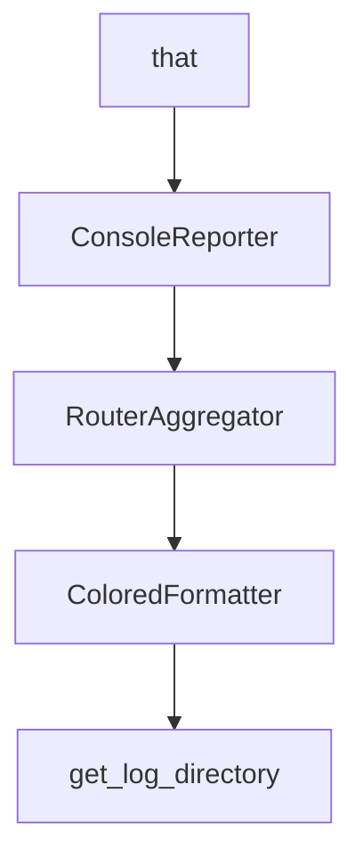

# Chapter 6: Context7 MCP and Local Models

Welcome to **Chapter 6: Context7 MCP and Local Models**. In this part of **Shotgun Tutorial: Spec-Driven Development for Coding Agents**, you will build an intuitive mental model first, then move into concrete implementation details and practical production tradeoffs.


Shotgun supports live documentation lookup through Context7 MCP and can run local-model workflows through Ollama integration.

## Context7 Integration

Context7 is attached as an MCP server for research flows so the agent can resolve library identifiers and fetch targeted docs during execution.

## Local Model Strategy

Ollama models are exposed via an OpenAI-compatible path with capability detection for tools and vision.

## Operational Caveats

- local models with weak tool-calling support may be constrained
- docs lookup requires external connectivity to the MCP endpoint
- model and provider choices should match task risk and latency budget

## Source References

- [Context7 Integration Architecture](https://github.com/shotgun-sh/shotgun/blob/main/docs/architecture/context7-mcp-integration.md)
- [Ollama/Local Models Architecture](https://github.com/shotgun-sh/shotgun/blob/main/docs/architecture/ollama-local-models.md)

## Summary

You now have a model for combining live docs retrieval and local-model execution pathways.

Next: [Chapter 7: Spec Sharing and Collaboration Workflows](07-spec-sharing-and-collaboration-workflows.md)

## Source Code Walkthrough

### `src/shotgun/settings.py`

The `that` class in [`src/shotgun/settings.py`](https://github.com/shotgun-sh/shotgun/blob/HEAD/src/shotgun/settings.py) handles a key part of this chapter's functionality:

```py
    """Main application settings with SHOTGUN_ prefix.

    This is the main settings class that composes all other settings groups.
    Access settings via the global `settings` singleton instance.

    Example:
        from shotgun.settings import settings

        # Telemetry settings
        settings.telemetry.posthog_api_key
        settings.telemetry.logfire_enabled

        # Logging settings
        settings.logging.log_level
        settings.logging.logging_to_console

        # API settings
        settings.api.web_base_url
        settings.api.account_llm_base_url

        # Development settings
        settings.dev.home
        settings.dev.pipx_simulate

        # Indexing settings
        settings.indexing.index_parallel
        settings.indexing.index_workers
    """

    telemetry: TelemetrySettings = Field(default_factory=TelemetrySettings)
    logging: LoggingSettings = Field(default_factory=LoggingSettings)
    api: ApiSettings = Field(default_factory=ApiSettings)
```

This class is important because it defines how Shotgun Tutorial: Spec-Driven Development for Coding Agents implements the patterns covered in this chapter.

### `evals/reporters/console.py`

The `ConsoleReporter` class in [`evals/reporters/console.py`](https://github.com/shotgun-sh/shotgun/blob/HEAD/evals/reporters/console.py) handles a key part of this chapter's functionality:

```py


class ConsoleReporter:
    """
    Formats evaluation reports for console output.

    Emphasizes scores and trace references for quick debugging.
    """

    # ANSI color codes
    GREEN = "\033[92m"
    RED = "\033[91m"
    YELLOW = "\033[93m"
    BLUE = "\033[94m"
    BOLD = "\033[1m"
    RESET = "\033[0m"

    def __init__(self, use_color: bool = True) -> None:
        """Initialize the console reporter.

        Args:
            use_color: Whether to use ANSI color codes
        """
        self.use_color = use_color and sys.stdout.isatty()

    def _color(self, text: str, color: str) -> str:
        """Apply color to text if colors are enabled."""
        if self.use_color:
            return f"{color}{text}{self.RESET}"
        return text

    def _status_icon(self, passed: bool) -> str:
```

This class is important because it defines how Shotgun Tutorial: Spec-Driven Development for Coding Agents implements the patterns covered in this chapter.

### `evals/aggregators/router_aggregator.py`

The `RouterAggregator` class in [`evals/aggregators/router_aggregator.py`](https://github.com/shotgun-sh/shotgun/blob/HEAD/evals/aggregators/router_aggregator.py) handles a key part of this chapter's functionality:

```py


class RouterAggregator:
    """
    Aggregates evaluation results from deterministic evaluators and LLM judge.

    Aggregation rules:
    1. Any HARD failure from deterministic evaluators -> overall failure
    2. SOFT failures are recorded but don't cause overall failure
    3. LLM judge scores contribute to dimension averages
    4. Overall score is weighted average of all dimensions
    5. Trace reference is attached for debugging
    """

    def __init__(
        self,
        hard_failure_causes_fail: bool = True,
        soft_failure_weight: float = 0.5,
        pass_threshold: float = 3.0,
    ) -> None:
        """Initialize the aggregator.

        Args:
            hard_failure_causes_fail: Whether hard failures cause overall fail
            soft_failure_weight: Weight for soft failure penalty (0-1)
            pass_threshold: Minimum score to pass (1-5 scale, default 3.0)
        """
        self.hard_failure_causes_fail = hard_failure_causes_fail
        self.soft_failure_weight = soft_failure_weight
        self.pass_threshold = pass_threshold

    def aggregate(
```

This class is important because it defines how Shotgun Tutorial: Spec-Driven Development for Coding Agents implements the patterns covered in this chapter.

### `src/shotgun/logging_config.py`

The `ColoredFormatter` class in [`src/shotgun/logging_config.py`](https://github.com/shotgun-sh/shotgun/blob/HEAD/src/shotgun/logging_config.py) handles a key part of this chapter's functionality:

```py


class ColoredFormatter(logging.Formatter):
    """Custom formatter with colors for different log levels."""

    # ANSI color codes
    COLORS = {
        "DEBUG": "\033[36m",  # Cyan
        "INFO": "\033[32m",  # Green
        "WARNING": "\033[33m",  # Yellow
        "ERROR": "\033[31m",  # Red
        "CRITICAL": "\033[35m",  # Magenta
    }
    RESET = "\033[0m"

    def format(self, record: logging.LogRecord) -> str:
        # Create a copy of the record to avoid modifying the original
        record = logging.makeLogRecord(record.__dict__)

        # Add color to levelname
        if record.levelname in self.COLORS:
            colored_levelname = (
                f"{self.COLORS[record.levelname]}{record.levelname}{self.RESET}"
            )
            record.levelname = colored_levelname

        return super().format(record)


def setup_logger(
    name: str,
    format_string: str | None = None,
```

This class is important because it defines how Shotgun Tutorial: Spec-Driven Development for Coding Agents implements the patterns covered in this chapter.


## How These Components Connect


