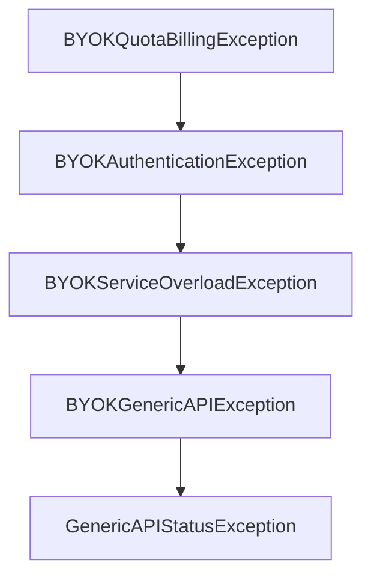

# Chapter 6: Context7 MCP and Local Models

Welcome to **Chapter 6: Context7 MCP and Local Models**. In this part of **Shotgun Tutorial: Spec-Driven Development for Coding Agents**, you will build an intuitive mental model first, then move into concrete implementation details and practical production tradeoffs.


Shotgun supports live documentation lookup through Context7 MCP and can run local-model workflows through Ollama integration.

## Context7 Integration

Context7 is attached as an MCP server for research flows so the agent can resolve library identifiers and fetch targeted docs during execution.

## Local Model Strategy

Ollama models are exposed via an OpenAI-compatible path with capability detection for tools and vision.

## Operational Caveats

- local models with weak tool-calling support may be constrained
- docs lookup requires external connectivity to the MCP endpoint
- model and provider choices should match task risk and latency budget

## Source References

- [Context7 Integration Architecture](https://github.com/shotgun-sh/shotgun/blob/main/docs/architecture/context7-mcp-integration.md)
- [Ollama/Local Models Architecture](https://github.com/shotgun-sh/shotgun/blob/main/docs/architecture/ollama-local-models.md)

## Summary

You now have a model for combining live docs retrieval and local-model execution pathways.

Next: [Chapter 7: Spec Sharing and Collaboration Workflows](07-spec-sharing-and-collaboration-workflows.md)

## Depth Expansion Playbook

## Source Code Walkthrough

### `src/shotgun/exceptions.py`

The `BYOKQuotaBillingException` class in [`src/shotgun/exceptions.py`](https://github.com/shotgun-sh/shotgun/blob/HEAD/src/shotgun/exceptions.py) handles a key part of this chapter's functionality:

```py


class BYOKQuotaBillingException(BYOKAPIException):
    """Raised when BYOK user has quota or billing issues."""

    def __init__(self, message: str):
        """Initialize the exception.

        Args:
            message: The error message from the API
        """
        super().__init__(message, specific_error="Quota or billing issue")


class BYOKAuthenticationException(BYOKAPIException):
    """Raised when BYOK authentication fails."""

    def __init__(self, message: str):
        """Initialize the exception.

        Args:
            message: The error message from the API
        """
        super().__init__(message, specific_error="Authentication error")


class BYOKServiceOverloadException(BYOKAPIException):
    """Raised when BYOK service is overloaded."""

    def __init__(self, message: str):
        """Initialize the exception.

```

This class is important because it defines how Shotgun Tutorial: Spec-Driven Development for Coding Agents implements the patterns covered in this chapter.

### `src/shotgun/exceptions.py`

The `BYOKAuthenticationException` class in [`src/shotgun/exceptions.py`](https://github.com/shotgun-sh/shotgun/blob/HEAD/src/shotgun/exceptions.py) handles a key part of this chapter's functionality:

```py


class BYOKAuthenticationException(BYOKAPIException):
    """Raised when BYOK authentication fails."""

    def __init__(self, message: str):
        """Initialize the exception.

        Args:
            message: The error message from the API
        """
        super().__init__(message, specific_error="Authentication error")


class BYOKServiceOverloadException(BYOKAPIException):
    """Raised when BYOK service is overloaded."""

    def __init__(self, message: str):
        """Initialize the exception.

        Args:
            message: The error message from the API
        """
        super().__init__(message, specific_error="Service overloaded")


class BYOKGenericAPIException(BYOKAPIException):
    """Raised for generic BYOK API errors."""

    def __init__(self, message: str):
        """Initialize the exception.

```

This class is important because it defines how Shotgun Tutorial: Spec-Driven Development for Coding Agents implements the patterns covered in this chapter.

### `src/shotgun/exceptions.py`

The `BYOKServiceOverloadException` class in [`src/shotgun/exceptions.py`](https://github.com/shotgun-sh/shotgun/blob/HEAD/src/shotgun/exceptions.py) handles a key part of this chapter's functionality:

```py


class BYOKServiceOverloadException(BYOKAPIException):
    """Raised when BYOK service is overloaded."""

    def __init__(self, message: str):
        """Initialize the exception.

        Args:
            message: The error message from the API
        """
        super().__init__(message, specific_error="Service overloaded")


class BYOKGenericAPIException(BYOKAPIException):
    """Raised for generic BYOK API errors."""

    def __init__(self, message: str):
        """Initialize the exception.

        Args:
            message: The error message from the API
        """
        super().__init__(message, specific_error="API error")


# ============================================================================
# Generic Errors
# ============================================================================


class GenericAPIStatusException(UserActionableError):  # noqa: N818
```

This class is important because it defines how Shotgun Tutorial: Spec-Driven Development for Coding Agents implements the patterns covered in this chapter.

### `src/shotgun/exceptions.py`

The `BYOKGenericAPIException` class in [`src/shotgun/exceptions.py`](https://github.com/shotgun-sh/shotgun/blob/HEAD/src/shotgun/exceptions.py) handles a key part of this chapter's functionality:

```py


class BYOKGenericAPIException(BYOKAPIException):
    """Raised for generic BYOK API errors."""

    def __init__(self, message: str):
        """Initialize the exception.

        Args:
            message: The error message from the API
        """
        super().__init__(message, specific_error="API error")


# ============================================================================
# Generic Errors
# ============================================================================


class GenericAPIStatusException(UserActionableError):  # noqa: N818
    """Raised for generic API status errors that don't fit other categories."""

    def __init__(self, message: str):
        """Initialize the exception.

        Args:
            message: The error message from the API
        """
        self.api_message = message
        super().__init__(message)

    def to_markdown(self) -> str:
```

This class is important because it defines how Shotgun Tutorial: Spec-Driven Development for Coding Agents implements the patterns covered in this chapter.


## How These Components Connect


