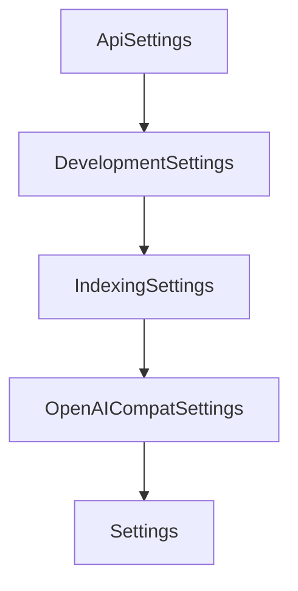

# Chapter 7: Spec Sharing and Collaboration Workflows

Welcome to **Chapter 7: Spec Sharing and Collaboration Workflows**. In this part of **Shotgun Tutorial: Spec-Driven Development for Coding Agents**, you will build an intuitive mental model first, then move into concrete implementation details and practical production tradeoffs.


Shotgun workflows are designed around reusable, versioned spec artifacts that teams can review and share.

## Artifact Model

| Artifact | Role |
|:---------|:-----|
| `.shotgun/research.md` | codebase and external findings |
| `.shotgun/specification.md` | feature definition and constraints |
| `.shotgun/plan.md` | staged implementation sequence |
| `.shotgun/tasks.md` | executable task breakdown |
| `.shotgun/AGENTS.md` | agent-facing export format |

## Collaboration Patterns

- review specs before implementation starts
- keep plan updates explicit when assumptions change
- use versioned sharing for cross-team alignment

## Source References

- [Shotgun CLI Output Files](https://github.com/shotgun-sh/shotgun/blob/main/docs/CLI.md#output-files)
- [Shotgun README: Share Specs](https://github.com/shotgun-sh/shotgun#-share-specs-with-your-team)

## Summary

You can now structure multi-person review around stable spec artifacts instead of ad hoc prompts.

Next: [Chapter 8: Production Operations, Observability, and Security](08-production-operations-observability-and-security.md)

## Depth Expansion Playbook

## Source Code Walkthrough

### `src/shotgun/settings.py`

The `ApiSettings` class in [`src/shotgun/settings.py`](https://github.com/shotgun-sh/shotgun/blob/HEAD/src/shotgun/settings.py) handles a key part of this chapter's functionality:

```py


class ApiSettings(BaseSettings):
    """API endpoint settings.

    Configuration for Shotgun backend services.
    """

    web_base_url: str = Field(
        default="https://api-219702594231.us-east4.run.app",
        description="Shotgun Web API base URL (authentication/subscription)",
    )
    account_llm_base_url: str = Field(
        default="https://litellm-219702594231.us-east4.run.app",
        description="Shotgun's LiteLLM proxy base URL (AI model requests)",
    )

    model_config = SettingsConfigDict(
        env_prefix="SHOTGUN_",
        env_file=".env",
        env_file_encoding="utf-8",
        extra="ignore",
    )


class DevelopmentSettings(BaseSettings):
    """Development and testing settings.

    These settings are primarily used for testing and development purposes.
    """

    home: str | None = Field(
```

This class is important because it defines how Shotgun Tutorial: Spec-Driven Development for Coding Agents implements the patterns covered in this chapter.

### `src/shotgun/settings.py`

The `DevelopmentSettings` class in [`src/shotgun/settings.py`](https://github.com/shotgun-sh/shotgun/blob/HEAD/src/shotgun/settings.py) handles a key part of this chapter's functionality:

```py


class DevelopmentSettings(BaseSettings):
    """Development and testing settings.

    These settings are primarily used for testing and development purposes.
    """

    home: str | None = Field(
        default=None,
        description="Override Shotgun home directory (for testing)",
    )
    pipx_simulate: bool = Field(
        default=False,
        description="Simulate pipx installation (for testing)",
    )
    version_override: str | None = Field(
        default=None,
        description="Override current version for testing (e.g., '0.1.0')",
    )
    install_method_override: str | None = Field(
        default=None,
        description="Override installation method for testing (uvx, uv-tool, pipx, pip, venv)",
    )

    model_config = SettingsConfigDict(
        env_prefix="SHOTGUN_",
        env_file=".env",
        env_file_encoding="utf-8",
        extra="ignore",
    )

```

This class is important because it defines how Shotgun Tutorial: Spec-Driven Development for Coding Agents implements the patterns covered in this chapter.

### `src/shotgun/settings.py`

The `IndexingSettings` class in [`src/shotgun/settings.py`](https://github.com/shotgun-sh/shotgun/blob/HEAD/src/shotgun/settings.py) handles a key part of this chapter's functionality:

```py


class IndexingSettings(BaseSettings):
    """Codebase indexing settings.

    Controls parallel processing behavior for code indexing.
    """

    index_parallel: bool = Field(
        default=True,
        description="Enable parallel indexing (requires 4+ CPU cores)",
    )
    index_workers: int | None = Field(
        default=None,
        description="Number of worker processes for parallel indexing (default: CPU count - 1)",
        ge=1,
    )
    index_batch_size: int | None = Field(
        default=None,
        description="Files per batch for parallel indexing (default: auto-calculated)",
        ge=1,
    )

    model_config = SettingsConfigDict(
        env_prefix="SHOTGUN_",
        env_file=".env",
        env_file_encoding="utf-8",
        extra="ignore",
    )

    @field_validator("index_parallel", mode="before")
    @classmethod
```

This class is important because it defines how Shotgun Tutorial: Spec-Driven Development for Coding Agents implements the patterns covered in this chapter.

### `src/shotgun/settings.py`

The `OpenAICompatSettings` class in [`src/shotgun/settings.py`](https://github.com/shotgun-sh/shotgun/blob/HEAD/src/shotgun/settings.py) handles a key part of this chapter's functionality:

```py


class OpenAICompatSettings(BaseSettings):
    """OpenAI-compatible endpoint settings.

    When base_url is set, Shotgun bypasses normal provider configuration
    and uses the specified endpoint directly for all LLM requests.

    Environment variables:
        SHOTGUN_OPENAI_COMPAT_BASE_URL: The base URL of the OpenAI-compatible endpoint
        SHOTGUN_OPENAI_COMPAT_API_KEY: API key for authentication
        SHOTGUN_OPENAI_COMPAT_WEB_SEARCH_MODEL: Model to use for web search (optional)
    """

    base_url: str | None = Field(
        default=None,
        description="Base URL for OpenAI-compatible endpoint (e.g., https://api.example.com/v1)",
    )
    api_key: str | None = Field(
        default=None,
        description="API key for the OpenAI-compatible endpoint",
    )
    web_search_model: str | None = Field(
        default=None,
        description="Model to use for web search (defaults to openai/gpt-5.2 if not set)",
    )

    model_config = SettingsConfigDict(
        env_prefix="SHOTGUN_OPENAI_COMPAT_",
        env_file=".env",
        env_file_encoding="utf-8",
        extra="ignore",
```

This class is important because it defines how Shotgun Tutorial: Spec-Driven Development for Coding Agents implements the patterns covered in this chapter.


## How These Components Connect


