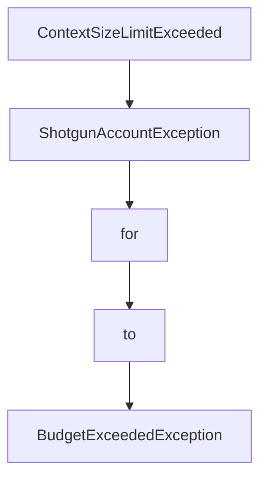

# Chapter 7: Spec Sharing and Collaboration Workflows

Welcome to **Chapter 7: Spec Sharing and Collaboration Workflows**. In this part of **Shotgun Tutorial: Spec-Driven Development for Coding Agents**, you will build an intuitive mental model first, then move into concrete implementation details and practical production tradeoffs.


Shotgun workflows are designed around reusable, versioned spec artifacts that teams can review and share.

## Artifact Model

| Artifact | Role |
|:---------|:-----|
| `.shotgun/research.md` | codebase and external findings |
| `.shotgun/specification.md` | feature definition and constraints |
| `.shotgun/plan.md` | staged implementation sequence |
| `.shotgun/tasks.md` | executable task breakdown |
| `.shotgun/AGENTS.md` | agent-facing export format |

## Collaboration Patterns

- review specs before implementation starts
- keep plan updates explicit when assumptions change
- use versioned sharing for cross-team alignment

## Source References

- [Shotgun CLI Output Files](https://github.com/shotgun-sh/shotgun/blob/main/docs/CLI.md#output-files)
- [Shotgun README: Share Specs](https://github.com/shotgun-sh/shotgun#-share-specs-with-your-team)

## Summary

You can now structure multi-person review around stable spec artifacts instead of ad hoc prompts.

Next: [Chapter 8: Production Operations, Observability, and Security](08-production-operations-observability-and-security.md)

## Source Code Walkthrough

### `src/shotgun/exceptions.py`

The `ContextSizeLimitExceeded` class in [`src/shotgun/exceptions.py`](https://github.com/shotgun-sh/shotgun/blob/HEAD/src/shotgun/exceptions.py) handles a key part of this chapter's functionality:

```py


class ContextSizeLimitExceeded(UserActionableError):  # noqa: N818
    """Raised when conversation context exceeds the model's limits.

    This is a user-actionable error - they need to either:
    1. Switch to a larger context model
    2. Switch to a larger model, compact their conversation, then switch back
    3. Clear the conversation and start fresh
    """

    def __init__(self, model_name: str, max_tokens: int):
        """Initialize the exception.

        Args:
            model_name: Name of the model whose limit was exceeded
            max_tokens: Maximum tokens allowed by the model
        """
        self.model_name = model_name
        self.max_tokens = max_tokens
        super().__init__(
            f"Context too large for {model_name} (limit: {max_tokens:,} tokens)"
        )

    def to_markdown(self) -> str:
        """Generate markdown-formatted error message for TUI."""
        return (
            f"⚠️ **Context too large for {self.model_name}**\n\n"
            f"Your conversation history exceeds this model's limit ({self.max_tokens:,} tokens).\n\n"
            f"**Choose an action:**\n\n"
            f"1. Switch to a larger model (`/` → Change Model)\n"
            f"2. Switch to a larger model, compact (`/compact`), then switch back to {self.model_name}\n"
```

This class is important because it defines how Shotgun Tutorial: Spec-Driven Development for Coding Agents implements the patterns covered in this chapter.

### `src/shotgun/exceptions.py`

The `ShotgunAccountException` class in [`src/shotgun/exceptions.py`](https://github.com/shotgun-sh/shotgun/blob/HEAD/src/shotgun/exceptions.py) handles a key part of this chapter's functionality:

```py


class ShotgunAccountException(UserActionableError):  # noqa: N818
    """Base class for Shotgun Account service errors.

    TUI will check isinstance() of this class to show contact email UI.
    """


class BudgetExceededException(ShotgunAccountException):
    """Raised when Shotgun Account budget has been exceeded.

    This is a user-actionable error - they need to contact support
    to increase their budget limit. This is a temporary exception
    until self-service budget increases are implemented.
    """

    def __init__(
        self,
        current_cost: float | None = None,
        max_budget: float | None = None,
        message: str | None = None,
    ):
        """Initialize the exception.

        Args:
            current_cost: Current total spend/cost (optional)
            max_budget: Maximum budget limit (optional)
            message: Optional custom error message from API
        """
        self.current_cost = current_cost
        self.max_budget = max_budget
```

This class is important because it defines how Shotgun Tutorial: Spec-Driven Development for Coding Agents implements the patterns covered in this chapter.

### `src/shotgun/exceptions.py`

The `for` class in [`src/shotgun/exceptions.py`](https://github.com/shotgun-sh/shotgun/blob/HEAD/src/shotgun/exceptions.py) handles a key part of this chapter's functionality:

```py
"""General exceptions for Shotgun application."""

from shotgun.utils import get_shotgun_home

# Shotgun Account signup URL for BYOK users
SHOTGUN_SIGNUP_URL = "https://shotgun.sh"
SHOTGUN_CONTACT_EMAIL = "contact@shotgun.sh"


class UserActionableError(Exception):  # noqa: N818
    """Base for user-actionable errors that shouldn't be sent to telemetry.

    These errors represent expected user conditions requiring action
    rather than bugs that need tracking.

    All subclasses should implement to_markdown() and to_plain_text() methods
    for consistent error message formatting.
    """

    def to_markdown(self) -> str:
        """Generate markdown-formatted error message for TUI.

        Subclasses should override this method.
        """
        return f"⚠️ {str(self)}"

    def to_plain_text(self) -> str:
        """Generate plain text error message for CLI.

        Subclasses should override this method.
```

This class is important because it defines how Shotgun Tutorial: Spec-Driven Development for Coding Agents implements the patterns covered in this chapter.

### `src/shotgun/exceptions.py`

The `to` class in [`src/shotgun/exceptions.py`](https://github.com/shotgun-sh/shotgun/blob/HEAD/src/shotgun/exceptions.py) handles a key part of this chapter's functionality:

```py

class UserActionableError(Exception):  # noqa: N818
    """Base for user-actionable errors that shouldn't be sent to telemetry.

    These errors represent expected user conditions requiring action
    rather than bugs that need tracking.

    All subclasses should implement to_markdown() and to_plain_text() methods
    for consistent error message formatting.
    """

    def to_markdown(self) -> str:
        """Generate markdown-formatted error message for TUI.

        Subclasses should override this method.
        """
        return f"⚠️ {str(self)}"

    def to_plain_text(self) -> str:
        """Generate plain text error message for CLI.

        Subclasses should override this method.
        """
        return f"⚠️  {str(self)}"


# ============================================================================
# User Action Required Errors
# ============================================================================


class AgentCancelledException(UserActionableError):  # noqa: N818
```

This class is important because it defines how Shotgun Tutorial: Spec-Driven Development for Coding Agents implements the patterns covered in this chapter.


## How These Components Connect


