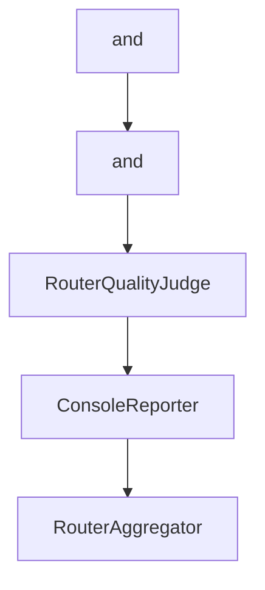

# Chapter 8: Production Operations, Observability, and Security

Welcome to **Chapter 8: Production Operations, Observability, and Security**. In this part of **Shotgun Tutorial: Spec-Driven Development for Coding Agents**, you will build an intuitive mental model first, then move into concrete implementation details and practical production tradeoffs.


Production use of Shotgun requires clear controls across CI, runtime telemetry, and deployment boundaries.

## Production Checklist

1. enforce CI gates (lint, tests, typing, secret scan)
2. pin installation/runtime versions in automation
3. manage API keys and telemetry environment variables explicitly
4. monitor errors and performance with configured observability backends

## Deployment Modes

- local/TUI for daily engineering loops
- scripted CLI for CI or batch pipelines
- containerized runtime for isolated web workflows

## Risk Controls

- keep secret scanning active in pipelines
- isolate config and credentials per environment
- treat generated plans/specs as reviewable artifacts before execution

## Source References

- [CI/CD Docs](https://github.com/shotgun-sh/shotgun/blob/main/docs/CI_CD.md)
- [Observability Docs](https://github.com/shotgun-sh/shotgun/blob/main/docs/OBSERVABILITY.md)
- [Docker Guide](https://github.com/shotgun-sh/shotgun/blob/main/docs/DOCKER.md)

## Summary

You now have an operating baseline for running Shotgun in team and production workflows.

## Depth Expansion Playbook

## Source Code Walkthrough

### `src/shotgun/posthog_telemetry.py`

The `and` interface in [`src/shotgun/posthog_telemetry.py`](https://github.com/shotgun-sh/shotgun/blob/HEAD/src/shotgun/posthog_telemetry.py) handles a key part of this chapter's functionality:

```py
from shotgun.settings import settings

# Use early logger to prevent automatic StreamHandler creation
logger = get_early_logger(__name__)


def _get_environment() -> str:
    """Determine environment from version string.

    Returns:
        'development' for dev/rc/alpha/beta versions, 'production' otherwise
    """
    if any(marker in __version__ for marker in ["dev", "rc", "alpha", "beta"]):
        return "development"
    return "production"


# Global PostHog client instance
_posthog_client: Posthog | None = None

# Cache user context to avoid async calls during event tracking
_shotgun_instance_id: str | None = None
_user_context: dict[str, Any] = {}

# Store original exception hook
_original_excepthook: Any = None


def _install_exception_hook() -> None:
    """Install custom exception hook to capture unhandled exceptions with full context."""
    import sys

```

This interface is important because it defines how Shotgun Tutorial: Spec-Driven Development for Coding Agents implements the patterns covered in this chapter.

### `src/shotgun/posthog_telemetry.py`

The `and` interface in [`src/shotgun/posthog_telemetry.py`](https://github.com/shotgun-sh/shotgun/blob/HEAD/src/shotgun/posthog_telemetry.py) handles a key part of this chapter's functionality:

```py
from shotgun.settings import settings

# Use early logger to prevent automatic StreamHandler creation
logger = get_early_logger(__name__)


def _get_environment() -> str:
    """Determine environment from version string.

    Returns:
        'development' for dev/rc/alpha/beta versions, 'production' otherwise
    """
    if any(marker in __version__ for marker in ["dev", "rc", "alpha", "beta"]):
        return "development"
    return "production"


# Global PostHog client instance
_posthog_client: Posthog | None = None

# Cache user context to avoid async calls during event tracking
_shotgun_instance_id: str | None = None
_user_context: dict[str, Any] = {}

# Store original exception hook
_original_excepthook: Any = None


def _install_exception_hook() -> None:
    """Install custom exception hook to capture unhandled exceptions with full context."""
    import sys

```

This interface is important because it defines how Shotgun Tutorial: Spec-Driven Development for Coding Agents implements the patterns covered in this chapter.

### `evals/judges/router_quality_judge.py`

The `RouterQualityJudge` class in [`evals/judges/router_quality_judge.py`](https://github.com/shotgun-sh/shotgun/blob/HEAD/evals/judges/router_quality_judge.py) handles a key part of this chapter's functionality:

```py


class RouterQualityJudge:
    """
    LLM-as-a-judge evaluator for Router agent quality.

    Uses structured output to evaluate Router outputs against rubrics.
    Configured with low temperature for consistent, deterministic evaluation.
    """

    def __init__(
        self,
        model_config: JudgeModelConfig | None = None,
        dimensions: list[RouterDimension] | None = None,
    ) -> None:
        """Initialize the Router quality judge.

        Args:
            model_config: Judge model configuration. Defaults to Claude Sonnet.
            dimensions: Dimensions to evaluate. Defaults to all dimensions.
        """
        self.model_config = model_config or JudgeModelConfig(
            provider=JudgeProviderType.ANTHROPIC,
            model_name="claude-opus-4-6",
            temperature=0.2,  # Low temperature for consistency
            max_tokens=2000,
        )

        self.dimensions = dimensions or list(RouterDimension)
        self.rubrics = {dim: DEFAULT_RUBRICS[dim] for dim in self.dimensions}

    def _create_combined_judge_agent(self) -> Agent[None, AllDimensionsScoreOutput]:
```

This class is important because it defines how Shotgun Tutorial: Spec-Driven Development for Coding Agents implements the patterns covered in this chapter.

### `evals/reporters/console.py`

The `ConsoleReporter` class in [`evals/reporters/console.py`](https://github.com/shotgun-sh/shotgun/blob/HEAD/evals/reporters/console.py) handles a key part of this chapter's functionality:

```py


class ConsoleReporter:
    """
    Formats evaluation reports for console output.

    Emphasizes scores and trace references for quick debugging.
    """

    # ANSI color codes
    GREEN = "\033[92m"
    RED = "\033[91m"
    YELLOW = "\033[93m"
    BLUE = "\033[94m"
    BOLD = "\033[1m"
    RESET = "\033[0m"

    def __init__(self, use_color: bool = True) -> None:
        """Initialize the console reporter.

        Args:
            use_color: Whether to use ANSI color codes
        """
        self.use_color = use_color and sys.stdout.isatty()

    def _color(self, text: str, color: str) -> str:
        """Apply color to text if colors are enabled."""
        if self.use_color:
            return f"{color}{text}{self.RESET}"
        return text

    def _status_icon(self, passed: bool) -> str:
```

This class is important because it defines how Shotgun Tutorial: Spec-Driven Development for Coding Agents implements the patterns covered in this chapter.


## How These Components Connect


