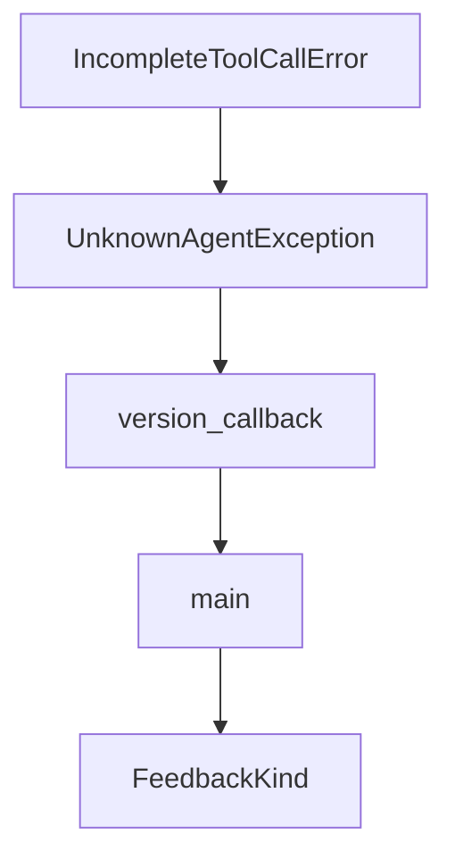

# Chapter 8: Production Operations, Observability, and Security

Welcome to **Chapter 8: Production Operations, Observability, and Security**. In this part of **Shotgun Tutorial: Spec-Driven Development for Coding Agents**, you will build an intuitive mental model first, then move into concrete implementation details and practical production tradeoffs.


Production use of Shotgun requires clear controls across CI, runtime telemetry, and deployment boundaries.

## Production Checklist

1. enforce CI gates (lint, tests, typing, secret scan)
2. pin installation/runtime versions in automation
3. manage API keys and telemetry environment variables explicitly
4. monitor errors and performance with configured observability backends

## Deployment Modes

- local/TUI for daily engineering loops
- scripted CLI for CI or batch pipelines
- containerized runtime for isolated web workflows

## Risk Controls

- keep secret scanning active in pipelines
- isolate config and credentials per environment
- treat generated plans/specs as reviewable artifacts before execution

## Source References

- [CI/CD Docs](https://github.com/shotgun-sh/shotgun/blob/main/docs/CI_CD.md)
- [Observability Docs](https://github.com/shotgun-sh/shotgun/blob/main/docs/OBSERVABILITY.md)
- [Docker Guide](https://github.com/shotgun-sh/shotgun/blob/main/docs/DOCKER.md)

## Summary

You now have an operating baseline for running Shotgun in team and production workflows.

## Source Code Walkthrough

### `src/shotgun/exceptions.py`

The `IncompleteToolCallError` class in [`src/shotgun/exceptions.py`](https://github.com/shotgun-sh/shotgun/blob/HEAD/src/shotgun/exceptions.py) handles a key part of this chapter's functionality:

```py


class IncompleteToolCallError(UserActionableError):  # noqa: N818
    """Raised when the model generates a tool call with truncated/incomplete JSON arguments.

    This can happen when the model's output is cut off mid-stream (e.g., due to
    token limits, network issues, or oversized arguments).
    """

    def __init__(self, tool_name: str | None = None):
        """Initialize the exception.

        Args:
            tool_name: Optional name of the tool that had incomplete args
        """
        self.tool_name = tool_name
        msg = "Tool call failed due to incomplete arguments"
        if tool_name:
            msg = f"Tool call '{tool_name}' failed due to incomplete arguments"
        super().__init__(msg)

    def to_markdown(self) -> str:
        """Generate markdown-formatted error message for TUI."""
        tool_info = f" (`{self.tool_name}`)" if self.tool_name else ""
        return (
            f"⚠️ **A tool call{tool_info} failed due to truncated arguments.**\n\n"
            "The model's output was cut off before completing the tool call.\n\n"
            "**Try again** — this is usually a transient issue."
        )

    def to_plain_text(self) -> str:
        """Generate plain text error message for CLI."""
```

This class is important because it defines how Shotgun Tutorial: Spec-Driven Development for Coding Agents implements the patterns covered in this chapter.

### `src/shotgun/exceptions.py`

The `UnknownAgentException` class in [`src/shotgun/exceptions.py`](https://github.com/shotgun-sh/shotgun/blob/HEAD/src/shotgun/exceptions.py) handles a key part of this chapter's functionality:

```py


class UnknownAgentException(UserActionableError):  # noqa: N818
    """Raised for unknown/unclassified agent errors."""

    def __init__(self, original_exception: Exception):
        """Initialize the exception.

        Args:
            original_exception: The original exception that was caught
        """
        self.original_exception = original_exception
        super().__init__(str(original_exception))

    def to_markdown(self) -> str:
        """Generate markdown-formatted error message for TUI."""
        log_path = get_shotgun_home() / "logs" / "shotgun.log"
        return f"⚠️ An error occurred: {str(self.original_exception)}\n\nCheck logs at {log_path}"

    def to_plain_text(self) -> str:
        """Generate plain text error message for CLI."""
        log_path = get_shotgun_home() / "logs" / "shotgun.log"
        return f"⚠️  An error occurred: {str(self.original_exception)}\n\nCheck logs at {log_path}"

```

This class is important because it defines how Shotgun Tutorial: Spec-Driven Development for Coding Agents implements the patterns covered in this chapter.

### `src/shotgun/main.py`

The `version_callback` function in [`src/shotgun/main.py`](https://github.com/shotgun-sh/shotgun/blob/HEAD/src/shotgun/main.py) handles a key part of this chapter's functionality:

```py


def version_callback(value: bool) -> None:
    """Show version and exit."""
    if value:
        from rich.console import Console

        console = Console()
        console.print(f"shotgun {__version__}")
        raise typer.Exit()


@app.callback(invoke_without_command=True)
def main(
    ctx: typer.Context,
    version: Annotated[
        bool,
        typer.Option(
            "--version",
            "-v",
            callback=version_callback,
            is_eager=True,
            help="Show version and exit",
        ),
    ] = False,
    no_update_check: Annotated[
        bool,
        typer.Option(
            "--no-update-check",
            help="Disable automatic update checks",
        ),
    ] = False,
```

This function is important because it defines how Shotgun Tutorial: Spec-Driven Development for Coding Agents implements the patterns covered in this chapter.

### `src/shotgun/main.py`

The `main` function in [`src/shotgun/main.py`](https://github.com/shotgun-sh/shotgun/blob/HEAD/src/shotgun/main.py) handles a key part of this chapter's functionality:

```py

@app.callback(invoke_without_command=True)
def main(
    ctx: typer.Context,
    version: Annotated[
        bool,
        typer.Option(
            "--version",
            "-v",
            callback=version_callback,
            is_eager=True,
            help="Show version and exit",
        ),
    ] = False,
    no_update_check: Annotated[
        bool,
        typer.Option(
            "--no-update-check",
            help="Disable automatic update checks",
        ),
    ] = False,
    continue_session: Annotated[
        bool,
        typer.Option(
            "--continue",
            "-c",
            help="Continue previous TUI conversation",
        ),
    ] = False,
    web: Annotated[
        bool,
        typer.Option(
```

This function is important because it defines how Shotgun Tutorial: Spec-Driven Development for Coding Agents implements the patterns covered in this chapter.


## How These Components Connect


