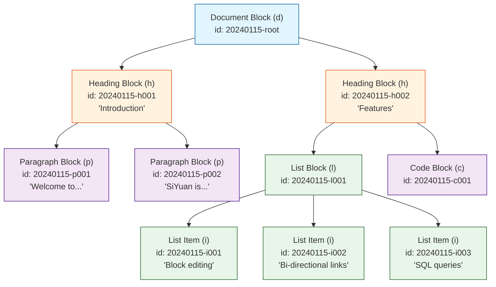
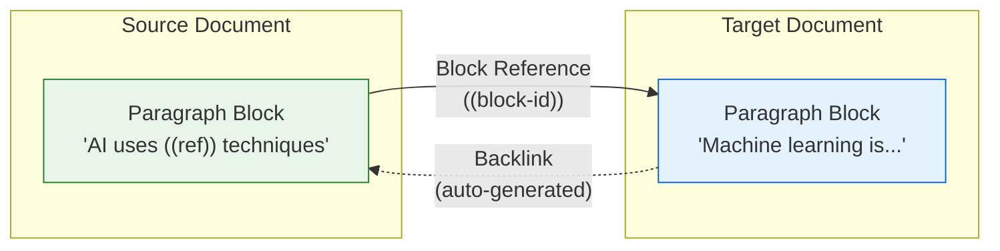
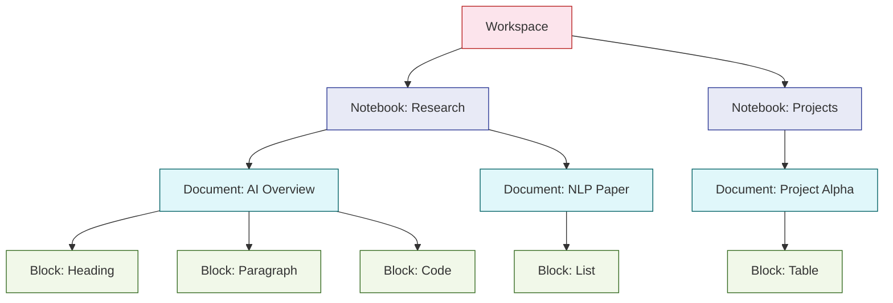
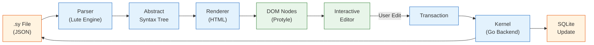

# Chapter 2: Block-Based Architecture

In [Chapter 1](01-getting-started.md), we installed SiYuan and explored the basics of creating documents and blocks. Now we'll take a deep dive into SiYuan's most distinctive feature: its block-based architecture. Understanding how blocks work is essential to mastering everything else in SiYuan.

## Why Blocks Matter

Most knowledge management tools think in terms of pages or files. SiYuan thinks in terms of **blocks**. Every piece of content -- a paragraph, heading, list, code snippet, or table -- is a block with its own unique identity. This seemingly simple choice unlocks powerful capabilities:

- **Fine-grained linking**: Reference any paragraph, not just a page
- **Structural queries**: Search and filter by block type, attributes, and relationships
- **Composable documents**: Embed and reuse blocks across documents
- **Precise version tracking**: Track changes at the block level

## Block Types

SiYuan supports a rich set of block types, each with its own rendering and behavior:

| Block Type | Type Code | Description | Supports Children |
|---|---|---|---|
| Document | `d` | Root container for all blocks | Yes |
| Heading | `h` | Section headings (H1-H6) | Yes (as section) |
| Paragraph | `p` | Plain text content | No |
| List | `l` | Ordered or unordered list container | Yes |
| List Item | `i` | Individual list entry | Yes |
| Code Block | `c` | Syntax-highlighted code | No |
| Math Block | `m` | LaTeX mathematical expressions | No |
| Table | `t` | Tabular data | Yes |
| Blockquote | `b` | Quoted content | Yes |
| Super Block | `s` | Layout container (columns/rows) | Yes |
| Embed Block | `e` | Embedded query results | No |
| Widget Block | `widget` | Custom widget container | No |
| IFrame | `iframe` | External web content | No |
| Audio | `audio` | Audio file player | No |
| Video | `video` | Video file player | No |

### Block Type Definitions in Go

The backend defines block types as constants used throughout the system:

```go
// kernel/treenode/node.go
package treenode

// Block type constants used across SiYuan's kernel
const (
    TypeDocument     = "d"
    TypeHeading      = "h"
    TypeParagraph    = "p"
    TypeList         = "l"
    TypeListItem     = "i"
    TypeCodeBlock    = "c"
    TypeMathBlock    = "m"
    TypeTable        = "t"
    TypeBlockquote   = "b"
    TypeSuperBlock   = "s"
    TypeEmbedBlock   = "e"
    TypeWidget       = "widget"
    TypeIFrame       = "iframe"
    TypeAudio        = "audio"
    TypeVideo        = "video"
)

// BlockTypeDisplayName returns a human-readable label
func BlockTypeDisplayName(typ string) string {
    switch typ {
    case TypeDocument:
        return "Document"
    case TypeHeading:
        return "Heading"
    case TypeParagraph:
        return "Paragraph"
    case TypeList:
        return "List"
    case TypeListItem:
        return "List Item"
    case TypeCodeBlock:
        return "Code Block"
    case TypeMathBlock:
        return "Math Block"
    case TypeTable:
        return "Table"
    case TypeBlockquote:
        return "Blockquote"
    case TypeSuperBlock:
        return "Super Block"
    default:
        return "Unknown"
    }
}
```

## Block Identity

Every block receives a unique ID at creation time. SiYuan uses a time-based ID format that encodes when and where a block was created:

```go
// kernel/util/id.go
package util

import (
    "fmt"
    "time"
    "math/rand"
)

// NewBlockID generates a unique block identifier.
// Format: YYYYMMDDHHmmss-XXXXXXX (timestamp + 7-char random suffix)
func NewBlockID() string {
    now := time.Now()
    timestamp := now.Format("20060102150405")
    suffix := fmt.Sprintf("%07x", rand.Intn(0x10000000))
    return fmt.Sprintf("%s-%s", timestamp, suffix)
}

// ParseBlockIDTime extracts the creation timestamp from a block ID
func ParseBlockIDTime(id string) (time.Time, error) {
    if len(id) < 14 {
        return time.Time{}, fmt.Errorf("invalid block ID: %s", id)
    }
    return time.ParseInLocation("20060102150405", id[:14], time.Local)
}
```

Example block IDs:

```
20240115143026-abc1234   // Created Jan 15, 2024 at 14:30:26
20240115143026-def5678   // Created at same second, different suffix
20240116091500-0a1b2c3   // Created Jan 16, 2024 at 09:15:00
```

## Block Tree Structure

Blocks form a tree hierarchy. A document is the root, and all blocks nest within it. This tree structure is the backbone of SiYuan's data model.



### Tree Operations in Go

SiYuan's kernel implements tree operations for building and traversing the block hierarchy:

```go
// kernel/treenode/tree.go
package treenode

import "sync"

// Tree represents a document's block tree in memory
type Tree struct {
    ID       string  // Document (root) block ID
    Root     *Node   // Root node of the tree
    Box      string  // Notebook ID containing this tree
    Path     string  // File path within the notebook
    mu       sync.RWMutex
}

// Node represents a single block in the tree
type Node struct {
    ID         string
    Type       string
    Content    string
    Properties map[string]string  // Custom attributes (key-value)
    Children   []*Node
    Parent     *Node
    Next       *Node              // Next sibling
    Previous   *Node              // Previous sibling
}

// Walk traverses the tree depth-first, calling fn for each node.
// If fn returns false, the traversal stops.
func (t *Tree) Walk(fn func(n *Node) bool) {
    t.mu.RLock()
    defer t.mu.RUnlock()
    walkNode(t.Root, fn)
}

func walkNode(n *Node, fn func(*Node) bool) {
    if n == nil {
        return
    }
    if !fn(n) {
        return
    }
    for _, child := range n.Children {
        walkNode(child, fn)
    }
}

// GetNodeByID finds a node by its block ID
func (t *Tree) GetNodeByID(id string) *Node {
    var result *Node
    t.Walk(func(n *Node) bool {
        if n.ID == id {
            result = n
            return false // stop walking
        }
        return true
    })
    return result
}

// InsertAfter inserts a new node after the given sibling
func (t *Tree) InsertAfter(newNode, sibling *Node) {
    t.mu.Lock()
    defer t.mu.Unlock()

    parent := sibling.Parent
    newNode.Parent = parent
    newNode.Previous = sibling
    newNode.Next = sibling.Next

    if sibling.Next != nil {
        sibling.Next.Previous = newNode
    }
    sibling.Next = newNode

    // Update parent's children slice
    for i, child := range parent.Children {
        if child.ID == sibling.ID {
            updated := make([]*Node, 0, len(parent.Children)+1)
            updated = append(updated, parent.Children[:i+1]...)
            updated = append(updated, newNode)
            updated = append(updated, parent.Children[i+1:]...)
            parent.Children = updated
            break
        }
    }
}
```

## Block References and Backlinks

Block references are one of SiYuan's most powerful features. They create connections between blocks, enabling a knowledge graph within your notes.

### Reference Types



There are two reference syntaxes:

| Syntax | Name | Behavior |
|---|---|---|
| `((block-id "anchor text"))` | Content Reference | Shows anchor text inline, links to target block |
| `{{block-id}}` | Embed Reference | Renders the full target block content inline |

### Reference Data Model

References are stored in both the tree structure and the database for fast lookups:

```go
// kernel/model/ref.go
package model

// Ref represents a block-to-block reference
type Ref struct {
    FromBlockID  string `json:"fromBlockID"`  // Source block
    ToBlockID    string `json:"toBlockID"`    // Target block
    AnchorText   string `json:"anchorText"`   // Display text
    Type         int    `json:"type"`         // 0=content ref, 1=embed ref
    FromRootID   string `json:"fromRootID"`   // Source document
    ToRootID     string `json:"toRootID"`     // Target document
}

// GetBacklinks returns all blocks that reference the given block
func GetBacklinks(blockID string) ([]*Ref, error) {
    stmt := `SELECT from_block_id, to_block_id, anchor_text, type,
                    from_root_id, to_root_id
             FROM refs
             WHERE to_block_id = ?
             ORDER BY from_root_id`
    rows, err := db.Query(stmt, blockID)
    if err != nil {
        return nil, err
    }
    defer rows.Close()

    var refs []*Ref
    for rows.Next() {
        ref := &Ref{}
        if err := rows.Scan(
            &ref.FromBlockID, &ref.ToBlockID, &ref.AnchorText,
            &ref.Type, &ref.FromRootID, &ref.ToRootID,
        ); err != nil {
            return nil, err
        }
        refs = append(refs, ref)
    }
    return refs, nil
}

// GetForwardLinks returns all blocks referenced by the given block
func GetForwardLinks(blockID string) ([]*Ref, error) {
    stmt := `SELECT from_block_id, to_block_id, anchor_text, type,
                    from_root_id, to_root_id
             FROM refs
             WHERE from_block_id = ?
             ORDER BY to_root_id`
    rows, err := db.Query(stmt, blockID)
    if err != nil {
        return nil, err
    }
    defer rows.Close()

    var refs []*Ref
    for rows.Next() {
        ref := &Ref{}
        if err := rows.Scan(
            &ref.FromBlockID, &ref.ToBlockID, &ref.AnchorText,
            &ref.Type, &ref.FromRootID, &ref.ToRootID,
        ); err != nil {
            return nil, err
        }
        refs = append(refs, ref)
    }
    return refs, nil
}
```

### Working with References via the API

```typescript
// Frontend: Creating and resolving references

// Create a block reference
async function createBlockRef(
    sourceBlockID: string,
    targetBlockID: string,
    anchorText: string
): Promise<void> {
    const refMarkdown = `((${targetBlockID} "${anchorText}"))`;

    await fetch("/api/block/updateBlock", {
        method: "POST",
        headers: { "Content-Type": "application/json" },
        body: JSON.stringify({
            id: sourceBlockID,
            dataType: "markdown",
            data: refMarkdown,
        }),
    });
}

// Get all backlinks for a block
async function getBacklinks(blockID: string): Promise<Ref[]> {
    const response = await fetch("/api/ref/getBacklink", {
        method: "POST",
        headers: { "Content-Type": "application/json" },
        body: JSON.stringify({ id: blockID }),
    });
    const result = await response.json();
    return result.data.backlinks;
}

// Build a local reference graph from a starting block
async function buildRefGraph(
    startBlockID: string,
    depth: number = 2
): Promise<Map<string, string[]>> {
    const graph = new Map<string, string[]>();
    const visited = new Set<string>();
    const queue: { id: string; level: number }[] = [
        { id: startBlockID, level: 0 },
    ];

    while (queue.length > 0) {
        const { id, level } = queue.shift()!;
        if (visited.has(id) || level > depth) continue;
        visited.add(id);

        const backlinks = await getBacklinks(id);
        const linkedIDs = backlinks.map((ref) => ref.fromBlockID);
        graph.set(id, linkedIDs);

        for (const linkedID of linkedIDs) {
            if (!visited.has(linkedID)) {
                queue.push({ id: linkedID, level: level + 1 });
            }
        }
    }

    return graph;
}
```

## Custom Block Attributes

Every block can carry custom key-value attributes. These attributes are the foundation for building structured knowledge systems on top of SiYuan.

### Setting Attributes

```typescript
// Set custom attributes on a block
async function setBlockAttributes(
    blockID: string,
    attrs: Record<string, string>
): Promise<void> {
    await fetch("/api/attr/setBlockAttrs", {
        method: "POST",
        headers: { "Content-Type": "application/json" },
        body: JSON.stringify({
            id: blockID,
            attrs: attrs,
        }),
    });
}

// Example: Tag a block with metadata
await setBlockAttributes("20240115143026-abc1234", {
    "custom-status": "reviewed",
    "custom-priority": "high",
    "custom-category": "machine-learning",
    "custom-due-date": "2024-02-01",
});
```

### Querying by Attributes

Once blocks have attributes, you can query them with SQL:

```sql
-- Find all blocks with "high" priority
SELECT b.id, b.content, b.type
FROM blocks AS b
JOIN attributes AS a ON b.id = a.block_id
WHERE a.name = 'custom-priority'
  AND a.value = 'high';

-- Find blocks due before a specific date
SELECT b.id, b.content,
       a1.value AS priority,
       a2.value AS due_date
FROM blocks AS b
JOIN attributes AS a1 ON b.id = a1.block_id AND a1.name = 'custom-priority'
JOIN attributes AS a2 ON b.id = a2.block_id AND a2.name = 'custom-due-date'
WHERE a2.value < '2024-02-01'
ORDER BY a1.value DESC;

-- Count blocks by category
SELECT a.value AS category, COUNT(*) AS block_count
FROM attributes AS a
WHERE a.name = 'custom-category'
GROUP BY a.value
ORDER BY block_count DESC;
```

## Document Structure and Notebooks

Documents and notebooks form the organizational layer above blocks:



### Notebook Configuration

Each notebook has its own configuration that controls sorting, appearance, and behavior:

```go
// kernel/model/notebook.go
package model

// Notebook represents a top-level container for documents
type Notebook struct {
    ID       string           `json:"id"`
    Name     string           `json:"name"`
    Sort     int              `json:"sort"`
    Icon     string           `json:"icon"`
    Closed   bool             `json:"closed"`
    SortMode int              `json:"sortMode"`   // 0=name, 1=modified, 2=created
    Conf     *NotebookConf    `json:"conf"`
}

// NotebookConf holds per-notebook settings
type NotebookConf struct {
    RefCreateSavePath   string `json:"refCreateSavePath"`
    CreateDocNameTpl    string `json:"createDocNameTpl"`
    DailyNoteSavePath   string `json:"dailyNoteSavePath"`
    DailyNoteTemplatePath string `json:"dailyNoteTemplatePath"`
}
```

### The .sy File Format

SiYuan stores each document as a `.sy` file -- a JSON representation of the block tree:

```json
{
  "ID": "20240115143026-abc1234",
  "Type": "NodeDocument",
  "Properties": {
    "id": "20240115143026-abc1234",
    "title": "AI Research Notes",
    "updated": "20240116091500"
  },
  "Children": [
    {
      "ID": "20240115143026-h001",
      "Type": "NodeHeading",
      "HeadingLevel": 1,
      "Properties": {
        "id": "20240115143026-h001"
      },
      "Children": [
        {
          "Type": "NodeText",
          "Data": "Introduction to AI"
        }
      ]
    },
    {
      "ID": "20240115143026-p001",
      "Type": "NodeParagraph",
      "Properties": {
        "id": "20240115143026-p001"
      },
      "Children": [
        {
          "Type": "NodeText",
          "Data": "Artificial intelligence encompasses..."
        }
      ]
    }
  ]
}
```

## Block Rendering Pipeline

When a block is displayed in the editor, it goes through a rendering pipeline that transforms the stored data into interactive HTML:



### The Lute Markdown Engine

SiYuan uses its own Markdown engine called **Lute** (written in Go) for parsing and rendering:

```go
// lute/parse/parse.go
package parse

import "github.com/siyuan-note/lute/ast"

// Parse converts a Markdown string into a Lute AST
func Parse(name string, markdown []byte, options *Options) *ast.Tree {
    lexer := NewLexer(markdown)
    tokens := lexer.Tokenize()

    parser := &Parser{
        tokens:  tokens,
        options: options,
    }

    tree := &ast.Tree{
        Name: name,
        Root: &ast.Node{Type: ast.NodeDocument},
    }

    parser.parseBlocks(tree.Root)
    parser.parseInlines(tree.Root)

    return tree
}
```

## Block Transactions

All block modifications go through a transaction system that ensures consistency and supports undo/redo:

```typescript
// Frontend transaction system
interface BlockOperation {
    action: "insert" | "update" | "delete" | "move";
    id: string;
    data?: string;
    parentID?: string;
    previousID?: string;
}

interface Transaction {
    doOperations: BlockOperation[];
    undoOperations: BlockOperation[];
    timestamp: number;
}

// Perform a block edit through the transaction system
async function performTransaction(ops: BlockOperation[]): Promise<void> {
    const tx: Transaction = {
        doOperations: ops,
        undoOperations: generateUndoOps(ops),
        timestamp: Date.now(),
    };

    await fetch("/api/transactions", {
        method: "POST",
        headers: { "Content-Type": "application/json" },
        body: JSON.stringify({ transactions: [tx] }),
    });
}

// Example: Move a block under a new parent
await performTransaction([
    {
        action: "move",
        id: "20240115143026-p001",
        parentID: "20240115143026-h002",
        previousID: "",  // First child of new parent
    },
]);

// Example: Update block content
await performTransaction([
    {
        action: "update",
        id: "20240115143026-p001",
        data: "<div data-node-id=\"20240115143026-p001\" data-type=\"NodeParagraph\">Updated content here</div>",
    },
]);
```

## Summary

SiYuan's block-based architecture is the foundation that everything else builds upon. Here are the key takeaways:

| Concept | Description |
|---|---|
| **Block Identity** | Every block gets a unique time-based ID for stable references |
| **Block Tree** | Blocks form a parent-child hierarchy within documents |
| **Block Types** | 15+ types cover all content needs (text, code, tables, embeds) |
| **References** | `((id))` and `{{id}}` link blocks across documents |
| **Backlinks** | Automatic reverse-link tracking builds a knowledge graph |
| **Attributes** | Custom key-value pairs enable structured metadata |
| **Transactions** | All edits go through a transactional system for consistency |
| **Lute Engine** | Custom Markdown engine handles parsing and rendering |

## Key Takeaways

1. **Blocks are the atomic unit** -- not pages, not files. Every operation in SiYuan works at the block level.
2. **Block IDs are stable** -- once created, an ID never changes, making references resilient to edits and moves.
3. **The tree structure is flexible** -- blocks can be nested, moved, and reorganized without breaking references.
4. **References create a graph** -- bidirectional links turn your notes into a connected knowledge network.
5. **Attributes extend blocks** -- custom metadata transforms simple notes into structured databases.

## Next Steps

Now that you understand SiYuan's block architecture, let's explore how all this data is stored and synchronized. In [Chapter 3: Data Storage & Persistence](03-data-storage.md), we'll examine the SQLite schema, file system layout, and cloud sync protocol.

---

*Built with insights from the [SiYuan](https://github.com/siyuan-note/siyuan) project.*
