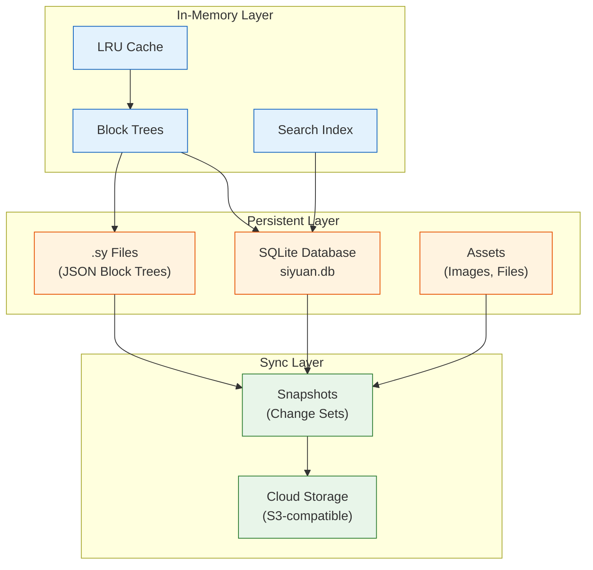
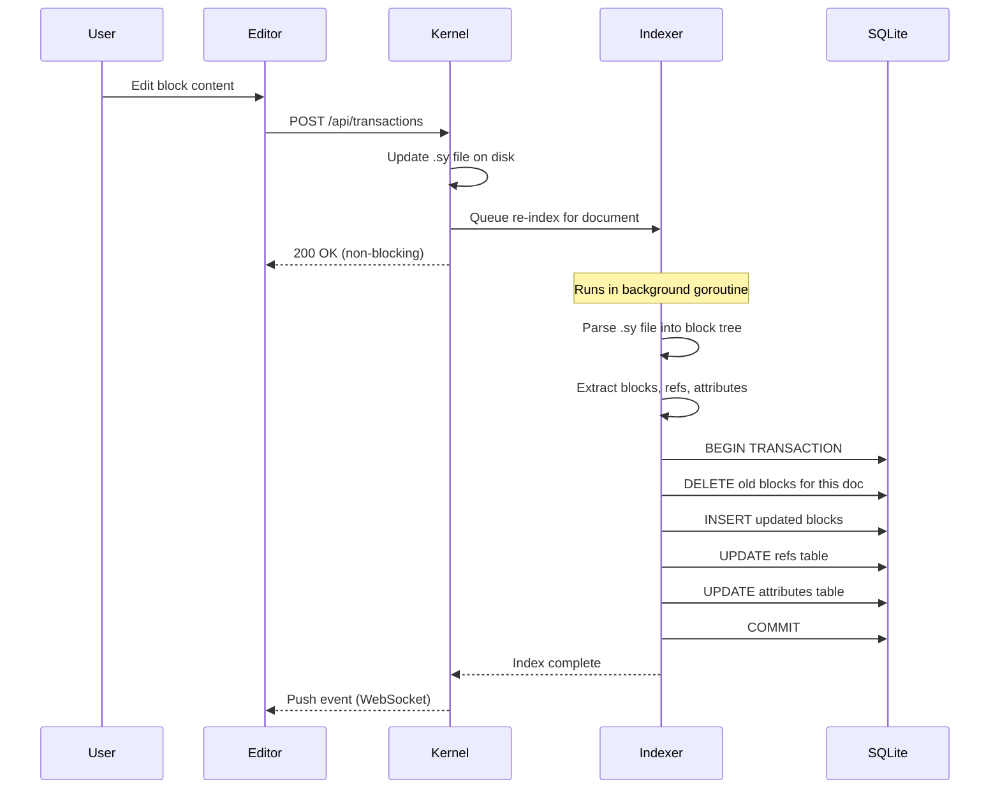
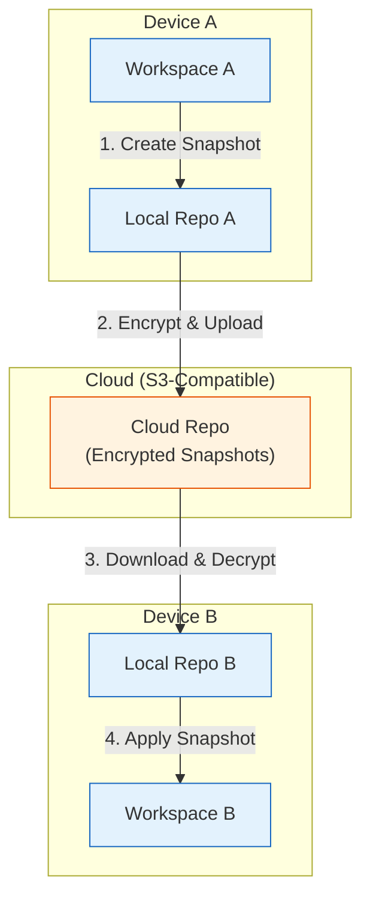
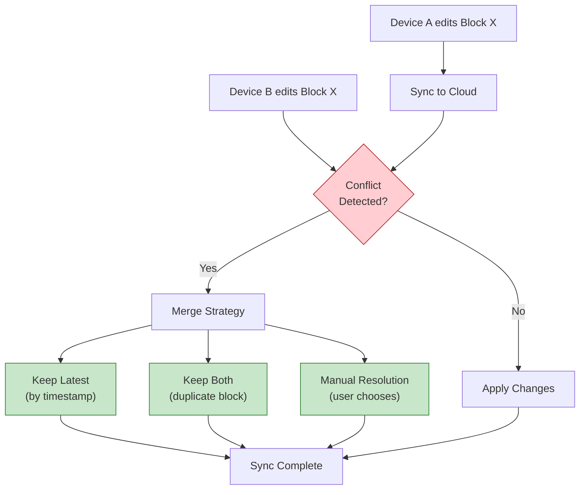

# Chapter 3: Data Storage & Persistence

Welcome to **Chapter 3: Data Storage & Persistence**. In this part of **SiYuan Tutorial: Privacy-First Knowledge Management**, you will build an intuitive mental model first, then move into concrete implementation details and practical production tradeoffs.


In [Chapter 2](02-block-architecture.md), we explored SiYuan's block-based architecture and how blocks form a tree hierarchy. Now let's look under the hood at how all that data is persisted, organized on disk, and synchronized across devices. SiYuan's storage layer is carefully designed to balance performance, privacy, and portability.

## Storage Architecture Overview

SiYuan uses a hybrid storage approach that combines a SQLite database for fast querying with a file-based system for human-readable exports and synchronization.



## File System Layout

A SiYuan workspace follows a well-defined directory structure. Understanding this layout is crucial for backup, migration, and troubleshooting.

```
workspace/
├── conf/
│   ├── conf.json              # Application configuration
│   ├── appearance.json        # Theme and UI settings
│   └── keymap.json            # Keyboard shortcuts
├── data/
│   ├── <notebook-id>/         # One directory per notebook
│   │   ├── .siyuan/
│   │   │   └── conf.json      # Notebook configuration
│   │   ├── <doc-id>.sy        # Document files (JSON)
│   │   ├── <doc-id>/          # Sub-document directory
│   │   │   ├── <child-id>.sy
│   │   │   └── <child-id>/
│   │   └── ...
│   ├── assets/                # Shared asset storage
│   │   ├── image-20240115.png
│   │   ├── document.pdf
│   │   └── ...
│   ├── emojis/                # Custom emoji files
│   ├── snippets/              # CSS/JS code snippets
│   ├── storage/               # Plugin and widget data
│   │   ├── local.json
│   │   ├── criterion.json     # Search criteria
│   │   └── petal/             # Plugin storage
│   ├── templates/             # Document templates
│   │   └── daily-note.md
│   └── widgets/               # Installed widgets
│       └── note-chart/
├── history/                   # Local edit history
│   ├── 2024-01-15-143026-update/
│   │   └── <notebook-id>/
│   │       └── <doc-id>.sy
│   └── ...
├── repo/                      # Sync repository (snapshots)
│   ├── objects/
│   ├── refs/
│   └── indexes/
├── temp/                      # Temporary files
│   ├── convert/
│   └── export/
└── log/
    └── siyuan.log             # Application log
```

### Path Conventions

SiYuan uses a hierarchical path system where document nesting is reflected in the directory structure:

```go
// kernel/model/file.go
package model

import (
    "path/filepath"
    "strings"
)

// DocPath builds the file system path for a document.
// A document at logical path /Research/AI/GPT becomes:
//   <notebook-dir>/Research/AI/GPT.sy
func DocPath(notebookDir, logicalPath string) string {
    parts := strings.Split(logicalPath, "/")
    // Last part becomes the .sy filename
    filename := parts[len(parts)-1] + ".sy"
    // Earlier parts form the directory path
    dirParts := parts[:len(parts)-1]
    dir := filepath.Join(append([]string{notebookDir}, dirParts...)...)
    return filepath.Join(dir, filename)
}

// DocChildren lists immediate child documents of a path
func DocChildren(notebookDir, parentPath string) ([]string, error) {
    parentDir := filepath.Join(notebookDir, parentPath)
    entries, err := os.ReadDir(parentDir)
    if err != nil {
        return nil, err
    }

    var children []string
    for _, entry := range entries {
        if !entry.IsDir() && strings.HasSuffix(entry.Name(), ".sy") {
            children = append(children, strings.TrimSuffix(entry.Name(), ".sy"))
        }
    }
    return children, nil
}
```

## SQLite Database Schema

The SQLite database (`data/siyuan.db`) is the heart of SiYuan's query capabilities. It mirrors the data from `.sy` files but in a relational format optimized for search and analysis.

### Core Tables

```sql
-- blocks: The primary table storing all block data
CREATE TABLE blocks (
    id          TEXT    PRIMARY KEY,
    parent_id   TEXT    NOT NULL DEFAULT '',
    root_id     TEXT    NOT NULL DEFAULT '',  -- Document block ID
    hash        TEXT    NOT NULL DEFAULT '',  -- Content hash for change detection
    box         TEXT    NOT NULL DEFAULT '',  -- Notebook ID
    path        TEXT    NOT NULL DEFAULT '',  -- File path within notebook
    hpath       TEXT    NOT NULL DEFAULT '',  -- Human-readable path
    name        TEXT    NOT NULL DEFAULT '',  -- Named anchor
    alias       TEXT    NOT NULL DEFAULT '',  -- Block aliases
    memo        TEXT    NOT NULL DEFAULT '',  -- Block memo/comment
    tag         TEXT    NOT NULL DEFAULT '',  -- Inline tags
    content     TEXT    NOT NULL DEFAULT '',  -- Plain text content
    fcontent    TEXT    NOT NULL DEFAULT '',  -- First child content
    markdown    TEXT    NOT NULL DEFAULT '',  -- Markdown source
    length      INTEGER NOT NULL DEFAULT 0,  -- Content length
    type        TEXT    NOT NULL DEFAULT '',  -- Block type code
    subtype     TEXT    NOT NULL DEFAULT '',  -- Block subtype (e.g., h1-h6)
    ial         TEXT    NOT NULL DEFAULT '',  -- Inline Attribute List
    sort        INTEGER NOT NULL DEFAULT 0,  -- Sort order
    created     TEXT    NOT NULL DEFAULT '',  -- Creation timestamp
    updated     TEXT    NOT NULL DEFAULT ''   -- Last modified timestamp
);

-- Indexes for common query patterns
CREATE INDEX idx_blocks_root_id ON blocks(root_id);
CREATE INDEX idx_blocks_parent_id ON blocks(parent_id);
CREATE INDEX idx_blocks_type ON blocks(type);
CREATE INDEX idx_blocks_content ON blocks(content);
CREATE INDEX idx_blocks_box ON blocks(box);
CREATE INDEX idx_blocks_path ON blocks(path);
CREATE INDEX idx_blocks_hash ON blocks(hash);
CREATE INDEX idx_blocks_tag ON blocks(tag);
CREATE INDEX idx_blocks_created ON blocks(created);
CREATE INDEX idx_blocks_updated ON blocks(updated);
```

```sql
-- spans: Inline content spans within blocks (bold, italic, links, etc.)
CREATE TABLE spans (
    id          TEXT    NOT NULL DEFAULT '',
    block_id    TEXT    NOT NULL DEFAULT '',
    root_id     TEXT    NOT NULL DEFAULT '',
    box         TEXT    NOT NULL DEFAULT '',
    path        TEXT    NOT NULL DEFAULT '',
    content     TEXT    NOT NULL DEFAULT '',
    markdown    TEXT    NOT NULL DEFAULT '',
    type        TEXT    NOT NULL DEFAULT '',  -- span type (tag, link, ref, etc.)
    ial         TEXT    NOT NULL DEFAULT ''
);

CREATE INDEX idx_spans_block_id ON spans(block_id);
CREATE INDEX idx_spans_type ON spans(type);
CREATE INDEX idx_spans_content ON spans(content);
```

```sql
-- refs: Block-to-block references
CREATE TABLE refs (
    id              TEXT    NOT NULL DEFAULT '',
    def_block_id    TEXT    NOT NULL DEFAULT '',  -- Target block
    def_block_parent_id TEXT NOT NULL DEFAULT '',
    def_block_root_id TEXT NOT NULL DEFAULT '',
    def_block_path  TEXT    NOT NULL DEFAULT '',
    block_id        TEXT    NOT NULL DEFAULT '',  -- Source block
    root_id         TEXT    NOT NULL DEFAULT '',
    box             TEXT    NOT NULL DEFAULT '',
    path            TEXT    NOT NULL DEFAULT '',
    content         TEXT    NOT NULL DEFAULT '',
    markdown        TEXT    NOT NULL DEFAULT '',
    type            TEXT    NOT NULL DEFAULT ''   -- d=dynamic, s=static
);

CREATE INDEX idx_refs_def_block_id ON refs(def_block_id);
CREATE INDEX idx_refs_block_id ON refs(block_id);
CREATE INDEX idx_refs_root_id ON refs(root_id);
```

```sql
-- attributes: Custom key-value pairs on blocks
CREATE TABLE attributes (
    id          TEXT    NOT NULL DEFAULT '',
    name        TEXT    NOT NULL DEFAULT '',  -- Attribute key
    value       TEXT    NOT NULL DEFAULT '',  -- Attribute value
    type        TEXT    NOT NULL DEFAULT '',  -- Source type
    block_id    TEXT    NOT NULL DEFAULT '',
    root_id     TEXT    NOT NULL DEFAULT '',
    box         TEXT    NOT NULL DEFAULT '',
    path        TEXT    NOT NULL DEFAULT ''
);

CREATE INDEX idx_attributes_block_id ON attributes(block_id);
CREATE INDEX idx_attributes_name ON attributes(name);
CREATE INDEX idx_attributes_value ON attributes(value);
```

### Database Initialization

The database is created and managed by the Go backend at startup:

```go
// kernel/sql/database.go
package sql

import (
    "database/sql"
    "os"
    "path/filepath"
    "sync"

    _ "github.com/mattn/go-sqlite3"
)

var (
    db     *sql.DB
    dbLock sync.Mutex
)

// InitDatabase opens or creates the SQLite database
func InitDatabase(workspacePath string) error {
    dbLock.Lock()
    defer dbLock.Unlock()

    dbPath := filepath.Join(workspacePath, "data", "siyuan.db")

    // Ensure parent directory exists
    if err := os.MkdirAll(filepath.Dir(dbPath), 0755); err != nil {
        return err
    }

    var err error
    db, err = sql.Open("sqlite3", dbPath+"?_journal_mode=WAL&_busy_timeout=5000&_synchronous=NORMAL")
    if err != nil {
        return err
    }

    // Set connection pool settings
    db.SetMaxOpenConns(1)       // SQLite handles one writer at a time
    db.SetMaxIdleConns(1)
    db.SetConnMaxLifetime(0)    // Keep connection alive

    // Create tables if they do not exist
    return createTables()
}

func createTables() error {
    schemas := []string{
        blocksTableSchema,
        spansTableSchema,
        refsTableSchema,
        attributesTableSchema,
    }

    for _, schema := range schemas {
        if _, err := db.Exec(schema); err != nil {
            return err
        }
    }
    return nil
}
```

## Database Indexing Pipeline

When `.sy` files change (due to user edits or sync), SiYuan re-indexes them into the SQLite database. This pipeline runs asynchronously to avoid blocking the UI.



### The Indexer Implementation

```go
// kernel/sql/index.go
package sql

import (
    "database/sql"
    "github.com/siyuan-note/siyuan/kernel/treenode"
)

// IndexTree re-indexes a full document tree into SQLite
func IndexTree(tree *treenode.Tree) error {
    tx, err := db.Begin()
    if err != nil {
        return err
    }
    defer tx.Rollback()

    // Remove old data for this document
    rootID := tree.ID
    if err := deleteDocData(tx, rootID); err != nil {
        return err
    }

    // Walk the tree and insert all blocks
    blockStmt, _ := tx.Prepare(insertBlockSQL)
    refStmt, _ := tx.Prepare(insertRefSQL)
    attrStmt, _ := tx.Prepare(insertAttrSQL)
    defer blockStmt.Close()
    defer refStmt.Close()
    defer attrStmt.Close()

    tree.Walk(func(n *treenode.Node) bool {
        // Insert block record
        insertBlock(blockStmt, n, tree)

        // Extract and insert references
        refs := extractRefs(n)
        for _, ref := range refs {
            insertRef(refStmt, ref, n, tree)
        }

        // Extract and insert attributes
        for key, value := range n.Properties {
            insertAttr(attrStmt, key, value, n, tree)
        }

        return true
    })

    return tx.Commit()
}

func deleteDocData(tx *sql.Tx, rootID string) error {
    tables := []string{"blocks", "spans", "refs", "attributes"}
    for _, table := range tables {
        if _, err := tx.Exec("DELETE FROM "+table+" WHERE root_id = ?", rootID); err != nil {
            return err
        }
    }
    return nil
}

const insertBlockSQL = `INSERT INTO blocks (
    id, parent_id, root_id, hash, box, path, hpath,
    name, alias, memo, tag, content, fcontent, markdown,
    length, type, subtype, ial, sort, created, updated
) VALUES (?, ?, ?, ?, ?, ?, ?, ?, ?, ?, ?, ?, ?, ?, ?, ?, ?, ?, ?, ?, ?)`
```

## Asset Management

Assets (images, PDFs, audio, video) are stored in the `data/assets/` directory and referenced from blocks using relative paths:

```go
// kernel/model/asset.go
package model

import (
    "crypto/sha256"
    "fmt"
    "io"
    "os"
    "path/filepath"
    "time"
)

// UploadAsset stores an uploaded file and returns its asset path
func UploadAsset(workspacePath string, filename string, reader io.Reader) (string, error) {
    assetsDir := filepath.Join(workspacePath, "data", "assets")
    if err := os.MkdirAll(assetsDir, 0755); err != nil {
        return "", err
    }

    // Generate a unique filename with timestamp prefix
    ext := filepath.Ext(filename)
    base := filename[:len(filename)-len(ext)]
    timestamp := time.Now().Format("20060102150405")
    uniqueName := fmt.Sprintf("%s-%s%s", base, timestamp, ext)
    destPath := filepath.Join(assetsDir, uniqueName)

    // Write to file and compute hash
    dest, err := os.Create(destPath)
    if err != nil {
        return "", err
    }
    defer dest.Close()

    hasher := sha256.New()
    writer := io.MultiWriter(dest, hasher)
    if _, err := io.Copy(writer, reader); err != nil {
        return "", err
    }

    // Return relative path for use in blocks
    return "assets/" + uniqueName, nil
}

// CleanUnusedAssets removes assets not referenced by any block
func CleanUnusedAssets(workspacePath string) ([]string, error) {
    assetsDir := filepath.Join(workspacePath, "data", "assets")

    // Get all asset filenames
    entries, err := os.ReadDir(assetsDir)
    if err != nil {
        return nil, err
    }

    // Query database for referenced assets
    rows, err := db.Query("SELECT content FROM blocks WHERE content LIKE '%assets/%'")
    if err != nil {
        return nil, err
    }
    defer rows.Close()

    referenced := make(map[string]bool)
    for rows.Next() {
        var content string
        rows.Scan(&content)
        // Extract asset paths from content
        for _, path := range extractAssetPaths(content) {
            referenced[path] = true
        }
    }

    // Remove unreferenced assets
    var removed []string
    for _, entry := range entries {
        assetPath := "assets/" + entry.Name()
        if !referenced[assetPath] {
            os.Remove(filepath.Join(assetsDir, entry.Name()))
            removed = append(removed, assetPath)
        }
    }

    return removed, nil
}
```

## Cloud Sync Protocol

SiYuan's sync system is built on a snapshot-based protocol that works with any S3-compatible cloud storage. The protocol is designed to be end-to-end encrypted.

### Sync Architecture



### S3 Sync Configuration

```go
// kernel/model/sync.go
package model

// CloudConf holds the configuration for cloud sync
type CloudConf struct {
    Endpoint  string `json:"endpoint"`   // S3 endpoint URL
    Region    string `json:"region"`     // AWS region
    Bucket    string `json:"bucket"`     // S3 bucket name
    AccessKey string `json:"accessKey"`  // Access key ID
    SecretKey string `json:"secretKey"`  // Secret access key
    PathStyle bool   `json:"pathStyle"`  // Use path-style addressing
}

// Supported S3-compatible providers
var SupportedProviders = map[string]CloudConf{
    "siyuan-cloud": {
        Endpoint: "https://cloud.siyuan.b3logfile.com",
        Region:   "us-east-1",
    },
    "aws-s3": {
        Endpoint: "https://s3.amazonaws.com",
        Region:   "us-east-1",
    },
    "minio": {
        Endpoint:  "http://localhost:9000",
        Region:    "us-east-1",
        PathStyle: true,
    },
    "cloudflare-r2": {
        Endpoint: "https://<account-id>.r2.cloudflarestorage.com",
        Region:   "auto",
    },
}
```

### Snapshot Format

Snapshots capture the state of the workspace at a point in time. Only changed files are included in each snapshot (delta snapshots):

```go
// kernel/model/repo.go
package model

import (
    "crypto/aes"
    "crypto/cipher"
    "crypto/rand"
    "encoding/json"
    "time"
)

// Snapshot represents a point-in-time capture of workspace state
type Snapshot struct {
    ID        string        `json:"id"`
    Memo      string        `json:"memo"`
    Created   time.Time     `json:"created"`
    Files     []FileEntry   `json:"files"`
    Removed   []string      `json:"removed"`
    ParentID  string        `json:"parentID"`  // Previous snapshot
}

// FileEntry represents one file in a snapshot
type FileEntry struct {
    Path    string `json:"path"`     // Relative path in workspace
    Hash    string `json:"hash"`     // SHA-256 of file content
    Size    int64  `json:"size"`     // File size in bytes
    Updated int64  `json:"updated"`  // Last modified timestamp
}

// EncryptSnapshot encrypts snapshot data with AES-256-GCM
func EncryptSnapshot(data []byte, key []byte) ([]byte, error) {
    block, err := aes.NewCipher(key)
    if err != nil {
        return nil, err
    }

    gcm, err := cipher.NewGCM(block)
    if err != nil {
        return nil, err
    }

    nonce := make([]byte, gcm.NonceSize())
    if _, err := rand.Read(nonce); err != nil {
        return nil, err
    }

    return gcm.Seal(nonce, nonce, data, nil), nil
}

// DecryptSnapshot decrypts AES-256-GCM encrypted snapshot data
func DecryptSnapshot(ciphertext []byte, key []byte) ([]byte, error) {
    block, err := aes.NewCipher(key)
    if err != nil {
        return nil, err
    }

    gcm, err := cipher.NewGCM(block)
    if err != nil {
        return nil, err
    }

    nonceSize := gcm.NonceSize()
    nonce, ciphertext := ciphertext[:nonceSize], ciphertext[nonceSize:]
    return gcm.Open(nil, nonce, ciphertext, nil)
}
```

### The Sync Process

```go
// kernel/model/sync.go

// SyncUpload pushes local changes to the cloud
func SyncUpload(workspacePath string, conf *CloudConf) error {
    // 1. Compute current file hashes
    currentFiles, err := scanWorkspace(workspacePath)
    if err != nil {
        return err
    }

    // 2. Load last synced snapshot
    lastSnapshot, err := loadLastSnapshot(workspacePath)
    if err != nil {
        return err
    }

    // 3. Compute delta (changed and removed files)
    changed, removed := computeDelta(lastSnapshot, currentFiles)
    if len(changed) == 0 && len(removed) == 0 {
        return nil // Nothing to sync
    }

    // 4. Create new snapshot
    snapshot := &Snapshot{
        ID:       NewSnapshotID(),
        Created:  time.Now(),
        Files:    changed,
        Removed:  removed,
        ParentID: lastSnapshot.ID,
    }

    // 5. Encrypt and upload changed files
    key := deriveEncryptionKey(conf)
    for _, file := range changed {
        data, _ := os.ReadFile(filepath.Join(workspacePath, file.Path))
        encrypted, _ := EncryptSnapshot(data, key)
        uploadToS3(conf, file.Hash, encrypted)
    }

    // 6. Upload snapshot index
    snapshotData, _ := json.Marshal(snapshot)
    encryptedIndex, _ := EncryptSnapshot(snapshotData, key)
    uploadToS3(conf, "snapshots/"+snapshot.ID, encryptedIndex)

    return nil
}
```

## Conflict Resolution

When multiple devices edit the same document, SiYuan must resolve conflicts during sync:



| Strategy | When Used | Trade-off |
|---|---|---|
| **Keep Latest** | Default for most blocks | May lose earlier edits |
| **Keep Both** | When structural conflicts occur | Creates duplicate content |
| **Manual** | When automatic merge fails | Requires user intervention |
| **Three-Way Merge** | For text content blocks | Most accurate but complex |

## Local History

SiYuan maintains a local history of changes for recovery purposes. Every edit creates a history entry:

```go
// kernel/model/history.go
package model

import (
    "os"
    "path/filepath"
    "time"
)

const (
    HistoryOpClean   = 0   // Auto-cleanup
    HistoryOpUpdate  = 1   // Block update
    HistoryOpDelete  = 2   // Block deletion
    HistoryOpFormat  = 3   // Format change
    HistoryOpSync    = 4   // Sync conflict
    HistoryOpReplace = 5   // Find & replace
)

// CreateHistoryEntry saves a snapshot of a file before modification
func CreateHistoryEntry(workspacePath, filePath string, op int) error {
    histDir := filepath.Join(
        workspacePath,
        "history",
        time.Now().Format("2006-01-02-150405")+"-"+historyOpName(op),
    )

    if err := os.MkdirAll(filepath.Dir(filepath.Join(histDir, filePath)), 0755); err != nil {
        return err
    }

    // Copy the current file to history
    src := filepath.Join(workspacePath, "data", filePath)
    dst := filepath.Join(histDir, filePath)

    srcData, err := os.ReadFile(src)
    if err != nil {
        return err
    }
    return os.WriteFile(dst, srcData, 0644)
}

// CleanHistory removes history entries older than the retention period
func CleanHistory(workspacePath string, retentionDays int) error {
    histDir := filepath.Join(workspacePath, "history")
    entries, err := os.ReadDir(histDir)
    if err != nil {
        return err
    }

    cutoff := time.Now().AddDate(0, 0, -retentionDays)
    for _, entry := range entries {
        entryTime, err := time.Parse("2006-01-02-150405", entry.Name()[:19])
        if err != nil {
            continue
        }
        if entryTime.Before(cutoff) {
            os.RemoveAll(filepath.Join(histDir, entry.Name()))
        }
    }
    return nil
}
```

## Performance Optimizations

SiYuan uses several strategies to keep the database fast even with large knowledge bases:

### Write-Ahead Logging (WAL)

```sql
-- WAL mode allows concurrent reads while writing
PRAGMA journal_mode = WAL;

-- Synchronous NORMAL balances safety and speed
PRAGMA synchronous = NORMAL;

-- Larger cache for frequently accessed data
PRAGMA cache_size = -8000;  -- 8MB cache

-- Memory-mapped I/O for read performance
PRAGMA mmap_size = 268435456;  -- 256MB
```

### Batch Operations

```go
// kernel/sql/batch.go
package sql

// BatchInsertBlocks inserts multiple blocks in a single transaction
func BatchInsertBlocks(blocks []*Block) error {
    tx, err := db.Begin()
    if err != nil {
        return err
    }
    defer tx.Rollback()

    stmt, err := tx.Prepare(insertBlockSQL)
    if err != nil {
        return err
    }
    defer stmt.Close()

    for _, block := range blocks {
        _, err := stmt.Exec(
            block.ID, block.ParentID, block.RootID, block.Hash,
            block.Box, block.Path, block.HPath, block.Name,
            block.Alias, block.Memo, block.Tag, block.Content,
            block.FContent, block.Markdown, block.Length,
            block.Type, block.SubType, block.IAL,
            block.Sort, block.Created, block.Updated,
        )
        if err != nil {
            return err
        }
    }

    return tx.Commit()
}
```

### Caching Layer

```go
// kernel/cache/blockcache.go
package cache

import (
    "container/list"
    "sync"
)

// BlockCache is an LRU cache for frequently accessed blocks
type BlockCache struct {
    capacity int
    items    map[string]*list.Element
    order    *list.List
    mu       sync.RWMutex
}

type cacheEntry struct {
    key   string
    value *Block
}

func NewBlockCache(capacity int) *BlockCache {
    return &BlockCache{
        capacity: capacity,
        items:    make(map[string]*list.Element),
        order:    list.New(),
    }
}

func (c *BlockCache) Get(id string) (*Block, bool) {
    c.mu.RLock()
    defer c.mu.RUnlock()

    if elem, ok := c.items[id]; ok {
        c.order.MoveToFront(elem)
        return elem.Value.(*cacheEntry).value, true
    }
    return nil, false
}

func (c *BlockCache) Put(id string, block *Block) {
    c.mu.Lock()
    defer c.mu.Unlock()

    if elem, ok := c.items[id]; ok {
        c.order.MoveToFront(elem)
        elem.Value.(*cacheEntry).value = block
        return
    }

    // Evict least recently used if at capacity
    if c.order.Len() >= c.capacity {
        oldest := c.order.Back()
        if oldest != nil {
            c.order.Remove(oldest)
            delete(c.items, oldest.Value.(*cacheEntry).key)
        }
    }

    entry := &cacheEntry{key: id, value: block}
    elem := c.order.PushFront(entry)
    c.items[id] = elem
}
```

## Data Export and Portability

SiYuan supports exporting data in multiple formats for portability:

| Format | Use Case | Preserves |
|---|---|---|
| **Markdown** | Universal text format | Content, basic formatting |
| **HTML** | Web publishing | Full formatting, styles |
| **PDF** | Print and sharing | Layout, images |
| **SiYuan .sy** | Backup and migration | Everything (blocks, refs, attrs) |
| **Pandoc** | Academic writing | Citations, cross-references |

```typescript
// Export API examples
async function exportDocument(
    docID: string,
    format: "markdown" | "html" | "pdf"
): Promise<Blob> {
    const response = await fetch("/api/export/" + format, {
        method: "POST",
        headers: { "Content-Type": "application/json" },
        body: JSON.stringify({ id: docID }),
    });
    return response.blob();
}

// Export entire notebook
async function exportNotebook(
    notebookID: string
): Promise<Blob> {
    const response = await fetch("/api/export/exportNotebook", {
        method: "POST",
        headers: { "Content-Type": "application/json" },
        body: JSON.stringify({
            notebook: notebookID,
            type: "markdown",
        }),
    });
    return response.blob();
}
```

## Summary

SiYuan's storage layer is a carefully designed system that balances performance, portability, and privacy.

| Component | Technology | Purpose |
|---|---|---|
| **Block Trees** | `.sy` JSON files | Human-readable, portable storage |
| **SQLite Database** | `siyuan.db` | Fast querying and search |
| **Asset Storage** | File system | Images, documents, media |
| **Local History** | Timestamped copies | Undo and recovery |
| **Sync Snapshots** | Delta + AES-256-GCM | Encrypted cloud sync |
| **Cache Layer** | LRU in-memory cache | Read performance |

## Key Takeaways

1. **Dual storage model** -- `.sy` files for portability and SQLite for queryability ensure data is both accessible and fast.
2. **Background indexing** -- database updates happen asynchronously so the editor stays responsive.
3. **End-to-end encryption** -- all cloud sync data is encrypted before leaving the device.
4. **Delta snapshots** -- only changed files are synced, minimizing bandwidth usage.
5. **Local history** -- every edit is preserved, giving you unlimited undo capability.
6. **WAL mode and caching** -- SQLite tuning and LRU caches keep queries fast at scale.

## Next Steps

Now that you understand how SiYuan stores and syncs data, let's explore how to query it effectively. In [Chapter 4: Query System & Search](04-query-system.md), we'll cover SQL-based queries, full-text search, attribute views, and embedded query blocks.

---

*Built with insights from the [SiYuan](https://github.com/siyuan-note/siyuan) project.*

## What Problem Does This Solve?

Most teams struggle here because the hard part is not writing more code, but deciding clear boundaries for `TEXT`, `block`, `json` so behavior stays predictable as complexity grows.

In practical terms, this chapter helps you avoid three common failures:

- coupling core logic too tightly to one implementation path
- missing the handoff boundaries between setup, execution, and validation
- shipping changes without clear rollback or observability strategy

After working through this chapter, you should be able to reason about `Chapter 3: Data Storage & Persistence` as an operating subsystem inside **SiYuan Tutorial: Privacy-First Knowledge Management**, with explicit contracts for inputs, state transitions, and outputs.

Use the implementation notes around `blocks`, `path`, `CREATE` as your checklist when adapting these patterns to your own repository.

## How it Works Under the Hood

Under the hood, `Chapter 3: Data Storage & Persistence` usually follows a repeatable control path:

1. **Context bootstrap**: initialize runtime config and prerequisites for `TEXT`.
2. **Input normalization**: shape incoming data so `block` receives stable contracts.
3. **Core execution**: run the main logic branch and propagate intermediate state through `json`.
4. **Policy and safety checks**: enforce limits, auth scopes, and failure boundaries.
5. **Output composition**: return canonical result payloads for downstream consumers.
6. **Operational telemetry**: emit logs/metrics needed for debugging and performance tuning.

When debugging, walk this sequence in order and confirm each stage has explicit success/failure conditions.

## Source Walkthrough

Use the following upstream sources to verify implementation details while reading this chapter:

- [View Repo](https://github.com/siyuan-note/siyuan)
  Why it matters: authoritative reference on `View Repo` (github.com).

Suggested trace strategy:
- search upstream code for `TEXT` and `block` to map concrete implementation paths
- compare docs claims against actual runtime/config code before reusing patterns in production

## Chapter Connections

- [Tutorial Index](index.md)
- [Previous Chapter: Chapter 2: Block-Based Architecture](02-block-architecture.md)
- [Next Chapter: Chapter 4: Query System & Search](04-query-system.md)
- [Main Catalog](../../README.md#-tutorial-catalog)
- [A-Z Tutorial Directory](../../discoverability/tutorial-directory.md)
