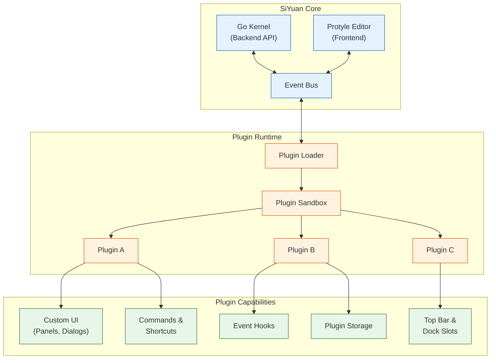
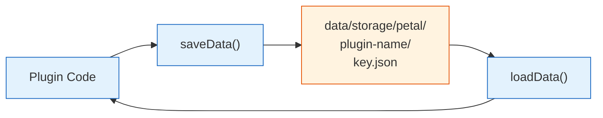
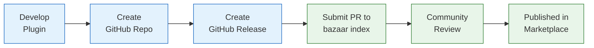

# Chapter 5: Plugin Architecture

Welcome to **Chapter 5: Plugin Architecture**. In this part of **SiYuan Tutorial: Privacy-First Knowledge Management**, you will build an intuitive mental model first, then move into concrete implementation details and practical production tradeoffs.


In [Chapter 4](04-query-system.md), we explored SiYuan's powerful query system. Now let's look at how to extend SiYuan's functionality through its plugin architecture. The plugin system allows developers to add new features, integrate with external services, and customize the user experience without modifying SiYuan's core codebase.

## Plugin System Overview

SiYuan's plugin system is built on a sandboxed JavaScript runtime that communicates with the Go backend through a well-defined API. Plugins can modify the UI, react to events, store data, and interact with the block system.



## Plugin Structure

Every SiYuan plugin follows a standard directory layout:

```
my-plugin/
├── plugin.json          # Plugin manifest
├── index.js             # Main entry point (compiled)
├── index.css            # Plugin styles (optional)
├── src/
│   ├── index.ts         # TypeScript source
│   ├── components/      # UI components
│   └── utils/           # Helper utilities
├── i18n/
│   ├── en_US.json       # English translations
│   └── zh_CN.json       # Chinese translations
├── icon.png             # Plugin icon (160x160)
├── preview.png          # Marketplace preview
├── README.md            # Plugin documentation
├── package.json         # Node.js package config
├── tsconfig.json        # TypeScript config
└── webpack.config.js    # Build config
```

### Plugin Manifest

The `plugin.json` file defines your plugin's metadata and capabilities:

```json
{
    "name": "my-awesome-plugin",
    "author": "Your Name",
    "url": "https://github.com/yourname/siyuan-plugin-awesome",
    "version": "1.0.0",
    "minAppVersion": "2.10.0",
    "displayName": {
        "default": "My Awesome Plugin",
        "zh_CN": "My Awesome Plugin"
    },
    "description": {
        "default": "A plugin that does awesome things",
        "zh_CN": "A plugin that does awesome things"
    },
    "readme": {
        "default": "README.md",
        "zh_CN": "README_zh_CN.md"
    },
    "funding": {
        "openCollective": "",
        "patreon": "",
        "github": "",
        "custom": []
    },
    "keywords": ["productivity", "automation"],
    "backends": ["windows", "linux", "darwin", "docker", "ios", "android"],
    "frontends": ["desktop", "desktop-window", "mobile", "browser-desktop", "browser-mobile"]
}
```

## Building Your First Plugin

Let's build a complete plugin step by step -- a "Reading Time Estimator" that shows estimated reading time for documents.

### Step 1: Plugin Entry Point

```typescript
// src/index.ts
import {
    Plugin,
    showMessage,
    Dialog,
    Menu,
    getFrontend,
    IModel,
} from "siyuan";

const STORAGE_KEY = "reading-time-config";

export default class ReadingTimePlugin extends Plugin {
    private wordsPerMinute: number = 200;
    private topBarElement: HTMLElement;
    private currentDocID: string | null = null;

    async onload(): Promise<void> {
        console.log("Reading Time plugin loaded");

        // Load saved configuration
        const config = await this.loadData(STORAGE_KEY);
        if (config) {
            this.wordsPerMinute = config.wordsPerMinute || 200;
        }

        // Add top bar button
        this.topBarElement = this.addTopBar({
            icon: "iconClock",
            title: this.i18n.readingTime,
            position: "right",
            callback: () => this.showReadingTimeDialog(),
        });

        // Register slash command
        this.addCommand({
            langKey: "showReadingTime",
            langText: "Show Reading Time",
            hotkey: "⌥⇧T",
            callback: () => this.showReadingTimeDialog(),
        });

        // Listen for document switches
        this.eventBus.on("switch-protyle", this.onDocumentSwitch.bind(this));
        this.eventBus.on("loaded-protyle-static", this.onDocumentLoad.bind(this));

        // Add context menu item
        this.eventBus.on("click-blockicon", this.onBlockIconClick.bind(this));
    }

    async onunload(): Promise<void> {
        console.log("Reading Time plugin unloaded");
        // Save configuration
        await this.saveData(STORAGE_KEY, {
            wordsPerMinute: this.wordsPerMinute,
        });
    }

    onLayoutReady(): void {
        // Called when the layout is fully loaded
        this.updateReadingTime();
    }

    // Handle document switch events
    private onDocumentSwitch(event: CustomEvent): void {
        const protyle = event.detail.protyle;
        if (protyle && protyle.block) {
            this.currentDocID = protyle.block.rootID;
            this.updateReadingTime();
        }
    }

    // Handle document load events
    private onDocumentLoad(event: CustomEvent): void {
        this.updateReadingTime();
    }

    // Calculate and display reading time
    private async updateReadingTime(): Promise<void> {
        if (!this.currentDocID) return;

        try {
            const result = await this.querySQL(`
                SELECT SUM(length) AS total_chars
                FROM blocks
                WHERE root_id = '${this.currentDocID}'
                  AND type IN ('p', 'h', 'i', 'c')
            `);

            if (result && result.length > 0) {
                const totalChars = result[0].total_chars as number || 0;
                const words = Math.ceil(totalChars / 5); // Rough word estimate
                const minutes = Math.ceil(words / this.wordsPerMinute);
                this.topBarElement.textContent = `${minutes} min read`;
            }
        } catch (err) {
            console.error("Failed to calculate reading time:", err);
        }
    }

    // Execute a SQL query through the API
    private async querySQL(sql: string): Promise<any[]> {
        const response = await fetch("/api/query/sql", {
            method: "POST",
            headers: { "Content-Type": "application/json" },
            body: JSON.stringify({ stmt: sql }),
        });
        const data = await response.json();
        return data.data;
    }

    // Show settings dialog
    private showReadingTimeDialog(): void {
        const dialog = new Dialog({
            title: "Reading Time Settings",
            content: `
                <div class="b3-dialog__content">
                    <div class="fn__flex b3-label">
                        <div class="fn__flex-1">
                            Words per minute
                            <div class="b3-label__text">
                                Average reading speed for time estimates
                            </div>
                        </div>
                        <input class="b3-text-field fn__flex-center fn__size200"
                               id="wpmInput" type="number"
                               value="${this.wordsPerMinute}" />
                    </div>
                </div>
            `,
            width: "520px",
        });

        const input = dialog.element.querySelector("#wpmInput") as HTMLInputElement;
        input.addEventListener("change", () => {
            this.wordsPerMinute = parseInt(input.value, 10) || 200;
            this.saveData(STORAGE_KEY, { wordsPerMinute: this.wordsPerMinute });
            this.updateReadingTime();
        });
    }

    // Add reading time to block context menu
    private onBlockIconClick(event: CustomEvent): void {
        const detail = event.detail;
        const menu = detail.menu as Menu;
        menu.addItem({
            icon: "iconClock",
            label: "Show Block Reading Time",
            click: async () => {
                const blockID = detail.blockElements[0]?.getAttribute("data-node-id");
                if (blockID) {
                    const result = await this.querySQL(`
                        SELECT content, length FROM blocks WHERE id = '${blockID}'
                    `);
                    if (result.length > 0) {
                        const words = Math.ceil((result[0].length as number) / 5);
                        const seconds = Math.ceil((words / this.wordsPerMinute) * 60);
                        showMessage(`Reading time: ~${seconds} seconds`);
                    }
                }
            },
        });
    }
}
```

### Step 2: Plugin Styles

```css
/* index.css */

/* Top bar reading time display */
.reading-time-badge {
    display: inline-flex;
    align-items: center;
    gap: 4px;
    padding: 2px 8px;
    border-radius: 4px;
    font-size: 12px;
    color: var(--b3-theme-on-surface);
    background: var(--b3-theme-surface-lighter);
}

/* Settings dialog styling */
.reading-time-settings .b3-label {
    margin-bottom: 12px;
}

.reading-time-settings .b3-text-field {
    width: 80px;
    text-align: center;
}

/* Dark mode support */
.theme--dark .reading-time-badge {
    background: var(--b3-theme-surface);
}
```

### Step 3: Build Configuration

```javascript
// webpack.config.js
const path = require("path");

module.exports = {
    mode: "production",
    entry: "./src/index.ts",
    output: {
        filename: "index.js",
        path: path.resolve(__dirname),
        libraryTarget: "commonjs2",
        library: {
            type: "commonjs2",
        },
    },
    resolve: {
        extensions: [".ts", ".js"],
    },
    module: {
        rules: [
            {
                test: /\.ts$/,
                use: "ts-loader",
                exclude: /node_modules/,
            },
        ],
    },
    externals: {
        siyuan: "siyuan",
    },
};
```

## Plugin API Reference

The Plugin base class provides a rich set of methods for interacting with SiYuan:

### Core Methods

```typescript
// Plugin lifecycle and core methods
abstract class Plugin {
    // --- Lifecycle ---
    abstract onload(): Promise<void>;       // Called when plugin loads
    abstract onunload(): Promise<void>;     // Called when plugin unloads
    onLayoutReady(): void;                  // Called when UI is fully ready

    // --- Data Storage ---
    async loadData(key: string): Promise<any>;
    async saveData(key: string, data: any): Promise<void>;
    async removeData(key: string): Promise<void>;

    // --- UI Elements ---
    addTopBar(options: {
        icon: string;
        title: string;
        position: "left" | "right";
        callback: () => void;
    }): HTMLElement;

    addDock(options: {
        config: {
            position: "LeftTop" | "LeftBottom" | "RightTop" |
                      "RightBottom" | "BottomLeft" | "BottomRight";
            size: { width: number; height: number };
            icon: string;
            title: string;
        };
        data: any;
        type: string;
        init: () => void;
    }): void;

    addTab(options: {
        type: string;
        init: () => void;
        beforeDestroy?: () => void;
        resize?: () => void;
        update?: () => void;
    }): () => IModel;

    addStatusBar(options: {
        element: HTMLElement;
    }): void;

    // --- Commands ---
    addCommand(options: {
        langKey: string;
        langText: string;
        hotkey: string;
        callback: () => void;
        globalCallback?: () => void;
    }): void;

    // --- Internationalization ---
    i18n: Record<string, string>;
}
```

### Event System

The event bus allows plugins to react to user actions and system state changes:

```typescript
// Available events for plugin subscription
type SiYuanEvent =
    | "switch-protyle"           // Document switched
    | "loaded-protyle-static"    // Document loaded (static render)
    | "loaded-protyle-dynamic"   // Document loaded (dynamic render)
    | "destroy-protyle"          // Document closed
    | "click-blockicon"          // Block icon clicked (context menu)
    | "click-editorcontent"      // Editor content clicked
    | "click-editortitleicon"    // Document title icon clicked
    | "open-menu-doctree"        // Document tree context menu
    | "open-menu-blockref"       // Block reference context menu
    | "open-menu-fileannotationref" // File annotation context menu
    | "open-menu-tag"            // Tag context menu
    | "open-menu-link"           // Link context menu
    | "open-menu-image"          // Image context menu
    | "open-menu-av"             // Attribute view context menu
    | "open-menu-content"        // Content area context menu
    | "open-menu-breadcrumbmore" // Breadcrumb overflow menu
    | "input-search"             // Search input changed
    | "paste"                    // Content pasted
    | "open-siyuan-url-plugin"   // Plugin URL scheme triggered
    | "open-siyuan-url-block"    // Block URL scheme triggered
    | "ws-main";                 // WebSocket message from kernel

// Subscribe to events
class MyPlugin extends Plugin {
    async onload() {
        // Listen for document switches
        this.eventBus.on("switch-protyle", (event: CustomEvent) => {
            const protyle = event.detail.protyle;
            console.log("Switched to:", protyle.block.rootID);
        });

        // Listen for WebSocket messages
        this.eventBus.on("ws-main", (event: CustomEvent) => {
            const msg = event.detail;
            if (msg.cmd === "transactions") {
                console.log("Blocks changed:", msg.data);
            }
        });

        // Listen for paste events
        this.eventBus.on("paste", (event: CustomEvent) => {
            const detail = event.detail;
            // Modify pasted content before insertion
            if (detail.textPlain.includes("http")) {
                detail.resolve({
                    textPlain: detail.textPlain,
                    // Auto-convert URLs to links
                    textHTML: `<a href="${detail.textPlain}">${detail.textPlain}</a>`,
                });
            }
        });
    }
}
```

### Kernel API Access

Plugins can call any of SiYuan's backend API endpoints:

```typescript
// Helper class for kernel API calls
class KernelAPI {
    // Block operations
    static async insertBlock(params: {
        dataType: "markdown" | "dom";
        data: string;
        parentID?: string;
        previousID?: string;
        nextID?: string;
    }): Promise<{ id: string }> {
        return this.call("/api/block/insertBlock", params);
    }

    static async updateBlock(params: {
        id: string;
        dataType: "markdown" | "dom";
        data: string;
    }): Promise<void> {
        return this.call("/api/block/updateBlock", params);
    }

    static async deleteBlock(params: { id: string }): Promise<void> {
        return this.call("/api/block/deleteBlock", params);
    }

    static async getBlockByID(id: string): Promise<Block> {
        return this.call("/api/block/getBlockKramdown", { id });
    }

    // Attribute operations
    static async setBlockAttrs(params: {
        id: string;
        attrs: Record<string, string>;
    }): Promise<void> {
        return this.call("/api/attr/setBlockAttrs", params);
    }

    static async getBlockAttrs(id: string): Promise<Record<string, string>> {
        return this.call("/api/attr/getBlockAttrs", { id });
    }

    // Document operations
    static async createDocWithMd(params: {
        notebook: string;
        path: string;
        markdown: string;
    }): Promise<string> {
        return this.call("/api/filetree/createDocWithMd", params);
    }

    // SQL query
    static async sql(stmt: string): Promise<any[]> {
        const result = await this.call("/api/query/sql", { stmt });
        return result;
    }

    // Notification
    static async pushMsg(msg: string, timeout?: number): Promise<void> {
        return this.call("/api/notification/pushMsg", { msg, timeout });
    }

    // Generic API caller
    private static async call(endpoint: string, params: any): Promise<any> {
        const response = await fetch(endpoint, {
            method: "POST",
            headers: {
                "Content-Type": "application/json",
                "Authorization": `Token ${window.siyuan?.config?.api?.token || ""}`,
            },
            body: JSON.stringify(params),
        });
        const result = await response.json();
        if (result.code !== 0) {
            throw new Error(`API error: ${result.msg}`);
        }
        return result.data;
    }
}
```

## Plugin Storage

Plugins have access to a persistent storage system for saving configuration and data:



```go
// kernel/model/petal.go
package model

import (
    "encoding/json"
    "os"
    "path/filepath"
)

const petalDir = "data/storage/petal"

// SavePluginData persists plugin data to the workspace
func SavePluginData(workspacePath, pluginName, key string, data interface{}) error {
    dir := filepath.Join(workspacePath, petalDir, pluginName)
    if err := os.MkdirAll(dir, 0755); err != nil {
        return err
    }

    bytes, err := json.MarshalIndent(data, "", "  ")
    if err != nil {
        return err
    }

    return os.WriteFile(filepath.Join(dir, key+".json"), bytes, 0644)
}

// LoadPluginData reads persisted plugin data
func LoadPluginData(workspacePath, pluginName, key string) (interface{}, error) {
    path := filepath.Join(workspacePath, petalDir, pluginName, key+".json")
    bytes, err := os.ReadFile(path)
    if err != nil {
        if os.IsNotExist(err) {
            return nil, nil // No data saved yet
        }
        return nil, err
    }

    var data interface{}
    if err := json.Unmarshal(bytes, &data); err != nil {
        return nil, err
    }
    return data, nil
}
```

## Building Custom Dock Panels

Dock panels let plugins add persistent UI elements to SiYuan's sidebar:

```typescript
// A custom dock panel showing document statistics
class StatsPlugin extends Plugin {
    async onload() {
        this.addDock({
            config: {
                position: "RightTop",
                size: { width: 300, height: 400 },
                icon: "iconGraph",
                title: "Knowledge Stats",
            },
            data: {},
            type: "stats-dock",
            init: () => {
                // Build the dock panel UI
                const container = document.createElement("div");
                container.className = "stats-dock-container";
                container.innerHTML = `
                    <div class="stats-header">
                        <h3>Knowledge Base Statistics</h3>
                        <button id="refreshStats" class="b3-button b3-button--outline">
                            Refresh
                        </button>
                    </div>
                    <div id="statsContent" class="stats-content">
                        <div class="stats-loading">Loading...</div>
                    </div>
                `;

                // Attach to dock element
                const dockElement = document.querySelector(
                    '[data-type="stats-dock"]'
                );
                if (dockElement) {
                    dockElement.appendChild(container);
                }

                // Load and display stats
                this.loadStats(container);

                // Refresh button
                container.querySelector("#refreshStats")?.addEventListener(
                    "click",
                    () => this.loadStats(container)
                );
            },
        });
    }

    private async loadStats(container: HTMLElement): Promise<void> {
        const content = container.querySelector("#statsContent");
        if (!content) return;

        try {
            const [blocks, docs, refs, recent] = await Promise.all([
                this.querySQL("SELECT COUNT(*) AS c FROM blocks"),
                this.querySQL("SELECT COUNT(*) AS c FROM blocks WHERE type = 'd'"),
                this.querySQL("SELECT COUNT(*) AS c FROM refs"),
                this.querySQL(`
                    SELECT content, updated FROM blocks
                    WHERE type = 'd'
                    ORDER BY updated DESC LIMIT 5
                `),
            ]);

            content.innerHTML = `
                <div class="stat-card">
                    <span class="stat-value">${blocks[0].c}</span>
                    <span class="stat-label">Total Blocks</span>
                </div>
                <div class="stat-card">
                    <span class="stat-value">${docs[0].c}</span>
                    <span class="stat-label">Documents</span>
                </div>
                <div class="stat-card">
                    <span class="stat-value">${refs[0].c}</span>
                    <span class="stat-label">References</span>
                </div>
                <h4>Recently Updated</h4>
                <ul class="recent-list">
                    ${recent.map((d: any) => `
                        <li>
                            <span class="doc-title">${d.content}</span>
                            <span class="doc-date">${d.updated}</span>
                        </li>
                    `).join("")}
                </ul>
            `;
        } catch (err) {
            content.innerHTML = `<div class="error">Failed to load stats</div>`;
        }
    }

    private async querySQL(sql: string): Promise<any[]> {
        const res = await fetch("/api/query/sql", {
            method: "POST",
            headers: { "Content-Type": "application/json" },
            body: JSON.stringify({ stmt: sql }),
        });
        return (await res.json()).data;
    }
}
```

## Plugin Marketplace

SiYuan has a built-in marketplace for discovering and installing community plugins:

### Publishing a Plugin



To publish your plugin:

1. **Create a GitHub repository** with the standard plugin structure
2. **Create a release** with `package.zip` containing compiled plugin files
3. **Submit a pull request** to the [SiYuan bazaar](https://github.com/siyuan-note/bazaar) repository
4. **Add your plugin** to the `plugins.json` index file

```json
// Entry in bazaar/stage/plugins.json
{
    "repos": [
        "yourname/siyuan-plugin-awesome"
    ]
}
```

### Plugin Installation Flow

```go
// kernel/model/bazaar.go
package model

import (
    "archive/zip"
    "io"
    "net/http"
    "os"
    "path/filepath"
)

// InstallPlugin downloads and installs a plugin from the marketplace
func InstallPlugin(workspacePath, repoURL, version string) error {
    // 1. Download the plugin package
    downloadURL := fmt.Sprintf(
        "https://github.com/%s/releases/download/%s/package.zip",
        repoURL, version,
    )

    resp, err := http.Get(downloadURL)
    if err != nil {
        return err
    }
    defer resp.Body.Close()

    // 2. Save to temp directory
    tmpFile, err := os.CreateTemp("", "plugin-*.zip")
    if err != nil {
        return err
    }
    defer os.Remove(tmpFile.Name())

    if _, err := io.Copy(tmpFile, resp.Body); err != nil {
        return err
    }
    tmpFile.Close()

    // 3. Extract to plugins directory
    pluginName := filepath.Base(repoURL)
    pluginDir := filepath.Join(workspacePath, "data", "plugins", pluginName)

    if err := os.MkdirAll(pluginDir, 0755); err != nil {
        return err
    }

    return unzip(tmpFile.Name(), pluginDir)
}

func unzip(src, dest string) error {
    r, err := zip.OpenReader(src)
    if err != nil {
        return err
    }
    defer r.Close()

    for _, f := range r.File {
        path := filepath.Join(dest, f.Name)

        if f.FileInfo().IsDir() {
            os.MkdirAll(path, f.Mode())
            continue
        }

        os.MkdirAll(filepath.Dir(path), 0755)

        outFile, err := os.OpenFile(path, os.O_WRONLY|os.O_CREATE|os.O_TRUNC, f.Mode())
        if err != nil {
            return err
        }

        rc, err := f.Open()
        if err != nil {
            outFile.Close()
            return err
        }

        io.Copy(outFile, rc)
        outFile.Close()
        rc.Close()
    }

    return nil
}
```

## Plugin Security Model

SiYuan plugins run with certain security constraints to protect user data:

| Capability | Allowed | Notes |
|---|---|---|
| Read blocks via API | Yes | All blocks accessible |
| Write blocks via API | Yes | Full CRUD operations |
| File system access | Limited | Only through SiYuan APIs |
| Network access | Yes | Fetch API available |
| Local storage | Yes | Plugin-specific directory |
| Execute system commands | No | Sandboxed environment |
| Access other plugins | No | Isolated namespaces |
| Modify SiYuan core | No | Core code is protected |
| Access API token | Yes | For authenticated API calls |
| WebSocket | Yes | For real-time updates |

## Summary

SiYuan's plugin system provides a powerful framework for extending the application while maintaining security and stability.

| Component | Purpose | Implementation |
|---|---|---|
| **Plugin Class** | Base class for all plugins | Lifecycle methods, API access |
| **Event Bus** | Inter-component communication | Subscribe/publish pattern |
| **Kernel API** | Backend access | REST endpoints over HTTP |
| **Plugin Storage** | Persistent data | JSON files in `petal/` directory |
| **Dock Panels** | Custom sidebar UI | DOM manipulation in slots |
| **Commands** | Keyboard shortcuts | Hotkey registration |
| **Marketplace** | Distribution | GitHub-based package registry |

## Key Takeaways

1. **Plugins are TypeScript/JavaScript** -- build with familiar web technologies and standard tooling.
2. **The event bus is central** -- subscribe to lifecycle events, user actions, and data changes.
3. **Full API access** -- plugins can read, write, and query blocks just like the built-in editor.
4. **Persistent storage** -- save configuration and plugin data across sessions.
5. **UI integration points** -- top bar, dock panels, context menus, tabs, and status bar.
6. **Marketplace distribution** -- publish through GitHub and the bazaar index.

## Next Steps

Now that you can extend SiYuan with plugins, let's explore the synchronization system in depth. In [Chapter 6: Synchronization & Backup](06-synchronization.md), we'll cover multi-device sync, backup strategies, and the S3-compatible cloud protocol.

---

*Built with insights from the [SiYuan](https://github.com/siyuan-note/siyuan) project.*

## What Problem Does This Solve?

Most teams struggle here because the hard part is not writing more code, but deciding clear boundaries for `void`, `menu`, `Plugin` so behavior stays predictable as complexity grows.

In practical terms, this chapter helps you avoid three common failures:

- coupling core logic too tightly to one implementation path
- missing the handoff boundaries between setup, execution, and validation
- shipping changes without clear rollback or observability strategy

After working through this chapter, you should be able to reason about `Chapter 5: Plugin Architecture` as an operating subsystem inside **SiYuan Tutorial: Privacy-First Knowledge Management**, with explicit contracts for inputs, state transitions, and outputs.

Use the implementation notes around `Promise`, `plugin`, `json` as your checklist when adapting these patterns to your own repository.

## How it Works Under the Hood

Under the hood, `Chapter 5: Plugin Architecture` usually follows a repeatable control path:

1. **Context bootstrap**: initialize runtime config and prerequisites for `void`.
2. **Input normalization**: shape incoming data so `menu` receives stable contracts.
3. **Core execution**: run the main logic branch and propagate intermediate state through `Plugin`.
4. **Policy and safety checks**: enforce limits, auth scopes, and failure boundaries.
5. **Output composition**: return canonical result payloads for downstream consumers.
6. **Operational telemetry**: emit logs/metrics needed for debugging and performance tuning.

When debugging, walk this sequence in order and confirm each stage has explicit success/failure conditions.

## Source Walkthrough

Use the following upstream sources to verify implementation details while reading this chapter:

- [View Repo](https://github.com/siyuan-note/siyuan)
  Why it matters: authoritative reference on `View Repo` (github.com).

Suggested trace strategy:
- search upstream code for `void` and `menu` to map concrete implementation paths
- compare docs claims against actual runtime/config code before reusing patterns in production

## Chapter Connections

- [Tutorial Index](index.md)
- [Previous Chapter: Chapter 4: Query System & Search](04-query-system.md)
- [Next Chapter: Chapter 6: Synchronization & Backup](06-synchronization.md)
- [Main Catalog](../../README.md#-tutorial-catalog)
- [A-Z Tutorial Directory](../../discoverability/tutorial-directory.md)
