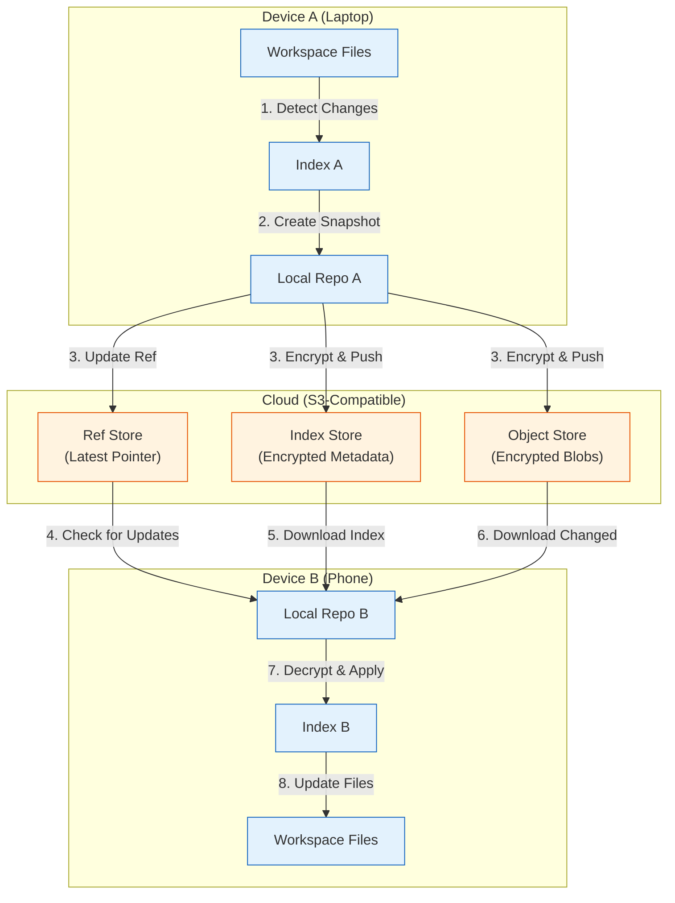
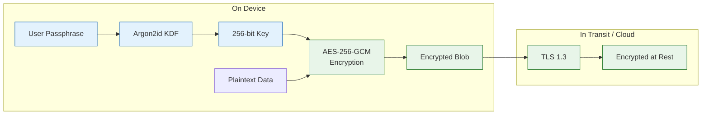
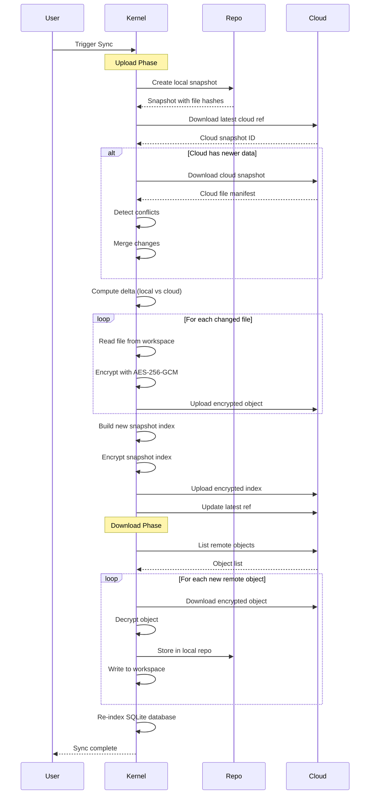

# Chapter 6: Synchronization & Backup

Welcome to **Chapter 6: Synchronization & Backup**. In this part of **SiYuan Tutorial: Privacy-First Knowledge Management**, you will build an intuitive mental model first, then move into concrete implementation details and practical production tradeoffs.


In [Chapter 5](05-plugin-architecture.md), we explored SiYuan's plugin system for extending functionality. Now let's take a deep dive into one of SiYuan's most critical systems: data synchronization and backup. For a privacy-first application, syncing data securely across devices without relying on proprietary cloud services is a significant engineering challenge.

## Sync Architecture

SiYuan's synchronization system is built on three key principles: end-to-end encryption, content-addressable storage, and snapshot-based versioning. These design choices ensure your data stays private while remaining efficiently syncable.



## Content-Addressable Storage

SiYuan uses content-addressable storage where each file is identified by its SHA-256 hash. This eliminates duplicate uploads and makes sync efficient.

```go
// kernel/model/repo.go
package model

import (
    "crypto/sha256"
    "encoding/hex"
    "io"
    "os"
    "path/filepath"
)

// Object represents a content-addressable blob in the repository
type Object struct {
    ID   string `json:"id"`   // SHA-256 hash of content
    Size int64  `json:"size"` // Content size in bytes
}

// HashFile computes the SHA-256 hash of a file
func HashFile(path string) (string, int64, error) {
    f, err := os.Open(path)
    if err != nil {
        return "", 0, err
    }
    defer f.Close()

    hasher := sha256.New()
    size, err := io.Copy(hasher, f)
    if err != nil {
        return "", 0, err
    }

    hash := hex.EncodeToString(hasher.Sum(nil))
    return hash, size, nil
}

// PutObject stores a file in the local repository by its hash
func PutObject(repoPath string, data []byte) (*Object, error) {
    hash := sha256.Sum256(data)
    id := hex.EncodeToString(hash[:])

    // Store in two-level directory structure: ab/cdef...
    dir := filepath.Join(repoPath, "objects", id[:2])
    if err := os.MkdirAll(dir, 0755); err != nil {
        return nil, err
    }

    objPath := filepath.Join(dir, id[2:])
    if _, err := os.Stat(objPath); err == nil {
        // Object already exists (deduplication)
        return &Object{ID: id, Size: int64(len(data))}, nil
    }

    if err := os.WriteFile(objPath, data, 0644); err != nil {
        return nil, err
    }

    return &Object{ID: id, Size: int64(len(data))}, nil
}

// GetObject retrieves a file from the local repository by its hash
func GetObject(repoPath, id string) ([]byte, error) {
    objPath := filepath.Join(repoPath, "objects", id[:2], id[2:])
    return os.ReadFile(objPath)
}
```

## Snapshot System

Snapshots capture the complete state of a workspace at a point in time. Each snapshot stores a list of files with their hashes, allowing efficient delta computation.

```go
// kernel/model/snapshot.go
package model

import (
    "encoding/json"
    "os"
    "path/filepath"
    "time"
)

// Snapshot represents a point-in-time workspace state
type Snapshot struct {
    ID       string      `json:"id"`       // Unique snapshot ID
    Parent   string      `json:"parent"`   // Parent snapshot ID
    Memo     string      `json:"memo"`     // User description
    Created  time.Time   `json:"created"`  // Timestamp
    Count    int         `json:"count"`    // Total file count
    Size     int64       `json:"size"`     // Total size in bytes
    Files    []FileInfo  `json:"files"`    // File manifest
}

// FileInfo represents a file in a snapshot
type FileInfo struct {
    Path    string `json:"path"`    // Relative workspace path
    Hash    string `json:"hash"`    // SHA-256 content hash
    Size    int64  `json:"size"`    // File size
    Updated int64  `json:"updated"` // Last modified timestamp
}

// CreateSnapshot builds a new snapshot from the current workspace state
func CreateSnapshot(workspacePath, memo string) (*Snapshot, error) {
    dataDir := filepath.Join(workspacePath, "data")
    repoDir := filepath.Join(workspacePath, "repo")

    // Scan all files in the data directory
    var files []FileInfo
    var totalSize int64

    err := filepath.Walk(dataDir, func(path string, info os.FileInfo, err error) error {
        if err != nil || info.IsDir() {
            return err
        }

        // Skip temporary and system files
        relPath, _ := filepath.Rel(dataDir, path)
        if shouldSkipFile(relPath) {
            return nil
        }

        hash, size, err := HashFile(path)
        if err != nil {
            return err
        }

        // Store the object in the repo
        data, _ := os.ReadFile(path)
        PutObject(repoDir, data)

        files = append(files, FileInfo{
            Path:    relPath,
            Hash:    hash,
            Size:    size,
            Updated: info.ModTime().Unix(),
        })
        totalSize += size

        return nil
    })
    if err != nil {
        return nil, err
    }

    // Get parent snapshot
    parentID := getLatestSnapshotID(repoDir)

    snapshot := &Snapshot{
        ID:      NewSnapshotID(),
        Parent:  parentID,
        Memo:    memo,
        Created: time.Now(),
        Count:   len(files),
        Size:    totalSize,
        Files:   files,
    }

    // Save snapshot index
    data, _ := json.MarshalIndent(snapshot, "", "  ")
    indexPath := filepath.Join(repoDir, "indexes", snapshot.ID+".json")
    os.MkdirAll(filepath.Dir(indexPath), 0755)
    os.WriteFile(indexPath, data, 0644)

    // Update latest ref
    os.WriteFile(filepath.Join(repoDir, "refs", "latest"), []byte(snapshot.ID), 0644)

    return snapshot, nil
}

// ComputeDelta calculates the differences between two snapshots
func ComputeDelta(oldSnapshot, newSnapshot *Snapshot) *Delta {
    oldFiles := make(map[string]FileInfo)
    for _, f := range oldSnapshot.Files {
        oldFiles[f.Path] = f
    }

    delta := &Delta{}

    // Find new and modified files
    for _, newFile := range newSnapshot.Files {
        oldFile, exists := oldFiles[newFile.Path]
        if !exists {
            delta.Added = append(delta.Added, newFile)
        } else if oldFile.Hash != newFile.Hash {
            delta.Modified = append(delta.Modified, newFile)
        }
        delete(oldFiles, newFile.Path)
    }

    // Remaining old files are deleted
    for _, oldFile := range oldFiles {
        delta.Removed = append(delta.Removed, oldFile)
    }

    return delta
}

// Delta represents changes between two snapshots
type Delta struct {
    Added    []FileInfo `json:"added"`
    Modified []FileInfo `json:"modified"`
    Removed  []FileInfo `json:"removed"`
}
```

## End-to-End Encryption

All data leaving the device is encrypted using AES-256-GCM with a key derived from the user's passphrase. The cloud provider never sees plaintext data.



### Key Derivation

```go
// kernel/model/encryption.go
package model

import (
    "crypto/aes"
    "crypto/cipher"
    "crypto/rand"
    "crypto/sha256"

    "golang.org/x/crypto/argon2"
)

// DeriveKey derives an AES-256 key from a passphrase using Argon2id
func DeriveKey(passphrase string, salt []byte) []byte {
    // Argon2id parameters (recommended for password hashing)
    const (
        timeCost    = 3          // Iterations
        memoryCost  = 64 * 1024  // 64 MB
        parallelism = 4          // Threads
        keyLength   = 32         // 256 bits
    )

    return argon2.IDKey(
        []byte(passphrase),
        salt,
        timeCost,
        memoryCost,
        parallelism,
        keyLength,
    )
}

// Encrypt encrypts data with AES-256-GCM
func Encrypt(plaintext, key []byte) ([]byte, error) {
    block, err := aes.NewCipher(key)
    if err != nil {
        return nil, err
    }

    gcm, err := cipher.NewGCM(block)
    if err != nil {
        return nil, err
    }

    // Generate random nonce
    nonce := make([]byte, gcm.NonceSize())
    if _, err := rand.Read(nonce); err != nil {
        return nil, err
    }

    // Encrypt and prepend nonce
    ciphertext := gcm.Seal(nonce, nonce, plaintext, nil)
    return ciphertext, nil
}

// Decrypt decrypts AES-256-GCM encrypted data
func Decrypt(ciphertext, key []byte) ([]byte, error) {
    block, err := aes.NewCipher(key)
    if err != nil {
        return nil, err
    }

    gcm, err := cipher.NewGCM(block)
    if err != nil {
        return nil, err
    }

    nonceSize := gcm.NonceSize()
    if len(ciphertext) < nonceSize {
        return nil, fmt.Errorf("ciphertext too short")
    }

    nonce, ciphertext := ciphertext[:nonceSize], ciphertext[nonceSize:]
    return gcm.Open(nil, nonce, ciphertext, nil)
}

// EncryptFilename encrypts a file path for cloud storage
func EncryptFilename(path string, key []byte) string {
    hash := sha256.Sum256(append([]byte(path), key...))
    return hex.EncodeToString(hash[:])
}
```

## S3-Compatible Cloud Sync

SiYuan syncs to any S3-compatible storage provider, giving users full control over where their encrypted data lives.

### Supported Providers

| Provider | Type | Self-Hosted | Cost |
|---|---|---|---|
| SiYuan Cloud | Official | No | Subscription |
| AWS S3 | Cloud | No | Pay-per-use |
| MinIO | Self-hosted | Yes | Free |
| Cloudflare R2 | Cloud | No | Pay-per-use (no egress) |
| Backblaze B2 | Cloud | No | Low-cost |
| Wasabi | Cloud | No | Flat-rate |
| SeaweedFS | Self-hosted | Yes | Free |

### S3 Client Implementation

```go
// kernel/model/cloud.go
package model

import (
    "bytes"
    "context"
    "io"
    "time"

    "github.com/aws/aws-sdk-go-v2/aws"
    "github.com/aws/aws-sdk-go-v2/config"
    "github.com/aws/aws-sdk-go-v2/credentials"
    "github.com/aws/aws-sdk-go-v2/service/s3"
)

// CloudClient wraps S3 operations for SiYuan sync
type CloudClient struct {
    client *s3.Client
    bucket string
    prefix string  // User-specific prefix for multi-tenant
}

// NewCloudClient creates an S3 client from SiYuan cloud configuration
func NewCloudClient(conf *CloudConf) (*CloudClient, error) {
    cfg, err := config.LoadDefaultConfig(context.TODO(),
        config.WithRegion(conf.Region),
        config.WithCredentialsProvider(credentials.NewStaticCredentialsProvider(
            conf.AccessKey, conf.SecretKey, "",
        )),
    )
    if err != nil {
        return nil, err
    }

    client := s3.NewFromConfig(cfg, func(o *s3.Options) {
        o.BaseEndpoint = aws.String(conf.Endpoint)
        o.UsePathStyle = conf.PathStyle
    })

    return &CloudClient{
        client: client,
        bucket: conf.Bucket,
        prefix: conf.UserID + "/",
    }, nil
}

// UploadObject uploads an encrypted object to S3
func (c *CloudClient) UploadObject(key string, data []byte) error {
    ctx, cancel := context.WithTimeout(context.Background(), 30*time.Second)
    defer cancel()

    _, err := c.client.PutObject(ctx, &s3.PutObjectInput{
        Bucket: aws.String(c.bucket),
        Key:    aws.String(c.prefix + key),
        Body:   bytes.NewReader(data),
    })
    return err
}

// DownloadObject retrieves an encrypted object from S3
func (c *CloudClient) DownloadObject(key string) ([]byte, error) {
    ctx, cancel := context.WithTimeout(context.Background(), 30*time.Second)
    defer cancel()

    output, err := c.client.GetObject(ctx, &s3.GetObjectInput{
        Bucket: aws.String(c.bucket),
        Key:    aws.String(c.prefix + key),
    })
    if err != nil {
        return nil, err
    }
    defer output.Body.Close()

    return io.ReadAll(output.Body)
}

// ListObjects lists all objects with a given prefix
func (c *CloudClient) ListObjects(prefix string) ([]string, error) {
    ctx, cancel := context.WithTimeout(context.Background(), 30*time.Second)
    defer cancel()

    output, err := c.client.ListObjectsV2(ctx, &s3.ListObjectsV2Input{
        Bucket: aws.String(c.bucket),
        Prefix: aws.String(c.prefix + prefix),
    })
    if err != nil {
        return nil, err
    }

    var keys []string
    for _, obj := range output.Contents {
        keys = append(keys, *obj.Key)
    }
    return keys, nil
}

// DeleteObject removes an object from S3
func (c *CloudClient) DeleteObject(key string) error {
    ctx, cancel := context.WithTimeout(context.Background(), 30*time.Second)
    defer cancel()

    _, err := c.client.DeleteObject(ctx, &s3.DeleteObjectInput{
        Bucket: aws.String(c.bucket),
        Key:    aws.String(c.prefix + key),
    })
    return err
}
```

## Full Sync Workflow

The complete sync process coordinates snapshot creation, delta computation, encryption, upload, and conflict resolution:



### Sync Implementation

```go
// kernel/model/sync.go
package model

import (
    "fmt"
    "os"
    "path/filepath"
    "time"
)

// SyncMode controls sync behavior
type SyncMode int

const (
    SyncModeAutomatic SyncMode = iota  // Sync periodically
    SyncModeManual                      // Sync on user request
    SyncModeDisabled                    // No sync
)

// SyncConf holds sync configuration
type SyncConf struct {
    Mode         SyncMode   `json:"mode"`
    Interval     int        `json:"interval"`     // Minutes between auto-sync
    CloudConf    *CloudConf `json:"cloudConf"`
    Passphrase   string     `json:"passphrase"`   // Encryption passphrase
    GenerateConflictDoc bool `json:"generateConflictDoc"`
}

// PerformSync executes a full sync cycle
func PerformSync(workspacePath string, conf *SyncConf) (*SyncResult, error) {
    result := &SyncResult{StartTime: time.Now()}

    // 1. Derive encryption key
    salt := []byte(conf.CloudConf.UserID)
    key := DeriveKey(conf.Passphrase, salt)

    // 2. Create local snapshot
    localSnapshot, err := CreateSnapshot(workspacePath, "auto-sync")
    if err != nil {
        return nil, fmt.Errorf("failed to create local snapshot: %w", err)
    }
    result.LocalSnapshot = localSnapshot

    // 3. Connect to cloud
    cloud, err := NewCloudClient(conf.CloudConf)
    if err != nil {
        return nil, fmt.Errorf("failed to connect to cloud: %w", err)
    }

    // 4. Get latest cloud snapshot
    cloudSnapshot, err := getCloudSnapshot(cloud, key)
    if err != nil {
        // First sync - upload everything
        return uploadAll(workspacePath, localSnapshot, cloud, key, result)
    }
    result.CloudSnapshot = cloudSnapshot

    // 5. Compute deltas
    localDelta := ComputeDelta(cloudSnapshot, localSnapshot)
    result.LocalChanges = len(localDelta.Added) + len(localDelta.Modified) + len(localDelta.Removed)

    // 6. Check for conflicts
    conflicts := detectConflicts(localDelta, cloudSnapshot)
    result.Conflicts = len(conflicts)

    if len(conflicts) > 0 && conf.GenerateConflictDoc {
        resolveConflicts(workspacePath, conflicts)
    }

    // 7. Upload changed files
    repoDir := filepath.Join(workspacePath, "repo")
    for _, file := range append(localDelta.Added, localDelta.Modified...) {
        data, err := GetObject(repoDir, file.Hash)
        if err != nil {
            continue
        }

        encrypted, err := Encrypt(data, key)
        if err != nil {
            continue
        }

        if err := cloud.UploadObject("objects/"+file.Hash, encrypted); err != nil {
            result.Errors = append(result.Errors, err.Error())
        }
        result.Uploaded++
    }

    // 8. Download new cloud files
    cloudDelta := ComputeDelta(localSnapshot, cloudSnapshot)
    for _, file := range append(cloudDelta.Added, cloudDelta.Modified...) {
        encrypted, err := cloud.DownloadObject("objects/" + file.Hash)
        if err != nil {
            continue
        }

        decrypted, err := Decrypt(encrypted, key)
        if err != nil {
            continue
        }

        PutObject(repoDir, decrypted)

        // Write to workspace
        destPath := filepath.Join(workspacePath, "data", file.Path)
        os.MkdirAll(filepath.Dir(destPath), 0755)
        os.WriteFile(destPath, decrypted, 0644)
        result.Downloaded++
    }

    // 9. Upload new snapshot index
    mergedSnapshot := mergeSnapshots(localSnapshot, cloudSnapshot)
    uploadSnapshotIndex(cloud, mergedSnapshot, key)

    result.EndTime = time.Now()
    result.Duration = result.EndTime.Sub(result.StartTime)

    return result, nil
}

// SyncResult contains the outcome of a sync operation
type SyncResult struct {
    StartTime     time.Time  `json:"startTime"`
    EndTime       time.Time  `json:"endTime"`
    Duration      time.Duration `json:"duration"`
    LocalSnapshot *Snapshot  `json:"localSnapshot"`
    CloudSnapshot *Snapshot  `json:"cloudSnapshot"`
    LocalChanges  int        `json:"localChanges"`
    Uploaded      int        `json:"uploaded"`
    Downloaded    int        `json:"downloaded"`
    Conflicts     int        `json:"conflicts"`
    Errors        []string   `json:"errors"`
}
```

## Backup Strategies

Beyond cloud sync, SiYuan supports multiple backup strategies for data safety:

### Strategy Comparison

| Strategy | Recovery Speed | Storage Cost | Automation | Data Loss Risk |
|---|---|---|---|---|
| Cloud Sync | Fast | Medium | Automatic | Very Low |
| Local Snapshots | Instant | Low | Automatic | Low (device failure) |
| Manual Export | Slow | Low | Manual | High |
| Git Backup | Fast | Low | Scriptable | Very Low |
| File System Backup | Medium | Medium | Scriptable | Low |

### Automated Backup Script

```bash
#!/bin/bash
# backup-siyuan.sh - Automated SiYuan workspace backup

WORKSPACE="${HOME}/SiYuan"
BACKUP_DIR="${HOME}/SiYuan-Backups"
RETENTION_DAYS=30
DATE=$(date +%Y%m%d-%H%M%S)
BACKUP_NAME="siyuan-backup-${DATE}"

# Create backup directory
mkdir -p "${BACKUP_DIR}"

# Create compressed backup (excluding temp files)
tar -czf "${BACKUP_DIR}/${BACKUP_NAME}.tar.gz" \
    --exclude='*/temp/*' \
    --exclude='*/log/*' \
    --exclude='*.log' \
    -C "$(dirname "${WORKSPACE}")" \
    "$(basename "${WORKSPACE}")"

# Compute checksum for integrity verification
sha256sum "${BACKUP_DIR}/${BACKUP_NAME}.tar.gz" > \
    "${BACKUP_DIR}/${BACKUP_NAME}.sha256"

# Remove backups older than retention period
find "${BACKUP_DIR}" -name "siyuan-backup-*.tar.gz" \
    -mtime +"${RETENTION_DAYS}" -delete
find "${BACKUP_DIR}" -name "siyuan-backup-*.sha256" \
    -mtime +"${RETENTION_DAYS}" -delete

echo "Backup created: ${BACKUP_DIR}/${BACKUP_NAME}.tar.gz"
echo "Size: $(du -h "${BACKUP_DIR}/${BACKUP_NAME}.tar.gz" | cut -f1)"
```

### Git-Based Backup

```bash
#!/bin/bash
# git-backup-siyuan.sh - Version-controlled SiYuan backup using Git

WORKSPACE="${HOME}/SiYuan/data"
GIT_BACKUP="${HOME}/SiYuan-Git-Backup"

# Initialize git repo if needed
if [ ! -d "${GIT_BACKUP}/.git" ]; then
    mkdir -p "${GIT_BACKUP}"
    cd "${GIT_BACKUP}"
    git init
    echo "temp/" > .gitignore
    echo "*.log" >> .gitignore
    echo ".siyuan.db-wal" >> .gitignore
    echo ".siyuan.db-shm" >> .gitignore
    git add .gitignore
    git commit -m "Initial backup setup"
fi

# Sync workspace to backup directory
rsync -av --delete \
    --exclude='temp/' \
    --exclude='*.log' \
    --exclude='siyuan.db-wal' \
    --exclude='siyuan.db-shm' \
    "${WORKSPACE}/" "${GIT_BACKUP}/"

# Commit changes
cd "${GIT_BACKUP}"
git add -A
git commit -m "Backup $(date +%Y-%m-%d\ %H:%M:%S)" \
    --allow-empty-message 2>/dev/null

# Optional: Push to remote
# git push origin main

echo "Git backup complete. Total commits: $(git rev-list --count HEAD)"
```

### Programmatic Backup via API

```typescript
// Automated backup using SiYuan's API
class BackupManager {
    private baseURL: string;
    private token: string;

    constructor(baseURL: string, token: string) {
        this.baseURL = baseURL;
        this.token = token;
    }

    // Create a snapshot (data history entry)
    async createSnapshot(memo: string): Promise<string> {
        const response = await fetch(`${this.baseURL}/api/repo/createSnapshot`, {
            method: "POST",
            headers: {
                "Content-Type": "application/json",
                "Authorization": `Token ${this.token}`,
            },
            body: JSON.stringify({ memo }),
        });
        const result = await response.json();
        return result.data.id;
    }

    // Export workspace as a zip file
    async exportWorkspace(): Promise<Blob> {
        const response = await fetch(`${this.baseURL}/api/export/exportData`, {
            method: "POST",
            headers: {
                "Content-Type": "application/json",
                "Authorization": `Token ${this.token}`,
            },
            body: JSON.stringify({}),
        });
        return response.blob();
    }

    // List available snapshots
    async listSnapshots(page: number = 1): Promise<Snapshot[]> {
        const response = await fetch(`${this.baseURL}/api/repo/getRepoSnapshots`, {
            method: "POST",
            headers: {
                "Content-Type": "application/json",
                "Authorization": `Token ${this.token}`,
            },
            body: JSON.stringify({ page }),
        });
        const result = await response.json();
        return result.data.snapshots;
    }

    // Restore from a snapshot
    async restoreSnapshot(snapshotID: string): Promise<void> {
        await fetch(`${this.baseURL}/api/repo/checkoutRepo`, {
            method: "POST",
            headers: {
                "Content-Type": "application/json",
                "Authorization": `Token ${this.token}`,
            },
            body: JSON.stringify({ id: snapshotID }),
        });
    }

    // Schedule periodic backups
    startAutomatedBackup(intervalMinutes: number): NodeJS.Timeout {
        return setInterval(async () => {
            try {
                const memo = `Auto-backup ${new Date().toISOString()}`;
                const id = await this.createSnapshot(memo);
                console.log(`Backup snapshot created: ${id}`);
            } catch (err) {
                console.error("Backup failed:", err);
            }
        }, intervalMinutes * 60 * 1000);
    }
}

// Usage
const backup = new BackupManager("http://localhost:6806", "your-api-token");

// Create a manual snapshot
await backup.createSnapshot("Before major reorganization");

// Start automated backups every 30 minutes
backup.startAutomatedBackup(30);

// List recent snapshots
const snapshots = await backup.listSnapshots();
console.log("Available snapshots:", snapshots.length);

// Restore from a specific snapshot
await backup.restoreSnapshot(snapshots[0].id);
```

## Monitoring Sync Health

Track sync status and detect issues before they become problems:

```typescript
// Sync health monitoring
interface SyncStatus {
    enabled: boolean;
    lastSync: Date | null;
    lastError: string | null;
    cloudSize: number;
    localSize: number;
    pendingChanges: number;
    provider: string;
}

async function getSyncStatus(baseURL: string, token: string): Promise<SyncStatus> {
    const response = await fetch(`${baseURL}/api/sync/getSyncInfo`, {
        method: "POST",
        headers: {
            "Content-Type": "application/json",
            "Authorization": `Token ${token}`,
        },
        body: JSON.stringify({}),
    });
    const result = await response.json();
    return result.data;
}

// Health check alerts
async function checkSyncHealth(baseURL: string, token: string): Promise<string[]> {
    const status = await getSyncStatus(baseURL, token);
    const alerts: string[] = [];

    if (!status.enabled) {
        alerts.push("WARNING: Sync is disabled");
    }

    if (status.lastSync) {
        const hoursSinceSync =
            (Date.now() - new Date(status.lastSync).getTime()) / (1000 * 60 * 60);
        if (hoursSinceSync > 24) {
            alerts.push(`WARNING: Last sync was ${Math.floor(hoursSinceSync)} hours ago`);
        }
    } else {
        alerts.push("WARNING: No sync has ever completed");
    }

    if (status.lastError) {
        alerts.push(`ERROR: Last sync failed: ${status.lastError}`);
    }

    if (status.pendingChanges > 100) {
        alerts.push(`INFO: ${status.pendingChanges} changes pending sync`);
    }

    return alerts;
}
```

## Summary

SiYuan's synchronization and backup system is designed around privacy, security, and user control.

| Component | Technology | Purpose |
|---|---|---|
| **Content Addressing** | SHA-256 hashing | Deduplication and integrity |
| **Snapshots** | Delta-based versioning | Efficient change tracking |
| **Encryption** | AES-256-GCM + Argon2id | End-to-end data protection |
| **Cloud Storage** | S3-compatible API | Provider-agnostic sync |
| **Conflict Resolution** | Timestamp + merge | Multi-device consistency |
| **Local History** | File system copies | Quick recovery |

## Key Takeaways

1. **End-to-end encryption is non-negotiable** -- your passphrase never leaves the device, and the cloud only stores ciphertext.
2. **Content-addressable storage** eliminates duplicate uploads and ensures data integrity through SHA-256 hashing.
3. **Delta snapshots** keep sync fast by only transferring changed files.
4. **S3 compatibility** means you can use any provider -- from AWS to self-hosted MinIO.
5. **Multiple backup strategies** should be combined for defense in depth.
6. **Conflict resolution** handles the inevitable case of simultaneous edits on multiple devices.

## Next Steps

With sync and backup covered, let's explore SiYuan's advanced features. In [Chapter 7: Advanced Features](07-advanced-features.md), we'll dive into templates, the Sprig function library, widgets, and API-driven automation.

---

*Built with insights from the [SiYuan](https://github.com/siyuan-note/siyuan) project.*

## What Problem Does This Solve?

Most teams struggle here because the hard part is not writing more code, but deciding clear boundaries for `json`, `Kernel`, `snapshot` so behavior stays predictable as complexity grows.

In practical terms, this chapter helps you avoid three common failures:

- coupling core logic too tightly to one implementation path
- missing the handoff boundaries between setup, execution, and validation
- shipping changes without clear rollback or observability strategy

After working through this chapter, you should be able to reason about `Chapter 6: Synchronization & Backup` as an operating subsystem inside **SiYuan Tutorial: Privacy-First Knowledge Management**, with explicit contracts for inputs, state transitions, and outputs.

Use the implementation notes around `result`, `backup`, `cloud` as your checklist when adapting these patterns to your own repository.

## How it Works Under the Hood

Under the hood, `Chapter 6: Synchronization & Backup` usually follows a repeatable control path:

1. **Context bootstrap**: initialize runtime config and prerequisites for `json`.
2. **Input normalization**: shape incoming data so `Kernel` receives stable contracts.
3. **Core execution**: run the main logic branch and propagate intermediate state through `snapshot`.
4. **Policy and safety checks**: enforce limits, auth scopes, and failure boundaries.
5. **Output composition**: return canonical result payloads for downstream consumers.
6. **Operational telemetry**: emit logs/metrics needed for debugging and performance tuning.

When debugging, walk this sequence in order and confirm each stage has explicit success/failure conditions.

## Source Walkthrough

Use the following upstream sources to verify implementation details while reading this chapter:

- [View Repo](https://github.com/siyuan-note/siyuan)
  Why it matters: authoritative reference on `View Repo` (github.com).

Suggested trace strategy:
- search upstream code for `json` and `Kernel` to map concrete implementation paths
- compare docs claims against actual runtime/config code before reusing patterns in production

## Chapter Connections

- [Tutorial Index](index.md)
- [Previous Chapter: Chapter 5: Plugin Architecture](05-plugin-architecture.md)
- [Next Chapter: Chapter 7: Advanced Features](07-advanced-features.md)
- [Main Catalog](../../README.md#-tutorial-catalog)
- [A-Z Tutorial Directory](../../discoverability/tutorial-directory.md)
